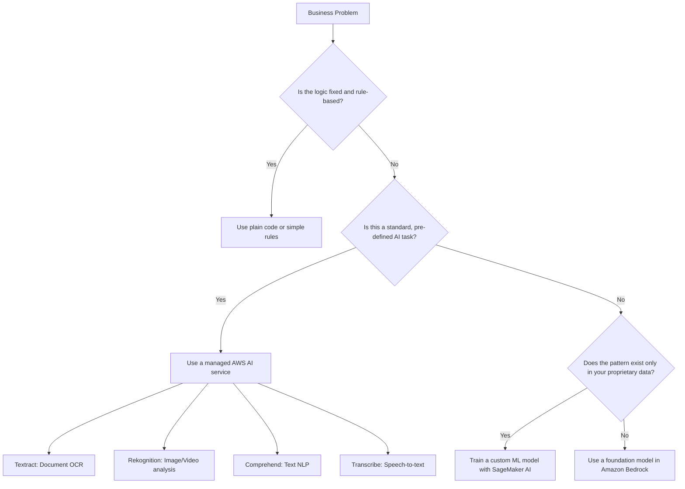
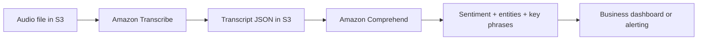
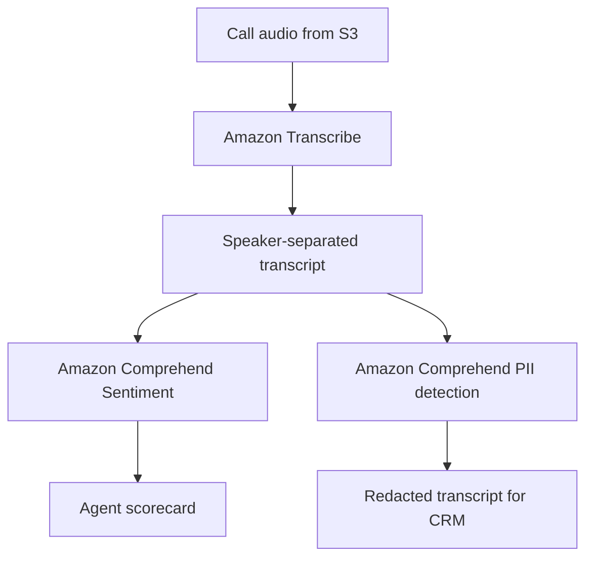
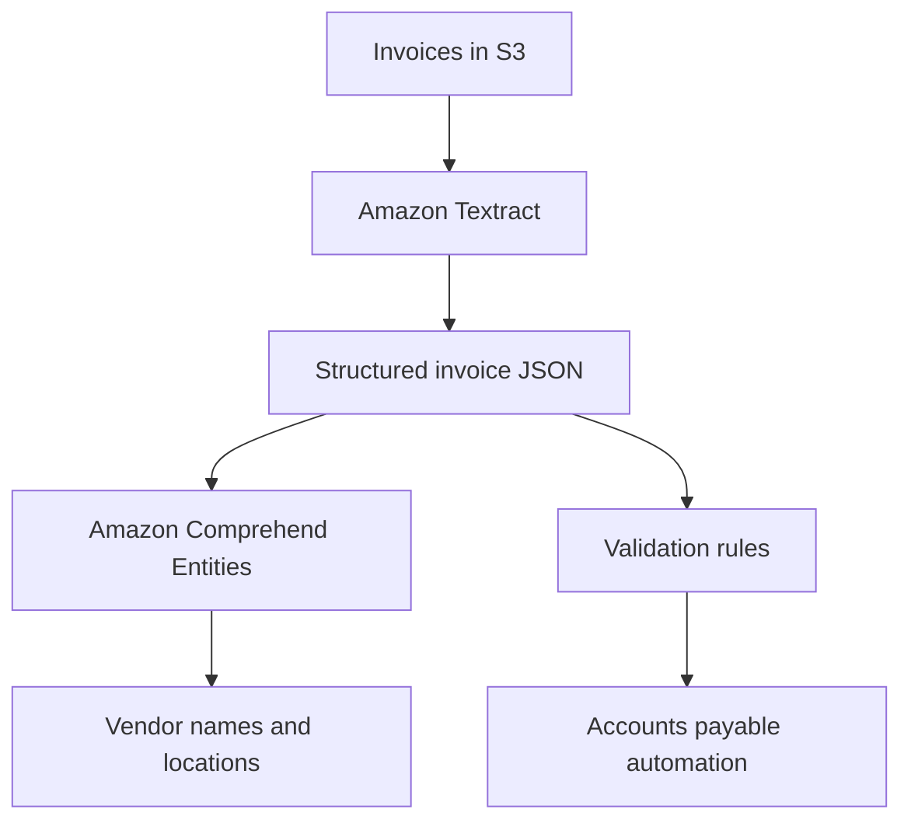

# Task 2.1: ML Model and Foundation Model (FM) Development - Choose appropriate modeling approaches for ML and AI solutions

## Skill 2.1.8: Apply AWS AI services to solve specific business problems (for example, Amazon Textract, Amazon Rekognition, Amazon Comprehend, Amazon Transcribe)

### Overview

This skill tests your ability to identify when a managed AWS AI service is the correct modeling approach instead of a custom ML model, a foundation model, or simple rule-based logic. The core principle is:

> **When a task is already solved as a standard capability, call the managed service first.**

AWS AI services are pre-trained, fully managed, and production-ready. They remove the need to gather labeled data, train a model, tune hyperparameters, and manage hosting infrastructure. For many business problems involving documents, images, video, text, and speech, a managed service is the fastest, cheapest, and most reliable option.

The four services most commonly tested in the MLA-C02 exam are:

| AWS Service | Key business problem it solves | Primary input |
| --- | --- | --- |
| **Amazon Textract** | Extract text, forms, tables, invoices, and identity fields from scanned documents | PDF, JPEG, PNG, TIFF |
| **Amazon Rekognition** | Analyze images and video for objects, faces, moderation labels, and text | Images, stored video, streaming video |
| **Amazon Comprehend** | Understand structure, sentiment, entities, key phrases, and PII in text | Raw text documents |
| **Amazon Transcribe** | Convert speech from audio recordings into text | Audio files, streaming audio |

---

### Where Managed AI Services Fit in the Modeling Approach Decision

Before selecting a modeling approach, evaluate where the answer comes from.

**Key takeaway:** If the task is standard, such as extracting text from a PDF, identifying objects in an image, detecting sentiment in a review, or transcribing a call, do not build a custom model. Call the managed AI service.

---

### Deep Dive: Amazon Textract

Amazon Textract extracts text, handwriting, forms, tables, invoices, and identity fields from scanned documents.

#### Core APIs and Their Business Use Cases

| API | What it does | Business problem |
| --- | --- | --- |
| `DetectDocumentText` | Basic OCR: lines, words, bounding boxes | Simple text extraction from digital documents |
| `AnalyzeDocument` | Forms: key-value pairs and checkboxes | Loan applications, patient intake forms, tax forms |
| `AnalyzeDocument` | Tables: table structure with rows/columns | Financial statements, compliance reports |
| `AnalyzeExpense` | Invoice and receipt fields: vendor, tax, total, line items | Accounts payable automation, expense management |
| `AnalyzeID` | Identity fields: name, DOB, ID number, address | Customer onboarding, KYC, age verification |

#### Input and Output Characteristics

- **Input formats:** PDF, JPEG, PNG, TIFF
- **Data sources:** Amazon S3 or direct byte input
- **Output:** JSON with text, confidence scores, page numbers, bounding boxes, relationships between form keys and values, and table cells
- **Processing:** Supports synchronous single-document and asynchronous batch processing

#### Typical Scenario

A shipping company receives thousands of scanned delivery invoices daily. The finance team manually enters vendor name, invoice number, total amount, and line items into SAP.

**Best approach:** Use Amazon Textract `AnalyzeExpense` to automatically extract invoice fields and line items. This requires no training data and is far faster than building a custom computer vision model.

---

### Deep Dive: Amazon Rekognition

Amazon Rekognition analyzes images and video for objects, scenes, faces, text, and unsafe content.

#### Core Capabilities

| Capability | What it does | Example business problem |
| --- | --- | --- |
| Label detection | Identifies objects, scenes, activities, and concepts | Auto-tagging product images in e-commerce |
| Face detection | Detects faces and attributes: age range, emotions, landmarks | Attendee sentiment in physical stores |
| Face search | Compares a face against a stored face collection | Building access control, identity verification |
| Content moderation | Detects explicit, violent, or suggestive content | Social media profile photo moderation |
| Text detection | Detects text in natural scenes, signs, and labels | Reading license plates, product labels |
| Custom Labels | Trains custom object or scene detection from your own labeled data | Detecting proprietary product defects |
| Video analysis | Asynchronous analysis of stored video for labels, faces, people, and paths | Security camera footage review |

#### Image vs. Video

- **Image analysis:** Synchronous API, low latency, ideal for real-time moderation or search.
- **Video analysis:** Asynchronous API for stored video in S3, or streaming with Kinesis Video Streams for near-real-time detection.

#### Important Distinction

Amazon Rekognition can detect text in images, but Amazon Textract is the correct service for extracting large amounts of text from documents. Rekognition text detection is intended for short text in natural scenes, signs, or product packaging.

---

### Deep Dive: Amazon Comprehend

Amazon Comprehend performs natural language processing (NLP) on raw text to find structure, sentiment, entities, key phrases, and personally identifiable information (PII).

#### Core APIs

| API | What it does | Example business problem |
| --- | --- | --- |
| `DetectDominantLanguage` | Identifies the language of a document | Routing multilingual support tickets |
| `DetectEntities` | Finds people, places, organizations, dates, quantities | Extracting company names from news articles |
| `DetectKeyPhrases` | Extracts important phrases from text | Summarizing customer reviews |
| `DetectSentiment` | Returns positive, negative, neutral, or mixed sentiment | Monitoring social media brand perception |
| `DetectPiiEntities` | Identifies PII: name, SSN, email, bank account, address | Compliance with data privacy policies |
| `DetectSyntax` | Analyzes parts of speech and sentence structure | Preparing text for downstream processing |
| Topic modeling | Discovers themes across large document sets | Grouping support tickets by root cause |
| Custom classification | Classifies documents into your own categories | Sorting emails into department-specific queues |
| Custom entity recognition | Detects custom terms such as part numbers or product codes | Extracting proprietary product IDs from service logs |

#### Batch vs. Real-Time

- **Real-time:** Single document synchronous API for quick NLP tasks.
- **Batch:** Asynchronous jobs for large document sets, topic modeling, and PII scanning at scale.

#### Typical Use Case

A customer support team wants to automatically route inbound messages to the correct department and tag the emotional tone of each message.

**Best approach:** Use Amazon Comprehend `DetectSentiment` to gauge tone and `DetectKeyPhrases` or custom classification to route by topic.

---

### Deep Dive: Amazon Transcribe

Amazon Transcribe converts speech from audio recordings into written text with timestamps, speaker labels, and confidence scores.

#### Core Modes and Features

| Feature | What it does | Business problem |
| --- | --- | --- |
| Batch transcription | Transcribes audio files stored in S3 asynchronously | Transcribing meeting recordings, podcasts |
| Streaming transcription | Transcribes real-time audio over WebSocket or HTTP/2 | Live call captioning, virtual assistants |
| Automatic language detection | Identifies the spoken language automatically | Multilingual customer support |
| Custom vocabularies | Improves accuracy for domain-specific terms | Transcribing medical terminology |
| Custom vocabulary filters | Removes or masks unwanted words | Meeting notes without profanity |
| Speaker diarization | Distinguishes between multiple speakers | Interview and meeting transcripts |
| Channel identification | Separates audio from different channels | Call center agent vs. customer audio |
| Call Analytics | Provides sentiment, categories, redaction, and issue detection | Contact center quality monitoring |
| Subtitle generation | Outputs WebVTT or SRT subtitle files | Video captioning and accessibility |

#### Input and Output

- **Input formats:** MP3, MP4, WAV, FLAC, OGG, WebM
- **Output:** JSON transcript with word-level timestamps, confidence scores, speaker labels, and punctuation.

#### Integration with Amazon Comprehend

A common pattern is:

This pipeline solves tasks such as:

- Contact center sentiment analysis
- Sales call key topic extraction
- Compliance monitoring for risky language

---

### Service Selection Decision Guide

When the exam asks which AWS AI service to use, map the data type and task to the correct service.

| Business problem | Input | Required output | Best service |
| --- | --- | --- | --- |
| Extract total amount and vendor from invoices | Scanned PDF invoices | Structured JSON fields | Amazon Textract AnalyzeExpense |
| Extract form key-value pairs from loan applications | Scanned forms | JSON key-value pairs | Amazon Textract AnalyzeDocument |
| Detect unsafe images before displaying them | User-uploaded images | Moderation labels | Amazon Rekognition |
| Identify celebrities in a video archive | Stored video | Celebrity names and timestamps | Amazon Rekognition video |
| Check if a given face matches an employee badge photo | Two images | Similarity score | Amazon Rekognition CompareFaces |
| Determine customer mood from support chat | Raw chat text | Sentiment score | Amazon Comprehend |
| Find all bank account numbers in documents | Text document | PII entity locations and types | Amazon Comprehend |
| Convert voicemail audio into readable text | Audio file | Text transcript | Amazon Transcribe |
| Label speaker and sentiment in a call recording | Audio file | Transcript + speaker labels + sentiment | Transcribe Call Analytics or Transcribe + Comprehend |
| Extract text from an image of a street sign | Image | Short text string | Amazon Rekognition DetectText |
| Extract hundreds of pages from a scanned report | Multi-page PDF | Full text + tables | Amazon Textract |

---

### Common Multi-Service Solutions

Many real-world exam scenarios combine multiple AI services.

#### Contact Center Intelligence Pipeline

**Result:** The call center automatically scores agent tone, detects sensitive customer information, and stores a compliant transcript.

#### Document Processing and Understanding

---

### Scenario-Based Exam Examples

#### Scenario 1

A financial services company must process scanned customer identification documents such as passports and driver's licenses. The solution must extract name, date of birth, document number, and expiration date without training a custom model.

**Which AWS service should the company use?**

- **A.** Amazon Rekognition DetectFaces
- **B.** Amazon Textract AnalyzeID
- **C.** Amazon Comprehend DetectEntities
- **D.** Amazon Transcribe

**Correct Answer:** **B. Amazon Textract AnalyzeID**

**Explanation:**  
Amazon Textract AnalyzeID is purpose-built to extract key fields from government-issued identity documents. It requires no custom training and produces structured JSON. Amazon Rekognition is for visual face analysis, not document data extraction. Amazon Comprehend works with raw text, not image-based documents. Amazon Transcribe converts speech to text.

---

#### Scenario 2

A media platform needs to automatically detect and block images containing nudity, violence, or drug-related content before the images are shown to users. The solution must be low latency and require no manual label review.

**Which AWS service meets these requirements?**

- **A.** Amazon Rekognition moderation labels
- **B.** Amazon Comprehend sentiment analysis
- **C.** Amazon Textract object detection
- **D.** Amazon Transcribe content filtering

**Correct Answer:** **A. Amazon Rekognition moderation labels**

**Explanation:**  
Amazon Rekognition provides pre-trained moderation APIs that detect explicit, suggestive, violent, and drug-related visual content. It operates synchronously on images, making it suitable for real-time moderation. Amazon Comprehend and Amazon Transcribe cannot analyze images. Amazon Textract does not perform moderation.

---

#### Scenario 3

A contact center stores customer call recordings in Amazon S3. The company wants to extract the main discussion topics, identify whether customers were frustrated, and generate a searchable transcript.

**Which combination of AWS services is MOST appropriate?**

- **A.** Amazon Rekognition + Amazon Textract
- **B.** Amazon Transcribe + Amazon Comprehend
- **C.** Amazon Textract + Amazon Comprehend
- **D.** Amazon Transcribe + Amazon Rekognition

**Correct Answer:** **B. Amazon Transcribe + Amazon Comprehend**

**Explanation:**  
Amazon Transcribe converts the call audio into text. Amazon Comprehend then analyzes that transcript to find entities, key phrases, and sentiment. This is the standard architecture for contact center intelligence. Rekognition and Textract are used for images and documents, not audio.

---

### Exam Tips and Traps

#### Tips

1. **Match the service to the data type first.**  
   - Documents → Textract  
   - Images or video → Rekognition  
   - Text → Comprehend  
   - Audio → Transcribe  

2. **Know the specialized APIs.**  
   The exam often tests specific capabilities such as `AnalyzeExpense`, `AnalyzeID`, `DetectPiiEntities`, and Rekognition moderation.  

3. **Remember the zero-training advantage.**  
   A managed AI service is usually the answer when the scenario says “with the LEAST development effort,” “fastest to implement,” or “no ML expertise available.”  

4. **Multi-service pipelines are common.**  
   Many scenarios require Transcribe followed by Comprehend. Recognize this pattern.

5. **Use custom features only when the standard service falls short.**  
   For example, if the business needs to identify specialized objects, consider Rekognition Custom Labels. If the business needs custom categories in text, consider Comprehend custom classification.

6. **Know the asynchronous vs. synchronous options.**  
   Video analysis in Rekognition and large batch transcription in Transcribe are asynchronous. Image analysis and real-time streaming transcription are synchronous.

#### Traps

1. **Do not use Rekognition for full document OCR.**  
   Rekognition can detect text in images, but Textract is the service for extracting large amounts of text, tables, and forms from documents.

2. **Do not use Textract for sentiment or entities.**  
   Textract extracts text but does not understand it. Once text is extracted, Comprehend performs NLP.

3. **Do not train a custom model for a solved problem.**  
   If the exam says a standard invoice extraction task requires the LEAST effort, Textract is the answer. A custom SageMaker model or fine-tuned Bedrock model adds unnecessary work.

4. **Do not use a foundation model for tasks that have a specialized managed service.**  
   For example, do not use Amazon Bedrock to extract invoice totals when Textract AnalyzeExpense is purpose-built, faster, and cheaper.

5. **Avoid mixing up audio and text.**  
   Amazon Transcribe produces text from audio. Amazon Comprehend analyzes text. Amazon Polly produces speech from text, but it is not in this skill statement.

6. **Watch for “real-time” keywords.**  
   If the scenario says real-time transcription of live audio, use Transcribe streaming. If it says batch process stored audio, use batch transcription.

7. **PII detection appears in multiple services.**  
   Amazon Comprehend detects PII in text. Amazon Transcribe Call Analytics can redact PII in audio transcripts. Amazon Rekognition can detect faces in images. Choose based on the input type.

---

### Summary Table

| AWS AI Service | Input | Primary Output | Best Use Case |
| --- | --- | --- | --- |
| Amazon Textract | Scanned documents | Text, forms, tables, invoices, IDs | Accounts payable, KYC, medical forms |
| Amazon Rekognition | Images, video | Labels, faces, moderation, text | Content moderation, identity verification, security |
| Amazon Comprehend | Raw text | Entities, sentiment, key phrases, PII, topics | Customer support, social media monitoring, compliance |
| Amazon Transcribe | Audio | Transcripts, speaker labels, timestamps | Call analytics, meeting notes, subtitles |

The key to this skill is not memorizing every API, but understanding which service solves which type of business problem and when a managed service is the correct approach compared to custom ML or foundation models.