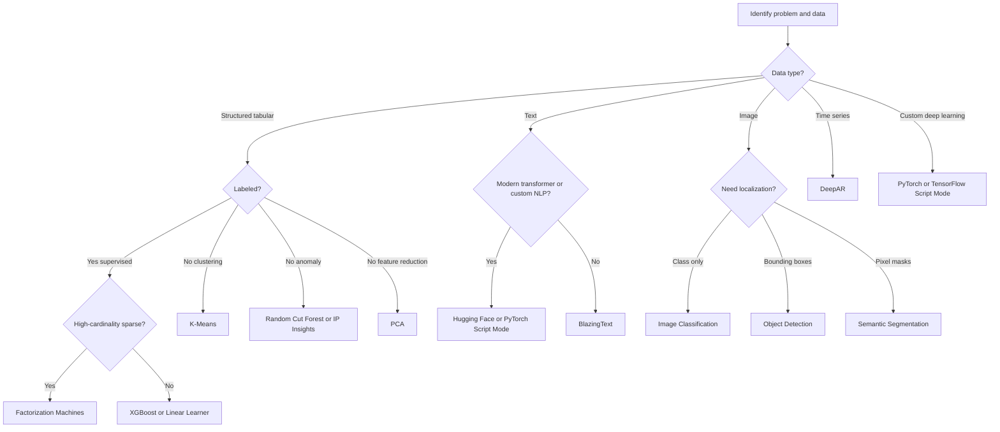
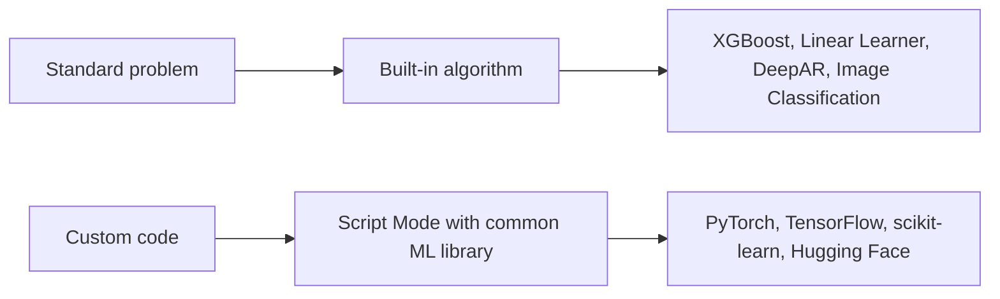

# Task 2.2: ML Model and Foundation Model (FM) Development - Train, fine-tune, and customize models for ML and AI solutions

## Skill 2.2.1: Apply Amazon SageMaker AI built-in algorithms and common ML libraries

This skill is about knowing **when and how to apply Amazon SageMaker AI built-in algorithms** and **common ML libraries/frameworks** to train models. It is not only about memorizing algorithm names. The exam expects you to match a business problem to the correct SageMaker AI training approach, understand data input requirements, and know when to bring your own training code using a managed framework container.

---

## 1. Key Idea

SageMaker AI gives you three main ways to train:

| Training route | Who supplies the learning logic? | Who supplies the container? | Best when |
| --- | --- | --- | --- |
| **Built-in algorithm** | AWS | AWS | The problem matches a standard algorithm and you want minimal code |
| **Common ML library / Script Mode** | You supply a training script | AWS supplies prebuilt framework container | You need a custom model, loss function, or architecture |
| **Bring your own container** | You supply both | You supply and maintain | You have special dependencies or inference requirements not covered by managed containers |

For this skill, focus on the first two routes.

---

## 2. Amazon SageMaker AI Built-in Algorithms

Built-in algorithms are AWS-managed implementations for common ML tasks. You provide data and hyperparameters, and SageMaker AI runs the training job.

### 2.1 Built-in Algorithm Quick Reference

| Problem type | SageMaker AI built-in algorithm | Typical use cases and notes |
| --- | --- | --- |
| Tabular classification/regression | **Linear Learner** | Linear models; good baseline; supports regression and binary/multiclass classification |
| Tabular classification/regression/ranking | **XGBoost** | Strong default for structured data; handles nonlinear relationships and missing values |
| Sparse classification/regression/recommendation | **Factorization Machines** | Click prediction, recommendations, sparse categorical features |
| Clustering | **K-Means** | Customer segmentation, grouping; unsupervised |
| Dimensionality reduction | **Principal Component Analysis (PCA)** | Reduce features, noise reduction |
| Anomaly detection on structured data | **Random Cut Forest (RCF)** | Unsupervised anomaly detection; unusual metrics/events |
| IP- or identity-based anomaly detection | **IP Insights** | Suspicious IP, account, or network behavior patterns |
| Time-series forecasting | **DeepAR** | Probabilistic forecasting across multiple related time series; demand, energy, revenue |
| Text classification and word embeddings | **BlazingText** | Word2Vec-style embeddings and fastText-style text classification |
| Sequence-to-sequence tasks | **Seq2Seq** | Machine translation, summarization, conversational modeling |
| Topic modeling | **Latent Dirichlet Allocation (LDA)** | Statistical document-topic discovery |
| Topic modeling | **Neural Topic Model (NTM)** | Neural document-topic discovery |
| Object/entity embeddings | **Object2Vec** | Recommendations, matching, fraud detection, semantic search |
| Image classification | **Image Classification** | Assigns an image-level class label |
| Object detection | **Object Detection** | Detects objects and bounding boxes within images |
| Pixel-level image labeling | **Semantic Segmentation** | Assigns a class to every pixel |

### 2.2 Choosing a Built-in Algorithm by Problem Pattern

Use this practical mapping:

| If you have... | First built-in algorithm to consider |
| --- | --- |
| Labeled tabular data with regression/classification | **XGBoost** |
| Very large linear tabular model or interpretable baseline | **Linear Learner** |
| Sparse, high-cardinality categorical data | **Factorization Machines** |
| Unlabeled tabular data requiring segmentation | **K-Means** |
| Unlabeled tabular/metric data requiring anomaly detection | **Random Cut Forest (RCF)** |
| Time-series data with seasonality and many related series | **DeepAR** |
| Text classification or word representation | **BlazingText** |
| Image class label prediction | **Image Classification** |
| Image object localization | **Object Detection** |
| Pixel-level vision task | **Semantic Segmentation** |

---

## 3. Common ML Libraries in SageMaker AI

Common ML libraries allow you to use custom training code while still running inside AWS-managed framework containers. In SageMaker AI, this is often called **Script Mode**.

### 3.1 Common ML Library Reference

| Library/framework | SageMaker AI usage | Typical scenarios |
| --- | --- | --- |
| **scikit-learn** | SageMaker AI SKLearn container with script mode | Traditional tabular ML, feature engineering, proof of concept |
| **XGBoost** | Built-in algorithm or script mode | Structured data, ranking, custom objectives and metrics |
| **TensorFlow/Keras** | SageMaker AI TensorFlow container | Custom deep learning, computer vision, NLP, distributed training |
| **PyTorch** | SageMaker AI PyTorch container | Custom architectures, research workloads, transformer fine-tuning |
| **Hugging Face Transformers** | SageMaker AI Hugging Face container | Fine-tuning foundation models like BERT, GPT, T5, or embedding models |
| **Apache MXNet** | SageMaker AI MXNet container | Legacy deep learning workloads; historically used by SageMaker built-ins |

### 3.2 Built-in Algorithm vs Common Library

| Criterion | Built-in algorithm | Common library / Script Mode |
| --- | --- | --- |
| Training code | Supplied by AWS | Supplied by you |
| Container | AWS-managed algorithm image | AWS-managed framework image |
| Customization | Hyperparameters only | Full model, data loading, loss, metrics |
| Setup effort | Very low | Medium |
| Use for custom architecture | No | Yes |
| Example | SageMaker AI XGBoost | PyTorch training script |

---

## 4. Decision Flow for Selecting a Training Approach

---

## 5. Important Input and Configuration Considerations

### 5.1 Data Input

- Training data is stored in **Amazon S3**.
- Built-in tabular algorithms commonly accept **CSV**.
- For SageMaker AI tabular supervised algorithms using CSV, the **first column** often contains the target label.
- Computer vision built-in algorithms typically use **RecordIO** or image files with a **manifest file**.
- Script mode gives you more flexibility: your script can read CSV, Parquet, JSON, images, or any supported format directly from S3.

### 5.2 Container and Script Selection

- Built-in algorithms require no training script.
- For common libraries, you must provide an **entry point script** containing your training logic.
- SageMaker AI supplies the framework container; you do not need to create a Docker image.

### 5.3 Hyperparameters

Built-in algorithms expose their own hyperparameters. Examples:

| Algorithm | Common hyperparameters |
| --- | --- |
| XGBoost | `num_round`, `eta`, `max_depth`, `min_child_weight`, `subsample`, `colsample_bytree`, `objective`, `eval_metric` |
| Linear Learner | `learning_rate`, `epochs`, `mini_batch_size`, `optimizer`, `L1`, `L2` |
| DeepAR | `prediction_length`, `context_length`, `epochs`, `learning_rate` |
| Image Classification | `epochs`, `learning_rate`, `batch_size`, `optimizer` |
| K-Means | `k`, `init_method` |
| PCA | `num_components`, `algorithm_mode` |

The exam generally tests whether you know which hyperparameters affect training behavior, not exact syntax.

---

## 6. Exam-Style Scenarios

### Scenario 1: Customer Churn Prediction

A telecommunications company has a labeled tabular dataset containing customer demographics, billing history, and service usage. The data science team wants high predictive accuracy with minimal custom training code. The dataset has missing values and nonlinear feature relationships.

Which approach is most appropriate?

- **A.** SageMaker AI Linear Learner
- **B.** SageMaker AI Random Cut Forest
- **C.** SageMaker AI XGBoost built-in algorithm
- **D.** SageMaker AI Object Detection

**Answer:** **C**

**Explanation:** XGBoost is the strongest built-in choice for structured tabular classification with missing values and nonlinear relationships. Linear Learner is linear and often less accurate for complex tabular data. Random Cut Forest is unsupervised anomaly detection, and Object Detection is an image task.

---

### Scenario 2: Unsupervised Login Anomaly Detection

A security team wants to detect unusual sign-in behavior based on IP address, account ID, and user-agent features. No fraud labels are available.

Which SageMaker AI built-in algorithm should the team choose?

- **A.** IP Insights
- **B.** XGBoost
- **C.** Linear Learner
- **D.** K-Means

**Answer:** **A**

**Explanation:** IP Insights is designed for unsupervised anomaly detection on IP-, account-, and entity-pattern data. XGBoost and Linear Learner are supervised and require labels. K-Means is for clustering, not anomaly scoring.

---

### Scenario 3: Custom PyTorch Model Without Container Maintenance

A team has written a custom PyTorch model for product recommendation. The model uses a specialized neural network architecture and a custom loss function. The team does not want to build or maintain its own Docker container.

Which SageMaker AI option should the team use?

- **A.** SageMaker AI built-in Factorization Machines
- **B.** SageMaker AI PyTorch Script Mode
- **C.** SageMaker AI built-in PCA
- **D.** Amazon RDS with SQL analytics

**Answer:** **B**

**Explanation:** Script Mode allows the team to provide its custom PyTorch training script while using an AWS-managed PyTorch container. Built-in algorithms do not support custom architectures or custom loss functions.

---

### Scenario 4: Multi-SKU Demand Forecasting

A retailer needs to forecast weekly demand for thousands of SKUs. The data contains multiple related time series with seasonal patterns and occasional promotions.

Which built-in algorithm is designed for this task?

- **A.** DeepAR
- **B.** Sequence-to-Sequence
- **C.** Linear Learner
- **D.** Image Classification

**Answer:** **A**

**Explanation:** DeepAR is SageMaker AI's built-in probabilistic forecasting algorithm for one-dimensional time series. It is designed for multiple related series and can incorporate covariates such as promotions.

---

### Scenario 5: Image Class Labels vs Object Bounding Boxes

A warehouse uses computer vision to identify whether an image contains a pallet, box, or conveyor belt. The team initially only needs class labels for each image.

Later, the team also needs bounding boxes around each detected object.

Which built-in algorithm pair should be used?

- **A.** Image Classification first, then Object Detection
- **B.** Object Detection first, then Semantic Segmentation
- **C.** Semantic Segmentation first, then PCA
- **D.** Image Classification first, then BlazingText

**Answer:** **A**

**Explanation:** Image Classification assigns an image-level class label. Object Detection localizes objects by returning bounding boxes. Semantic Segmentation is for pixel-level masks, not bounding boxes.

---

## 7. Exam Tips and Traps

### 7.1 Strong Signal Patterns

| If the question says... | Think... |
| --- | --- |
| Labeled tabular data, high accuracy, not custom code | XGBoost built-in |
| Sparse categorical data, click prediction, recommendations | Factorization Machines |
| Time-series forecasting | DeepAR |
| No labels, detect anomalies in metrics | Random Cut Forest |
| No labels, detect suspicious IP/account behavior | IP Insights |
| Image class only | Image Classification |
| Image with bounding boxes | Object Detection |
| Pixel-level masks | Semantic Segmentation |
| Word embeddings or basic text classification | BlazingText |
| Custom PyTorch/TensorFlow model | Script Mode with managed framework container |
| Transformer fine-tuning | Hugging Face or PyTorch Script Mode |

### 7.2 Common Traps

- **Do not choose a supervised algorithm for an unsupervised task.** For anomaly detection without labels, XGBoost or Linear Learner is usually wrong.
- **Do not confuse Image Classification with Object Detection.** Image Classification gives class labels; Object Detection gives bounding boxes and class labels.
- **Do not choose built-in algorithms for custom architectures.** If the team has custom neural network code, use Script Mode with PyTorch, TensorFlow, or another framework.
- **Do not assume BlazingText is the best option for transformer-based NLP.** Modern foundation model tasks usually require Hugging Face or PyTorch Script Mode.
- **Do not select K-Means for classification.** K-Means is clustering and does not use labels for training.
- **Do not treat SageMaker AI Autopilot as a built-in algorithm.** Autopilot is an AutoML service that explores data and models automatically.
- **Do not ignore data format.** Built-in tabular algorithms commonly expect CSV; vision built-ins commonly expect RecordIO or manifest-based image data.
- **Do not confuse DeepAR with general regression.** DeepAR is specifically for time-series forecasting.

### 7.3 Cost and Operational Traps

- Built-in algorithms are often simpler and faster to deploy than custom script-mode jobs.
- Script Mode still requires a training script; cannot run without an entry point.
- Managed framework containers reduce infrastructure work but do not replace the need for correct training code.
- For standard tabular problems, rewriting as a custom PyTorch model may add complexity without enough benefit.

---

## 8. Quick Memory Map

### One-Line Exam Reminder

> **Standard problem + no custom code = built-in algorithm.**
>
> **Custom model + team-owned script = SageMaker AI Script Mode with a common ML library.**