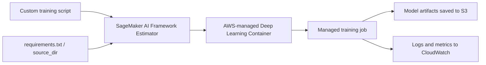
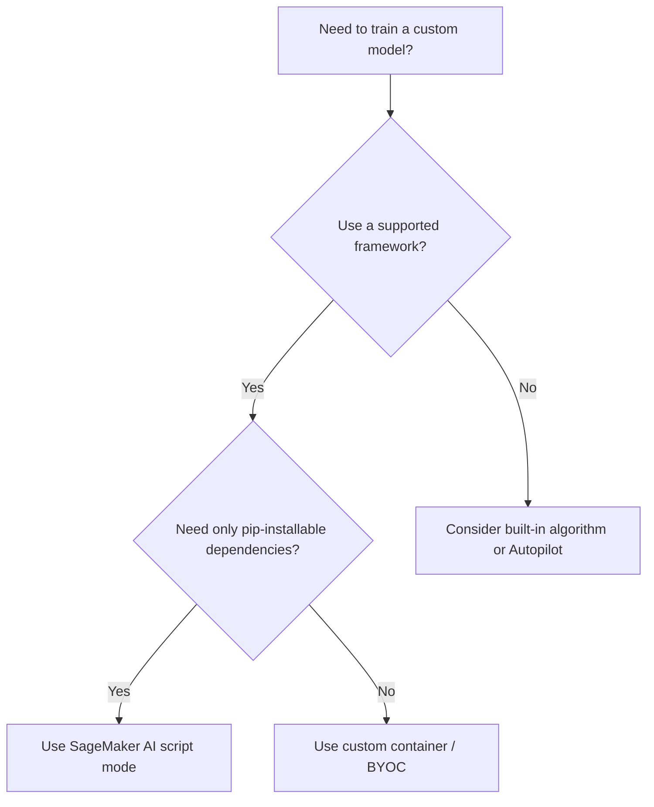

# Task 2.2: ML Model and Foundation Model (FM) Development - Train, fine-tune, and customize models for ML and AI solutions

## Skill 2.2.2: Configure SageMaker AI script mode with supported frameworks for simplicity and performance

### Overview

SageMaker AI script mode allows you to bring your own training code in a supported machine learning framework while AWS provides and maintains the underlying container. It is the middle path between using AWS built-in algorithms and building a fully custom container.

- You own the training logic: the model architecture, loss function, training loop, and data processing inside your script.
- AWS owns the runtime: an optimized, prebuilt Deep Learning Container (DLC) for your chosen framework.
- You get simplicity: no Dockerfiles, no container registry management, and no security patching.
- You get performance: AWS-tuned containers, GPU support, and integration with SageMaker AI distributed training libraries.

Script mode is not an algorithm. It is an execution pattern for your own training script inside a managed container.

---

### Where script mode fits among SageMaker AI training options

| Option | Who supplies training logic | Who maintains container | Best for |
|---|---:|---:|---|
| Built-in algorithms | AWS | AWS | Standard tabular, text, or vision tasks that match an AWS algorithm |
| **Script mode** | **You** | **AWS** | Custom model code in a supported framework without special OS-level dependencies |
| Bring your own container (BYOC) | You | You | Unsupported frameworks, OS package requirements, custom drivers, or non-Python runtimes |
| SageMaker Autopilot | AWS | AWS | AutoML, automatic feature engineering, algorithm selection, and tuning |

Script mode should be your default when:

- The model architecture or training loop is custom.
- The team does not want to maintain container images.
- The framework is supported by SageMaker AI DLCs.
- You still want SageMaker AI managed infrastructure, logs, and tuning.

---

### How SageMaker AI script mode works

At a high level:

1. You write a framework-specific training script in Python.
2. You choose the matching SageMaker AI framework estimator.
3. SageMaker AI pulls an AWS-maintained framework container.
4. Your script and any declared dependencies are copied into the container.
5. The entry point script runs as the training job.
6. The script reads input data locations and writes model artifacts to known environment variable paths.
7. SageMaker AI uploads artifacts to Amazon S3 and streams logs and metrics to Amazon CloudWatch.

---

### Supported frameworks for script mode

SageMaker AI provides prebuilt containers for common ML frameworks. Choosing the correct framework estimator is part of configuring script mode properly.

| Framework | Typical use case | Notes |
|---|---|---|
| PyTorch | Custom deep learning architectures, research models, transformer fine-tuning | Most common choice for custom neural networks |
| TensorFlow | Keras and TensorFlow 2 production models | Strong fit for teams already using TensorFlow |
| Hugging Face | Fine-tuning pretrained transformer models for NLP or vision | Uses PyTorch or TensorFlow underneath; simplifies transformer training |
| Scikit-learn | Tabular ML baselines, traditional models | Good for non-deep-learning custom preprocessing plus training |
| MXNet | Legacy or existing MXNet workloads | Less common for new projects but still supported |

The framework container includes common Python libraries and framework dependencies. If your script requires additional Python packages, you can include them through a `requirements.txt` or dependency specification. OS-level packages are not provided in script mode; that requires a custom container.

---

### Key configuration elements

| Element | Purpose |
|---|---|
| `entry_point` | Identifies the training script that SageMaker AI should run |
| `source_dir` | Points to a local directory containing additional modules, utilities, or files needed by the script |
| `framework_version` | Selects the specific version of the framework container |
| `py_version` | Selects the Python version inside the container |
| `instance_type` | Chooses CPU or GPU compute |
| `instance_count` | Sets the number of training instances |
| `hyperparameters` | Passes values to the script as command-line arguments |
| `metric_definitions` | Defines regex patterns to extract custom metrics from logs into CloudWatch |
| `distribution` | Configures distributed training behavior |

Script mode creates a clean separation:

- The script contains what to run.
- The estimator configuration controls where and how to run it.
- The framework container provides the runtime.

---

### Simplicity benefits

Script mode removes the heavy lifting of container management while keeping full control of the model.

Benefits include:

- No custom Dockerfile required.
- No Amazon ECR repository needed for training images.
- AWS patches and maintains the base container.
- Easier to onboard new data scientists because they only need to write Python.
- Works naturally with SageMaker AI Automatic Model Tuning.
- Works with SageMaker AI managed storage, logging, monitoring, and IAM.

Example use case:

A team has a custom PyTorch recommendation model with a custom loss function. The model does not fit any built-in SageMaker AI algorithm. Instead of creating a Docker file and maintaining a container, the team supplies its PyTorch script through a SageMaker PyTorch estimator. SageMaker AI runs the script inside the AWS-managed PyTorch container.

---

### Performance benefits

Using script mode does not mean using only one instance or CPU. Performance can be improved through:

1. **GPU instance selection**
   - Choose GPU instances for deep learning training.
   - AWS-managed DLCs include CUDA, cuDNN, and other GPU libraries.

2. **Distributed training configuration**
   - Data parallelism: split batches across replicas and synchronize gradients.
   - Model parallelism: partition a model too large for one device.

| Distributed strategy | Use when | How it helps |
|---|---|---|
| Data parallelism | Model fits on one GPU, but dataset is large | Replicates the model and splits data across instances |
| Model parallelism | Model cannot fit on one GPU | Partitions layers or tensors across devices |

Increasing `instance_count` alone does not automatically distribute a script mode job. You must also configure the `distribution` parameter and ensure the script supports the framework's distributed mechanism.

SageMaker AI distributed training libraries can provide better scaling for large models and datasets. The Elastic Fabric Adapter (EFA) helps reduce communication overhead in large clusters.

---

### Environment variables used by script mode

Your training script should not hardcode S3 paths. SageMaker AI injects environment variables at runtime.

| Environment variable | Purpose |
|---|---|
| `SM_CHANNEL_TRAINING` | Path to the training data channel |
| `SM_CHANNEL_VALIDATION` | Path to validation data if provided |
| `SM_CHANNEL_TEST` | Path to test data if provided |
| `SM_MODEL_DIR` | Directory where the script must save model artifacts |
| `SM_OUTPUT_DATA_DIR` | Directory for non-model output artifacts |
| `SM_HOSTS` | Number of training hosts |
| `SM_CURRENT_HOST` | Identifier of the current host |
| `SM_NUM_GPUS` | Number of GPUs on the current instance |

This design makes script mode portable across jobs. You can move from one instance type to another or from single-node to multi-node without changing the training script's data and model path logic.

---

### Hyperparameters and automatic model tuning

In script mode, hyperparameters are passed to the training script as command-line arguments. The script must parse and use them. This matters because SageMaker AI Automatic Model Tuning launches many training jobs with different hyperparameter values.

A tuning job works this way:

1. You define ranges for continuous, integer, or categorical hyperparameters.
2. You provide an objective metric such as validation accuracy or validation loss.
3. SageMaker AI runs multiple script mode training jobs.
4. Each job receives different hyperparameter values.
5. SageMaker AI keeps the combination that performs best against the objective metric.

Common hyperparameters configured through script mode include:

- `epochs`
- `batch-size`
- `learning-rate`
- `dropout`
- `optimizer`
- `weight-decay`

For tuning to work correctly, the script must:

- Accept hyperparameters dynamically.
- Not hardcode them.
- Report the objective metric through training logs.

---

### Decision flow for choosing script mode

---

### Common use cases for script mode

- A company has a custom deep learning architecture in PyTorch or TensorFlow.
- A data science team wants to fine-tune a Hugging Face transformer model.
- An organization needs custom data augmentation or preprocessing inside the training loop.
- A team wants to run hyperparameter tuning on custom model code.
- A startup wants managed training without hiring infrastructure engineers to maintain containers.
- A model must be trained on multiple GPUs using supported distributed training libraries.

---

### Scenario-based exam questions

#### Question 1

A data science team has a custom TensorFlow training script that includes a custom loss function and a custom data loader. The team wants to run this workload as a managed SageMaker AI training job. They do not want to build or maintain a Docker container. Which approach should they use?

**A.** Use the SageMaker AI TensorFlow estimator with script mode and supply the script as the entry point.  
**B.** Rewrite the model using a SageMaker AI built-in algorithm.  
**C.** Package the script into a custom container and register it with Amazon ECR.  
**D.** Convert the workload to SageMaker Autopilot.

**Correct answer:** A

**Explanation:**  
Script mode is designed for custom model code in a supported framework. The TensorFlow estimator uses an AWS-managed TensorFlow container. The team only supplies the training script. Built-in algorithms are not appropriate for a custom loss function. Building a custom container is unnecessary and violates the team’s no-container-maintenance constraint. Autopilot is used for AutoML, not for running a custom TensorFlow script.

---

#### Question 2

An ML engineer increases `instance_count` from 1 to 4 for a PyTorch script mode training job, expecting faster training. However, the training time remains nearly the same. What is the most likely reason?

**A.** PyTorch is not supported in script mode.  
**B.** The training script was not saved to `SM_MODEL_DIR`.  
**C.** Distributed training was not configured in the `distribution` parameter.  
**D.** The job used a CPU instance.

**Correct answer:** C

**Explanation:**  
Simply increasing `instance_count` does not automatically distribute a script mode job. The `distribution` parameter must be configured for data parallelism or model parallelism. Additionally, the training script may need to use the framework's distributed training mechanism. Without this, the extra instances may not cooperate effectively or may even run independent copies of the job.

---

#### Question 3

A team uses SageMaker AI script mode for a TensorFlow model. They want to use SageMaker AI Automatic Model Tuning to search for the best learning rate and batch size. What must be true for the tuning job to work correctly?

**A.** The training script must hardcode the hyperparameter values.  
**B.** The hyperparameters must be passed through environment variables only.  
**C.** The script must accept hyperparameters as command-line arguments and use them.  
**D.** Automatic Model Tuning only works with built-in algorithms.

**Correct answer:** C

**Explanation:**  
In script mode, SageMaker AI passes estimator hyperparameters as command-line arguments to the entry point script. The script must parse those arguments and actually use them. Automatic Model Tuning launches multiple script mode jobs with different values. If hyperparameters are hardcoded, tuning will not change model performance.

---

### Exam tips and traps

- **Choose script mode when custom training code is needed and the framework is supported.**  
  If the team wants to avoid container maintenance, script mode is usually the correct answer.

- **Do not confuse script mode with SageMaker Autopilot.**  
  Autopilot is AutoML. Script mode runs your own code.

- **Do not recommend building a custom container merely because the model is custom.**  
  Script mode exists specifically to avoid that burden.

- **Script mode is framework-specific.**  
  A PyTorch script must be run in a PyTorch-style framework estimator. A TensorFlow script uses a TensorFlow estimator.

- **Increasing `instance_count` is not the same as configuring distributed training.**  
  Many exam questions test this trap. Distributed training requires a `distribution` configuration and compatible script changes.

- **The script must save artifacts to `SM_MODEL_DIR`.**  
  If it writes to another local path, SageMaker AI may not upload the model artifact to S3 correctly.

- **Hyperparameters must be parsed by the script.**  
  Passing values through the estimator has no effect if the script ignores them.

- **Use `requirements.txt` for additional Python dependencies.**  
  If you need OS-level packages, script mode is likely insufficient; use a custom container.

- **Script mode uses AWS-maintained Deep Learning Containers.**  
  These containers are optimized, patched, and managed. This is a major argument for script mode over custom containers.

- **For Hugging Face workloads, script mode is commonly used for fine-tuning.**  
  The Hugging Face estimator provides prebuilt containers that support transformer training and tuning without custom Docker images.

---

### Summary

SageMaker AI script mode is the recommended approach when you need custom training logic in a supported framework but do not want to manage containers. You provide the model code; AWS provides the runtime. It supports PyTorch, TensorFlow, Hugging Face, Scikit-learn, and other frameworks. The main configuration elements include the entry point, source code, environment, compute, hyperparameters, and distributed training settings. Script mode simplifies model development while preserving performance through managed, optimized containers and SageMaker AI distributed training capabilities.