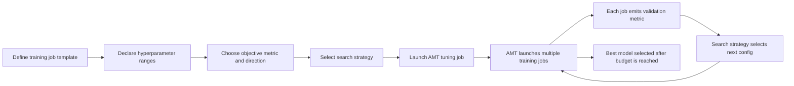

# Task 2.2: ML Model and Foundation Model (FM) Development - Train, fine-tune, and customize models for ML and AI solutions

## Skill 2.2.3: Implement hyperparameter optimization (for example, SageMaker AI automatic model tuning [AMT])

---

## 1. Foundational Concepts

### 1.1 Model Parameters vs. Hyperparameters

| Concept | Meaning | Examples | Learned or Set? |
| --- | --- | --- | --- |
| **Model parameters** | Internal values adjusted during training from the data | Neural network weights, linear regression coefficients, tree split values | Learned by the optimizer |
| **Hyperparameters** | External configuration values that control the training process or model capacity | Learning rate, batch size, number of layers, number of trees, dropout rate | Set before training by the practitioner |

Hyperparameter optimization (HPO) is the search over the space of hyperparameter values to find the configuration that produces the best model performance against a chosen objective metric.

---

## 2. Why Hyperparameter Optimization Matters

Choosing hyperparameters by intuition or one-at-a-time experimentation is slow and often inconsistent. Hyperparameters interact with each other, so evaluating combinations matters.

| Manual tuning | Automatic model tuning |
| --- | --- |
| Hard to reproduce | Systematic search |
| Small number of attempts | Many training jobs evaluated |
| Biased by personal experience | Data-driven selection |
| Difficult to track | Job history and metrics tracked in SageMaker AI |
| Easy to miss better combinations | Searches declared ranges |

---

## 3. Fundamental Hyperparameters to Understand

You should know what these controls do because they are frequently part of tuning ranges.

| Hyperparameter | Effect | Typical tuning range or guidance |
| --- | --- | --- |
| **Learning rate / eta** | Step size for updating weights. Too high implies instability; too low implies slow convergence. | Use continuous range; use logarithmic scale, e.g., 0.0001 to 0.1 |
| **Batch size** | Number of dataset records used in each weight update. Larger batch gives smoother gradients but more memory. | Integer range; depends on instance memory |
| **Epochs / num_boost_round** | Number of complete passes over training data or boosting rounds. | Integer range; pair with early stopping |
| **Number of layers / units** | Model capacity. More capacity can memorize noise. | Integer ranges |
| **Dropout rate** | Regularization for neural networks to reduce overfitting. | Continuous range, often 0.0 to 0.5 |
| **L1 / L2 regularization** | Penalizes large weights to reduce overfitting. | Continuous range, logarithmic scale |
| **Max depth** | Tree depth for tree-based models like XGBoost. | Integer range, often 3 to 10 |
| **Subsample / colsample_bytree** | Row/column sampling for tree ensembles to reduce overfitting. | Continuous range, 0.5 to 1.0 |
| **Momentum / optimizer beta parameters** | Control optimization dynamics. | Continuous ranges near default values |

---

## 4. Amazon SageMaker AI Automatic Model Tuning (AMT)

### 4.1 What AMT Does

Amazon SageMaker AI automatic model tuning runs multiple training jobs with different hyperparameter combinations, evaluates the objective metric for each, and returns the model with the best metric.

AMT works with:

- SageMaker AI built-in algorithms
- Script mode with supported frameworks
- Custom training containers
- Foundation model fine-tuning workflows when applicable

### 4.2 Core Inputs to an AMT Job

| Input | Purpose |
| --- | --- |
| **Training job template** | The estimator or job definition that AMT will clone and launch with varied hyperparameters |
| **Hyperparameter ranges** | Integer, continuous, or categorical ranges to search |
| **Objective metric** | The validation metric AMT should optimize |
| **Objective metric direction** | Whether the metric should be minimized or maximized |
| **Search strategy** | How AMT selects the next hyperparameter combination |
| **Resource limits** | Maximum number of jobs, maximum parallel jobs, and completion criteria |

### 4.3 How AMT Works

AMT does **not** adjust hyperparameters inside a single training job. It runs many separate training jobs, compares their validation metrics, and selects the best configuration.

---

## 5. AMT Search Strategies

| Strategy | How It Works | Best Used When |
| --- | --- | --- |
| **Bayesian optimization** | Uses previous training job results to choose the next configuration; builds a probabilistic model of the objective function | Training jobs are expensive; you want fewer runs but good results |
| **Random search** | Samples configurations independently from the declared ranges | You want broad exploration; objective is simple; baseline approach |
| **Hyperband** | Uses multi-fidelity evaluation; starts many configurations and stops underperforming jobs early | You have many configurations to test and want cost/time reduction |

**Important exam distinction:**

- Bayesian optimization: learns from previous runs.
- Random search: independent sampling.
- Hyperband: early stops weak training jobs to save resources.

---

## 6. Hyperparameter Range Types and Scaling

AMT supports three hyperparameter types:

| Type | Example | When to Use |
| --- | --- | --- |
| **Integer** | `num_layers` from 2 to 10 | Discrete values only |
| **Continuous** | `learning_rate` from 0.0001 to 0.1 | Real-valued settings |
| **Categorical** | `optimizer` in `[adam, sgd, rmsprop]` | Non-numeric choices |

### 6.1 Scaling for Continuous Ranges

| Scaling Type | Meaning | Example Use Case |
| --- | --- | --- |
| **Linear** | Values are spaced evenly | Dropout rate from 0.1 to 0.5 |
| **Logarithmic** | Values are spaced on a log scale | Learning rate from 0.0001 to 1.0 |
| **Reverse logarithmic** | Useful for values that make sense near 1 on a small scale | Some regularization or momentum settings |

Use logarithmic scaling when values span multiple orders of magnitude, especially for learning rate and regularization.

---

## 7. Objective Metric and Direction

AMT requires:

- **Objective metric name**  
  Example: `validation:rmse`, `validation:auc`, `validation:accuracy`

- **Metric regex**  
  Defines how to parse the metric from training job logs, especially in script mode.

- **Metric direction**

| Direction | Common Metrics |
| --- | --- |
| **Minimize** | RMSE, MSE, log loss, validation error |
| **Maximize** | Accuracy, F1 score, AUC, precision, recall |

---

## 8. Completion and Resource Controls

| Control | Purpose |
| --- | --- |
| **Max number of training jobs** | Limits total AMT cost and time |
| **Max parallel training jobs** | Controls how many training jobs run concurrently |
| **Target objective metric** | Optional; stops tuning when a specified metric value is reached |
| **Early stopping of training jobs** | AMT can stop individual training jobs that are unlikely to beat the current best |
| **Warm start** | Reuses results from a previous tuning job to improve a new search |

### 8.1 Warm Start

Warm start is useful when:

- You want to continue a previous tuning search.
- You have related data or a related algorithm.
- You want to avoid starting from zero prior information.

| Warm Start Type | Use Case |
| --- | --- |
| **Identical data and algorithm** | Continue the same search or refine ranges |
| **Transfer learning** | Reuse knowledge from a related tuning job with different data or algorithm |

---

## 9. AMT and Model Quality

HPO can overfit the validation set if too many configurations are evaluated and the same validation set is reused. After tuning, evaluate the final selected model on a separate test set.

Best practices:

- Use training, validation, and test splits.
- Tune on the validation metric.
- Report final performance on the untouched test set.
- Avoid tuning too many hyperparameters on small datasets.

---

## 10. Scenario-Based Examples

### Scenario 10.1

A data science team is tuning an XGBoost churn classification model. They want to select the model with the best area-under-curve (AUC) on the validation set. Which configuration should they use in AMT?

**Options:**

- A. Use `validation:auc` as the objective metric and set direction to **Minimize**
- B. Use `validation:auc` as the objective metric and set direction to **Maximize**
- C. Use `training:auc` as the objective metric and set direction to **Maximize**
- D. Use `validation:rmse` as the objective metric and set direction to **Minimize**

**Correct answer: B**

**Explanation:**  
AUC is a classification metric where higher is better. AMT should maximize `validation:auc`. Using the training metric can overfit. RMSE is for regression.

---

### Scenario 10.2

A team wants to tune a deep learning model. Each training job runs for hours. They have a large hyperparameter search space but limited time and cost. They want to avoid wasting resources on poorly performing configurations.

Which strategy is most appropriate?

**Options:**

- A. Random search
- B. Grid search
- C. Bayesian optimization
- D. Hyperband

**Correct answer: D**

**Explanation:**  
Hyperband is designed to evaluate many configurations quickly by stopping weak jobs early. It reduces total training time and cost across a search. Bayesian optimization is also sample-efficient, but Hyperband specifically addresses large search spaces with limited compute by using early stopping.

---

### Scenario 10.3

A team previously ran an AMT job to tune a fraud detection model. They now want to refine the search using what the previous tuning job learned. Which feature should they use?

**Options:**

- A. Early stopping
- B. Warm start
- C. Data parallelism
- D. Model parallelism

**Correct answer: B**

**Explanation:**  
Warm start lets AMT reuse prior search results. This can speed up convergence and improve the next search without starting from scratch.

---

### Scenario 10.4

A practitioner is tuning a model's learning rate from `0.0001` to `0.1`. Which scaling type should be used?

**Options:**

- A. Linear
- B. Logarithmic
- C. Reverse logarithmic
- D. Categorical

**Correct answer: B**

**Explanation:**  
Learning rate values span multiple orders of magnitude. Logarithmic scaling ensures that AMT explores both small and larger learning rates effectively.

---

## 11. Exam Tips and Traps

### 11.1 Key Exam Tips

| Tip | Why It Matters |
| --- | --- |
| AMT runs many training jobs | It does not tune hyperparameters within a single training run |
| Use validation metric for tuning | Training metrics can mislead due to overfitting |
| Set the right direction | Choosing `Maximize` for RMSE optimizes the wrong model |
| Use logarithmic scale for learning rate | Values like 0.0001 to 0.1 need log scale exploration |
| Use Bayesian optimization for expensive jobs | It uses previous runs to guide the next selection |
| Use Hyperband when time is limited | It stops weak jobs early |
| Use warm start for related tuning jobs | It reuses prior search knowledge |
| Set resource limits | Avoid runaway AMT costs |
| Evaluate final model on a test set | Tuning against validation can overfit the validation set |

### 11.2 Common Traps

| Trap | What to Remember |
| --- | --- |
| Confusing AMT with model training | AMT searches; training jobs actually train the model |
| Confusing hyperparameters with model parameters | Hyperparameters are set; model parameters are learned |
| Believing AMT computes optimal values directly | Hyperparameters cannot be analytically computed; they must be searched |
| Choosing the wrong objective metric direction | RMSE should be minimized; AUC should be maximized |
| Tuning too many hyperparameters at once | The search space explodes and the tuning becomes inefficient |
| Using only training accuracy | Training accuracy can select an overfit model |
| Expecting grid search to be efficient | AMT strategies like Bayesian and Hyperband are usually more efficient |
| Ignoring early stopping during tuning | Early stopping can save time and cost for weak jobs |
| Forgetting multi-instance tuning costs | Parallel tuning jobs increase throughput and cost |
| Thinking AMT performs feature engineering | AMT only tunes hyperparameters; it does not transform data or select algorithms |

---

## 12. Summary

Amazon SageMaker AI automatic model tuning (AMT) is a managed hyperparameter optimization service that:

- Launches multiple separate training jobs
- Samples hyperparameter values from declared ranges
- Evaluates a single objective validation metric
- Uses a search strategy to select promising configurations
- Returns the best-performing model based on that objective metric

For the exam, know:

- The difference between manual tuning and AMT
- Search strategies: Bayesian, Random, Hyperband
- Hyperparameter range types: integer, continuous, categorical
- Scaling types: linear, logarithmic, reverse logarithmic
- Objective metric direction: minimize vs. maximize
- Resource controls and warm start
- The relationship between AMT, validation metrics, and final test evaluation

Mastering AMT helps you select better models with less manual trial and error, but it also requires careful configuration of ranges, metrics, direction, and budgets.