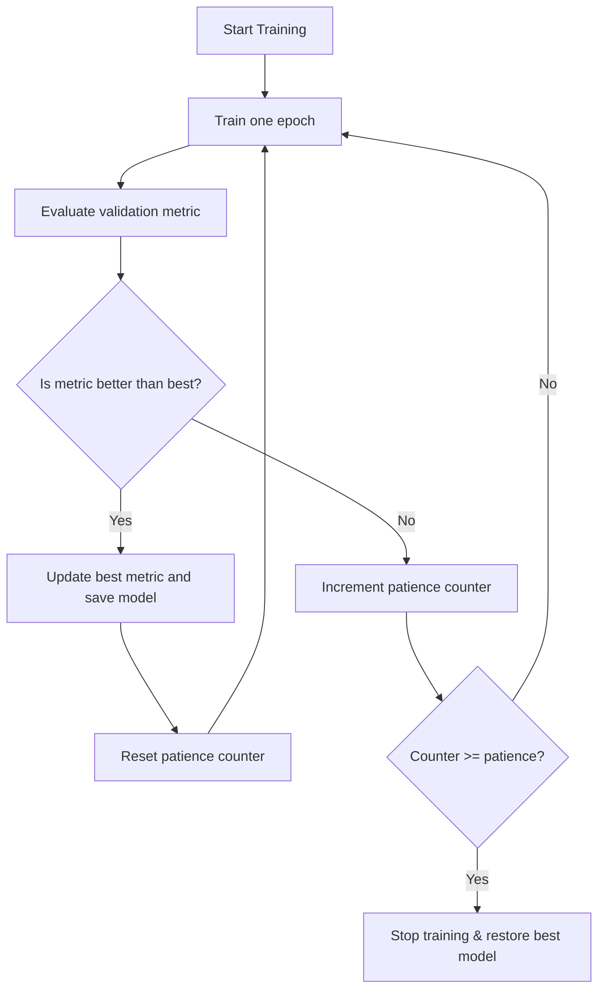
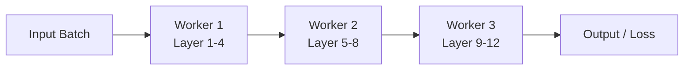
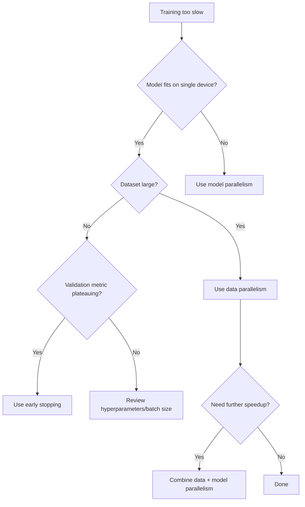

# Task 2.2: Train, fine-tune, and customize models for ML and AI solutions

## Skill 2.2.4: Implement training time reduction techniques (for example, early stopping, distributed training)

### Overview

Training time can become a bottleneck when models are large, datasets are large, or hyperparameter searches run many jobs. This skill focuses on **reducing the time required for training** while maintaining or improving model quality. The two primary techniques highlighted in the exam guide are:

- **Early stopping** – halting a single training run when it stops improving, avoiding wasted epochs.
- **Distributed training** – splitting the training workload across multiple devices or instances to reduce elapsed time.

Understanding when and how to apply these techniques, and their trade-offs, is critical for both the exam and real-world AWS ML engineering.

---

### 1. Early Stopping

**Definition:**  
Early stopping is a regularization and time-saving technique that monitors a validation metric during training and terminates the run when that metric ceases to improve for a specified number of epochs (or steps). This prevents the model from:
- Overfitting to training data.
- Wasting compute resources on non-productive epochs.

#### How It Works

- During training, the model is evaluated on a held-out validation set after each epoch.
- The best observed validation metric (e.g., lowest validation loss, highest validation accuracy) is tracked.
- If the metric does not improve for a pre-defined number of consecutive epochs (**patience**), training stops.
- The model weights from the epoch with the best validation metric are typically restored or saved.

#### Mermaid Diagram: Early Stopping Logic



#### Key Hyperparameters

| Parameter | Description | Typical Use |
| --- | --- | --- |
| **Patience** | Number of epochs to wait after last improvement before stopping | 3–10 for small models; 1–3 for large models |
| **Metric** | Validation metric to monitor (loss, accuracy, F1) | Must align with business objective |
| **Min Delta** | Minimum change to count as improvement | Avoids stopping on noise |

#### Early Stopping in AWS SageMaker AI

- **Built-in algorithms** often expose early stopping via hyperparameters. Example: XGBoost has `early_stopping_rounds`.
- **Script Mode** (custom training code): you implement early stopping logic in your training loop (e.g., using PyTorch Lightning or Keras callbacks). SageMaker passes hyperparameters like `epochs`, `patience` to the script.
- **Automatic Model Tuning (AMT)** uses **Hyperband** strategy, which aggressively stops underperforming training jobs early. This reduces the total time of a hyperparameter search, not just a single run.
- **CloudWatch** displays the training and validation metrics emitted by the job, helping you visually confirm the loss curve plateaued.

---

### 2. Distributed Training

**Definition:**  
Distributed training uses multiple compute devices (GPUs, CPUs, or entire instances) to train a model simultaneously, reducing wall-clock time. It is necessary when:
- A single device cannot hold the model or batch in memory.
- A dataset is too large to process sequentially in a reasonable time.

#### Two Primary Paradigms

| Aspect | Data Parallelism | Model Parallelism |
| --- | --- | --- |
| **Core Idea** | Each worker has a full copy of the model; the dataset is split across workers | The model itself is split across workers; each holds a portion of the layers/parameters |
| **Best For** | Models that fit on a single device but dataset is large | Very large models that exceed single-device memory |
| **Communication** | Gradients are synchronized (AllReduce or parameter server) | Activations/gradients are passed between workers (pipeline or tensor) |
| **Scaling** | Scales with data size; number of workers limited by sync overhead | Scales with model size; limited by sequential dependencies between layers |
| **SageMaker Library** | SageMaker Distributed Data Parallel (SMDDP) | SageMaker Model Parallel (SMP) |

#### Mermaid Diagrams

**Data Parallelism**

```mermaid
flowchart LR
    D[Full Dataset] --> D1[Shard 1]
    D --> D2[Shard 2]
    D --> D3[Shard 3]
    D --> D4[Shard 4]

    D1 --> W1[Worker 1<br>Model Copy]
    D2 --> W2[Worker 2<br>Model Copy]
    D3 --> W3[Worker 3<br>Model Copy]
    D4 --> W4[Worker 4<br>Model Copy]

    W1 <--|AllReduce gradients| W2
    W2 <--|AllReduce gradients| W3
    W3 <--|AllReduce gradients| W4
```

**Model Parallelism (Pipeline)**



#### Hybrid Approaches

In practice, large-scale training often combines both:
- **Pipeline parallelism** for sequential groups of layers.
- **Tensor parallelism** for splitting individual layer operations.
- **Sharded data parallelism** (e.g., FSDP) where optimizer states and gradients are sharded across workers to reduce memory footprint.

#### Distributed Training on AWS SageMaker AI

- **SageMaker Distributed Data Parallel (SMDDP)** is optimized to reduce communication overhead in data parallelism using AWS network infrastructure. It automatically shards data and averages gradients.
- **SageMaker Model Parallel (SMP)** supports pipeline and tensor parallelism for large transformer models. It integrates with PyTorch and Hugging Face.
- **Training with multiple instances**: In SageMaker, you set `instance_count > 1` and either use a managed distributed library or enable it in your training script.
- **Checkpointing and fault tolerance**: Distributed jobs can be long-running; SageMaker handles automatic recovery if an instance fails.

#### Considerations When Scaling

- **Learning Rate**: When increasing batch size across workers, scale the learning rate (e.g., linear scaling).
- **Batch Size**: Effective global batch size = per-worker batch size × number of workers.
- **Communication Overhead**: Data parallelism synchronizes gradients after every step; with too many workers, communication can dominate computation.
- **Data Loading**: Ensure data pipeline can keep up with all workers (e.g., use Amazon S3, optimized DataLoader, or SageMaker Pipe Mode).
- **Network**: SageMaker training clusters use high-bandwidth, low-latency networking, but cross-instance synchronization still costs time.

---

### 3. Other Training Time Reduction Techniques

Although the skill focuses on early stopping and distributed training, the exam may expect familiarity with related techniques:

| Technique | Description | Example in AWS |
| --- | --- | --- |
| **Warm Start** | Reuse knowledge from a previous training/model to initialize a new job, reducing search time | SageMaker AMT warm start uses previous hyperparameter search results |
| **Transfer Learning / Fine-tuning** | Start from a pre-trained model (e.g., foundation model) instead of training from scratch | SageMaker JumpStart, Amazon Bedrock custom models |
| **Automatic Model Tuning with Hyperband** | Stops underperforming tuning jobs early and allocates resources to promising configurations | SageMaker AMT strategy: Hyperband |
| **Mixed Precision Training** | Use lower precision (FP16) to speed up computation and reduce memory usage | Supported in deep learning containers |
| **Increase Batch Size** | Larger batches process more data per step, but may require learning rate scaling | Can be combined with data parallelism |

---

### Scenario-Based Examples

#### Scenario 1: Early Stopping for a Single Training Job

**Question:**  
A data scientist is training a neural network on a large image dataset using SageMaker Script Mode. After 20 epochs, the training loss continues to decrease, but the validation loss has not improved for the last 8 epochs. The job is scheduled to run 100 epochs. Which technique should the data scientist implement to reduce training time and prevent overfitting?

**Options:**
- A. Increase the number of epochs to 150
- B. Implement early stopping with a patience of 3–5 epochs
- C. Switch from data parallelism to model parallelism
- D. Increase the learning rate

**Answer:** **B.** Early stopping would halt the run when validation loss plateaus, saving the remaining unproductive epochs.

**Explanation:**  
The validation loss plateau indicates overfitting. Early stopping monitors validation metrics and stops training if no improvement occurs for a defined patience. This reduces both time and overfitting. Options A and D increase training time or destabilize training. Model parallelism is irrelevant because the model fits on a single device.

---

#### Scenario 2: Choosing Distributed Training Approach

**Question:**  
A company needs to train a BERT-based text classification model. The model fits in memory on a single GPU, but the training dataset contains 500 million rows and takes two weeks on a single instance. Which change would reduce training time **most directly**?

**Options:**
- A. Use model parallelism to partition the BERT layers across multiple GPUs
- B. Increase the number of epochs
- C. Use data parallelism to distribute the dataset across multiple instances
- D. Reduce batch size to one sample per step

**Answer:** **C.** Data parallelism splits the dataset across workers, increasing throughput for a model that fits on a single device.

**Explanation:**  
Since the model fits on one GPU, data parallelism is appropriate. Each worker processes a shard of data in parallel, and gradients are synchronized. Model parallelism is for very large models exceeding device memory. Increasing epochs and reducing batch size would increase or maintain training time.

---

#### Scenario 3: Large Language Model Training

**Question:**  
An ML team wants to train a 175-billion parameter transformer model that does not fit on a single GPU. They require both speed and the ability to fit the model. Which technique should they use?

**Options:**
- A. Data parallelism only
- B. Model parallelism to split the model across devices, possibly combined with data parallelism
- C. Early stopping
- D. Random search hyperparameter tuning

**Answer:** **B.** Model parallelism partitions the model across multiple devices, enabling training of large models. Combining with data parallelism can further speed up training.

**Explanation:**  
For models that exceed single-device memory, model parallelism is necessary. Data parallelism alone would still require each device to hold the full model. Early stopping and random search do not address memory or speed.

---

#### Scenario 4: Hyperparameter Tuning Time Reduction

**Question:**  
A hyperparameter tuning job is taking too long because it runs many full training jobs. The team wants to reduce the total search time while still exploring the hyperparameter space. Which two actions are most effective? *(Choose two)*

**Options:**
- A. Enable early stopping within each training run
- B. Use Hyperband strategy to stop underperforming jobs early
- C. Use model parallelism for each training job
- D. Increase the number of training epochs per job

**Answer:** **A and B.**  
- **A** reduces time per candidate if validation stops improving.  
- **B** (Hyperband) stops poorly performing tuning jobs early, reallocating resources.

**Explanation:**  
These two techniques directly reduce total tuning time. Model parallelism does not necessarily reduce time if the model fits on one device; increasing epochs increases time.

---

### Exam Tips and Traps

#### Tips

- **Match the technique to the bottleneck**:
  - Single-run time + model fits → early stopping or data parallelism.
  - Single-run time + model too large → model parallelism.
  - Search over many hyperparameters → Hyperband or warm start.
- **Remember that early stopping prevents overfitting** – it is also a regularization technique, not just a time saver.
- **Data parallelism** requires each worker to have the full model; use it for large datasets, not large models.
- **Model parallelism** splits the model; use it to fit models larger than device memory, even if dataset is moderate.
- **SageMaker libraries**: 
  - `SMDDP` for data parallel.
  - `SMP` for model parallel.
  - Both can be used together for massive models.
- **Warm start** in AMT: reuses prior tuning results to quickly find good hyperparameters. It is about reducing tuning time, not a single training run.
- **CloudWatch metrics** help you detect plateaus and decide whether early stopping is needed.

#### Common Traps

- **Confusing early stopping for a single job vs. stopping tuning jobs**: AMT can use an early stopping policy to kill underperforming training jobs (like Hyperband). Do not mix them up.
- **Assuming distributed training always reduces time**: Communication overhead can negate speedup if the model is small or batch size is too small. There is an optimal number of workers.
- **Ignoring learning rate scaling**: When increasing global batch size via data parallelism, if learning rate is not adjusted, convergence can suffer.
- **Using model parallelism for models that fit on one device**: This adds communication overhead without memory benefit.
- **Forgetting to save best model**: Early stopping should restore weights from the best epoch, not the last. Otherwise you may keep an overfit model.
- **Overestimating the impact of validation split size**: Reducing validation data size does not significantly reduce training time; actual compute is on training data.
- **Choosing an inappropriate objective metric direction**: If you stop based on a metric that should be maximized but you set it to minimize, early stopping will stop too early (or not at all) and the model may be worse.

---

### Summary Table

| Technique | Use Case | AWS Service / Feature | Key Benefit | Key Risk |
| --- | --- | --- | --- | --- |
| Early stopping | Validation metric plateaus | SageMaker built-in algorithms, Script Mode, AMT | Reduces wasted epochs; prevents overfitting | Stopping too early if patience too low |
| Data parallelism | Model fits on one device; dataset large | SageMaker Distributed Data Parallel (SMDDP) | Linear speedup with workers | Communication overhead; learning rate scaling needed |
| Model parallelism | Model too large for one device | SageMaker Model Parallel (SMP) | Enables training of huge models | Complex communication; pipeline bubbles |
| Hyperband / AMT early stopping | Hyperparameter search too slow | SageMaker Automatic Model Tuning | Stops bad trials early; speeds up search | May miss late-blooming configurations |
| Warm start | Reuse knowledge from previous jobs | SageMaker AMT warm start | Faster convergence to good hyperparameters | Only useful if previous search is related |

---

### Final Mermaid Summary: Selecting the Right Technique



This decision tree helps you choose between early stopping, data parallelism, and model parallelism based on the primary constraint.