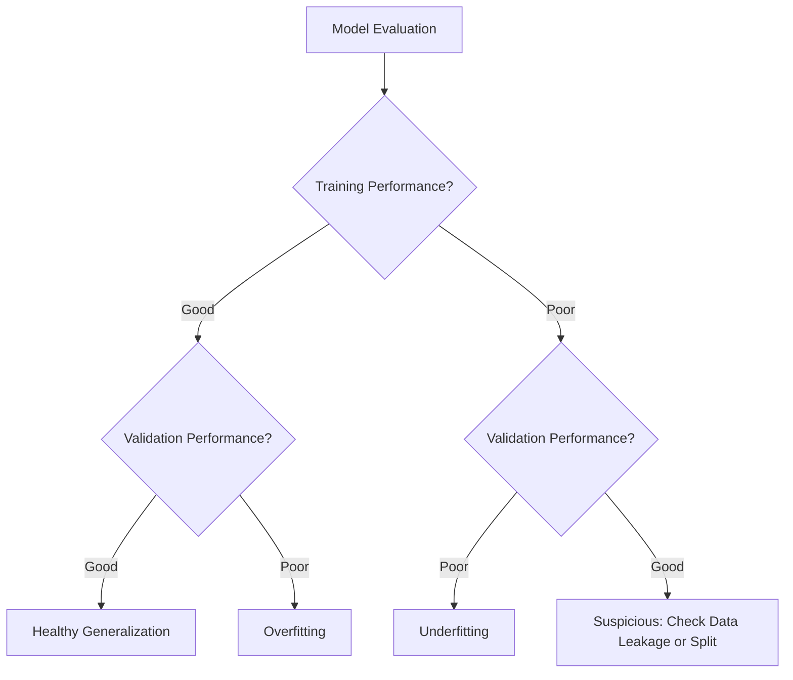
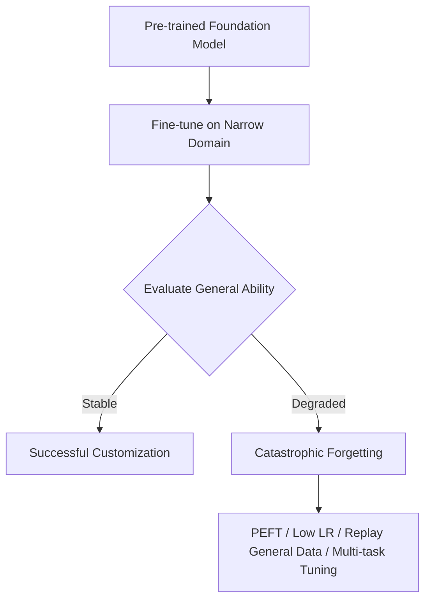

# Task 2.2: ML Model and Foundation Model (FM) Development - Train, fine-tune, and customize models for ML and AI solutions
## Skill 2.2.5: Prevent model overfitting, underfitting, and catastrophic forgetting

## Overview

The goal of training and fine-tuning is **generalization**: strong performance on data the model has not seen before. Three common failures prevent generalization:

| Failure Mode | Core Problem | Common Signal |
| --- | --- | --- |
| **Overfitting** | Model memorizes training data, including noise | Very good training performance, poor validation performance |
| **Underfitting** | Model is too simple to learn the underlying signal | Poor performance on both training and validation data |
| **Catastrophic Forgetting** | Fine-tuning on a narrow task degrades previously learned general capability | New task improves, older or general task degrades sharply |

These failures are not just theoretical. They directly influence how you choose model complexity, regularization, training length, data volume, hyperparameter ranges, and fine-tuning strategy on AWS.

---

## Core Concepts

### Generalization gap
The difference between training performance and validation performance. A large gap usually means overfitting.

### Bias-variance trade-off

| Direction | Failure | Meaning |
| --- | --- | --- |
| High bias | Underfitting | Model is too constrained and misses important relationships |
| High variance | Overfitting | Model changes too much with small differences in training data |

---

## Diagnosing Through Training and Validation Metrics

In Amazon SageMaker AI training jobs, metrics are emitted to Amazon CloudWatch. The shape of training and validation curves is the primary diagnostic signal.

| Training Metric | Validation Metric | Diagnosis |
| --- | --- | --- |
| Very good | Poor | **Overfitting / high variance** |
| Poor | Poor | **Underfitting / high bias** |
| Good | Good | Healthy generalization |
| Poor | Good | Unusual; investigate data leakage, split error, or mislabeled data |

> In classification and regression, choose the direction correctly: minimize loss/error, maximize accuracy/AUC/F1. A SageMaker AI automatic model tuning job pointed in the wrong direction can faithfully optimize toward a worse model.

---

## Overfitting

### What it is
Overfitting occurs when a model learns the specific details, noise, and patterns unique to the training dataset rather than the general signal that transfers to new data.

### Signs
- Training loss is very low, validation loss is higher and may rise after some epochs.
- Training accuracy is much higher than validation accuracy.
- The model responds well to training examples but poorly to held-out examples.
- The model is very sensitive to small changes in input data.

### Common Causes
- Too many model parameters for the amount of training data.
- Training for too many epochs without early stopping.
- Too little training data.
- Noisy or highly complex features.
- Too little regularization.
- Over-tuning to a single validation split.

### Prevention and Remediation

| Technique | What It Does |
| --- | --- |
| **Early stopping** | Stops training when validation performance stops improving; prevents later epochs from memorizing noise |
| **L1/L2 regularization / weight decay** | Penalizes large weights, reducing model complexity |
| **Dropout** | Randomly drops units during training in deep learning models, forcing the model to learn redundant, robust features |
| **Data augmentation** | Creates varied versions of training examples to increase effective dataset size and diversity |
| **Simplify the model** | Reduces number of layers, units, trees, or features |
| **More training data** | Exposes the model to more representative examples |
| **Cross-validation** | Uses multiple validation folds to avoid overfitting to one split |
| **Bagging / ensembling** | Averages multiple models to reduce variance |
| **Lower learning rate** | Prevents large, unstable updates that can fit noise too quickly |

### AWS Context
- Use **Amazon SageMaker AI automatic model tuning (AMT)** with a validation objective.
- Monitor loss curves in **Amazon CloudWatch** to detect a widening train-validation gap.
- Use **early stopping** in built-in algorithms or within your own training loop.
- Use **SageMaker AI Debugger** to inspect gradients and weights for signs of unstable learning.
- Use more data, if available, from Amazon S3 or through AWS data processing services.

---

## Underfitting

### What it is
Underfitting occurs when the model is too simple or too constrained to capture the meaningful patterns in the training data.

### Signs
- Training error remains high.
- Validation error remains high.
- Adding more data alone does not meaningfully improve performance.
- The model produces generic or weak predictions.
- Loss plateaus at a high value.

### Common Causes
- Model capacity is too low for the problem complexity.
- Important features are missing or poorly encoded.
- Too much regularization.
- Not enough training epochs or too low learning rate.
- Wrong algorithm family for the data pattern.

### Prevention and Remediation

| Technique | What It Does |
| --- | --- |
| **Increase model complexity** | Add layers, hidden units, trees, or polynomial interactions |
| **Feature engineering** | Add meaningful features, transforms, interactions, or domain signal |
| **Reduce regularization** | Loosen L1/L2 penalties or reduce dropout |
| **Train longer** | Run more epochs if the training loss is still improving |
| **Increase learning rate carefully** | Helps the model learn faster if training is too slow |
| **Choose a more expressive algorithm** | For example, move from linear regression to a tree or deep model when nonlinear relationships exist |

### AWS Context
- In **SageMaker AI**, switch to a more complex built-in algorithm or adjust model-specific hyperparameters such as tree depth, number of layers, or feature dimension.
- Use **SageMaker AI AMT** to search over a wider range of capacity and regularization hyperparameters.
- Review training curves in **CloudWatch**. If both training and validation loss are high and flat, the model is likely underfitting.

---

## Catastrophic Forgetting

### What it is
Catastrophic forgetting occurs when fine-tuning a pre-trained model on a narrow or new task causes it to lose previously acquired general knowledge or abilities. It is especially important with foundation models and transfer learning.

### Signs
- The target fine-tuning task improves.
- Performance on a previously strong general task degrades sharply.
- The model forgets instructions, reasoning patterns, or domains it handled before.
- Evaluation on a general validation set declines after customization.

### Common Causes
- Full fine-tuning on a very narrow dataset.
- Very high learning rate during fine-tuning.
- Too many fine-tuning epochs.
- Training only on the new task without preserving older or general data.
- Large updates to all parameters of a large pre-trained model.

### Prevention and Remediation

| Technique | What It Does |
| --- | --- |
| **Parameter-efficient fine-tuning (PEFT)** | Updates only a small subset of parameters, such as adapters or low-rank updates, preserving the base model |
| **Data replay / mixing** | Includes a sample of general or previous-task data alongside the fine-tuning dataset |
| **Multi-task fine-tuning** | Trains on the new task and general tasks simultaneously |
| **Lower learning rate** | Makes smaller updates to pre-trained weights |
| **Instruction/prompt tuning** | Adapts behavior without heavily changing core model weights |
| **Evaluate on both target and general validation sets** | Detects forgetting early instead of after deployment |
| **Regularization toward original weights** | Penalizes large deviations from the pre-trained model |

### AWS Context
- Use **Amazon Bedrock** custom model fine-tuning with high-quality, diverse training data and a validation split.
- When available, prefer parameter-efficient customization over full model retraining.
- Use **Amazon SageMaker JumpStart** to fine-tune pre-trained models while controlling learning rate and training data input.
- Monitor target task and general task performance separately after fine-tuning.

---

## AWS Services and Features

| AWS Service | Relevance |
| --- | --- |
| **Amazon SageMaker AI training** | Emits training and validation metrics; supports built-in algorithms and script mode |
| **Amazon CloudWatch** | Visualizes loss and accuracy curves to detect overfitting and underfitting |
| **Amazon SageMaker AI automatic model tuning (AMT)** | Searches hyperparameters to improve generalization based on validation objective |
| **Amazon SageMaker AI Debugger** | Inspects gradients, weights, and training state for problematic patterns |
| **Amazon SageMaker JumpStart** | Fine-tunes pre-trained models with less risk than training from scratch |
| **Amazon Bedrock** | Customizes foundation models; requires careful data selection to avoid forgetting |
| **Amazon S3** | Stores broader, more representative training and replay datasets |

---

## Scenario-Based Exam Examples

### Scenario 1

A team trains a deep learning fraud detection model on Amazon SageMaker AI. They observe 99% training AUC and 72% validation AUC.

Which conclusion and action are correct?

**A.** The model is underfitting; increase model capacity.  
**B.** The model is overfitting; apply regularization, early stopping, and expand the dataset.  
**C.** The model has catastrophic forgetting; use parameter-efficient fine-tuning.  
**D.** The model is healthy; improve the training metric to close the gap.

**Answer:** **B**

**Explanation:**  
Strong training performance with weak validation performance is the classic sign of overfitting. The model has memorized training-specific patterns and needs variance reduction through regularization, early stopping, a simpler model, or more representative data.

---

### Scenario 2

A company fine-tunes an Amazon Bedrock foundation model to convert natural language into SQL. The SQL task improves dramatically, but the model now fails to answer general questions and follow complex instructions it previously handled well.

What is the most likely problem, and what is the best response?

**A.** Underfitting; run more fine-tuning epochs on the SQL dataset.  
**B.** Overfitting; stop using a validation split.  
**C.** Catastrophic forgetting; mix general data into the fine-tuning set and use parameter-efficient fine-tuning.  
**D.** Bad prompt engineering; lower inference temperature.

**Answer:** **C**

**Explanation:**  
The model improved on the new task but lost older general capability, which is catastrophic forgetting. The best response is to constrain updates through parameter-efficient fine-tuning or include replay/general data to preserve prior skills.

---

### Scenario 3

A model trained with SageMaker AI built-in XGBoost has high error on both training and validation sets. Increasing epochs does not help.

What is the most appropriate change?

**A.** Increase regularization strength.  
**B.** Add more informative features or increase model capacity.  
**C.** Apply early stopping.  
**D.** Increase dropout.

**Answer:** **B**

**Explanation:**  
Poor performance on both training and validation data points to underfitting. The model is too simple or lacks useful signal. Adding features, reducing overly aggressive regularization, or increasing model capacity can help. Early stopping and more regularization would likely make underfitting worse.

---

## Exam Tips and Traps

- **Read the metric direction carefully.** If training performance is strong and validation is weak, the answer is likely overfitting, not underfitting.
- **Both train and validation poor = underfitting.** Raising regularization or simplifying the model will make it worse.
- **More epochs is not always the answer.** Without early stopping, more epochs can increase overfitting.
- **Catastrophic forgetting is not classic overfitting.** It shows up as degradation on a previously good general task after fine-tuning.
- **For foundation model fine-tuning**, the safest default is parameter-efficient fine-tuning, lower learning rate, diverse data, and evaluation on multiple capabilities.
- **More data is generally good for overfitting**, but it is not a guaranteed fix for underfitting if the model is too simple.
- **Validation metrics matter in AWS tuning.** SageMaker AI AMT must be pointed at the correct objective direction: minimize error, maximize accuracy.
- **Early stopping should monitor validation performance**, not training performance.
- **Cross-validation reduces the chance of accidentally overfitting** to a single validation split.
- **Check both the model and the data.** Overfitting may mean the model is too complex or the dataset is too small/noisy; underfitting may mean missing features or insufficient capacity.

---

## Key Takeaways

1. **Overfitting** = high variance; strong training score, weak validation score.  
2. **Underfitting** = high bias; both training and validation scores are weak.  
3. **Catastrophic forgetting** = fine-tuned model loses prior general ability while improving on the new task.  
4. Use **training/validation splits**, **CloudWatch metrics**, and **early stopping** to detect failure early.  
5. On AWS, use **SageMaker AI AMT**, **regularization**, **data augmentation**, and **monitoring** to prevent overfitting and underfitting.  
6. For foundation models, prefer **parameter-efficient fine-tuning**, **replay data**, **low learning rates**, and **multi-domain evaluation** to avoid forgetting.