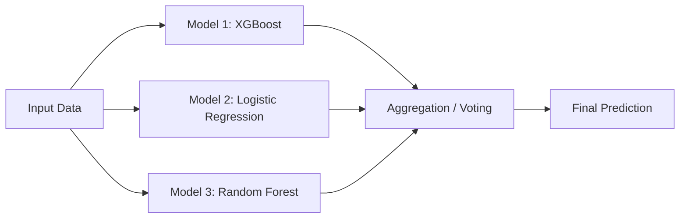
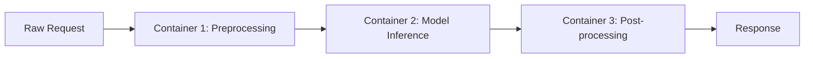
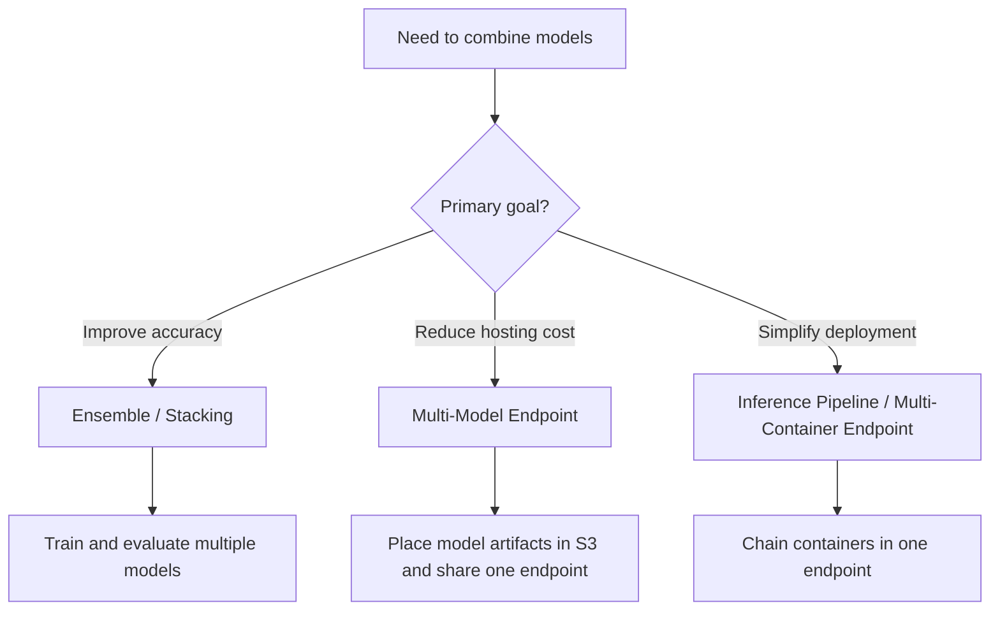

# Task 2.2: ML Model and Foundation Model (FM) Development - Train, fine-tune, and customize models for ML and AI solutions

## Skill 2.2.6: Combine multiple ML models to improve performance or reduce cost

## 1. Introduction

Combining multiple ML models is not a single technique. On the exam, you must distinguish between two very different goals:

- **Improving predictive performance** through ensembles, stacking, or blending.
- **Reducing operational cost** by hosting many models together on shared infrastructure.

A common mistake is to assume that any form of combining models automatically improves both accuracy and cost. The direction of the benefit matters:

| Goal | Primary approach | Main benefit | Main trade-off |
| --- | --- | --- | --- |
| Improve performance | Ensembling, boosting, stacking, voting | Higher accuracy, lower variance/bias | Higher training/inference complexity |
| Reduce cost | SageMaker multi-model endpoints | Shared hosting, better utilization | Cold starts, shared memory limits |
| Improve performance and reduce complexity | Inference pipeline | Clean separation of preprocessing/modeling | Sequential latency |

---

## 2. Combining Models to Improve Performance

### 2.1 Ensemble Methods

Ensemble methods train multiple models and combine their predictions. They improve performance when the individual models make different errors that can offset each other.

Common ensemble strategies include:

| Strategy | How It Works | Main Effect | Example |
| --- | --- | --- | --- |
| **Bagging** | Train multiple independent models on bootstrapped samples in parallel; average or vote | Reduces variance and overfitting | Random forest, multiple XGBoost models on different data subsets |
| **Boosting** | Train models sequentially; each new model focuses on errors made by previous models | Reduces bias and often improves accuracy | SageMaker built-in XGBoost, gradient boosting |
| **Stacking** | Train different base models, then train a meta-model on their outputs | Can combine strengths of different model types | Linear model + XGBoost + neural network with logistic regression meta-model |
| **Voting** | Multiple models vote on the final class or average regression outputs | Simpler combination, improves stability | Majority vote across decision trees or models |
| **Model averaging** | Average predictions from several diverse models | Reduces variance | Averaging deep learning models from different seeds |

### 2.2 When Ensembling Helps

An ensemble is most useful when:

- A single model has high variance and overfits the training data.
- The problem has diverse patterns that different model families capture differently.
- Small gains in accuracy justify additional complexity.
- You can train several models without exceeding project or compute budgets.

It may not help when:

- Models are highly correlated and make the same mistakes.
- The main bottleneck is poor data quality or underfitting.
- The added complexity cannot be justified in production.

### 2.3 Example: Combining Models for Accuracy

A fraud detection team trains an XGBoost model on transaction features. The model has good recall but high false-positive rate. The team then trains a logistic regression model and a decision tree model and combines all three through a weighted vote.

This is an ensemble approach. The goal is improved performance, not reduced infrastructure cost. The extra models can require additional hosting resources unless they are consolidated efficiently.

### 2.4 Mermaid Diagram: Ensemble Decision Flow

---

## 3. Combining Models to Reduce Cost

### 3.1 SageMaker Multi-Model Endpoints

Amazon SageMaker multi-model endpoints allow you to host many models behind a single endpoint using one shared serving container.

Key facts:

- Models are stored in Amazon S3 as model artifacts.
- When a particular model is invoked, SageMaker loads it into the endpoint container on demand.
- Multiple models share the same container and compute resources.
- Useful when you have many models with similar inference logic but different model artifacts.

| Characteristic | Description |
| --- | --- |
| Shared container | All models use the same framework and serving stack |
| Storage | Model artifacts stored in Amazon S3 |
| Loading | Models are loaded on demand when invoked |
| Cost benefit | Fewer endpoint instances required across many models |
| Latency trade-off | Cold starts can occur when a model is not already loaded |

### 3.2 Multi-Container Endpoints vs Multi-Model Endpoints

These two SageMaker endpoint options are different, and the exam may intentionally confuse them.

| Feature | Multi-Model Endpoint | Multi-Container Endpoint |
| --- | --- | --- |
| Number of containers | One shared container | Multiple containers |
| Purpose | Host many model artifacts using one framework | Host several different containers, frameworks, or pipeline steps |
| Common use case | Many similar models per customer or per region | Preprocessing container + model container |
| Model loading | On demand from S3 | Containers are deployed as part of the endpoint |
| Framework flexibility | Low; one container must serve all models | High; each container can use a different framework |

### 3.3 Inference Pipelines

SageMaker inference pipelines combine multiple containers in a single endpoint as a sequential flow.

Example:

Inference pipelines improve deployment simplicity by combining preprocessing, model inference, and post-processing into one endpoint. They do not necessarily reduce cost in the same way as multi-model endpoints, but they reduce the number of separately managed endpoints and network calls.

---

## 4. Choosing the Right Combination Strategy

### 4.1 Decision Table

| Requirement | Recommended Combination | AWS Service/Technique |
| --- | --- | --- |
| Improve model accuracy | Ensemble or stacking | SageMaker training with XGBoost, script mode, or built-in algorithms |
| Reduce variance and overfitting | Bagging | Train multiple models on bootstrapped samples |
| Reduce bias | Boosting | SageMaker built-in XGBoost |
| Host many similar models cost-effectively | Multi-model endpoint | Amazon SageMaker multi-model endpoint |
| Run different frameworks or processing steps in one endpoint | Multi-container endpoint or inference pipeline | Amazon SageMaker multi-container endpoint |
| Simplify preprocessing + inference deployment | Inference pipeline | Amazon SageMaker inference pipeline |

### 4.2 Mermaid Diagram: Choosing Performance vs Cost

---

## 5. Scenario-Based Examples

### Scenario 1: Improving Model Stability

A data science team developed a churn prediction model that performs well on training data but shows high variance on validation data. The team decides to train five versions of the same model on different bootstrapped samples and average their outputs.

**Question:** Which strategy is the team using?

- **A.** Multi-model endpoint hosting
- **B.** Bagging ensemble
- **C.** Boosting ensemble
- **D.** Inference pipeline

**Answer:** **B. Bagging ensemble**

**Explanation:**  
Training several independent models on bootstrapped samples and averaging their outputs is bagging. It reduces variance and overfitting. It is not a hosting strategy, sequential boosting, or a deployment pipeline.

---

### Scenario 2: Reducing Hosting Costs

A company maintains 40 different product recommendation models for 40 retail partners. Each model uses the same framework and receives only modest traffic. Hosting each model on a separate endpoint is expensive.

**Question:** Which approach most directly reduces hosting cost?

- **A.** Train a larger ensemble of the 40 models
- **B.** Implement a multi-container endpoint for each model
- **C.** Deploy all models to a SageMaker multi-model endpoint
- **D.** Fine-tune a single foundation model for all partners

**Answer:** **C. Deploy all models to a SageMaker multi-model endpoint**

**Explanation:**  
A SageMaker multi-model endpoint shares one container and underlying compute across many model artifacts. Since all models use the same framework and have low traffic, this directly reduces cost. Ensembling does not primarily reduce hosting cost, and creating multiple multi-container endpoints would not consolidate resources.

---

### Scenario 3: Combining Preprocessing and Inference

An ML engineer needs to deploy a model that first transforms raw text features using a custom preprocessing container and then runs inference in a separate PyTorch container.

**Question:** Which SageMaker capability should they use?

- **A.** Multi-model endpoint
- **B.** Inference pipeline
- **C.** Bagging
- **D.** Automatic model tuning

**Answer:** **B. Inference pipeline**

**Explanation:**  
An inference pipeline chains multiple containers sequentially in one endpoint, making it the correct choice for preprocessing followed by model inference. A multi-model endpoint shares one container across many models but does not chain different containers.

---

### Scenario 4: Different Frameworks on One Endpoint

A team has one model trained in TensorFlow and one model trained in PyTorch. They want to combine them into one endpoint where the TensorFlow model handles feature extraction and the PyTorch model performs classification.

**Question:** Which approach should the team choose?

- **A.** SageMaker multi-model endpoint with TensorFlow container
- **B.** SageMaker multi-container endpoint
- **C.** Train both models in the same framework and use a multi-model endpoint
- **D.** Use bagging to average the two models

**Answer:** **B. SageMaker multi-container endpoint**

**Explanation:**  
A multi-model endpoint uses a single shared container. If the models require different frameworks, they cannot share the same container. A multi-container endpoint supports multiple containers and frameworks in one endpoint.

---

## 6. Exam Tips and Traps

### 6.1 Key Distinctions to Remember

- **Ensembling improves performance.**  
  Multi-model endpoints reduce cost. Do not confuse the two goals.

- **Bagging reduces variance.**  
  Boosting reduces bias. Stacking combines different model types through a meta-model.

- **Multi-model endpoints support one container and many model artifacts.**  
  They do not support different frameworks in different containers.

- **Multi-container endpoints support different containers and frameworks.**  
  They are used for inference pipelines or serving different models in separate containers.

- **Inference pipelines chain containers sequentially.**  
  They are not the same as running independent models in parallel for voting.

- **Cold starts are a key trade-off for multi-model endpoints.**  
  If models are loaded on demand, infrequently used models may take longer to serve first requests.

### 6.2 Common Exam Traps

| Trap | Correct Understanding |
| --- | --- |
| “Use a multi-model endpoint to improve accuracy.” | Multi-model endpoints mainly reduce cost; they do not inherently improve accuracy. |
| “Use ensembling when the main requirement is lower latency and lower cost.” | Ensembling can increase training and hosting complexity; it is used for accuracy. |
| “A multi-model endpoint can run models from different frameworks.” | A multi-model endpoint uses one shared container, so the framework must be compatible. |
| “Boosting trains models independently in parallel.” | Boosting trains models sequentially, with each model focusing on previous errors. Bagging is the parallel strategy. |
| “Stacking is always simpler than a single model.” | Stacking adds complexity and can overfit if the meta-model is not trained carefully. |
| “Inference pipelines are the same as multi-model endpoints.” | Inference pipelines chain multiple containers; multi-model endpoints share one container across many model artifacts. |

### 6.3 Quick Recall for Exam Day

- **Need better accuracy?** Consider ensemble, bagging, boosting, or stacking.
- **Need lower hosting cost for many similar models?** Consider a SageMaker multi-model endpoint.
- **Need different framework containers in one endpoint?** Consider a multi-container endpoint.
- **Need preprocessing + inference as one endpoint?** Consider an inference pipeline.
- **Need to reduce variance?** Bagging.
- **Need to reduce bias?** Boosting.
- **Need to combine heterogeneous base models?** Stacking.

---

## 7. Summary

Combining multiple ML models in AWS is primarily divided into:

1. **Performance-oriented combinations:**  
   Ensembles, bagging, boosting, voting, and stacking improve model accuracy and robustness.

2. **Cost-oriented combinations:**  
   Amazon SageMaker multi-model endpoints reduce hosting costs by sharing infrastructure across many model artifacts.

3. **Deployment-oriented combinations:**  
   Multi-container endpoints and inference pipelines combine different processing stages or different frameworks into a single endpoint.

For the AWS Certified Machine Learning - Associate exam, focus on why each approach is used, its trade-offs, and the correct SageMaker capability for a given scenario.