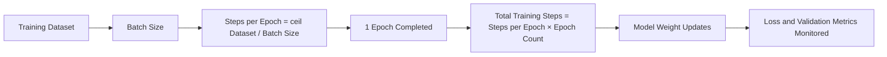

# Task 2.2: ML Model and Foundation Model (FM) Development - Train, fine-tune, and customize models for ML and AI solutions

## Skill 2.2.7: Adjust fundamental hyperparameters (for example, epoch, steps, batch size)

## 1. Introduction

Hyperparameters are configuration settings that control how a model learns. Unlike model parameters, such as weights and biases, hyperparameters are **set before training begins** and are not learned directly from the training data. The most fundamental hyperparameters to understand for the AWS Certified Machine Learning - Associate exam are:

- **Epoch**
- **Steps**
- **Batch size**
- **Learning rate** (closely related and often tested together with the above)

Adjusting these hyperparameters correctly directly affects model quality, training time, resource cost, and the risk of overfitting or underfitting.

---

## 2. Core Concepts

### 2.1 Model Parameters vs. Hyperparameters

| Concept | Definition | Learned or Set? |
|---|---|---|
| **Model parameters** | Weights, biases, coefficients learned during training | Learned by the algorithm from data |
| **Hyperparameters** | External configuration settings that govern training | Set before training by the practitioner |

For example, in a neural network, the weights between neurons are model parameters. The number of epochs, batch size, and learning rate are hyperparameters.

---

## 3. Fundamental Hyperparameters in Detail

### 3.1 Epoch

#### Definition

An **epoch** is one complete pass over the entire training dataset.

- If a training dataset has 10,000 samples, one epoch means the model has seen all 10,000 samples once.
- If you train for 10 epochs, the model sees each sample 10 times, resulting in repeated passes over the data.

#### Purpose and Impact

| Increase in Epochs | Typical Effect |
|---|---|
| Too few epochs | Underfitting; model has not learned enough from the data |
| Moderate increase | Better training performance, usually better validation performance until a point |
| Too many epochs | Overfitting; model memorizes training data, validation performance drops |

Epochs must be balanced. **Early stopping** is a technique that monitors a validation metric during training and stops the job when the metric stops improving, even before the configured number of epochs is reached.

#### Example

A deep learning model trained on tabular customer churn data:

- 1 epoch: underfits, both training and validation accuracy are low.
- 20 epochs: good balance, validation accuracy peaks.
- 100 epochs: training accuracy near 100%, validation accuracy drops, indicating overfitting.

---

### 3.2 Steps

#### Definition

A **step** is one update of the model weights. The number of steps in one epoch depends on the dataset size and batch size:

```
steps_per_epoch = ceil(number_of_training_samples / batch_size)
```

For example, with 1,000 training samples and a batch size of 100, one epoch has 10 steps.

#### Total Training Steps

```
total_steps = steps_per_epoch × number_of_epochs
```

For 10 epochs with the above example:

```
total_steps = 10 × 10 = 100
```

#### Why Steps Matter

- Some training jobs can be configured using a fixed number of steps instead of epochs.
- In reinforcement learning and some fine-tuning APIs, training stops after a specified number of steps.
- Monitoring loss every N steps helps determine when a model has stopped improving.

#### Key Exam Clarification

- **Epoch** defines a full pass through the data.
- **Step** defines a single weight update, typically based on one batch.

If you change batch size, the number of steps per epoch changes even if the dataset size remains the same.

---

### 3.3 Batch Size

#### Definition

**Batch size** is the number of training examples used to compute one update to the model weights. The training data is split into batches, and the model updates weights after each batch.

#### Impact of Batch Size

| Batch Size | Effect on Training | Effect on Memory | Effect on Generalization |
|---|---|---|---|
| **Small** (e.g., 16, 32) | Slower training wall-clock time; more updates per epoch | Lower GPU memory usage | Often acts as a form of regularization; can generalize better |
| **Large** (e.g., 256, 512, 1024) | Faster training; fewer updates per epoch | Higher GPU memory usage | May converge to sharper minima; sometimes worse generalization |

#### Important Trade-offs

- **Small batch size**:
  - Noisier gradient estimates.
  - More updates per epoch.
  - Can help escape local minima.
  - Longer total training time per epoch.
- **Large batch size**:
  - More stable gradient estimates.
  - Faster if hardware can handle it.
  - May require a higher learning rate to converge well.
  - May not fit into GPU memory.

#### Example

On a single GPU with 16 GB of memory:

- Batch size of 512 may cause out-of-memory errors for a large transformer.
- Batch size of 32 fits, but training is slower per epoch because of more forward/backward passes.

---

### 3.4 Learning Rate

Although the skill statement focuses on epoch, steps, and batch size, the **learning rate** is a closely related fundamental hyperparameter that is frequently tested.

#### Definition

The learning rate controls how much the model weights change in response to the estimated error gradient at each step.

| Learning Rate | Typical Effect |
|---|---|
| **Too high** | Training loss oscillates or diverges; model may fail to converge |
| **Too low** | Training is very slow; model may get stuck in local minima |
| **Moderate** | Good convergence speed and stability |

#### Relationship with Batch Size

- Larger batch sizes typically allow a larger learning rate because gradients are more stable.
- Smaller batch sizes may require a smaller learning rate due to noisy gradient updates.

---

## 4. Visualizing the Relationship



This diagram shows:

1. The dataset is split by batch size.
2. The number of steps per epoch depends on batch size and dataset size.
3. After one full pass, an epoch is complete.
4. Training continues for the configured number of epochs.
5. Each step triggers a weight update.
6. Metrics are evaluated periodically for early stopping or tuning.

---

## 5. How to Adjust Fundamental Hyperparameters in Practice

### 5.1 General Guidance

| Problem | Likely Adjustment |
|---|---|
| Training loss decreases too slowly | Increase learning rate or batch size; consider if model capacity is sufficient |
| Training loss oscillates or diverges | Decrease learning rate |
| Training accuracy high but validation accuracy low | Overfitting: reduce epochs, use early stopping, add regularization, or reduce batch size |
| Both training and validation accuracy low | Underfitting: increase epochs, increase model capacity, or reduce regularization |
| Training takes too long | Increase batch size if memory allows, use distributed training, or reduce epochs with early stopping |
| GPU memory exhausted | Reduce batch size |

### 5.2 Epoch Adjustment

- Start with a reasonable epoch count and use **early stopping**.
- Monitor **training loss** and **validation loss**:
  - If validation loss stops decreasing, more epochs may not help.
  - If both keep decreasing, more epochs may be useful.

### 5.3 Batch Size Adjustment

- Choose the largest batch size that fits into memory to improve hardware utilization.
- If training is unstable or generalization is poor, consider reducing batch size.
- When increasing batch size significantly, also consider increasing the learning rate proportionally or using a learning rate warm-up.

### 5.4 Steps Adjustment

- If you configure training by **steps** rather than epochs, calculate:
  - `steps_per_epoch = ceil(dataset_size / batch_size)`
  - `total_steps = steps_per_epoch × epochs`
- In SageMaker built-in algorithms, some use `epochs` only, while others may expose `steps` or `max_steps`.
- For custom scripts in SageMaker script mode, you control epochs and batch size inside your training loop.

---

## 6. Scenario-Based Examples

### Scenario 1: Overfitting During Image Classification

A data scientist trains a convolutional neural network on 50,000 images using Amazon SageMaker. After 100 epochs, training accuracy is 99%, but validation accuracy is only 78%.

**Question:** Which hyperparameter adjustment would most directly reduce overfitting?

**Answer:** Reduce the number of epochs and enable early stopping.

**Explanation:**
- The model has learned the training data too well.
- Training beyond the point where validation performance peaks causes the model to memorize noise.
- Reducing epochs reduces the number of passes over the training data, limiting overfitting.
- Early stopping automatically halts training when validation loss stops improving.

---

### Scenario 2: Training Time Too Long

A machine learning engineer is training a deep learning model on a dataset of 1 million records. The current batch size is 32, and training takes many hours on a single GPU.

**Question:** Which adjustment could reduce training time without necessarily increasing overfitting?

**Answer:** Increase batch size to 256 or 512, provided GPU memory supports it.

**Explanation:**
- Larger batch sizes reduce the number of steps per epoch.
- Each epoch processes the same amount of data, but fewer weight updates reduce overhead.
- However, the engineer must validate that larger batch size does not degrade generalization.
- If needed, pair the larger batch size with a slightly higher learning rate or learning rate warm-up.

---

### Scenario 3: Underfitting and Slow Convergence

A model is trained for 5 epochs with a batch size of 16 and a learning rate of 0.00001. Both training and validation accuracy are low, and loss decreases very slowly.

**Question:** Which hyperparameter changes would most likely improve convergence?

**Answer:** Increase learning rate and increase number of epochs.

**Explanation:**
- The learning rate is too small, causing slow weight updates.
- With only 5 epochs, the model may not have seen enough data to learn.
- Increasing epochs gives the model more passes over the data.
- Increasing the learning rate moves weights more per step, speeding up convergence.

---

## 7. Exam Tips and Traps

### 7.1 Exam Tips

1. **Know the definitions precisely**
   - Epoch = full pass over the dataset.
   - Step = one weight update.
   - Batch size = number of samples per weight update.

2. **Understand the relationships**
   - `steps_per_epoch = ceil(samples / batch_size)`
   - More epochs = more passes = higher risk of overfitting.
   - Larger batch size = fewer steps per epoch = possible faster training but higher memory.

3. **Connect hyperparameters to overfitting and underfitting**
   - Overfitting: reduce epochs, add regularization, or reduce batch size.
   - Underfitting: increase epochs, increase model capacity, or increase learning rate.

4. **Use early stopping**
   - Early stopping is a training time reduction technique.
   - It monitors a validation metric and stops training when improvement stops.
   - It is not the same as simply setting fewer epochs.

5. **Match hyperparameters to SageMaker capabilities**
   - SageMaker training jobs accept hyperparameters as JSON key-value inputs.
   - SageMaker automatic model tuning can search ranges of epochs, batch size, learning rate, etc.
   - For built-in algorithms, check the algorithm-specific hyperparameter names.

---

### 7.2 Common Traps

| Trap | Why It Is Wrong |
|---|---|
| **More epochs always improve the model** | Beyond a point, more epochs cause overfitting and waste compute |
| **Batch size can be increased arbitrarily to speed up training** | Large batch sizes may exceed GPU memory and can harm generalization |
| **Steps and epochs are the same thing** | One epoch consists of many steps; steps per epoch depends on batch size |
| **Hyperparameters can be calculated exactly from the dataset** | Hyperparameters are chosen empirically, not derived analytically |
| **Reducing epochs is always the best way to reduce training time** | It may cause underfitting; consider batch size, distributed training, or early stopping first |
| **A larger batch size always requires a lower learning rate** | In many cases, larger batch sizes allow a higher learning rate because gradients are more stable |
| **Changing batch size does not affect steps per epoch** | Batch size directly changes the number of steps per epoch |
| **Early stopping increases the number of epochs** | Early stopping stops training before the configured maximum epochs; it never increases them |
| **Overfitting is caused only by too many epochs** | Overfitting can also be caused by too much model capacity or too little training data |
| **Validation accuracy improves indefinitely with more epochs** | Validation accuracy typically peaks and then decreases as the model overfits |

---

## 8. Visual Summary Table

| Hyperparameter | Definition | Increase Effect | Decrease Effect | Typical Use |
|---|---|---|---|---|
| **Epoch** | Full pass over training data | More learning, higher overfitting risk | May underfit if too small | Set with early stopping |
| **Step** | One weight update | More total updates if epochs fixed | Fewer total updates | Monitor training progress |
| **Batch size** | Samples per weight update | Faster epochs, higher memory, fewer steps | Slower epochs, lower memory, more steps | Balance speed and generalization |
| **Learning rate** | Amount weights move per step | Faster convergence, risk of divergence | Slower convergence, risk of getting stuck | Tune based on batch size and stability |

---

## 9. Key Takeaways for the Exam

- **Epoch, steps, and batch size are hyperparameters**, not model parameters.
- **Epochs** control how many times the model sees the dataset.
- **Batch size** controls how many samples are used per weight update and determines steps per epoch.
- **Steps** are individual weight updates; total steps depend on epochs and batch size.
- Adjusting these hyperparameters affects **training time, cost, memory usage, and generalization**.
- Use **early stopping** when validation performance stops improving.
- For AWS scenarios, know that SageMaker training and tuning jobs allow you to specify these hyperparameters and search over them using **automatic model tuning**.
- In foundation model fine-tuning, epoch and batch size are still key customization hyperparameters, but the trade-offs remain the same.

---

## 10. Final Exam-Style Question

A machine learning engineer is training a model on 240,000 samples. The current batch size is 64, and training is set for 25 epochs. The model is overfitting, and training time is also longer than desired.

**Which change would address both overfitting and long training time?**

**Answer:** Enable early stopping and increase batch size to 128 while monitoring validation loss.

**Explanation:**
- Early stopping prevents overfitting by halting training when validation performance stops improving.
- Increasing batch size reduces the number of steps per epoch and can speed up training, provided GPU memory is sufficient.
- The combination addresses both the overfitting signal and the efficiency concern without eliminating training prematurely.

---

**End of Study Notes for Skill 2.2.7**