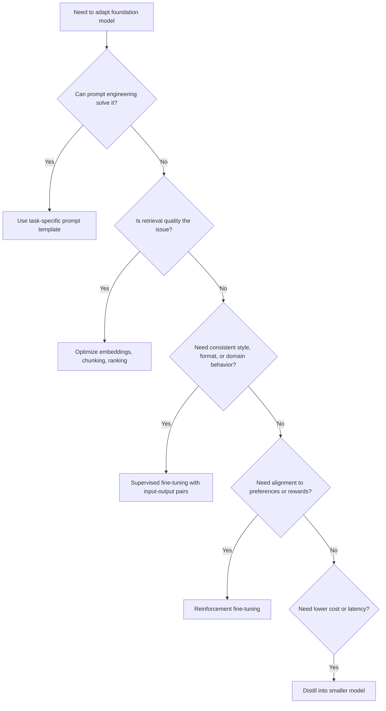

# Task 2.2: ML Model and Foundation Model (FM) Development - Train, fine-tune, and customize models for ML and AI solutions

## Skill 2.2.8: Apply customization techniques for AI solutions (for example, task-specific prompt engineering, fine-tuning)

---

## 1. Skill Overview

This skill focuses on adapting generative AI foundation models to a specific task, domain, or application behavior. The two most common customization techniques covered on the AWS Certified Machine Learning - Associate exam are:

- **Task-specific prompt engineering** - changing the model input without changing model weights.
- **Fine-tuning** - updating model weights using task-specific data.

AWS provides managed tools for both approaches, primarily through **Amazon Bedrock** and **Amazon SageMaker AI**. A successful candidate must know when to use each technique, what data or artifacts each requires, and what failure signals indicate the wrong technique is being applied.

This skill also intersects with retrieval optimization. If an application uses Retrieval-Augmented Generation (RAG), poor answers may come from poor retrieval rather than from the generator model. Customizing the model is not always the correct fix.

---

## 2. Customization Techniques at a Glance

| Technique | What Changes | Typical Data/Artifact Required | Primary Goal | Complexity/Cost |
|---|---|---|---|---|
| **Prompt engineering** | Model input only | Instructions, context, output examples | Shape response format, tone, task framing | Very low |
| **Supervised fine-tuning** | Model weights | Labeled input-output pairs | Improve domain style, task adherence, consistent formatting | Medium to high |
| **Reinforcement fine-tuning** | Model weights/policy | Reward signals, preference data | Align model behavior to human or business preferences | High |
| **Distillation** | Student model weights | Prompt set and teacher-generated responses | Reduce inference cost/latency while preserving behavior | Medium |
| **Retrieval optimization** | Retrieval pipeline | Embeddings, chunked documents, ranking logic | Ensure the model receives relevant source content | Low to medium |

All of these techniques are customization paths for AI solutions. However, they solve different problems.

---

## 3. Task-Specific Prompt Engineering

### 3.1 What It Is

Prompt engineering is the practice of designing and maintaining the input text sent to a foundation model to produce more accurate, consistent, and task-appropriate outputs.

Prompt engineering does **not** change model weights, does not require a training job, and is not considered model training. It is the fastest and least expensive customization technique.

### 3.2 Key Components of a Strong Task-Specific Prompt

A well-engineered prompt typically includes:

| Component | Purpose | Example |
|---|---|---|
| **Instruction** | Tell the model what task to perform | "Summarize this support ticket." |
| **Context** | Provide relevant background or source text | The actual ticket text or retrieved passages |
| **Output format** | Specify structure, length, tone, or style | "Return a JSON object with fields: summary, sentiment, priority." |
| **Few-shot examples** | Show examples of desired input-output behavior | A support ticket and its correct summary |
| **Constraints** | Set boundaries | "Do not mention customer names. Use no more than 50 words." |

### 3.3 Prompt Templates and Versioning

In production AI applications, prompts should be treated like configuration artifacts, not buried inside application code.

A stored **prompt template** contains:

- Static instructions.
- Variables for dynamic content.
- A version identifier.

This allows teams to track prompt changes, compare outputs across versions, and roll back if needed.

### 3.4 When Prompt Engineering Is the Right Choice

Use prompt engineering first when:

- The base model already knows the general task.
- The required change is about how the model responds, not what it knows.
- The team has few or no labeled examples.
- Speed and cost are critical.
- Output inconsistency can be fixed by clearer instructions or examples.

### 3.5 Limitations of Prompt Engineering

Prompt engineering has limits:

- It cannot teach the model new private domain facts reliably.
- It is constrained by the model's context window.
- It may still produce inconsistent output for complex tasks.
- Too many few-shot examples may increase latency and token usage.
- It does not change the model's learned behavior or style.

When repeated prompt improvements stop providing meaningful gains, the next step is often **fine-tuning**.

---

## 4. Fine-Tuning Foundation Models

### 4.1 What Fine-Tuning Is

Fine-tuning updates a pre-trained foundation model's weights using additional task-specific data. Unlike prompt engineering, fine-tuning changes the model itself.

Fine-tuning is appropriate when the model needs to:

- Adopt a consistent output format for a specific application.
- Learn domain-specific terminology or tone.
- Follow a company-specific style guide.
- Reduce the number of few-shot examples required at inference.
- Perform a specialized task more reliably than prompting alone can achieve.

### 4.2 Supervised Fine-Tuning

Supervised fine-tuning uses **labeled input-output pairs**.

Example:

- Input: "A customer asked for a refund because the product arrived damaged."
- Output: "Category: Refund; Subcategory: Damaged Shipment; Priority: High"

During customization, the model learns to map inputs to the expected outputs.

**Typical use cases:**

- Customer support ticket classification.
- Domain-specific summarization.
- Legal or medical language adaptation.
- Consistent report generation.
- API-like structured output from natural language input.

### 4.3 Reinforcement Fine-Tuning

Reinforcement fine-tuning goes beyond labeled examples. It uses **reward signals** to teach the model which responses are preferred.

The team provides:

- A reward function or reward model.
- Feedback that scores responses for quality, safety, helpfulness, or business metrics.

This technique is useful when the desired behavior is hard to express only through examples and instead depends on preferences.

**Example scenario:**

A financial assistant should refuse unclear investment advice, ask clarifying questions, and avoid speculative language. The team creates rewards for compliant responses and penalties for unsafe ones.

### 4.4 Distillation

Distillation transfers knowledge from a large, high-performing teacher model into a smaller, faster student model.

The workflow generally uses:

- A prompt set reflecting the task distribution.
- The teacher model generates high-quality responses.
- The student model is fine-tuned on those generated responses.

**Primary benefit:**

- Lower inference cost.
- Lower latency.
- Smaller deployment footprint.

Distillation does not necessarily require manually labeled data. It relies on the teacher's generated outputs.

### 4.5 Catastrophic Forgetting

Catastrophic forgetting occurs when fine-tuning a foundation model on a narrow domain or small dataset causes it to lose broader capabilities it previously had.

Signs include:

- Fine-tuned model performs well on the target task.
- Performance drops significantly on general language understanding or previously learned tasks.

**Mitigations:**

- Include a mixture of target-domain data and broader general data.
- Use a low learning rate.
- Limit the number of training epochs.
- Evaluate on both target and general benchmarks before deployment.

---

## 5. Decision Framework for AI Customization

The diagram below summarizes the decision-making flow for customizing a generative AI solution.

---

## 6. Prompt Engineering vs. Fine-Tuning vs. RAG

This comparison is frequently tested on the exam.

| Aspect | Prompt Engineering | Fine-Tuning | RAG |
|---|---|---|---|
| Changes model weights? | No | Yes | No |
| Adds new external knowledge? | No, only context window | Limited, not ideal for frequent updates | Yes, retrieves from external sources |
| Primary purpose | Shape behavior per request | Learn a stable task style or domain behavior | Access fresh or private knowledge |
| Cost | Very low | Medium to high | Medium |
| Typical data needed | Few examples or none | Labeled input-output pairs | Documents, embeddings, vector store |
| Best first step? | Usually yes | Only after prompting is insufficient | When answers depend on current/private data |

**Key insight:** Fine-tuning is not a reliable replacement for RAG when the application needs continuous access to changing knowledge bases. Fine-tuning specializes behavior; RAG supplies external knowledge.

---

## 7. Scenario-Based Examples

### Scenario 1: Consistent Legal Document Summarization

A legal tech company uses a foundation model to summarize contracts. The model sometimes produces bullet lists, sometimes paragraphs, and occasionally omits the governing law section. The team has tried improving prompts with limited success.

Which customization technique should they apply next?

**Answer:** Supervised fine-tuning.

**Explanation:**  
The model's behavior is inconsistent despite clear prompting. The team likely has a collection of contracts and acceptable summaries. Fine-tuning with labeled input-output pairs can teach the model to consistently produce the required structure and include the governing law section. Prompt engineering has already been exhausted.

---

### Scenario 2: Bad Retrieval Blamed on the Generator

A RAG-based support bot often retrieves passages that are only loosely related to the customer's question. The development team wants to fine-tune the generator model to improve answer quality.

What is the most appropriate action?

**Answer:** Improve the retrieval pipeline before fine-tuning the generator.

**Explanation:**  
If the retrieved passages do not contain the answer, no amount of fine-tuning or prompting will make the generator produce a correct, grounded answer. The issue is in the retrieval component. The team should revisit:

- The embedding model used for queries and documents.
- The chunking strategy.
- The ranking and filtering logic.

Fine-tuning the generator would be premature and expensive.

---

### Scenario 3: Reducing Cost While Preserving Model Behavior

A company uses a very large foundation model for a customer-facing summarization task. The model performs well but is too expensive and slow. The team does not want to sacrifice output quality significantly.

Which customization technique is most appropriate?

**Answer:** Distillation.

**Explanation:**  
Distillation transfers the behavior of the large teacher model into a smaller, faster student model. The team can provide a prompt set representing the summarization workload, have the teacher model generate responses, and then fine-tune the student model on those responses. This reduces cost and latency while preserving much of the teacher's task behavior.

---

### Scenario 4: Domain-Specific Tone but No Labeled Data

A healthcare startup wants a foundation model to write patient education summaries in a warm, plain-language tone. They do not have labeled examples, but they have a large set of approved educational articles.

What is the best immediate approach?

**Answer:** Start with task-specific prompt engineering using the articles as context.

**Explanation:**  
Without labeled input-output pairs, supervised fine-tuning is not immediately feasible. The team can use prompt engineering to instruct the model to write in a warm, plain-language style and include a relevant educational article as context. If they later create labeled examples from approved summaries, fine-tuning may become a viable next step.

---

## 8. Exam Tips and Traps

### 8.1 Tips

1. **Always consider prompt engineering first.**  
   Exam scenarios often expect the cheapest, fastest solution. If a problem can be solved by improving the prompt, choose prompt engineering.

2. **Match data to technique.**  
   - Labeled input-output pairs → supervised fine-tuning.
   - Reward functions or preference scores → reinforcement fine-tuning.
   - Prompt set and teacher-generated responses → distillation.
   - Unlabeled documents → RAG, not fine-tuning.

3. **Know what retrieval problems look like.**  
   If retrieved passages are irrelevant, fix the embedding model, chunking, or ranking, not the generator.

4. **Recognize the role of prompt templates.**  
   Prompt templates with variables and versioning are part of production prompt engineering. They improve maintainability and reproducibility.

5. **Understand that fine-tuning changes weights.**  
   Fine-tuning is a training job. Prompt engineering is an inference-time change.

6. **Watch for catastrophic forgetting.**  
   If fine-tuning improves a narrow task but degrades general behavior, include broader data in the training mixture.

7. **Use few-shot examples correctly.**  
   Few-shot prompting is not fine-tuning. It is still prompt engineering because no weights are updated.

### 8.2 Traps

1. **Choosing fine-tuning when prompting has not been tried.**  
   If the question says the model is not following instructions well, the first answer is usually better prompt design, not fine-tuning.

2. **Assuming fine-tuning adds fresh knowledge.**  
   Fine-tuning is not the correct tool for giving a model access to a frequently changing private knowledge base. RAG is more suitable.

3. **Confusing retrieval problems with generation problems.**  
   If the generated answer is poor because the source passages are wrong, fine-tuning the generator will not help.

4. **Thinking lower temperature fixes retrieval.**  
   Temperature affects output randomness during generation. It does not change which passages are retrieved from a vector store.

5. **Treating distillation as a prompt-only change.**  
   Distillation requires training a student model. It is more than simply using a shorter prompt or fewer examples.

6. **Ignoring the objective metric direction during evaluation.**  
   When comparing model versions after customization, ensure metrics are correctly maximized or minimized.

7. **Assuming reinforcement fine-tuning needs large labeled output sets.**  
   Reinforcement fine-tuning relies on reward signals or preference data, not necessarily traditional input-output labels.

---

## 9. Summary

| Customization Need | Best Technique |
|---|---|
| Improve task framing, output format, or style quickly | Task-specific prompt engineering |
| Teach consistent domain-specific behavior with available labeled data | Supervised fine-tuning |
| Align model behavior to complex human or business preferences | Reinforcement fine-tuning |
| Reduce cost and latency while keeping task behavior | Distillation |
| Provide access to fresh or private knowledge | RAG, not model fine-tuning |
| Fix irrelevant retrieved passages | Optimize embeddings, chunking, and ranking |

For the AWS MLA-C02 exam, remember that customization follows a logical progression:

1. Start with prompt engineering.
2. If retrieval is involved, verify retrieval quality.
3. Use fine-tuning when prompts are exhausted and labeled data exists.
4. Use distillation when cost and latency dominate.
5. Always diagnose whether the problem is in the **input**, the **retrieval**, or the **model behavior** before choosing a customization technique.