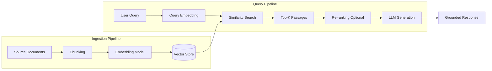
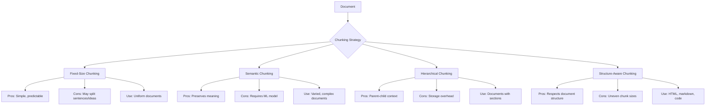
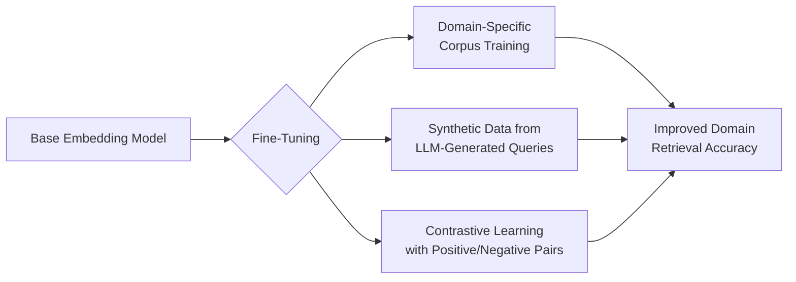
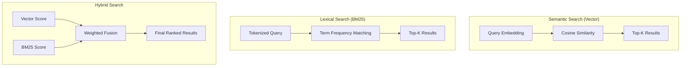
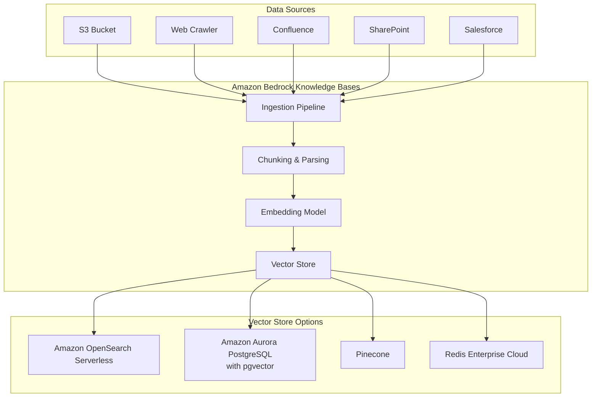
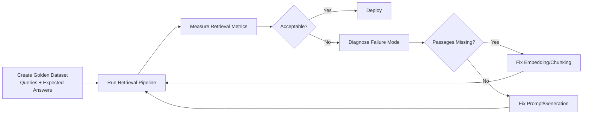
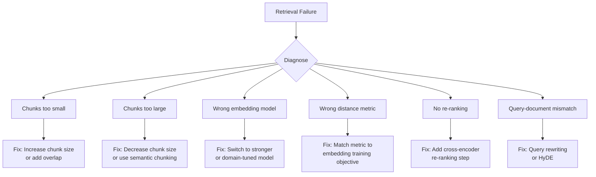
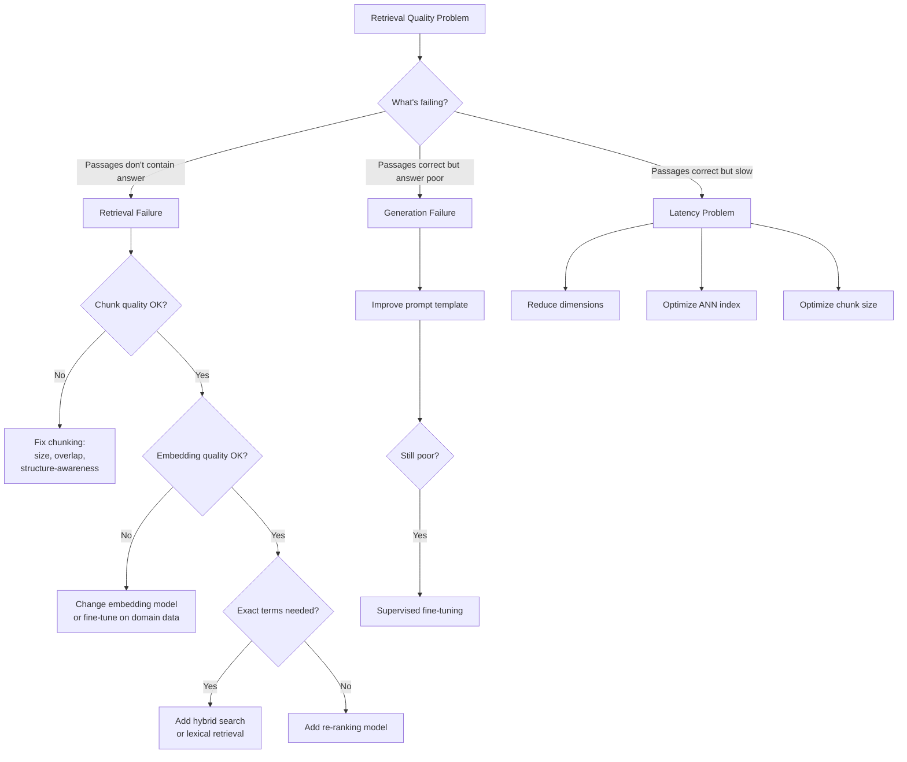

# Task 1.2: ML Model and Foundation Model (FM) Development - Train, fine-tune, and customize models for ML and AI solutions

## Skill 1.2.9: Optimize retrieval components and embedding models

---

## 1. Conceptual Foundation

### 1.1 What Are Embedding Models?

Embedding models convert text, images, or other unstructured data into **dense vector representations** (numerical arrays) that capture semantic meaning. In vector space, semantically similar texts cluster closer together, enabling similarity-based retrieval.

```
┌─────────────────────────────────────────────────────────────────┐
│                    EMBEDDING MODEL WORKFLOW                      │
├─────────────────────────────────────────────────────────────────┤
│                                                                 │
│   "What is Amazon S3?"  ──►  [Embedding Model]  ──►  [0.12,     │
│                                                       -0.43,    │
│   "Amazon S3 is storage" ──►  [Embedding Model]  ──►   0.78,    │
│                                                         ...]     │
│                                                                 │
│   Semantically similar texts → closely located vectors          │
│   (measured by cosine similarity, dot product, or Euclidean)    │
│                                                                 │
└─────────────────────────────────────────────────────────────────┘
```

### 1.2 Key Properties of Good Embeddings

| Property | Description | Why It Matters |
|----------|-------------|----------------|
| **Semantic fidelity** | Similar meanings produce similar vectors | Directly affects retrieval accuracy |
| **Discriminative power** | Different meanings produce distinct vectors | Prevents false matches |
| **Dimensionality** | Typical range: 256–4,096 dimensions | Higher dims = more expressiveness but more compute |
| **Cross-lingual capability** | Can map text from multiple languages | Enables multilingual retrieval |
| **Context awareness** | Considers surrounding context, not just words | Handles polysemy (e.g., "bank" as river vs. financial) |

### 1.3 Embedding Types in AWS

| Embedding Model | Provider | Best Use Case | Notes |
|-----------------|----------|---------------|-------|
| **Amazon Titan Text Embeddings v2** | Amazon Bedrock | General-purpose RAG, 256–1,024 dims | Default choice; flexible dimension control |
| **Amazon Titan Multimodal Embeddings** | Amazon Bedrock | Image + text search | Maps images and text to shared vector space |
| **Cohere Embed v3 / v4** | Amazon Bedrock | High-quality semantic search | Strong performance on BEIR benchmarks |
| **OpenAI text-embedding-3** | Third-party | High dimensional options | Requires external API integration |
| **Sentence Transformers** | Open-source (SageMaker) | Fine-tuning on domain data | Full control, requires hosting |

---

## 2. The RAG Pipeline: Retrieval Components

### 2.1 RAG Architecture Overview



### 2.2 Retrieval Components That Can Be Optimized

| Component | What It Does | Optimization Levers |
|-----------|-------------|---------------------|
| **Chunking Strategy** | Splits documents into retrievable units | Chunk size, overlap, chunk boundaries |
| **Embedding Model** | Converts text to vectors | Model selection, dimension reduction |
| **Vector Store** | Stores and indexes embeddings | Index type, distance metric |
| **Retriever** | Finds relevant passages for queries | Top-K, similarity threshold, re-ranking |
| **Query Processing** | Prepares the query for search | Query rewriting, expansion, filtering |

---

## 3. Chunking Strategies

### 3.1 Why Chunking Matters

Chunking is often the **most overlooked but highest-impact** retrieval optimization. Poor chunking destroys context and relevance, regardless of how good the embedding model is.

### 3.2 Chunking Approaches



### 3.3 Key Chunking Parameters

| Parameter | Typical Range | Effect of Too Small | Effect of Too Large |
|-----------|---------------|---------------------|---------------------|
| **Chunk Size** | 256–1,024 tokens | Loses context, splits concepts | Dilutes signal, irrelevant content mixed in |
| **Overlap** | 10–25% of chunk size | Wastes storage, duplicates content | Loses connections between chunks |
| **Chunk Boundary** | Sentence/paragraph/section | Splits mid-concept | Uneven retrieval granularity |

### 3.4 Exam-Tip: Chunking Diagnostic Questions

> **When retrieval is poor, ask:**
> 1. Are chunks splitting key concepts across boundaries?
> 2. Is the chunk size appropriate for the content type?
> 3. Is overlap needed for context continuity?
> 4. Does the chunk preserve document structure (headings, lists)?
> 5. Would metadata filtering (e.g., by section, date, product) help?

---

## 4. Embedding Model Optimization

### 4.1 When to Change the Embedding Model

| Signal | Action |
|--------|--------|
| Retrieval scores are uniformly low across queries | Replace embedding model with a stronger one |
| Retrieval works for generic queries but fails on domain terms | Fine-tune embedding model on domain data |
| High latency in embedding generation | Reduce dimensions or use a faster model |
| Cost exceeds budget | Use smaller dimension embedding or caching |
| Multi-modal retrieval needed | Switch to multimodal embedding model |

### 4.2 Fine-Tuning Embedding Models



| Fine-Tuning Method | How It Works | Best For |
|--------------------|-------------|----------|
| **Domain adaptation** | Train on domain-specific text pairs | Specialized vocabularies (medical, legal, financial) |
| **Query-document pairing** | Learn to map queries to correct documents | Improving retrieval precision |
| **Contrastive learning** | Push similar pairs together, dissimilar apart | Building domain-specific similarity judgment |

### 4.3 Dimension Trade-offs

| Dimensions | Retrieval Quality | Storage Cost | Query Latency | Best Use Case |
|------------|-------------------|--------------|---------------|---------------|
| 256 | Moderate | Low | Fast | Simple Q&A, small document sets |
| 512 | Good | Medium | Moderate | General-purpose RAG |
| 1,024 | High | High | Slower | Complex semantic matching, large corpora |
| 3,072 | Very High | Very High | Slowest | Maximum quality, large budgets |

---

## 5. Retrieval Methods and Techniques

### 5.1 Semantic Search vs. Hybrid Search



| Method | Strengths | Weaknesses | Best For |
|--------|-----------|------------|----------|
| **Semantic (Vector)** | Finds paraphrases, conceptual matches | May miss exact terms, acronyms | Natural language queries |
| **Lexical (BM25)** | Exact term matches, acronyms, codes | Misses paraphrases, synonyms | Highly technical queries |
| **Hybrid** | Combines both strengths | More complex infrastructure | Production systems needing robust retrieval |

### 5.2 Re-Ranking

A **re-ranking model** (also called a cross-encoder) evaluates the retrieved candidates and reorders them by more precise relevance scoring. This adds a quality improvement layer on top of the initial retrieval.


| Without Re-Ranking | With Re-Ranking |
|-------------------|-----------------|
| Lower precision in top results | Higher precision in final context |
| Fewer API calls | Extra API or compute cost |
| Faster pipeline | Slightly slower pipeline |
| Good for simple queries | Essential for complex, nuanced queries |

### 5.3 Query Optimization Techniques

| Technique | Description | When to Use |
|-----------|-------------|-------------|
| **Query rewriting** | LLM rewrites user query for better matching | Vague or conversational queries |
| **Query expansion** | Add synonyms or related terms | Sparse query vocabulary |
| **HyDE** (Hypothetical Document Embeddings) | Generate a hypothetical answer, embed that instead | Queries that are conceptually rich |
| **Metadata filtering** | Filter by document attributes before similarity search | When user context provides filters |
| **Multi-query retrieval** | Generate multiple query variants, retrieve for each | Complex multi-faceted queries |

---

## 6. Amazon Bedrock Knowledge Bases

### 6.1 Architecture



### 6.2 Key Configuration Options in Bedrock KB

| Setting | Options | Optimization Consideration |
|---------|---------|---------------------------|
| **Embedding model** | Titan Text Embeddings v2, Cohere Embed | Choose based on quality vs. cost |
| **Vector dimensions** | 256–1,024 | Higher = better quality, more cost |
| **Chunk size** | Configurable | Match to content type |
| **Chunk overlap** | Configurable | 10–25% recommended |
| **Parsing strategy** | Default, Amazon Bedrock Data Automation | BDA handles tables, images, complex layouts |
| **Vector store** | OpenSearch Serverless, Aurora, Pinecone, Redis | Choose based on existing infrastructure |

### 6.3 Evaluate and Modify Workflows

Amazon Bedrock Knowledge Bases now includes **evaluation** and **modification** capabilities:

- **Evaluation**: Test retrieval quality on a golden dataset of queries and expected answers
- **Modification**: Suggest or apply changes to chunking, embedding, or vector store settings
- **Iterative improvement**: Systematically identify and fix retrieval failures

---

## 7. Vector Store Optimization

### 7.1 Distance Metrics

| Metric | Formula | Best For | Notes |
|--------|---------|----------|-------|
| **Cosine Similarity** | cos(θ) = A·B / (||A|| × ||B||) | Most common for text embeddings | Measures angle, ignores magnitude |
| **Dot Product** | A·B | Normalized embeddings (magnitude = 1) | Faster than cosine; equivalent when normalized |
| **Euclidean Distance (L2)** | √(Σ(Aᵢ - Bᵢ)²) | When magnitude matters | Used with some models (e.g., some sentence transformers) |
| **Inner Product** | A·B (unnormalized) | Embeddings trained with inner product loss | Requires matching training objective |

> **Critical Exam Point:** The distance metric **must match** the metric used when the embedding model was trained. Mismatched metrics (e.g., cosine vs. dot product on unnormalized vectors) lead to incorrect rankings.

### 7.2 Index Types and ANN Search

| Index Type | Speed | Accuracy | Use Case |
|------------|-------|----------|----------|
| **Flat (Brute Force)** | Slowest | Exact | Small collections (< 10K vectors), debugging |
| **HNSW** | Fast | Approximate (high) | Production retrieval; good balance |
| **IVF** | Fast | Approximate (moderate) | Large datasets; requires training |
| **IVF-PQ** | Fastest | Approximate (lowest) | Very large datasets; highest compression |

### 7.3 Vector Store Selection in AWS

| Service | Strengths | Considerations |
|---------|-----------|----------------|
| **Amazon OpenSearch Serverless** | Integrated with Bedrock KB; vector engine; hybrid search | No infrastructure management |
| **Amazon Aurora PostgreSQL + pgvector** | Familiar SQL queries; transactional + vector data | Needs capacity planning |
| **Amazon Kendra** | Managed intelligent search; semantic + lexical; relevance tuning | Alternative to custom RAG for document search |
| **Amazon MemoryDB** | In-memory vector search; ultra-low latency | Higher cost; caching scenarios |

---

## 8. Evaluation Metrics for Retrieval

### 8.1 Common Metrics

| Metric | What It Measures | When to Use |
|--------|-----------------|-------------|
| **Recall@K** | Fraction of relevant items found in top-K | You need all possible relevant passages |
| **Precision@K** | Fraction of top-K items that are relevant | You need only highly relevant passages |
| **MRR** (Mean Reciprocal Rank) | Position of first relevant result | Single correct answer matters |
| **nDCG** (Normalized Discounted Cumulative Gain) | Relevance with position weighting | Graded relevance (very relevant vs. somewhat) |
| **Hit Rate** | Fraction of queries with at least one relevant result | Binary relevance judgment |

### 8.2 Golden Dataset and Evaluation Workflow



---

## 9. Diagnosing Retrieval Failures

### 9.1 The Two-Half Diagnostic Framework

| Observation | Diagnosis | Primary Fix | Secondary Fix |
|-------------|-----------|-------------|---------------|
| Retrieved passages don't contain the answer | **Retrieval failure** | Improve embedding model or chunking | Add re-ranking or hybrid search |
| Retrieved passages contain the answer, but LLM response is poor | **Generation failure** | Improve prompt template | Fine-tune LLM |
| Retrieved passages are relevant but ranked poorly | **Ranking failure** | Add re-ranking model | Adjust top-K |
| Retrieval works for some topics, not others | **Domain gap** | Fine-tune embedding model | Add domain-specific filtering |

### 9.2 Common Failure Patterns



---

## 10. Scenario-Based Exam Questions

### Scenario 1: Poor Retrieval in RAG System

**Question:** You are building a RAG application on Amazon Bedrock Knowledge Bases for a medical research organization. Users report that retrieved passages frequently contain irrelevant content when they search for specific drug interactions. The passages contain the correct drug names but mix in unrelated information from other sections of the documents. What should you do first to improve retrieval quality?

**A.** Fine-tune the generating LLM on additional drug interaction data.
**B.** Decrease the chunk size and implement structure-aware chunking that respects section boundaries.
**C.** Increase the number of tokens the LLM can generate.
**D.** Lower the temperature setting during inference.

**Answer:** **B**

**Explanation:** The symptom — passages containing relevant terms but diluted with unrelated content — strongly indicates chunks that are too large. Reducing chunk size ensures each retrieved passage focuses on a single topic. Structure-aware chunking (respecting headings and sections) is especially valuable for medical documents with distinct sections. Fine-tuning the LLM (A) addresses generation quality, not retrieval. Increasing output tokens (C) and lowering temperature (D) affect generation, not retrieval relevance.

---

### Scenario 2: Acronym and Code Retrieval Failure

**Question:** A financial services company built a RAG system for internal policy documents. The retrieval works well for natural language queries like "What is our vacation policy?" but fails for queries containing financial acronyms and regulation codes (e.g., "KYC-AML rule 31a-2"). The passages exist in the vector store. Which change addresses this directly?

**A.** Switch to a larger embedding model with more dimensions.
**B.** Implement hybrid search that combines vector similarity with lexical (BM25) matching.
**C.** Fine-tune the LLM on financial regulations.
**D.** Increase the chunk overlap to 50%.

**Answer:** **B**

**Explanation:** Exact-term matching for acronyms, codes, and identifiers is a classic weakness of pure semantic vector search. Hybrid search adds lexical (BM25/term-based) retrieval, which excels at exact token matching. A larger embedding model (A) doesn't specifically improve acronym matching. Fine-tuning the LLM (C) doesn't change retrieval. Excessive chunk overlap (D) doesn't address the term-matching issue.

---

### Scenario 3: Distance Metric Mismatch

**Question:** You migrate an embedding model from an on-premises system to Amazon OpenSearch Serverless. The model was originally trained using cosine similarity. You configure the vector index with the `faiss` engine using **inner product** as the default metric (common for some prebuilt configurations). Retrieval results are unexpectedly poor. What is the most likely cause?

**A.** The embedding model's dimension is incompatible with OpenSearch.
**B.** The distance metric has changed from cosine similarity to inner product, causing incorrect ranking on unnormalized vectors.
**C.** The chunk size is too large for the vector index.
**D.** The top-K value is set too low.

**Answer:** **B**

**Explanation:** The distance/similarity metric used at index time must match the metric the embedding model was trained with. Inner product and cosine similarity are equivalent only when vectors are L2-normalized. If vectors are unnormalized, inner product will rank differently than cosine, producing incorrect nearest-neighbor results. Options A, C, and D are unrelated to the explicit migration change described.

---

### Scenario 4: Choosing Between Retrieval vs. Generation Fix

**Question:** You deploy a RAG application for a legal firm. During evaluation, you notice that 80% of retrieved passages contain the correct legal precedent for the user's question. However, the generated answers often miss key arguments, fail to cite the retrieved passages, or provide incomplete responses. What is the most appropriate next step?

**A.** Replace the embedding model with a higher-dimensional model.
**B.** Reduce the chunk size to improve passage precision.
**C.** Improve the prompt template with instructions to cite passages and structure the answer using only the retrieved context.
**D.** Fine-tune the LLM on legal documents.

**Answer:** **C**

**Explanation:** The key diagnostic signal: **retrieved passages are correct** (80% hit rate). The problem is in **generation**. The first step for generation failures is prompt engineering — add explicit instructions to answer only from retrieved context, cite passages, and structure responses. Fine-tuning (D) is only needed after prompt engineering is exhausted. Options A and B fix retrieval, which is already working well.

---

### Scenario 5: Retrieval Latency Optimization

**Question:** A RAG application on Amazon Bedrock Knowledge Bases retrieves from a vector store with 5 million embeddings. Users experience 3-second retrieval latency, which is too slow for the interactive application. The team wants to reduce latency without significantly degrading retrieval quality. Which change is most appropriate?

**A.** Switch from approximate nearest neighbor (ANN) search to exact brute-force search.
**B.** Reduce embedding dimensionality from 1,024 to 512 and use an optimized ANN index (e.g., HNSW).
**C.** Remove all chunk overlap.
**D.** Store embeddings in Amazon S3 and load them on demand.

**Answer:** **B**

**Explanation:** Reducing embedding dimensions from 1,024 to 512 typically provides a ~30–50% improvement in search speed with modest quality loss. Optimized ANN indexes (HNSW) are already the standard for large-scale retrieval and provide sublinear search time. Brute-force search (A) is slower, not faster. Removing chunk overlap (C) affects retrieval quality, not meaningful latency. Loading from S3 on demand (D) is architectureally wrong — vector stores are designed for in-memory search.

---

## 11. Exam Tips and Traps

### 11.1 Key Exam Tips

| Tip | Explanation |
|-----|-------------|
| **Diagnose before changing** | In RAG scenarios, identify whether retrieval or generation is failing before selecting a fix |
| **Chunking is often the root cause** | When retrieval fails despite good embeddings, look at chunk size and boundaries first |
| **Match distance metric to embedding model** | Cosine similarity vs. inner product vs. L2 — mismatches cause silent failures |
| **Hybrid search for exact terms** | Acronyms, codes, product IDs, and legal citations need lexical search |
| **Re-ranking is a precision booster** | Add cross-encoder re-ranking when initial retrieval is adequate but ordering is poor |
| **Prompt engineering before fine-tuning** | For generation issues, exhaust prompt-level fixes before customizing the model |
| **Dimension reduction = cost optimization** | Lower dimensions reduce storage, latency, and cost with acceptable quality loss |
| **Overlap preserves boundary context** | A 10–25% overlap prevents losing connections at chunk boundaries |

### 11.2 Common Traps

| Trap | Why It's Wrong |
|------|---------------|
| **"Increase LLM output tokens to fix retrieval"** | Output length affects generation not retrieval |
| **"Lower LLM temperature to improve relevance"** | Determinism doesn't change retrieval |
| **"Fine-tune the LLM when retrieval is failing"** | Fine-tuning the generator cannot recover missing passages |
| **"Bigger embedding model always means better retrieval"** | Quality gains may be marginal; dimension mismatch can cause issues |
| **"Chunk overlap is not important"** | Boundaries split concepts without overlap |
| **"Brute-force search is faster for large datasets"** | Exact search scales linearly; ANN scales sublinear |
| **"Use separate embedding models for query and document"** | Both query and document must use the **same** embedding model for a shared vector space |
| **"Any vector store works the same"** | Different vector stores have different index types, metrics, and performance |

### 11.3 Decision-Making Checklist for Retrieval Optimization



---

## 12. Quick Reference Summary

| Concept | Key Points |
|---------|------------|
| **Embedding Models** | Convert text to vectors; must be consistent across queries and documents |
| **Chunking** | Optimal size 256–1,024 tokens; include 10–25% overlap; respect document structure |
| **Vector Stores** | Use ANN indexes (HNSW, IVF) for scale; match distance metric to embedding training |
| **Retrieval Methods** | Semantic (vector), lexical (BM25), hybrid; each has distinct strengths |
| **Re-Ranking** | Cross-encoder scoring on retrieved candidates; improves precision at added cost |
| **Bedrock Knowledge Bases** | Managed RAG: ingestion, chunking, embeddings, vector store; supports evaluation |
| **Diagnostic Framework** | Retrieval failure → fix chunking/embedding; Generation failure → fix prompt/fine-tune |
| **Evaluation Metrics** | Recall@K for completeness; Precision@K and nDCG for relevance quality |