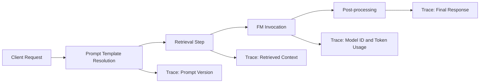
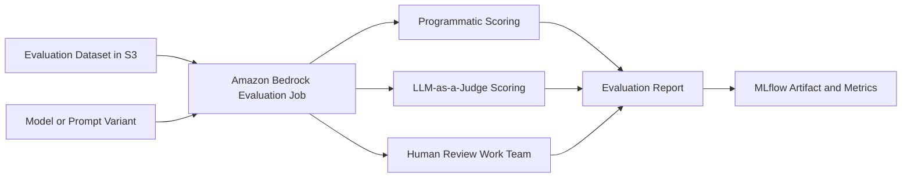
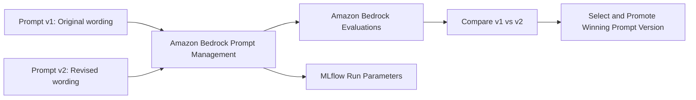
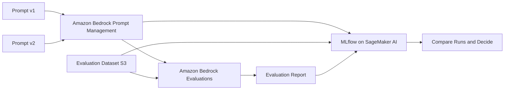

# Task 2.3: ML Model and Foundation Model (FM) Development - Analyze and evaluate the performance of ML and AI systems

## Skill 2.3.1: Perform reproducible experiments (for example, by using MLflow on SageMaker AI, Amazon Bedrock evaluations, Amazon Bedrock Prompt Management)

This study note covers how to make ML and generative AI experiments repeatable, comparable, and defensible. Reproducibility is not just rerunning a notebook. It requires controlling and recording the model, prompt, data, environment, evaluation dataset, and metrics so that two runs can be compared honestly.

---

## 1. What “Perform Reproducible Experiments” Means

A reproducible experiment answers these questions:

- What model or foundation model version was used?
- What prompt version or prompt variables were injected?
- What dataset version and evaluation set were used?
- What hyperparameters or inference settings were used?
- What metrics were recorded, and how were they defined?
- What artifacts were produced?
- Can another engineer rerun this and get a meaningfully comparable result?

In AWS, the three key services for this skill are:

| AWS Capability | Primary Role | What It Makes Reproducible |
| --- | --- | --- |
| **Amazon SageMaker AI with MLflow** | Experiment tracking and tracing | Parameters, metrics, artifacts, tags, and GenAI application traces |
| **Amazon Bedrock Evaluations** | Automated, judge-based, and human evaluation | Evaluation datasets, scoring jobs, model response quality |
| **Amazon Bedrock Prompt Management** | Prompt storage, versioning, and variant comparison | Prompt text, variables, and prompt versions |

Together, these services let you establish a reproducible lineage:  
**prompt version + model version + dataset version + evaluation metrics = a tracked experiment.**

---

## 2. Why Reproducibility Matters for the Exam and in Practice

Reproducibility is the foundation of model evaluation and deployment decisions.

- Without it, you cannot tell whether a better score came from a better model, better data, a different prompt, or random chance.
- It prevents cherry-picking the best run from many untracked experiments.
- It supports audit, compliance, debugging, and collaboration.
- For generative AI, changing a prompt by a few words can change outputs significantly. You must track that change as a controlled experiment.

Exam expectation:  
You should recognize which AWS service or feature records experiment lineage, which executes an evaluation, and which stores and compares prompt variants.

---

## 3. Amazon SageMaker AI with MLflow

### 3.1 What MLflow on SageMaker AI Provides

Amazon SageMaker AI provides a fully managed MLflow capability. You can use it to:

- Create and manage experiments.
- Track each run with parameters, metrics, tags, and artifacts.
- Compare runs and select the best model.
- Record the inputs, outputs, and metadata at each step of a generative AI application by using MLflow tracing.

### 3.2 Key Concepts

| Concept | Description | Reproducibility Value |
| --- | --- | --- |
| **Experiment** | A logical grouping of related runs | Organizes comparisons |
| **Run** | One execution of a training or evaluation job | Captures one reproducible attempt |
| **Parameters** | Inputs such as model ID, learning rate, batch size, seed, prompt version, dataset URI | Identifies what changed between runs |
| **Metrics** | Outputs such as accuracy, loss, ROUGE, BLEU, BERTScore | Measures performance |
| **Artifacts** | Files such as model binaries, evaluation reports, charts, configuration files | Preserves outputs and evidence |
| **Tags** | Key-value labels for filtering and search | Helps categorize runs |
| **Trace** | Step-by-step record of a GenAI application flow | Shows which component caused a given output |

### 3.3 Reproducible Experiment Checkpoints

When using MLflow on SageMaker AI, log:

- Model ID or model version.
- Prompt ID or prompt version from Amazon Bedrock Prompt Management.
- Dataset S3 URI and dataset version or content hash.
- Random seed.
- Hyperparameters.
- Inference settings such as temperature, top-p, and max tokens.
- Environment and package dependencies if training is involved.
- Evaluation metrics and their definitions.
- A pointer to the exact evaluation report produced by Amazon Bedrock Evaluations.

A run is not fully reproducible simply because MLflow recorded it. You must also record the right inputs. MLflow tracks what you tell it to track.

### 3.4 MLflow Tracing for Generative AI

For a generative AI application, a single accuracy score is not enough. MLflow traces can record each step:

This helps you identify whether an unexpected response was caused by:

- A changed prompt.
- A wrong retrieval result.
- A different model version.
- A change in post-processing logic.

### 3.5 When to Use MLflow on SageMaker AI

Use MLflow when:

- You need to compare multiple fine-tuning runs.
- You need a central record of experiments across a team.
- You need to trace a GenAI application pipeline.
- You need to associate prompt versions, model IDs, datasets, and evaluation results in one place.
- You need evidence for model selection decisions.

---

## 4. Amazon Bedrock Evaluations

### 4.1 Purpose

Amazon Bedrock Evaluations performs evaluation jobs for generative AI models and retrieval systems. It helps you measure quality, accuracy, robustness, instruction following, helpfulness, and other criteria.

There are three evaluation modes:

1. **Programmatic evaluation**
2. **LLM-as-a-judge evaluation**
3. **Human evaluation**

### 4.2 Evaluation Modes

| Evaluation Mode | Description | Common Use Cases | Example Metrics |
| --- | --- | --- | --- |
| **Programmatic** | Automatically computes metrics against a ground-truth dataset | Summarization, question answering, classification, short-form generation | Accuracy, BLEU, ROUGE, BERTScore, semantic similarity |
| **LLM-as-a-judge** | A judge foundation model scores responses and provides reasoning | Helpfulness, tone, instruction following, faithfulness, harmlessness | Judge-assigned score, reasoning |
| **Human evaluation** | Human reviewers rate outputs using a rubric | Brand voice, consequential outputs, nuanced quality, safety | Human rating, rubric-based score |

Programmatic evaluation is suitable when you have a defined reference answer and a deterministic scoring mechanism.

LLM-as-a-judge is suitable when two valid responses may be phrased differently and you need semantic or behavioral judgment.

Human evaluation is suitable when the final decision requires human judgment, such as high-risk outputs, compliance, or subjective quality.

### 4.3 Reproducibility in Amazon Bedrock Evaluations

To make an evaluation reproducible:

- Pin the evaluation dataset in Amazon S3 with an immutable version or hash.
- Use the same model or prompt version for each run.
- Define the evaluation metric clearly.
- Record evaluation job configuration.
- Store the evaluation report as an artifact in MLflow.

### 4.4 Bedrock Evaluations Flow

---

## 5. Amazon Bedrock Prompt Management

### 5.1 Purpose

Amazon Bedrock Prompt Management stores prompts as reusable templates with variables, tracks prompt versions, and compares prompt variants.

This turns a prompt change from an ad hoc text edit into a tracked, repeatable experiment.

### 5.2 Key Concepts

| Concept | Description |
| --- | --- |
| **Prompt template** | Core instruction text with placeholders for dynamic inputs |
| **Prompt variable** | A placeholder that changes per request, such as customer query or document context |
| **Prompt version** | An immutable saved version of a prompt template |
| **Prompt variant comparison** | Side-by-side evaluation of different prompt versions |
| **Prompt ID** | Identifier used as a tracked parameter in downstream experiments |

### 5.3 Prompt Management Flow

### 5.4 Reproducibility Value

Prompt Management helps reproduce results because:

- You can identify exactly which prompt text was used in an evaluation.
- You can return to an older prompt version if performance regresses.
- You can compare prompt variants without manually copying text.
- You can plug the prompt version into MLflow as a tracked parameter.

---

## 6. How the Three AWS Capabilities Work Together

Suppose you want to reproduce an evaluation of two prompt variants for a customer-support summarization assistant.

1. Store both prompt variants in **Amazon Bedrock Prompt Management**.
2. Create an evaluation dataset in Amazon S3 with ground-truth summaries.
3. Run an **Amazon Bedrock Evaluation** job for each prompt variant.
4. Use programmatic metrics such as ROUGE and BERTScore.
5. Optionally add an **LLM-as-a-judge** evaluation for readability and completeness.
6. Send a human review step only if subjective judgment is required.
7. Log the prompt version, model version, dataset URI, and evaluation metrics in **MLflow on SageMaker AI**.
8. Compare the runs and select the better prompt version.

---

## 7. Scenario-Based Exam Examples

### Scenario 1: Track Training Runs

A data scientist fine-tunes a foundation model multiple times with different learning rates and batch sizes. After several days, they cannot remember which run produced the best validation loss.

**Question:**  
Which AWS capability should they use to make the runs comparable and reproducible?

**Correct answer:**  
Use **Amazon SageMaker AI with MLflow** to log each run as an experiment with its hyperparameters, dataset version, seed, metrics, and artifacts.

**Explanation:**  
MLflow records what changed between runs. Without that, comparing runs becomes guesswork.

---

### Scenario 2: Compare Prompt Versions

A product team wants to compare two versions of a system prompt before releasing a new chatbot behavior. They need to know which version produces better responses without sending traffic to production.

**Question:**  
Which AWS services should they combine?

**Correct answer:**  
Use **Amazon Bedrock Prompt Management** to store and version the two prompts, and use **Amazon Bedrock Evaluations** to score both against a curated evaluation dataset. Record the results in MLflow for tracking.

**Explanation:**  
Prompt Management provides versioning and comparison. Bedrock Evaluations computes or judges quality. This is an offline, reproducible experiment, not a live shadow test.

---

### Scenario 3: Tracing a Wrong Generative AI Answer

A production assistant gives a factually correct but contextually irrelevant answer. The team suspects either the retriever returned the wrong passage or the prompt changed.

**Question:**  
Which feature helps trace the cause across the generative AI pipeline?

**Correct answer:**  
Use **MLflow tracing on SageMaker AI** to record the inputs and outputs of each step, including retrieval results, prompt version, model invocation, and post-processing.

**Explanation:**  
MLflow tracing captures each step of the GenAI application. It connects the final answer back to the component that caused it.

---

### Scenario 4: Reproducing an Evaluation After a Dataset Update

An evaluation was run last month. The dataset has since been updated. The team wants to rerun the exact previous evaluation with the old dataset for comparison.

**Question:**  
What must they track to reproduce the exact run?

**Correct answer:**  
Track the immutable dataset version or S3 URI and content hash, model ID, prompt version, inference settings, and evaluation metric definitions.

**Explanation:**  
Reproducibility depends on pinning every input. Saving only the final metric is insufficient because you cannot identify what produced that metric.

---

## 8. Common Exam Distractors

| Wrong Statement | Why It Is Wrong |
| --- | --- |
| “MLflow on SageMaker AI is used to route live traffic to a shadow model.” | MLflow tracks experiments and traces; shadow traffic is handled by SageMaker AI shadow tests. |
| “Amazon Bedrock Prompt Management deploys model variants to production.” | Prompt Management stores and versions prompts; it does not deploy model endpoints or manage traffic. |
| “Amazon Bedrock Evaluations is used for live A/B testing.” | Bedrock Evaluations uses curated evaluation datasets offline. Live traffic comparison is shadow testing or canary deployment. |
| “A run is automatically reproducible just because it is recorded in MLflow.” | MLflow records what you log. You must also log seed, data version, environment, prompt version, and model ID. |
| “Human evaluation jobs do not need a display or browser interface.” | Human-based evaluation jobs created in the console require a browser-facing display so reviewers can read prompts and responses. Automated/programmatic evaluation does not. |
| “A single BLEU or ROUGE score is enough to decide text generation quality.” | Generated text can be semantically correct with different wording. You usually need multiple metrics and possibly judge-based or human evaluation. |

---

## 9. Exam Tips

- Think of **MLflow on SageMaker AI** as the experiment ledger. It records parameters, metrics, artifacts, and GenAI traces.
- Think of **Amazon Bedrock Evaluations** as the scoring engine. It computes programmatic or judge-based metrics over an evaluation dataset.
- Think of **Amazon Bedrock Prompt Management** as the prompt version control system. It makes prompt edits reproducible and comparable.
- For any question about “Why did the score change?” or “How do we compare two runs?” look for an experiment tracking solution.
- For any question about “Which prompt text was used?” look for Amazon Bedrock Prompt Management.
- For any question about “How do we evaluate model output quality?” look for Amazon Bedrock Evaluations.
- For any question involving live traffic without changing caller responses, the answer is **SageMaker AI shadow testing**, not MLflow or Bedrock Evaluations.

---

## 10. Summary

Performing reproducible experiments requires more than collecting metrics. It requires a traceable record of:

- The model or FM version.
- The prompt version.
- The evaluation dataset version.
- The hyperparameters or inference settings.
- The exact metric definitions.
- The artifacts and reports produced.

AWS maps these requirements to specific services:

- **MLflow on SageMaker AI** records and compares experiments.
- **Amazon Bedrock Evaluations** runs reproducible evaluation jobs.
- **Amazon Bedrock Prompt Management** versions and compares prompts.

Together, they create a controlled, repeatable path from prompt or model change to measurable result.