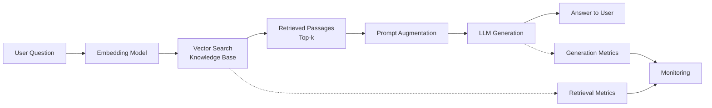
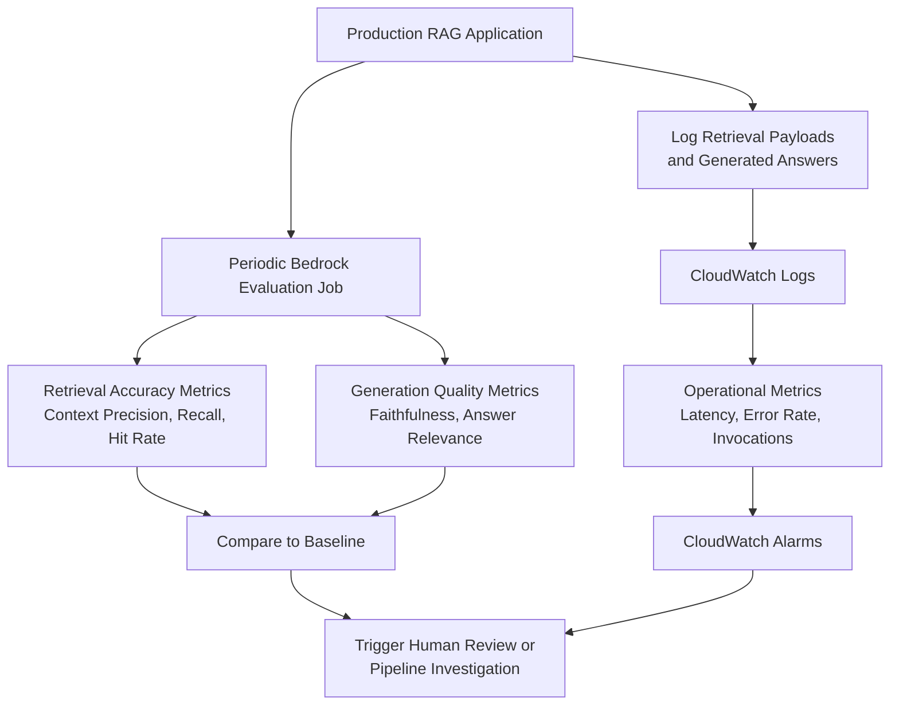

# Task 2.3: Analyze and evaluate the performance of ML and AI systems

## Skill 2.3.10: Configure RAG system monitoring, including retrieval accuracy assessment

### Overview

Retrieval-Augmented Generation (RAG) systems combine a retrieval step—typically a vector search over a knowledge base—with a generation step that uses the retrieved passages as context to produce an answer. Monitoring such a system requires evaluating two distinct layers:

- **Retrieval accuracy:** Did the system fetch the right passages from the knowledge base?
- **Generation quality:** Did the model use those passages correctly to answer the user’s question?

A fluent answer that omits facts present in source documents is often a **retrieval failure wearing a generation costume**. Therefore, on the AWS Certified Machine Learning – Associate exam, you must know how to configure monitoring that isolates retrieval accuracy from generation quality, and how to use AWS services such as Amazon Bedrock Evaluations and Amazon CloudWatch to do so.

---

### Why Monitor Retrieval and Generation Separately?

In a RAG system, the pipeline typically follows this flow:

If the final answer is fluent but factually wrong or missing information, the root cause can often be one of two issues:

| Symptom | Possible Root Cause | Where to Look |
|---------|---------------------|----------------|
| Answer is fluent but missing a fact that is in the source documents | The vector search failed to retrieve the document containing that fact | Retrieval accuracy (context recall, hit rate) |
| Answer is fluent and the retrieved passage contains the fact, but the LLM omitted it | The generator did not faithfully use the retrieved context | Generation quality (faithfulness, grounding) |
| Answer is irrelevant or off-topic even though retrieved passages are relevant | The LLM did not follow the prompt or instruction | Answer relevance, prompt design |
| Retrieved passages are off-topic or low-quality | The embedding or chunking strategy is not appropriate for the query | Context precision, chunking strategy |

**Key takeaway:** Do not evaluate only the final answer. Evaluate retrieval and generation separately to locate the failure point.

---

### Retrieval Accuracy Assessment Metrics

Retrieval accuracy means measuring how well the retrieval component of the RAG pipeline returns the passages that are actually relevant to the incoming query. The following metrics are commonly used and are supported by Amazon Bedrock knowledge base evaluations.

| Metric | Definition | What It Tells You |
|--------|------------|-------------------|
| **Context Relevance** | Measures whether the retrieved passages are relevant to the query. Often judged by an LLM or against ground truth. | Overall quality of the retrieved context. |
| **Context Precision** | Of the retrieved passages, how many are actually relevant to the query? | Whether the top-k results are filled with relevant chunks and not noise. |
| **Context Recall** | Of all the relevant passages that exist in the knowledge base, how many did the retrieval system actually return? | Whether the retrieval system missed any relevant chunks. |
| **Hit Rate / Success Rate** | The proportion of queries for which at least one relevant passage is retrieved within the top-k results. | How often retrieval finds at least one useful chunk. |
| **Mean Reciprocal Rank (MRR)** | The average of the reciprocal ranks of the first relevant passage in the retrieval results. | How highly ranked the first relevant passage typically is. |
| **Normalized Discounted Cumulative Gain (NDCG)** | Evaluates ranking quality by weighting relevance according to position in the retrieved list. | How well the retrieval system orders relevant passages ahead of irrelevant ones. |

#### Key Relationship

- **High context recall + low context precision** → retrieval returns the relevant passage but also many irrelevant ones.
- **High context precision + low context recall** → retrieval only returns one or a few relevant passages but misses other important documents.
- **High hit rate + low MRR** → retrieval usually finds a relevant passage, but it may be ranked too low in the top-k list, potentially hurting generation because the LLM may focus on earlier, less relevant chunks.

---

### Generation Quality Metrics (RAG Triad)

Although the focus of this skill is retrieval accuracy, you should also know the three commonly used dimensions of RAG evaluation—often called the **RAG Triad**—because Bedrock Evaluations reports them together.

| Dimension | Question It Answers | Failure Example |
|-----------|---------------------|-----------------|
| **Context Relevance** | Did the retrieval step return passages that are relevant to the query? | Retrieving a passage about AWS Lambda when the user asks about Amazon S3. |
| **Faithfulness / Grounding** | Is the generated answer factually grounded in the retrieved passages? | The answer states a fact that is not present in any retrieved document. |
| **Answer Relevance** | Does the generated answer actually respond to the user’s question? | The retrieved context is relevant, but the LLM produces a generic definition instead of the requested comparison. |

---

### AWS Services for RAG Monitoring

| AWS Service | Role in RAG Monitoring | Typical Metrics / Output |
|-------------|------------------------|--------------------------|
| **Amazon Bedrock Knowledge Bases** | The retrieval source: it stores documents, chunks, embeddings, and performs vector search. Its accuracy is what you are assessing. | Document chunks, retrieved passages, source metadata. |
| **Amazon Bedrock Evaluations** | Runs automated or human evaluation jobs against a knowledge base, a retrieval step, and/or a generative model. Supports retrieval-only and RAG (retrieval + generation) evaluations. | Context precision, context recall, faithfulness, answer relevance, helpfulness, correctness, etc. |
| **Amazon CloudWatch** | Stores operational logs and metrics for the RAG application. Use it for latency, error rate, invocation count, and custom metrics you emit. | Invocation count, latency, error rate, token usage, custom embedding similarity or retrieval precision. |
| **Amazon SageMaker with MLflow** | Tracks prompts, prompts traces, and parameters for debug and lineage tracking if you build a custom RAG pipeline outside Bedrock. | Trace steps, input/output at each step, retrieval payloads. |

---

### Configuring Monitoring with Amazon Bedrock Evaluations

Amazon Bedrock Evaluations offers two relevant evaluation types:

1. **Knowledge base evaluation (retrieval only)**  
   - Assesses only the retrieval step of a Knowledge Base.  
   - Requires a JSONL dataset of queries along with expected relevant passages or document IDs.  
   - Produces retrieval accuracy metrics such as context precision, context recall, hit rate, MRR, and NDCG.

2. **RAG evaluation (retrieval + generation)**  
   - Evaluates the full pipeline by also invoking a generative model on top of the retrieved passages.  
   - Produces generation-level metrics in addition to retrieval metrics: faithfulness, answer relevance, and context relevance.  
   - You can choose an automated programmatic evaluation, an LLM-as-a-judge evaluation, or a human evaluation.

#### Typical Steps to Configure

1. **Prepare an evaluation dataset**  
   - Create a golden dataset that includes representative user queries and the expected correct facts or relevant document chunks.  
   - This dataset must be representative of real user traffic; otherwise the retrieval accuracy metric will not reflect production behavior.

2. **Choose the evaluation type**  
   - Use *knowledge base evaluation* if you only need retrieval accuracy.  
   - Use *RAG evaluation* if you also need to see whether the retrieved passages are used correctly in the final answer.

3. **Select metrics**  
   - For retrieval accuracy, select context precision, context recall, hit rate, MRR, or NDCG.  
   - For generation quality, select faithfulness, answer relevance, or helpfulness.

4. **Run the evaluation job**  
   - Bedrock Evaluations executes the job and returns a detailed report with score distributions on the dataset.

5. **Review and monitor over time**  
   - Store results, compare against baselines, and schedule periodic runs.  
   - If retrieval accuracy falls, investigate embeddings, chunking strategy, or the vector index.

---

### Operational Monitoring with Amazon CloudWatch

In addition to semantic retrieval accuracy, you must monitor the **operations** of the RAG system. Bedrock Evaluations is an offline batch evaluation tool; CloudWatch is the production-time monitoring layer.

| Metric to Monitor | Why It Matters | CloudWatch Feature |
|-------------------|----------------|---------------------|
| **Invocation count** | Tracks usage and detects unexpected spikes or drops. | CloudWatch metrics on Bedrock, Lambda, SageMaker endpoint. |
| **Latency** | Retrieval step latency directly affects user experience. | `p50`, `p90`, `p99` metrics. |
| **Error rate** | Errors indicate failures in embedding, vector search, or generation. | CloudWatch alarms on 5xx or exception counts. |
| **Token usage** | Helps cost modeling and identifies unexpectedly long prompts or completions. | Bedrock or application logs. |
| **Custom retrieval metrics** | You can emit context precision or embedding similarity from application logic when ground truth is available. | `PutMetricData` or application logs transformed into CloudWatch metrics. |

You can also set **CloudWatch alarms** to notify when retrieval-related metrics, such as custom embedding similarity or average context precision, fall below a known-good baseline.

---

### End-to-End Monitoring Strategy

**Best practice:**  
- Establish a baseline retrieval accuracy score from a known-good period.  
- Schedule Bedrock Evaluations at regular intervals against a stable golden dataset.  
- Use CloudWatch to monitor the live system’s operational metrics.  
- If retrieval metrics drift from baseline, investigate embeddings, chunk size, or document ingestion changes before assuming the generative model is failing.

---

### Scenario-Based Examples

#### Scenario 1: Fluent Answer Missing Facts

A company operates a RAG chatbot over internal HR documentation. Users report that the bot often gives fluent answers but misses specific policy details that are definitely in the documents. The engineering team only evaluates the final answer quality using BLEU and ROUGE scores, which remain consistently high.

**Question:** What monitoring configuration change would best help isolate the root cause?

**Answer:**  
Add a **retrieval accuracy evaluation**—such as Amazon Bedrock knowledge base evaluation—that measures context recall and hit rate separately from generation quality. High BLEU/ROUGE can be achieved even when the answer misses facts, because these overlap-based metrics compare surface wording, not factual completeness. Measuring retrieval separately reveals whether the vector search is failing to retrieve the relevant policy chunks.

---

#### Scenario 2: Choosing the Right Metric

A team has configured a RAG application with Amazon Bedrock Knowledge Bases. They want to automatically evaluate whether the vector retrieval step is returning the correct chunks from the knowledge base, independent of how the LLM uses those chunks.

**Question:** Which evaluation type and metric should they select?

**Answer:**  
Use **Amazon Bedrock knowledge base evaluation** (retrieval only) and select retrieval accuracy metrics such as **context precision**, **context recall**, **hit rate**, **MRR**, or **NDCG**. Retrieval-only evaluation does not invoke a generative model, so it isolates the search quality from the LLM’s ability to summarize.

---

#### Scenario 3: Monitoring Drift in Retrieval

A RAG system has been working well, but after a major document ingestion, users begin complaining about lower answer quality. The team wants to detect future retrieval degradation automatically.

**Question:** Which AWS configuration should be implemented?

**Answer:**  
Create a **golden evaluation dataset** of representative queries and expected relevant passages. Schedule **periodic Amazon Bedrock evaluation jobs** to compute retrieval accuracy metrics and compare them against the established baseline. Simultaneously, log retrieval contexts and answers to CloudWatch, and set **CloudWatch alarms** on custom retrieval metrics such as average context precision or hit rate. When the metric falls below the baseline, an alarm triggers investigation of the new document chunking or embedding pipeline.

---

### Exam Tips and Traps

| Tip / Trap | Explanation |
|------------|-------------|
| **Split retrieval from generation.** | A fluent answer that misses a fact is often a retrieval failure. Do not rely on a single end-to-end score. |
| **Know the retrieval-specific metrics.** | Context precision, context recall, hit rate, MRR, and NDCG measure retrieval accuracy. BLEU, ROUGE, and BERTScore measure generated text overlap/semantics, not retrieval accuracy. |
| **Bedrock knowledge base evaluation ≠ RAG evaluation.** | Knowledge base evaluation tests only retrieval. RAG evaluation tests retrieval plus generation. Choose accordingly. |
| **CloudWatch monitors operations, not semantic retrieval quality by default.** | CloudWatch tracks latency, error rate, invocation count, and custom metrics you emit. For built-in retrieval accuracy, use Bedrock Evaluations. |
| **Shadow tests are for variant comparison, not retrieval accuracy.** | SageMaker shadow tests compare a new model against production on live requests, but they do not directly compute retrieval precision or recall. |
| **Human evaluation jobs require a browser-based UI.** | Automated Bedrock evaluation jobs do not require a browser display; human evaluation jobs in the console do. |
| **Embedding similarity is not the same as retrieval accuracy.** | Two passages may be semantically similar but still not contain the exact fact the user needs. Combine embedding similarity with context precision/recall when possible. |
| **Chunking and embedding strategy affect retrieval accuracy.** | If retrieval accuracy drops, examine chunk size, chunk overlap, and embedding model changes before blaming the generative model. |

---

### Summary

Configuring RAG system monitoring—especially retrieval accuracy assessment—requires:

- Isolating the retrieval step from the generation step.  
- Using retrieval-specific metrics like context precision, context recall, hit rate, MRR, and NDCG.  
- Using Amazon Bedrock Evaluations for offline semantic evaluation of the knowledge base and RAG pipeline.  
- Using Amazon CloudWatch for production operational monitoring and custom metric alarms.  
- Establishing a baseline and scheduling periodic evaluation jobs to detect drift.  

By mastering these concepts, you will be well prepared for RAG monitoring scenarios on the AWS Certified Machine Learning – Associate exam.