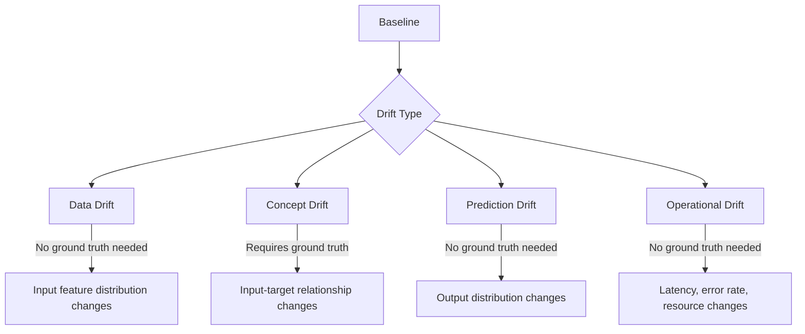
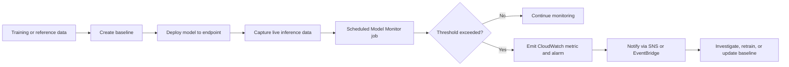

# Task 2.3: ML Model and Foundation Model (FM) Development - Analyze and evaluate the performance of ML and AI systems

## Skill 2.3.2: Create model performance baselines and implement drift detection

---

### Skill Overview

A model performance baseline is a quantified, versioned snapshot of expected behavior for a model, its input data, its outputs, and its operational characteristics during a known-good period. Drift detection is the ongoing process of comparing live system behavior against that baseline to identify when the model, data, or environment has changed enough to require investigation or retraining.

This skill is central to production ML operations because a model can silently degrade after deployment without any obvious failure. Baselines and drift detection turn that invisible degradation into measurable, actionable signals.

---

### Why Baselines Matter

A baseline answers two questions:

1. What does "normal" look like for this system?
2. Has the system deviated from normal in a meaningful way?

Without a baseline, drift detection is impossible because there is no reference point. A single accuracy score captured at launch is not enough. A useful baseline includes:

- Model performance metrics
- Input data statistics and constraints
- Output distribution characteristics
- Operational metrics such as latency and error rate
- For generative AI systems: prompt patterns, response quality metrics, retrieval quality, toxicity, and semantic similarity

---

### Components of a Strong Baseline

| Baseline Component | What It Captures | Example |
| --- | --- | --- |
| Data quality baseline | Statistical distribution of input features | Mean transaction amount, missing value rate, category distribution |
| Model quality baseline | Model accuracy against ground truth | Precision, recall, F1, RMSE, R2, AUC |
| Prediction distribution baseline | Distribution of model outputs | Class distribution, predicted score histogram |
| Operational baseline | System health and latency | Invocation count, p95 latency, error rate, CPU/GPU utilization |
| Prompt and response baseline | Input prompts and generated output quality for FM systems | Prompt length, topic distribution, toxicity score, faithfulness |
| Retrieval baseline | Retrieval effectiveness in RAG systems | Context precision, context recall, hit rate |

A baseline must be:

- Recorded from a known-good period or training/reference data
- Versioned and tied to the model version
- Measured with the same metrics used during evaluation
- Stored alongside thresholds that define acceptable variance
- Re-baselined after deliberate model or data changes

---

### Creating Traditional ML Baselines

For a traditional ML model deployed on Amazon SageMaker AI, the typical baseline workflow is:

1. Select a reference dataset, usually the training data or a clean validation set.
2. Compute data statistics: mean, median, variance, quantiles, missing value rates, and category distributions for each feature.
3. Define constraints for accepted variation, such as allowed missing value percentage or allowed numeric range.
4. Record model quality metrics such as accuracy, precision, recall, F1, RMSE, MAE, or R2.
5. Store the baseline as a versioned artifact using SageMaker Model Monitor, MLflow, or the SageMaker Model Registry.
6. Configure monitoring jobs to compare live inference data with the stored baseline.

Amazon SageMaker Model Monitor can generate data quality baselines, model quality baselines, bias baselines, and feature attribution baselines.

---

### Creating Baselines for Foundation Models and Generative AI

Foundation models do not produce a single "accuracy" score in the traditional sense. A good FM baseline typically includes:

| Evaluation Area | Example Metrics |
| --- | --- |
| Lexical overlap | BLEU, ROUGE |
| Semantic similarity | BERTScore, cosine similarity |
| Model judgment | LLM-as-a-judge score |
| Faithfulness | Whether the generated response is grounded in retrieved or provided context |
| Answer relevance | Whether the answer addresses the user question |
| Toxicity and bias | Toxicity score, bias detection metrics |
| Retrieval quality | Context precision, context recall, hit rate |
| Prompt consistency | Prompt topic distribution, embedding similarity to historical prompts |

For a RAG system, the baseline should measure retrieval and generation separately. Otherwise, a fluent answer that omits facts from the source documents cannot be diagnosed as a retrieval failure versus a generation failure.

Amazon Bedrock evaluations can run periodic evaluation jobs against a prompt dataset to produce these metrics. Amazon Bedrock Prompt Management can version prompts so that a prompt change becomes a tracked event. However, these are generally used for scheduled or trigger-based evaluation rather than continuous endpoint data monitoring in the same way SageMaker Model Monitor works for SageMaker endpoints.

---

### AWS Services for Baselines and Drift Detection

| AWS Service | Role in Baseline and Drift Detection |
| --- | --- |
| Amazon SageMaker Model Monitor | Creates baselines and runs scheduled drift detection jobs for data quality, model quality, bias, and feature attribution on SageMaker endpoints |
| Amazon SageMaker Clarify | Produces bias and explainability baselines; detects drift in fairness metrics and feature attribution |
| Amazon CloudWatch | Stores monitoring metrics, supports alarms, dashboards, and anomaly detection |
| Amazon SageMaker AI with MLflow | Tracks experiment runs, parameters, metrics, and artifacts to help establish a reproducible baseline |
| Amazon Bedrock evaluations | Runs periodic evaluation jobs using programmatic metrics, judge models, or human reviewers |
| Amazon Bedrock Prompt Management | Versions and compares prompts, making prompt drift traceable |
| Amazon SNS / Amazon EventBridge | Automates notification and response workflows when drift alarms fire |

Use SageMaker Model Monitor when the question asks about automatically detecting drift on a deployed endpoint. Use MLflow when the issue is reproducing an experiment or comparing training runs. Use Bedrock evaluations when the task is judging generated text quality against a benchmark set.

---

### Types of Drift

| Drift Type | Definition | Detection Method | Ground Truth Required? |
| --- | --- | --- | --- |
| Data drift | The distribution of model inputs shifts from the baseline | Compare feature statistics and distributions such as KS statistic, KL divergence, or PSI | No |
| Concept drift | The relationship between inputs and the target variable changes | Monitor model quality metrics against newly available ground truth | Yes |
| Prediction drift | The output distribution of the model changes | Compare predicted class distribution or score histogram to baseline | No |
| Model quality drift | The model's predictive performance degrades | Track precision, recall, RMSE, AUC, and related metrics | Yes |
| Operational drift | System latency, throughput, error rate, or resource usage changes | CloudWatch metrics and alarms | No |
| Prompt or embedding drift | The semantic distribution of prompts or generated text shifts | Monitor prompt embeddings, topic distributions, toxicity, or judge scores | Usually no, unless quality labels are used |

A critical exam distinction is that **data drift can be detected without ground truth**, while **concept drift usually requires ground truth labels**. A model can experience data drift without concept drift, meaning the inputs shifted but the model still performs well. Conversely, concept drift can occur even when input distributions look stable, which is why model quality monitoring remains important.

---

### Implementing Drift Detection with SageMaker Model Monitor

The general drift detection workflow on SageMaker is:

SageMaker Model Monitor supports several monitoring types:

| Monitoring Type | What It Detects | Baseline Created From |
| --- | --- | --- |
| Data quality | Changes in input feature statistics, missing values, ranges, and distributions | Training data or recent known-good inference data |
| Model quality | Accuracy, precision, recall, F1, RMSE, and other metrics against ground truth | Ground truth dataset |
| Bias drift | Shifts in bias metrics such as class imbalance or fairness metrics | Clarify baseline |
| Feature attribution drift | Changes in which features drive predictions, using SHAP values | Clarify baseline |

When a Model Monitor job detects a violation, it writes metrics to CloudWatch. CloudWatch alarms can then trigger SNS notifications, Lambda workflows, or EventBridge rules.

---

### Scenario-Based Example 1: Traditional Fraud Detection Model

A bank has deployed a fraud detection model on a SageMaker endpoint. At launch, the team records:

- Feature baseline: average transaction amount, card country distribution, merchant category distribution
- Model quality baseline: precision = 0.91, recall = 0.86, AUC = 0.94
- Operational baseline: p95 latency = 80 ms, error rate below 0.5%

After three months, Model Monitor reports that the KS statistic for the `card_country` feature exceeds the threshold. The input country distribution has shifted significantly. However, ground truth fraud labels are delayed, so model quality drift has not yet been measured.

Which conclusion is safest?

The model has experienced **data drift**, but the team cannot yet confirm **concept drift**. The correct action is to investigate the input change, review whether the model is still making sound decisions on recent sampled data, and prepare a retraining dataset. The team should not assume the model has failed, nor should it immediately retrain on unlabeled data.

---

### Scenario-Based Example 2: RAG Chatbot for Customer Support

A company uses a RAG system with Amazon Bedrock to answer customer support questions. The team creates a baseline:

- Context precision: 0.87
- Answer relevance: 0.91
- Faithfulness: 0.93
- Average prompt embedding similarity to baseline month: within threshold

After a documentation indexing change, customers report that answers are fluent but sometimes miss facts. The team examines the metrics:

- Retrieval context precision dropped from 0.87 to 0.61
- Faithfulness remained high at 0.92
- Answer relevance dropped slightly

This pattern indicates a **retrieval failure**, not a generation failure. The fluent answers were generated faithfully from irrelevant or incomplete retrieved passages. Because retrieval and generation were measured separately, the root cause was isolated to the indexing change rather than the LLM.

---

### Scenario-Based Example 3: Generative AI Response Quality Drift

A company serves an AI writing assistant. Its baseline uses:

- BLEU score against reference datasets
- BERTScore for semantic similarity
- LLM-as-a-judge score
- Toxicity score

After a new foundation model version is rolled out, periodic Bedrock evaluations show:

- BLEU remains similar
- BERTScore drops significantly
- LLM-as-a-judge score falls below threshold
- Toxicity remains low

This is a case of **semantic drift**, not lexical drift. Overlap measures such as BLEU did not catch the issue because the output still used similar words, but the meaning changed. This is why embedding-based metrics and judge model evaluations are needed alongside n-gram overlap metrics.

---

### Best Practices for Baselines and Drift Detection

- Separate baselines for data, model quality, operations, and FM outputs.
- Use a known-good production window when possible, not only training data, because training data may not reflect live traffic.
- Schedule drift detection jobs at an interval appropriate to the business risk and data velocity.
- Set thresholds that balance sensitivity against alert fatigue.
- Monitor retrieval separately from generation in RAG systems.
- Use CloudWatch alarms for operational drift and Model Monitor violations for data and model quality drift.
- Re-baseline after deliberate changes such as retraining, feature addition, prompt updates, or index updates.
- Treat alarms as investigation triggers, not automatic retraining commands.
- Record baselines in a versioned system so that changes over time can be audited.

---

### Exam Tips and Traps

- **Choose SageMaker Model Monitor** for automated drift detection on deployed SageMaker endpoints.
- **Data drift does not require ground truth.** Model quality and concept drift do.
- **MLflow is for experiment tracking**, not live drift detection. Do not choose it to detect production data changes.
- **Shadow tests compare a candidate variant against production before rollout**, but they are not a drift detection solution.
- **CloudWatch stores metrics and alarms**, but it does not by itself compute feature distribution drift against a baseline.
- **BLEU and ROUGE are overlap-based metrics.** They can miss paraphrase or semantic changes. Use BERTScore, semantic similarity, or LLM-as-a-judge for semantic evaluation of generative text.
- **A fluent answer that misses facts can be a retrieval failure.** Measure retrieval context precision and recall separately from generation faithfulness.
- **Retraining immediately after a drift alarm is often incorrect.** First investigate the source of drift, validate recent data, and confirm the model is actually degraded.
- **Re-baseline after intentional changes.** Otherwise, drift alarms will fire because the system legitimately changed.
- **Input drift does not always mean model quality drift.** A robust model may handle shifted input distributions without performance loss.

---

### Summary

Creating a model performance baseline is the process of defining and recording expected behavior across data, model outputs, and system operations. Implementing drift detection means continuously comparing live behavior to that baseline and alerting when meaningful deviations occur.

For traditional ML systems, use SageMaker Model Monitor to automate data quality, model quality, bias, and feature attribution monitoring. For foundation models and RAG systems, combine periodic Bedrock evaluations, prompt management, retrieval quality metrics, and semantic evaluation methods.

The exam will test your ability to choose the correct AWS service, distinguish between drift types, and identify whether ground truth is required. It will also test whether you understand that generative AI evaluation demands multiple complementary metrics rather than a single accuracy figure.