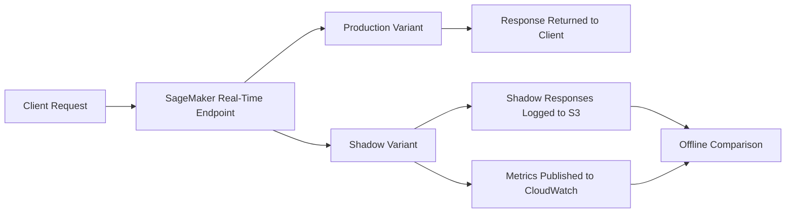

# Task 2.3: Analyze and evaluate the performance of ML and AI systems

## Skill 2.3.3: Compare the performance of shadow variants to production variants

| | |
|---|---|
| **Domain** | ML Model and Foundation Model (FM) Development |
| **Task** | Analyze and evaluate the performance of ML and AI systems |
| **Skill** | Compare the performance of shadow variants to production variants |
| **Primary AWS service** | Amazon SageMaker AI shadow tests |
| **Supporting services** | Amazon CloudWatch, Amazon S3, Amazon SageMaker Data Capture |

---

## Overview

When a data science team trains a new model version, the offline metrics on a static validation set may look strong. However, offline datasets often do not capture the true distribution, payload shapes, concurrency, or unusual inputs that occur in live production traffic.

A **shadow variant** allows a team to compare a candidate model against the currently deployed production model by sending the candidate a copy of real live requests. The production model continues to serve the actual responses to callers. The candidate response is logged and analyzed later without any customer-facing impact.

This skill tests your ability to:

- Identify when shadow testing is the correct deployment evaluation strategy.
- Understand how a shadow variant receives live traffic copies.
- Compare production and shadow variants using operational and model-quality metrics.
- Distinguish shadow testing from A/B testing, canary deployments, and offline evaluation.

---

## What Is a Shadow Variant?

In Amazon SageMaker AI, a **shadow variant** is a model variant deployed on the same real-time endpoint as the production variant.

- The **production variant** receives live inference requests and returns responses to the caller.
- The **shadow variant** receives an asynchronous copy of a configurable percentage of those same live requests.
- The shadow variant’s responses are **not returned** to the caller.
- Shadow responses are stored, for example, in Amazon S3 using SageMaker Data Capture, and operational metrics are published to Amazon CloudWatch.

This allows teams to validate a candidate model, container image, or instance type against real production traffic without exposing users to potentially incorrect or slower responses.

---

## How Shadow Testing Works

1. **Deploy production variant**  
   The currently approved model is deployed on a SageMaker real-time endpoint.

2. **Deploy candidate variant as shadow**  
   The candidate model, container, or inference configuration is deployed as an additional variant on the same endpoint, marked as a shadow variant.

3. **Configure traffic copy percentage**  
   You specify the percentage of live requests that will be copied to the shadow variant. For example, 10%, 50%, or 100% of traffic can be mirrored.

4. **Enable data capture**  
   SageMaker captures the shadow variant’s input and output. These capture files are stored in Amazon S3 for later offline analysis.

5. **Monitor CloudWatch metrics**  
   Metrics such as invocation latency, model latency, error rate, CPU utilization, GPU utilization, and memory usage are collected for both production and shadow variants.

6. **Analyze and compare**  
   After the shadow variant has received enough live traffic, data scientists compare the logged predictions, operational metrics, and error rates between production and shadow.

7. **Make a deployment decision**  
   If the shadow variant performs comparably or better, the team can promote it to production. If not, the shadow variant can be deleted with no user impact.

---

## What Should You Compare Between Production and Shadow Variants?

| Category | Metrics / Signals | Reason |
|---|---|---|
| **Model quality** | Accuracy, F1 score, precision, recall, RMSE, MAE, BLEU, ROUGE, BERTScore, semantic similarity | Determines if the candidate model makes better or equivalent predictions on live data. |
| **Latency** | Invocation latency, model latency, p50/p90/p99 response times | Detects whether the candidate is slower under real traffic patterns. |
| **Error rate** | 4xx/5xx errors, timeouts, crashes, OOM errors | Identifies operational instability in the candidate. |
| **Resource utilization** | CPU utilization, GPU utilization, memory usage | Confirms the candidate can run on the selected instance type without over-provisioning or exhaustion. |
| **Input distribution** | Feature value distributions, payload size, request shape | Checks whether the shadow model is receiving the same type of live traffic as production. |
| **Throughput** | Requests per second, concurrent invocations | Evaluates whether the candidate handles production concurrency levels. |

Shadow testing is especially valuable because it compares both **model behavior** and **operational behavior** on the same real traffic.

---

## Shadow Testing vs. Other Deployment Evaluation Strategies

| Strategy | Caller receives candidate response? | Uses live traffic? | Primary purpose |
|---|---|---|---|
| **Offline evaluation** | No | No | Evaluate candidate on stored dataset before deployment. |
| **Shadow testing** | No | Yes, copied asynchronously | Compare candidate against production on real traffic with zero user impact. |
| **A/B testing** | Yes, some callers get candidate | Yes | Compare business or user-level outcomes between two live variants. |
| **Canary deployment** | Yes, a small percentage of callers get candidate | Yes | Gradually roll out candidate to limited traffic and monitor before full rollout. |
| **Blue/green deployment** | Yes, all traffic can switch at once | Yes | Replace production with candidate after final validation. |

The key distinction for the exam:  
**Shadow testing does not expose users to the candidate. A/B testing and canary deployments do expose users to the candidate.**

---

## When to Use Shadow Testing

Use shadow testing when you need to:

- Compare a new model version against the current production model using real traffic.
- Validate a new inference container or model framework.
- Evaluate a new instance type or hardware accelerator before committing to it.
- Measure latency, throughput, and error rates under realistic production concurrency.
- Identify mismatches between offline evaluation and live request patterns.
- Avoid any customer-facing risk while testing.

Avoid shadow testing when you need:

- User feedback on the candidate output.
- A randomized experiment to measure business metrics such as click-through rate or conversion.
- Direct comparison of user experience between two variants.
- A gradual rollout where real users receive candidate responses.

---

## Scenario-Based Examples

### Scenario 1: Validating a New Recommendation Model

**Context:**  
An e-commerce company has a product recommendation model in production. Data scientists trained a new model that achieved higher offline AUC. They want to evaluate it on live traffic without changing the recommendations that customers currently see.

**Question:**  
Which approach should the company use?

**Answer:**  
Deploy the new model as a **shadow variant** on the same SageMaker endpoint as the production model. A copy of live traffic is routed to the shadow variant. Customers continue to receive recommendations from the production variant. The team then compares the shadow variant’s predictions, latency, and error rate with production using logs and CloudWatch metrics.

**Why:**  
Shadow testing allows real-traffic comparison with zero customer impact. In contrast, A/B testing would expose customers to the candidate model, which is not desired here.

---

### Scenario 2: Testing a New Instance Type

**Context:**  
A team wants to determine whether a new GPU instance type reduces model latency while maintaining accuracy. They cannot risk increased errors for end users.

**Question:**  
Which method best satisfies the requirement?

**Answer:**  
Deploy the candidate model on the new instance type as a **shadow variant** behind the existing production endpoint. Mirror a percentage of live traffic to it. Compare CloudWatch latency, error, and resource metrics between the two instance types.

**Why:**  
Shadow testing evaluates operational performance on real traffic without user-facing risk. This is more representative than offline benchmarking because real traffic includes variable payloads and concurrency.

---

### Scenario 3: Distinguishing Shadow from A/B Testing

**Context:**  
A product team wants to know whether a new fraud detection model increases user satisfaction by reducing false positives. They plan to send 10% of live traffic to the new model and compare user complaints.

**Question:**  
Is this a shadow test?

**Answer:**  
No. This is an **A/B test or canary deployment** because real users are receiving responses from the candidate model. In a shadow test, the candidate model only receives copies of requests and does not send responses back to callers.

---

## Exam Tips and Traps

### Tips

- **Remember the zero-impact property.**  
  Shadow variants receive live traffic copies, but the production variant still returns the response to the caller.

- **Associate shadow testing with SageMaker AI.**  
  Amazon SageMaker AI shadow tests are the AWS-native feature for this pattern.

- **Think about both model quality and operational metrics.**  
  Shadow comparisons are not only about accuracy. They also validate latency, error rate, and resource utilization.

- **Data capture is required for offline response comparison.**  
  Shadow responses must be stored in Amazon S3 through SageMaker Data Capture for later analysis.

- **Use a sufficient traffic percentage and duration.**  
  Too little mirrored traffic may not be statistically representative.

- **Compare production and shadow over the same time window.**  
  This ensures both variants experienced the same live traffic conditions.

- **Know when not to use shadow testing.**  
  If the goal is to measure real user responses to a candidate, use A/B or canary testing instead.

### Traps

- **Confusing shadow with A/B testing.**  
  If callers see candidate responses, it is not shadow testing.

- **Assuming shadow variants automatically compute model metrics.**  
  Shadow testing provides the raw logged inputs and outputs. You must compute accuracy, F1, RMSE, or other metrics offline.

- **Forgetting that some endpoint configurations do not support shadow testing.**  
  For example, shadow testing may not be available for all SageMaker endpoint types or configurations. Check service documentation for current limitations.

- **Thinking shadow testing changes production latency for the caller.**  
  Shadow traffic is copied asynchronously. The production response path is designed to remain the same, though there may be minor infrastructure overhead.

- **Believing offline evaluation is enough.**  
  A model can perform well on stored data but fail on live payloads, concurrency, or unusual inputs. Shadow testing specifically addresses this gap.

- **Misreading the question’s requirement for zero user impact.**  
  If the question states that callers must continue receiving production responses, shadow testing is usually the correct answer.

---

## Summary

Shadow testing is a live-traffic validation technique that compares a candidate model variant against the current production variant without affecting end users.

- The production variant returns the actual response.
- The shadow variant receives a copied subset of live requests.
- Shadow outputs and metrics are logged for offline comparison.
- It is the correct choice when you need real-world validation but cannot risk exposing users to a new model.
- It is different from A/B testing, canary deployment, and offline evaluation.

For the AWS Certified Machine Learning – Associate exam, remember that **shadow variants provide zero user exposure to candidate responses** and are used to evaluate model quality and operational performance against live production traffic.

---

## Knowledge Quick Check

**Question 1:**  
A candidate model must be compared against the model in production by using live requests. Callers must continue receiving only production responses. Which approach meets both requirements?

- A. Route a copy of live requests to a shadow variant and log its responses for offline comparison  
- B. Replace the production variant with the candidate and monitor error rates  
- C. Split traffic 50/50 between candidate and production  
- D. Evaluate both models on a stored dataset before deploying either  

**Correct Answer:** A  
**Explanation:** Shadow testing sends a copy of live traffic to the candidate variant without changing what callers receive. B and C expose users to the candidate. D does not use live traffic.

---

**Question 2:**  
A new model version has better offline accuracy, but the team wants to measure its latency and memory usage under real production concurrency. Which strategy is most appropriate?

- A. Delete the production model and deploy the new model only  
- B. Deploy the new model as a shadow variant and mirror production traffic  
- C. Run a batch transform job using the production request history  
- D. Send 50% of live traffic to the new model and compare user satisfaction  

**Correct Answer:** B  
**Explanation:** Shadow testing compares operational metrics under live traffic without affecting users. Batch transform uses historical data, not live concurrency. A and D involve user-facing changes.

Use shadow testing whenever the question emphasizes **live traffic**, **zero user impact**, and **comparing a candidate to production**.