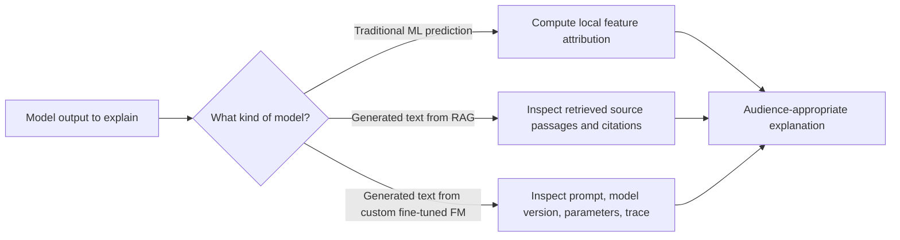
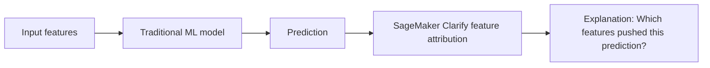
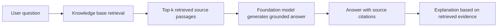

# Task 2.3: Analyze and evaluate the performance of ML and AI systems
## Skill 2.3.4: Explain model outputs

### What This Skill Means

Explaining model outputs means answering a specific question:

> **Why did the model produce this particular result?**

For a traditional ML model, the explanation usually identifies which input features pushed a prediction up or down. For a generative AI or foundation model application, the explanation often identifies which source context, retrieved passage, prompt instructions, or model parameters shaped the generated answer.

A candidate should understand that:

- **Evaluation** says how well a model performs.
- **Explainability** says why a specific output happened.
- A high score, low loss, or strong accuracy does not by itself explain an individual prediction or generated response.

---

### Traditional ML vs. Generative AI Explanations

| Topic | Traditional ML | Generative AI / Foundation Model |
| --- | --- | --- |
| Typical output | Numeric prediction, class label, probability score | Free-form text, answer, summary, code, dialogue |
| Explanation focus | Feature contributions, decision boundaries, input influence | Source passages, retrieved context, prompt wording, trace path |
| Example question | Why was this loan application denied? | Why did the bot return this answer and where did it come from? |
| AWS tools | Amazon SageMaker Clarify, MLflow | Amazon Bedrock Knowledge Bases citations, MLflow tracing, Bedrock Prompt Management |
| Best explanation format | Feature attribution table or chart | Cited source passages plus trace of retrieved context |

---

### Explanation Decision Flow

---

### Explaining Traditional ML Model Outputs

For traditional ML models, explanation is usually about identifying how each input feature contributed to one prediction.

#### Global vs. Local Explanation

| Type | Scope | Example |
| --- | --- | --- |
| **Global explanation** | Describes overall model behavior across all predictions | Feature importance shows that account age and transaction amount are the strongest model drivers overall |
| **Local explanation** | Explains one specific prediction | SHAP shows that this customer's short account age increased their churn risk by 0.15 |

The exam is usually interested in **local explanations** when the question asks about a single customer, loan applicant, or anomaly.

#### Common Traditional ML Explanation Methods

| Method | Purpose |
| --- | --- |
| **SHAP** | Assigns a contribution value to each feature for a specific prediction |
| **Feature importance** | Provides a global ranking of feature impact across the model |
| **Partial dependence plots** | Show how a feature affects predictions on average while other features are held constant |
| **SageMaker Clarify feature attribution** | Computes local feature attributions and bias metrics for trained models |

#### Amazon SageMaker Clarify

Amazon SageMaker Clarify helps explain model behavior for traditional ML models by identifying which features most influenced a prediction. It supports feature attribution and can also assess bias across groups.

Use SageMaker Clarify when the question resembles:

- A loan application was denied, and a regulator asks which fields led to the decision.
- A customer churn prediction is very high, and a business team wants to know the reasons.
- A compliance team asks whether certain protected attributes are influencing outcomes.

SageMaker Clarify can provide local feature-level explanations without requiring the team to build a separate explainability system.

#### Traditional Explanation Flow

---

### Explaining Foundation Model and Generative AI Outputs

Generated text is different from a numeric prediction. Two different sentences can both be correct. An explanation for generated text should identify the evidence, source, or trace that produced the answer.

#### RAG-Based Models Can Point to Their Sources

In a Retrieval-Augmented Generation architecture, the application retrieves source passages before generating the answer. This gives the system a natural explanation path:

> **Generated answer** → **retrieved passages** → **source citations**

If the model uses Amazon Bedrock Knowledge Bases, the response can include citations to the retrieved source passages. An auditor can see which document chunks supported the answer.

#### Custom Fine-Tuned Models Cannot Automatically Cite Sources

A model fine-tuned on an organization's documents absorbs that knowledge into its weights. It cannot reliably point back to the specific document, page, or passage used for a given answer.

This is a key exam distinction:

| Model architecture | Source attribution |
| --- | --- |
| RAG with a knowledge base | Can show retrieved passages and citations |
| Custom fine-tuned foundation model | Cannot directly cite source documents |
| Plain foundation model with no retrieval | No source grounding unless context is supplied in the prompt |

If the business requirement is source-level explanation or regulatory traceability, a RAG-based design using a knowledge base is usually the better fit.

#### What Must Be Captured to Explain an FM Output

To explain an unexpected generated answer, the team should be able to inspect:

| Artifact | Why It Helps |
| --- | --- |
| Prompt text and prompt version | Determines instruction changes or wording changes |
| Model version and inference parameters | Determines temperature, top-p, max tokens, randomness |
| Retrieved passage IDs or chunk scores | Determines whether the correct source text was returned |
| Final response and citation mapping | Determines which answer segment came from which passage |
| Input and output trace | Identifies which application step changed the behavior |

Amazon SageMaker AI with MLflow supports tracing in generative AI applications. It records the inputs, outputs, and metadata at each step, such as retrieval, prompt assembly, and generation.

---

### Distinguishing Retrieval Failure from Generation Failure

A common exam scenario is a RAG answer that is fluent but wrong or incomplete.

Ask two separate questions:

1. Did retrieval return the relevant passage?
2. Did the generator correctly use that passage?

| Situation | Likely Root Cause |
| --- | --- |
| The relevant passage was not retrieved | **Retrieval failure** |
| The relevant passage was retrieved, but the answer ignored or contradicted it | **Generation failure** |
| The answer cites a source but adds unsupported detail | **Hallucination / insufficient grounding** |
| The answer is correct but uses different wording | **Not a failure at all** |

Measuring retrieval and generation separately is the only reliable way to isolate the cause.

---

### Tailoring Explanations to the Audience

| Audience | Explanation Focus |
| --- | --- |
| Regulator or auditor | Feature impact, data version, source passage, model version, fairness attributes |
| Business owner | Actionable business reason, such as which customer behavior increased risk |
| ML engineer | Input trace, retrieved context, prompt version, model parameters, experiment ID |
| End user | Plain-language reason and next step |

---

### AWS Tools That Help Explain Outputs

| AWS Service | Role in Explaining Outputs |
| --- | --- |
| **Amazon SageMaker Clarify** | Computes feature attributions and bias metrics for traditional ML predictions |
| **Amazon Bedrock Knowledge Bases** | Returns retrieved source passages and citations for RAG-based generated answers |
| **Amazon SageMaker AI with MLflow** | Traces inputs, outputs, retrieval context, and metadata across a GenAI application |
| **Amazon Bedrock Prompt Management** | Stores and versions prompts, allowing teams to compare how prompt wording changes output behavior |
| **Amazon Bedrock evaluations** | Uses a judge model that can score outputs and provide a rationale for its judgment; this explains the evaluation, not necessarily the original model's grounding |
| **Amazon CloudWatch** | Provides operational logs and metrics, useful for tracing what happened in the serving system |

---

### Scenario-Based Examples

#### Scenario 1: Explaining a Traditional ML Decision

A financial company uses a trained XGBoost model for credit risk. A compliance officer asks why a customer's application was rejected. The team needs to explain this specific decision.

**Question:** Which AWS approach should the team use?

**Answer:** Use Amazon SageMaker Clarify to compute feature attributions for that specific prediction. It identifies which features, such as debt-to-income ratio or number of recent inquiries, had the largest impact on the rejection.

**Why not:** Global accuracy, overall feature importance, or model loss do not explain a single customer's outcome.

---

#### Scenario 2: Explaining a Generated Answer in a RAG System

A company runs a customer support chatbot using Amazon Bedrock Knowledge Bases. A customer receives an answer that says returns are accepted within 90 days, but the policy document says 30 days. A compliance auditor asks why the model produced that answer.

**Question:** What should the team inspect?

**Answer:** Inspect the retrieved source passages and citations. Check whether the correct policy chunk was retrieved.

- If the correct chunk was not retrieved, the root cause is retrieval failure.
- If the correct chunk was retrieved but the model generated "90 days," the root cause is generation failure.

The team can also use MLflow tracing to view the exact prompt, retrieved context, model version, and final response.

---

#### Scenario 3: Explaining a Change After a Prompt Update

A marketing team updates a prompt used by an Amazon Bedrock foundation model. After deployment, the generated campaign copy has a different tone and length. The ML team cannot remember exactly what changed in the prompt.

**Question:** Which service helps explain the output shift?

**Answer:** Amazon Bedrock Prompt Management. It stores prompts with variables and versions, so teams can compare the current prompt against previous prompt versions and understand which wording change drove the behavior change.

---

#### Scenario 4: LLM-as-a-Judge Provides a Rationale

A team uses an LLM-as-a-judge model in Amazon Bedrock evaluations. The judge says a generated answer is good and gives a rationale. A stakeholder asks if that rationale explains the model's source evidence.

**Question:** Does the judge model's rationale by itself explain the model's grounding?

**Answer:** No. The judge model explains its evaluation of the answer. It does not automatically prove that the original answer was grounded in correct source passages. To provide source-level explanation, the application must include retrieval citations or an equivalent source-attribution mechanism.

---

### Exam Tips and Traps

- **Do not confuse evaluation with explanation.** Accuracy, ROUGE, BLEU, BERTScore, F1, and loss scores assess performance. They do not explain a specific output.
- **SageMaker Clarify is for explainability and bias assessment.** It is not the same as SageMaker Model Monitor, which detects drift in data quality, model quality, or feature distributions.
- **A shadow test compares model variants under live traffic.** It does not explain why a particular model produced a particular output.
- **Global feature importance can be misleading for a single prediction.** For one customer, use local feature attribution, not just the overall top features.
- **RAG systems can explain outputs through retrieved passages.** A fine-tuned model cannot automatically cite source documents. If source attribution is mandatory, prefer RAG with a knowledge base.
- **For RAG failures, split retrieval from generation.** A fluent answer that omits a fact is often a retrieval problem, not necessarily a generation problem.
- **Prompt Management helps explain prompt-driven output changes.** It provides version control and variant comparison for prompts.
- **LLM-as-a-judge can give a rationale for its score, but that rationale explains the judgment, not the original model's source grounding.**
- **Trace rich artifacts for FM outputs.** Without captured prompts, model versions, retrieval context, and inference parameters, explaining an answer after the fact becomes guesswork.

---

### Summary

To explain model outputs effectively, a candidate should understand:

- Traditional ML outputs are explained through feature attribution, especially SageMaker Clarify.
- Generative AI outputs are explained through source attribution and application tracing.
- RAG models can point to retrieved passages; fine-tuned models cannot automatically cite sources.
- Retrieval and generation should be measured separately when diagnosing a bad RAG answer.
- Explanations should be tailored to the audience: regulator, business owner, ML engineer, or end user.
- Explanation is not the same as evaluation, accuracy, or drift detection.