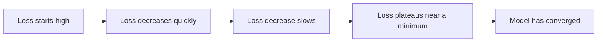
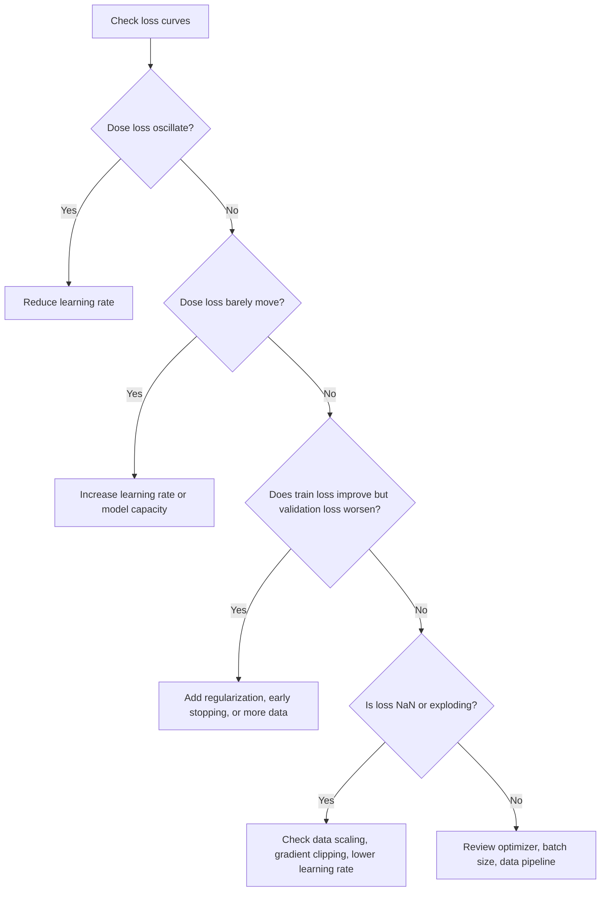

# Task 2.3: ML Model and Foundation Model (FM) Development - Analyze and evaluate the performance of ML and AI systems

## Skill 2.3.5: Debug model convergence issues

## Overview

**Model convergence** is the point during training where the optimization algorithm settles into a stable solution and the loss function stops changing meaningfully. Debugging convergence issues means diagnosing:

- A loss that oscillates and never stabilizes
- A loss that decreases too slowly or not at all
- A training loss that improves while validation loss degrades
- A loss that becomes `NaN`, `Inf`, or explodes
- A run that fails to reproduce a previous result

For the AWS Certified Machine Learning - Associate exam, you must be able to match a convergence symptom to the most likely cause and the best corrective action.

---

## 1. What Does Healthy Convergence Look Like?

A healthy training run typically shows:

1. **Training loss**: Decreases rapidly at first, then gradually flattens.
2. **Validation loss**: Decreases alongside training loss, then reaches a minimum.
3. **Gap between training and validation**: Stays small during the useful learning phase.
4. **Stability**: Small, noise-driven fluctuations are normal; large, erratic jumps are not.

If the curve does not follow this pattern, you have a convergence problem.

---

## 2. Convergence Failure Patterns

| Symptom | What It Looks Like | Most Likely Cause |
|---|---|---|
| **Oscillating loss** | Loss repeatedly jumps up and down without settling | Learning rate too high |
| **Flat or near-flat loss** | Loss barely changes from start | Learning rate too low or model capacity too low |
| **Train loss down, validation loss up** | Training improves, validation worsens over epochs | Overfitting |
| **Loss becomes `NaN` or `Inf`** | Training fails outright with non-finite values | Exploding gradients, bad input scaling, or learning rate far too high |
| **High but stable plateau** | Loss stops improving at a poor value | Underfitting, missing features, or insufficient model capacity |
| **Very slow improvement** | Loss decreases but takes too long to reach a usable value | Learning rate too low, poor optimizer settings, or poor data pipeline |

---

## 3. Diagnostic Decision Flow

Use this sequence when a model does not converge:

---

## 4. Common Causes and Remediation

### 4.1 Learning Rate Problems

The learning rate is the most common convergence control.

| Condition | Symptom | Fix |
|---|---|---|
| Too high | Oscillating loss, `NaN` loss, exploding loss | Decrease learning rate, add learning rate decay |
| Too low | Loss improves very slowly or stalls | Increase learning rate |
| Static throughout training | Early instability or late slow convergence | Use a learning rate schedule or warmup |
| Large batch size with unchanged learning rate | Poor generalization or unstable updates | Consider scaling learning rate with batch size |

### 4.2 Model Capacity and Architecture

| Condition | Symptom | Fix |
|---|---|---|
| Model too small | High training loss plateau; underfitting | Increase depth or width |
| Model too large for data | Training loss drops, validation loss rises | Reduce capacity, add regularization |
| Missing non-linearities | Cannot learn non-linear relationships | Add appropriate layers/representations |
| Poor weight initialization | Slow or unstable start | Use proper initialization schemes |
| Vanishing gradients | Loss stalls in deep networks | Use better activations, residual connections, normalization |

### 4.3 Data Issues

| Condition | Symptom | Fix |
|---|---|---|
| Unscaled features | Slow convergence; large weight updates | Normalize or standardize features |
| Noisy labels | Loss plateaus at poor value | Clean labels or use robust loss |
| Data leakage | Validation loss unrealistically good, then poor deployment performance | Rebuild train/validation split honestly |
| Poor shuffling | Periodic jumps in loss | Shuffle training data properly per epoch |
| Imbalanced dataset | Model converges to majority class | Use class weighting, resampling, or appropriate objective |

### 4.4 Optimization Settings

| Setting | Effect on Convergence |
|---|---|
| Batch size too small | Noisy gradients, unstable loss |
| Batch size too large | Fewer updates per epoch, possible poorer generalization |
| No gradient clipping | Exploding gradients in RNNs, transformers, or deep models |
| Wrong optimizer | Slower convergence or instability |
| No early stopping | Wastes compute and may overfit |
| No regularization | Validation loss degrades while training loss improves |

---

## 5. Debugging Convergence with AWS Services

| AWS Capability | Role in Convergence Debugging |
|---|---|
| **Amazon CloudWatch** | Visualizes training and validation loss metrics emitted from SageMaker training jobs; sets alarms for non-finite loss or stalled metrics. |
| **Amazon SageMaker AI training jobs** | Captures metric logs and provides console dashboards to compare runs. |
| **Amazon SageMaker AI Debugger** | Captures tensors, gradients, and optimizer states during training to expose vanishing gradients, exploding gradients, and layer-level issues. |
| **Amazon SageMaker AI Experiments / MLflow** | Tracks hyperparameters, metrics, and artifacts across runs so you can compare learning rates, batch sizes, and random seeds systematically. |
| **Amazon SageMaker AI Automatic Model Tuning** | Searches for hyperparameters that improve convergence, such as learning rate, optimizer, weight decay, and batch size. |

> **Important:** Services like Amazon Bedrock evaluations, SageMaker shadow tests, and Bedrock Prompt Management are **not** convergence debugging tools. They evaluate deployed model performance, traffic behavior, and prompt variations, not training optimization.

---

## 6. Convergence Debugging in Practice

### Scenario 1: Oscillating Loss

A deep learning model's training loss jumps up and down across epochs and never settles. The validation loss is also unstable.

**Question:** What is the first hyperparameter to examine?

**Answer:** **Learning rate.**

A learning rate that is too high causes the optimizer to overshoot the minimum repeatedly. The result is oscillation rather than convergence. Reducing the learning rate or adding a decay schedule usually stabilizes training.

**Exam Tip:** If the exam mentions "loss oscillates," "bounces," or "jumps wildly," look for an answer involving reducing the learning rate.

---

### Scenario 2: Plateau at Poor Loss

A binary classification model reaches an accuracy near 50% and the loss stops improving early in training. Both training and validation loss remain high.

**Question:** What is the likely issue?

**Answer:** The model may be underfitting due to insufficient capacity, missing features, or a learning rate that is too low.

The model is not learning the underlying pattern. Possible fixes:

- Increase model capacity
- Add more useful input features
- Increase learning rate
- Verify data pipeline is not feeding corrupted or unnormalized inputs

**Exam Tip:** If both training and validation loss remain high, it is an **underfitting** problem, not overfitting.

---

### Scenario 3: Training Loss Improves, Validation Loss Worsens

A model's training loss decreases steadily to a very low value, but validation loss starts increasing after several epochs.

**Question:** What is happening?

**Answer:** The model is **overfitting**.

Recommended actions:

- Early stopping based on validation loss
- Add L1/L2 regularization
- Add dropout
- Increase training data
- Reduce model capacity
- Use data augmentation

**Exam Tip:** Overfitting is a generalization problem, not strictly a convergence failure. The optimizer has converged on the training data but not on the broader distribution.

---

### Scenario 4: Loss Becomes `NaN`

During training, the loss suddenly becomes `NaN`.

**Question:** What should you check first?

**Answer:** Check the learning rate and input data scale.

Common causes:

- Too high learning rate causing exploding gradients
- `NaN` or infinite values in input features
- Large activations producing overflow
- No gradient clipping in architectures prone to exploding gradients

Remediation:

- Lower learning rate
- Clip gradients
- Normalize inputs
- Sanitize data for `NaN` and extreme values

---

## 7. Reproducibility and Convergence

Two runs with the same code and data may differ because of:

- Unset random seeds
- Different hardware or framework versions
- Different data splits
- Non-deterministic operations
- Different library defaults
- Changing hyperparameters without tracking

Use experiment tracking to compare:

- Learning rate
- Batch size
- Optimizer type
- Weight initialization
- Data version
- Random seed
- Compute instance

Without tracked metadata, it is difficult to determine why one run converged and another did not.

---

## 8. Exam Tips and Traps

### Tips

- Match the loss curve symptom to the correct cause:
  - **Oscillation** → learning rate too high
  - **Flat loss** → learning rate too low or model capacity too small
  - **Train good, validation bad** → overfitting
  - **Train bad and validation bad** → underfitting

- Use **validation loss**, not just training loss, to judge convergence.

- Track every run's hyperparameters and metrics. Reproducibility is a first-class debugging technique.

- Use **early stopping** to stop training when validation loss stops improving.

- Use **gradient clipping** for deep models or sequence models when loss becomes `NaN` or explodes.

- Use **CloudWatch** to monitor loss metrics in near real time during SageMaker training.

- Use **SageMaker Debugger** for deep inspection of gradients and activations.

### Traps

- Do not assume more epochs always improves convergence. It may cause overfitting.

- Do not change the model architecture first when the learning rate is the obvious issue.

- Do not confuse evaluation tools with convergence tools:
  - **Amazon Bedrock evaluations** evaluate generated output quality
  - **SageMaker shadow tests** compare deployed variants on live traffic
  - **MLflow** tracks runs but does not automatically fix convergence

- Do not immediately deploy a model just because training loss is low. Validation loss must also be low.

- Do not conclude that a stagnant loss means the model has converged if the loss is still high.

- Do not scale the training instances just to fix convergence. Compute scale may speed up training, but does not fix optimization dynamics.

- If the problem states that loss oscillates, **do not** choose "increase the learning rate."

- If the problem states that loss is not changing, **do not** choose "add regularization" first. Regularization addresses overfitting, not a stalled optimizer.

---

## 9. Quick Reference Summary

| Convergence Issue | First Suspect | First Action |
|---|---|---|
| Oscillating loss | Learning rate too high | Reduce learning rate |
| Loss nearly flat | Learning rate too low or model too small | Increase learning rate or capacity |
| Train loss down, validation loss up | Overfitting | Regularization, early stopping, more data |
| High training plateau | Underfitting | Add capacity or features |
| `NaN` or exploding loss | Bad data scaling or high learning rate | Normalize inputs, lower learning rate, clip gradients |
| Different results per run | Missing random seed or tracking | Track seeds, hyperparameters, data versions |

---

## 10. Scenario-Based Practice

### Question 1

A data scientist notices that the validation loss curve has started to increase while training loss continues to decrease. What should the scientist do first?

**A.** Increase the learning rate  
**B.** Enable early stopping and add regularization  
**C.** Increase the batch size  
**D.** Add more layers to the model  

**Correct Answer:** **B**

**Explanation:** The pattern is overfitting. Early stopping and regularization reduce overfitting. Increasing capacity would worsen it, and increasing learning rate would cause instability.

---

### Question 2

During a transformer training job, the loss suddenly becomes `NaN`. Which approach is most likely to resolve the issue?

**A.** Increase model capacity  
**B.** Apply gradient clipping and lower the learning rate  
**C.** Delete previous training runs  
**D.** Increase batch size only  

**Correct Answer:** **B**

**Explanation:** `NaN` loss is commonly caused by exploding gradients or an excessively high learning rate. Gradient clipping and a lower learning rate stabilize optimization.

---

### Question 3

A model's training loss decreases but remains at a high plateau. The validation loss is similarly high. The model is likely experiencing what problem?

**A.** Overfitting  
**B.** Underfitting  
**C.** Data leakage  
**D.** Shadow test failure  

**Correct Answer:** **B**

**Explanation:** Both training and validation loss remaining high indicates underfitting. The model has not learned the underlying relationship. Increasing model capacity, adding features, or adjusting the learning rate may help.

---

## 11. Key Takeaways for the Exam

1. **Loss curve pattern is the primary diagnostic signal.**
2. **Learning rate is the most important first check when convergence fails.**
3. **Training vs validation gap is how you identify overfitting.**
4. **Both losses high means underfitting.**
5. **`NaN` loss means exploding gradients or bad data scaling.**
6. **Experiment tracking is essential for reproducibility and convergence comparisons.**
7. **AWS convergence debugging uses CloudWatch, SageMaker training metrics, SageMaker Debugger, and experiment tracking.**