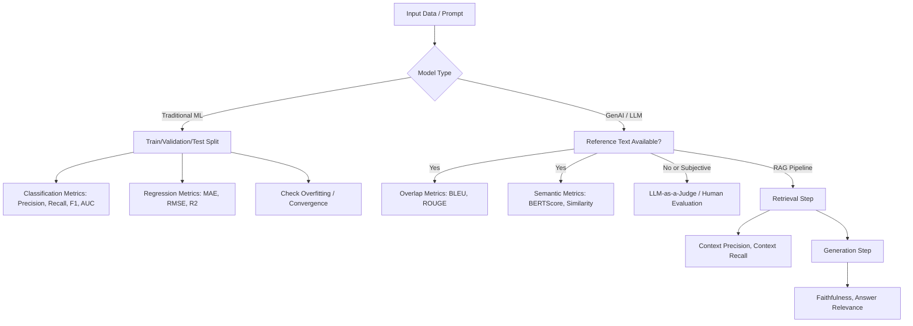

# Task 2.3: ML Model and Foundation Model (FM) Development - Analyze and evaluate the performance of ML and AI systems

## Skill 2.3.6: Apply comprehensive model evaluation techniques for traditional ML and GenAI models

---

## Overview

Comprehensive model evaluation means selecting metrics and validation strategies that match the problem type, the output form, and the business consequence of errors. Traditional ML models produce structured predictions (labels, numbers) and can be scored with statistical metrics against a held-out dataset. Generative AI models produce free-form text where many correct answers exist, requiring a mix of lexical overlap, semantic similarity, automated judge models, and human review. In addition, RAG systems must be evaluated in two parts: retrieval quality and generation quality, separately.

AWS services covered in this skill include **Amazon Bedrock Evaluations**, **Amazon SageMaker AI with MLflow**, **Amazon SageMaker Clarify**, **Amazon SageMaker Model Monitor**, **Amazon Bedrock Prompt Management**, and **Amazon CloudWatch**.

---

## 1. Traditional ML Model Evaluation

Traditional evaluation starts with an honest split of data into training, validation, and test sets. The model is tuned on validation, then reported once on test data to avoid optimistic bias.

### 1.1 Data Splitting and Validation Strategies

| Strategy | Description | Use When |
| --- | --- | --- |
| Hold-out validation | Single train/validation/test split | Large datasets; simple models |
| K-fold cross-validation | Split data into K folds, train on K-1, validate on 1, repeat | Small to medium datasets; hyperparameter tuning |
| Stratified K-fold | Preserves class proportions in each fold | Imbalanced classification |
| Time series split | Respects chronological order; validate on future periods | Forecasting, financial or event data |
| Nested cross-validation | Inner loop for hyperparameters, outer loop for performance | Unbiased model selection with limited data |

**Pitfall to avoid:** Scaling or imputing using the test set before applying the model causes data leakage. Fit preprocessing only on training data, then transform validation/test.

### 1.2 Classification Metrics

| Metric | Formula / Meaning | Best When |
| --- | --- | --- |
| Accuracy | Correct predictions / total predictions | Balanced classes; misclassification costs equal |
| Precision | TP / (TP + FP) | False positives are costly (e.g., spam detection) |
| Recall (Sensitivity) | TP / (TP + FN) | False negatives are costly (e.g., fraud, cancer) |
| F1 Score | Harmonic mean of precision and recall | Imbalanced data; need balance between precision and recall |
| ROC-AUC | Area under receiver operating characteristic curve | Binary classification; balanced performance across thresholds |
| PR-AUC | Area under precision-recall curve | Highly imbalanced datasets; focuses on minority class |
| Confusion Matrix | Table of TP, TN, FP, FN | Diagnosing error types |

**Exam insight:** For imbalanced datasets, **accuracy is misleading**. A model that always predicts the majority class may have high accuracy but fails on the minority class. Use precision, recall, F1, or AUC-PR.

### 1.3 Regression Metrics

| Metric | Description | Properties |
| --- | --- | --- |
| MAE (Mean Absolute Error) | Average absolute difference between predicted and actual | Robust to outliers; same units as target |
| MSE (Mean Squared Error) | Average squared difference | Penalizes large errors more heavily |
| RMSE | Square root of MSE | Same units as target; sensitive to outliers |
| R² (R-Squared) | Proportion of variance explained | Values <=1; can be negative if model is worse than mean baseline |
| MAPE / sMAPE | Percentage errors | Use for relative error but careful when actuals contain zeros |

### 1.4 Overfitting, Underfitting, and Convergence

| Symptom | Likely Cause | Remediation |
| --- | --- | --- |
| Low training loss, high validation loss | Overfitting | More data, regularization, dropout, early stopping |
| High training loss and high validation loss | Underfitting or learning rate too low | Increase model capacity, higher learning rate |
| Oscillating loss, non-converging | Learning rate too high | Reduce learning rate or use decay scheduler |
| Training loss decreases but validation loss increases after epoch N | Overfitting begins | Early stopping, regularization |

**Convergence debugging is part of evaluation** because a model that has not converged will perform poorly on evaluation metrics.

---

## 2. GenAI and LLM Evaluation

Generated text has multiple valid formulations. A single exact-match accuracy is inappropriate. Evaluation must combine overlap-based, embedding-based, judge-model, and human judgment techniques.

### 2.1 Challenges in Evaluating Generative Text

- Non-deterministic output: same prompt can produce different valid answers.
- No single ground truth: syntactic variations can be semantically equivalent.
- Quality is multidimensional: relevance, faithfulness, coherence, harmfulness, bias, readability.
- Open-ended tasks may have no reference answer.

### 2.2 Overlap-Based Metrics (Lexical)

| Metric | Type | Description | Strength | Weakness |
| --- | --- | --- | --- |
| BLEU | Precision-focused | Measures n-gram precision against reference, with brevity penalty | Good for machine translation | Misses synonyms/paraphrases; poor for creative text |
| ROUGE-N | Recall-focused | Measures n-gram overlap recall | Good for summarization (recall coverage of important content) | Overlaps can be superficial; ignores semantics |
| ROUGE-L | Longest common subsequence | Captures sentence-level structure similarity | Better than pure n-gram for fluency | Still lexical, not semantic |
| METEOR | F1-like blend | Matches stems, synonyms, paraphrases | More robust than BLEU/ROUGE | Requires linguistic resources; less common in AWS exams |

**Key distinction:**  
- **BLEU** = precision of n-grams in candidate vs reference.  
- **ROUGE** = recall of n-grams in reference vs candidate.  
They are complementary and should be reported together for overview, but both fail to capture meaning.

### 2.3 Embedding-Based and Semantic Similarity Metrics

| Metric | Description | Strength | Weakness |
| --- | --- | --- | --- |
| BERTScore | Uses contextual embeddings to compute soft precision/recall by token cosine similarity | Captures paraphrase and meaning | Requires pre-trained embeddings; token alignment can be noisy |
| Semantic Similarity / Cosine Similarity | Averages embeddings of candidate and reference, computes cosine | Fast, interpretable | Embedding model choice impacts score |
| Sentence-BERT / Cross-encoder | Fine-tuned for sentence similarity | Better for sentence-level comparison | More compute |

**Use these when wording differs but meaning matters.** A summary may use different words but same facts; BLEU/ROUGE will penalize it, while BERTScore will reward semantic overlap.

> Example: Candidate "The cat sat on the mat" vs reference "A feline rests on a rug." BLEU is low, BERTScore is high. Both answers are correct, demonstrating the need for semantic metrics.

### 2.4 LLM-as-a-Judge

A judge model (another LLM) scores candidate outputs based on a rubric or pairwise comparison.

**How it works:**
- Prompt the judge model with the original prompt, reference (if any), and candidate response.
- Ask for a score (1–5) or preference (A vs B), along with reasoning.
- Can evaluate dimensions: helpfulness, relevance, faithfulness, coherence, safety.

**Advantages:**
- Captures open-ended quality beyond n-gram overlap.
- Scales better than human evaluation.
- Provides explanations for scores.

**Limitations and traps:**
- Judge model has its own biases (position bias, verbosity bias, self-preference).
- Must be calibrated and tested against human ratings.
- Not a replacement for human evaluation on high-stakes, subjective, or harmful content.

**AWS implementation:** Amazon Bedrock Evaluations supports **LLM-as-a-judge** jobs where a judge model scores responses from other models automatically.

### 2.5 Human Evaluation

Human workers rate outputs for quality, safety, helpfulness, truthfulness, and style. Use human evaluation when:
- Task is subjective or high-stakes (medical, legal, financial).
- Need to detect subtle bias, toxicity, or cultural nuance.
- Automatable metrics are ambiguous or contradictory.

**AWS implementation:** Amazon Bedrock Evaluations supports **human-based evaluation jobs**, using employees or subject-matter experts via the console. A human review workflow can include a **human-in-the-loop step** for outputs that require approval before reaching users.

### 2.6 Bias Detection and Content Quality Validation

- **Bias detection**: measure output differences across demographic, gender, racial, or other groups. Use curated datasets to probe for stereotypes or harmful content.
- **Content quality validation**: check for factual accuracy, groundedness, toxicity, profanity, and off-topic responses.
- AWS services: **Amazon SageMaker Clarify** evaluates bias and explainability in data and models; **Amazon Bedrock Evaluations** provides programmatic and judge-based content validation.

---

## 3. RAG System Evaluation

In Retrieval-Augmented Generation, two components must be evaluated separately. A fluent answer that omits facts may be a retrieval failure, not a generation failure.

### 3.1 RAG Evaluation Triad

| Evaluation Component | Metric | Question Answered | Failure Symptom |
| --- | --- | --- | --- |
| Retrieval Quality | Context Precision, Context Recall, Hit Rate, MRR | Did the retriever fetch relevant, useful chunks? | Missing facts or irrelevant context |
| Generation Faithfulness | Faithfulness | Is the answer grounded in the retrieved context? | Hallucination or unsupported claims |
| Generation Relevance | Answer Relevance | Does the answer address the original question? | Off-topic or evasive answers |
| Context Relevance | Context Relevance | Is the retrieved context relevant to the question and not noisy? | Retrieval returned irrelevant chunks causing the LLM to ignore them |

### 3.2 Retrieval Metrics

| Metric | Description |
| --- | --- |
| Context Precision | Of retrieved chunks, how many are relevant to the answer; rank-aware |
| Context Recall | Of relevant chunks that should have been retrieved, how many were retrieved |
| Hit Rate | Percentage of queries where at least one relevant chunk was retrieved in top-K |
| MRR (Mean Reciprocal Rank) | Average reciprocal rank of first relevant chunk |
| NDCG (Normalized Discounted Cumulative Gain) | Rank-aware quality of retrieval list |

### 3.3 Generation Metrics

- **Faithfulness**: percentage of statements in the answer that are supported by the retrieved context.
- **Answer Relevance**: semantic similarity between answer and question to detect deviations.
- **Correctness** (if ground truth exists): factual overlap with reference answer.

### 3.4 RAG Monitoring in AWS

- **Amazon Bedrock Knowledge Bases** provides retrieval source that can be evaluated separately via Bedrock Evaluations.
- **Amazon CloudWatch** logs operation metrics: retrieval latency, number of chunks returned, token usage, error rates.
- Establish a baseline during a known-good period and alert on drift in retrieval precision/recall or generation quality.

---

## 4. AWS Services for Evaluation

| AWS Service | Evaluation Capability |
| --- | --- |
| Amazon Bedrock Evaluations | Programmatic, LLM-as-a-judge, and human-based evaluation jobs for models and retrieval sources |
| Amazon SageMaker AI with MLflow | Tracks training runs, metrics, parameters, artifacts; tracing for GenAI applications |
| Amazon SageMaker Clarify | Bias detection and model explainability for ML predictions |
| Amazon SageMaker Model Monitor | Drift detection on prediction quality, input distribution, and operational metrics |
| Amazon Bedrock Prompt Management | Stores, versions, and compares prompt variants and outputs |
| Amazon CloudWatch | Metrics, logs, alarms; baselines and drift visibility |
| Amazon SageMaker AI Shadow Tests | Deploys shadow variant to compare against production on live traffic without caller impact |

### 4.1 Amazon Bedrock Evaluation Modes

| Mode | How it Works | Best For |
| --- | --- | --- |
| Programmatic | Runs automated scoring algorithms against a prompt dataset (BLEU, ROUGE, BERTScore, semantic) | Fast, deterministic, large-scale regression |
| Judge model | Uses a powerful LLM to score responses per rubric, with reasoning | Open-ended quality, helpfulness, faithfulness |
| Human-based | Ratings from human workers, employees, or SMEs | Subjective or high-stakes evaluation, bias, toxicity |

**Remember:** Human-based evaluation jobs in the Amazon Bedrock console **require a browser-facing display** so raters can see prompts and responses.

---

## 5. Evaluation Workflow Diagram

---

## 6. Scenario-Based Knowledge Checks

### Scenario 1

A company builds a fraud detection model where 98% of transactions are legitimate and 2% are fraudulent. The model achieves 98.5% accuracy. A stakeholder claims this is excellent. What should the ML engineer do?

**A.** Accept the model as deployable because accuracy is high.  
**B.** Evaluate precision, recall, F1, and PR-AUC, because accuracy is misleading on imbalanced data.  
**C.** Remove the legitimate examples to balance the dataset.  
**D.** Only report accuracy to keep stakeholders confident.

??? success "Answer & Explanation"
    **Correct Answer:** B  
    **Explanation:** With 98% legitimate transactions, a model that always predicts "not fraud" gets 98% accuracy but catches zero fraud. For imbalanced classification, use precision, recall, F1, and especially PR-AUC to evaluate the minority class.

### Scenario 2

A team evaluates a text summarization model using only ROUGE. Which limitation will they encounter?

**A.** ROUGE measures semantic meaning, so it is too strict.  
**B.** ROUGE is only for translation tasks.  
**C.** ROUGE relies on lexical overlap and may give high scores to summaries with similar words but different meaning, or low scores to semantically correct paraphrases.  
**D.** ROUGE requires human raters.

??? success "Answer & Explanation"
    **Correct Answer:** C  
    **Explanation:** ROUGE measures n-gram overlap between candidate and reference. It can both miss correct paraphrases (different words, same meaning) and reward superficial word overlap. Use ROUGE in combination with BERTScore, semantic similarity, and judge or human evaluation.

### Scenario 3

A RAG chatbot returns fluent answers but frequently includes facts not present in the retrieved documents. Which metric directly identifies this problem?

**A.** Context Recall  
**B.** Answer Relevance  
**C.** Faithfulness  
**D.** Hit Rate

??? success "Answer & Explanation"
    **Correct Answer:** C  
    **Explanation:** Faithfulness measures whether the generated answer is grounded in the provided context. If the answer contains facts not in context, faithfulness is low. Context recall and hit rate evaluate retrieval; answer relevance checks if the answer addresses the question.

### Scenario 4

An ML engineer wants to evaluate an LLM response for "helpfulness, coherence, and safety" without hiring human workers immediately. Which AWS approach is most suitable?

**A.** Run a shadow test on SageMaker AI.  
**B.** Use MLflow to track the LLM prompt.  
**C.** Create an Amazon Bedrock Evaluations job with an LLM-as-a-judge model.  
**D.** Use Amazon CloudWatch to monitor token usage.

??? success "Answer & Explanation"
    **Correct Answer:** C  
    **Explanation:** Amazon Bedrock Evaluations supports judge model jobs where an LLM scores responses according to a rubric, including helpfulness, coherence, and safety. Shadow tests compare live traffic variants; MLflow tracks runs; CloudWatch monitors metrics.

---

## 7. Exam Tips and Traps

### Tips

- **Match metric to problem type.** Classification: accuracy only for balanced; imbalanced uses precision/recall/F1/PR-AUC. Regression: RMSE/MAE/R².
- **For GenAI, never rely on one metric.** Combine BLEU/ROUGE (overlap) with BERTScore (semantic), plus human or judge evaluation.
- **RAG evaluation is always two-part.** Evaluate retrieval with context precision/recall separately from generation with faithfulness/answer relevance.
- **Know AWS evaluation services:** Bedrock Evaluations (programmatic, judge, human), SageMaker Clarify (bias/explainability), MLflow (run tracking), Model Monitor (drift).
- **Understand validation integrity:** avoid data leakage by fitting preprocessing only on training folds; use time series splits for temporal data.
- **Reproducible evaluation:** track parameters, metrics, artifacts in MLflow; version prompts with Bedrock Prompt Management.

### Traps

- **Using accuracy on imbalanced data** – a classic exam trap. Always check class distribution.
- **Believing BLEU/ROUGE measure meaning** – they are lexical overlap only. A high ROUGE can still be a bad summary.
- **Thinking a single judge model is always unbiased** – LLM-as-a-judge has biases (verbosity, position, self-preference) and needs validation against human ratings.
- **Merging RAG retrieval and generation into one score** – you cannot isolate failure; measure them separately.
- **Treating test data as a tuning target** – repeated evaluation on test data causes optimistic bias; keep test untouched until final.
- **Assuming a lower loss always means a better deployed model** – validation metrics and business metrics matter; watch for overfitting and convergence oscillations.
- **Confusing shadow tests with evaluation metrics** – shadow tests validate operational readiness and performance against live traffic, not model quality in a static sense.

---

## 8. Summary

Comprehensive model evaluation for traditional ML and GenAI demands:

- **Traditional ML:** correct metric per problem type, honest validation, awareness of overfitting and convergence.
- **GenAI:** multi-faceted evaluation using overlap, semantic, judge, and human metrics.
- **RAG:** separate assessment of retrieval and generation.
- **AWS tools:** Bedrock Evaluations, SageMaker Clarify, MLflow, Model Monitor, CloudWatch for reproducibility, bias detection, and drift detection.

A defensible evaluation framework is not a single accuracy number; it is a deliberate collection of evidence that answers what, how, and why a model’s outputs can be trusted.