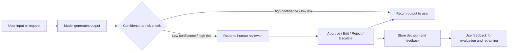
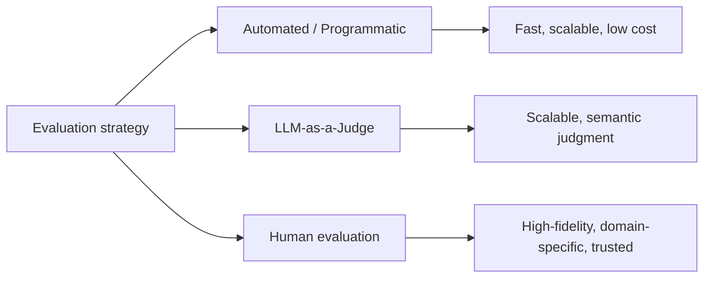
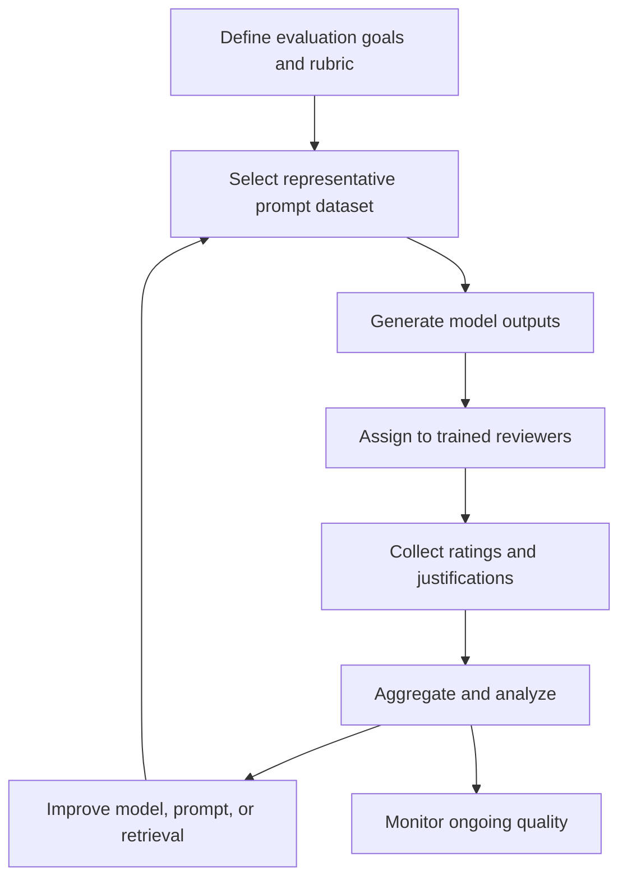

# Task 2.3: ML Model and Foundation Model (FM) Development - Analyze and evaluate the performance of ML and AI systems

## Skill 2.3.7: Implement integrated human evaluation frameworks (for example, human-in-the-loop workflows, text generation quality assessment)

### Overview

This skill focuses on bringing human judgment into ML and generative AI systems in a structured, repeatable way. It covers two related ideas:

1. **Human-in-the-loop (HITL) workflows** – inserting human review into an inference or decision process.
2. **Text generation quality assessment** – using humans to evaluate generated language outputs beyond what automated metrics can measure.

A strong evaluation strategy does not choose between automated metrics and human judgment. It combines them.

---

### 1. Why human evaluation matters for ML and generative AI

For traditional ML, evaluation often uses metrics such as accuracy, precision, recall, F1, AUC, or RMSE. These work well when the output is a class label, a probability, or a number.

For text generation and conversational AI, outputs are open-ended. Two responses can be:

- Worded differently but both correct.
- Fluent but factually wrong.
- Helpful but not aligned with brand tone.
- Relevant but unsafe or biased.

Automated metrics such as BLEU, ROUGE, and BERTScore help with lexical overlap or semantic similarity, but they cannot fully judge truthfulness, helpfulness, tone, safety, or user satisfaction. Human evaluation fills that gap.

**Exam perspective:**  
When the exam asks about subjective quality, brand voice, helpfulness, empathy, trust, safety, or nuanced factual judgment, the likely answer involves human evaluation or a hybrid framework including humans.

---

### 2. Human-in-the-loop workflows

A human-in-the-loop workflow is an operational pattern where a human reviews, approves, edits, or rejects a model output before it reaches the end user or downstream system.

#### 2.1 Common HITL workflow

#### 2.2 When to use HITL

Use human review when:

- The cost of an incorrect output is high.
- The output is customer-facing and sensitive.
- Compliance or regulatory requirements mandate human oversight.
- Model confidence is low.
- The task requires domain expertise not fully captured by the model.
- The data distribution is shifting and the model may be unreliable.
- The system is new and requires controlled rollout.

#### 2.3 What makes HITL integrated and effective

A mature HITL framework includes:

| Component | Description |
| --- | --- |
| **Trigger** | Confidence threshold, risk classifier, business rule, or policy rule |
| **Routing** | Sends selected outputs to the appropriate human work team |
| **Review interface** | Shows model output, input, retrieved passages, and review options |
| **Decision options** | Approve, reject, edit, escalate |
| **Recording** | Stores reviewer identity, timestamp, decision, and corrected output |
| **Feedback loop** | Uses review outcomes for evaluation metrics, retraining, or prompt updates |

#### 2.4 HITL example

A healthcare summarization system may generate a draft medical summary from provider notes. If the model confidence is below a threshold, or if the output contains certain drug names, the summary is routed to a clinical reviewer before being placed in the patient record.

In this example, HITL is not just measuring quality; it is part of the production control system.

---

### 3. Text generation quality assessment

Text generation quality assessment is the process of having human reviewers rate generated text against a clear rubric.

#### 3.1 Common human evaluation dimensions

| Dimension | Question |
| --- | --- |
| **Relevance** | Does the response directly answer the prompt or question? |
| **Correctness / Factual accuracy** | Are the facts true? |
| **Faithfulness / Groundedness** | Does the response stay faithful to retrieved source material? |
| **Completeness** | Does the answer include all important parts? |
| **Coherence** | Does the response flow logically? |
| **Fluency** | Is the language natural and grammatical? |
| **Helpfulness** | Does the response help the user accomplish their goal? |
| **Safety / Toxicity** | Is the response harmful, biased, or inappropriate? |
| **Style / Tone / Brand voice** | Does the style match the intended voice? |
| **Instruction following** | Does the response follow formatting, length, or content constraints? |

#### 3.2 Rating methods

Human assessments can use:

- **Likert scales** – e.g., rate helpfulness from 1 to 5.
- **Pairwise comparisons** – compare two model responses and choose the better one.
- **Rubrics** – score against detailed descriptions for each dimension.
- **Task-specific checklists** – e.g., did the response include a required disclaimer?
- **Accept / reject decisions** – used in production review workflows.

#### 3.3 Why automated metrics alone are weak for generative text

BLEU, ROUGE, METEOR, and similar overlap-based measures compare generated text with reference text. They reward exact or near-exact word overlap. However, a correct paraphrase may score poorly, and a fluent but false answer may score well.

Embedding-based measures such as BERTScore and semantic similarity capture meaning better but still miss truthfulness, user intent, safety, and domain-specific judgment.

**Key idea:**  
Automated metrics are useful for fast, scalable regression checks. Human evaluation is needed for nuanced, consequential quality decisions.

---

### 4. AWS services and features for human evaluation

| AWS Service / Feature | Role |
| --- | --- |
| **Amazon Bedrock Evaluations – Human evaluation** | Runs human-based evaluation jobs for generative AI model outputs using a work team. Reviewers rate outputs using structured prompts and rating criteria. |
| **Amazon SageMaker AI Ground Truth** | Provides human labeling and evaluation workflows, including private, vendor, and public workforces. Used for data labeling and model evaluation tasks. |
| **Amazon Augmented AI (A2I)** | Provides built-in human review workflows for low-confidence predictions and custom ML models. It can integrate with Amazon Textract, Amazon Rekognition, and custom SageMaker endpoints. |
| **Amazon Mechanical Turk** | Public workforce for broad, general human intelligence tasks. Useful for lower-sensitivity text evaluation at scale. |
| **Private work teams / vendor work teams** | Used when domain expertise, data privacy, or compliance requires curated reviewers. |

**Practical note:**  
In Amazon Bedrock, human-based evaluation jobs created in the console require a browser-facing display because human reviewers must see the prompts and responses. Automated evaluation jobs do not have that requirement.

---

### 5. Comparing evaluation modes

| Evaluation Mode | What It Does | Best For | Limitations |
| --- | --- | --- | --- |
| **Automated / Programmatic** | Computes predefined scores such as ROUGE, BLEU, BERTScore, or exact match | Large datasets; fast regression checks | Misses truth, nuance, tone, safety |
| **LLM-as-a-Judge** | Uses a strong model to score or compare outputs and explain its reasoning | Scalable semantic evaluation; faster than humans | Judge bias, prompt sensitivity, need for validation |
| **Human Evaluation** | Uses human reviewers to rate outputs against rubrics | High-risk, subjective, domain-specific, compliance-related quality | Slow, costly, harder to scale, requires rater alignment |

In practice, a mature system uses all three:

1. **Automated metrics** run continuously on all outputs.
2. **LLM-as-a-Judge** flags possibly low-quality outputs.
3. **Human review** is performed on a sample or on high-risk outputs.

---

### 6. Designing an integrated human evaluation framework

A repeatable framework should include:

#### 6.1 Best practices

- **Define clear rubrics.** Reviewers need written criteria with examples for each score.
- **Use representative data.** Evaluation prompts should mirror real production traffic.
- **Use multiple raters.** A single human opinion is noisy. Multiple raters improve reliability.
- **Measure rater agreement.** Use methods such as inter-rater reliability, Cohen’s kappa, or percentage agreement.
- **Blind the model identity.** Avoid biasing reviewers by hiding which model produced each response.
- **Randomize response order.** Prevent position bias in pairwise comparisons.
- **Train and calibrate reviewers.** Hold calibration sessions on sample items.
- **Track evaluation data.** Store ratings alongside model, prompt, date, and dataset version.
- **Separate retrieval from generation.** In RAG systems, measure whether retrieval returned the correct context and whether generation used that context faithfully.

#### 6.2 HITL as an evaluation source

Production HITL decisions can also feed the evaluation framework. For example:

- Reviewer overrides a model answer.
- Reviewer flags an output as unsafe.
- Reviewer marks a low-confidence prediction as incorrect.

These decisions become labeled data for measuring quality, drift, and model improvement.

---

### 7. Scenario-based examples

#### Example 1

A financial services application generates customer email replies. Compliance requires that any reply with detected negative sentiment or low model confidence be reviewed by a licensed advisor before delivery. The system must continue to serve customers normally for all other replies.

**Which approach should you implement?**

**Answer:**  
Route only low-confidence or flagged outputs through an Amazon Augmented AI (A2I) human review workflow with a private work team. High-confidence outputs continue to be returned automatically. Review decisions are stored for auditing and future evaluation.

**Why not automated scoring alone?**  
Automated scoring can flag the cases, but it cannot satisfy the regulatory requirement for human oversight.

---

#### Example 2

A team evaluates two versions of an LLM used for customer support. The task is to measure empathy, tone, and brand voice across 500 support conversations. The team already knows BLEU and ROUGE do not capture these qualities.

**Which evaluation method is most appropriate?**

**Answer:**  
Use a human evaluation framework with a private work team of trained support-quality reviewers. Show reviewers the model outputs with a clear rubric for empathy, tone, and brand alignment. Use multiple raters per response and measure agreement.

**Why not LLM-as-a-Judge alone?**  
LLM-as-a-Judge can approximate some subjective judgments, but for brand-sensitive and customer-facing tone, human evaluation is more defensible.

---

#### Example 3

A RAG-based insurance assistant returns fluent answers, but sometimes omits important details from retrieved policy documents. The team wants to know whether the problem is caused by retrieval or by the LLM ignoring retrieved context.

**Which evaluation design best isolates the cause?**

**Answer:**  
Evaluate retrieval and generation separately. Have human reviewers first rate whether the retrieved passages contain the necessary facts. Then have them rate whether the generated response is faithful to those retrieved passages.

This separates:

- **Retrieval quality** – did the system find the right context?
- **Generation groundedness** – did the LLM use the context correctly?

A fluent but incomplete answer may still be a retrieval failure, not solely a generation failure.

---

### 8. Exam tips

- **Associate subjective quality with human evaluation.** If the scenario mentions tone, empathy, helpfulness, brand voice, or nuanced domain correctness, human evaluation is usually the best answer.
- **Know the three Amazon Bedrock evaluation modes:** automatic, LLM-as-a-judge, and human-based.
- **Choose private work teams for sensitive or domain-specific work.** Public crowdsourcing is less appropriate for confidential, regulated, or expert tasks.
- **HITL is an operational control, not just a metric.** It is used to gate high-risk outputs.
- **Human evaluation scales poorly.** Use automated metrics and LLM-as-a-judge for volume, and human review for high-value or high-risk subsets.
- **Separate retrieval from generation.** In RAG evaluation, measure context retrieval quality independently from answer generation quality.
- **For production HITL with low confidence predictions, Amazon Augmented AI (A2I) is the AWS-native fit.**
- **For generative AI model evaluation using human raters, Amazon Bedrock human-based evaluation is relevant.**
- **For labeling and structured model evaluation with custom workflows, SageMaker Ground Truth can be used.**

---

### 9. Common traps

- **Relying only on BLEU or ROUGE for open-ended generated text.** These metrics miss meaning, truthfulness, and user experience.
- **Assuming one human rater is enough.** A single rater creates noise and bias. Multiple raters and agreement checks are needed.
- **Confusing HITL with shadow testing.** Shadow testing mirrors live traffic to a candidate model without affecting production. HITL routes specific outputs to humans.
- **Treating human review as automatic ground truth.** Humans also make errors and have biases. A clear rubric, calibration, and multiple reviewers reduce this.
- **Using public crowdsourcing for sensitive data.** Private or vendor-managed teams are required for confidential, regulated, or specialized content.
- **Evaluating only the final generated answer in RAG systems.** This hides whether the failure came from retrieval or generation.
- **Using human evaluation for large-scale, low-risk outputs.** That is expensive and slow. Automated and judge-based evaluation should handle most of the volume.
