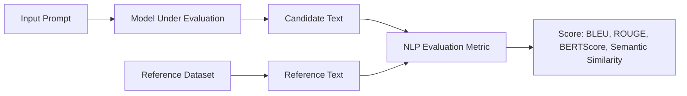
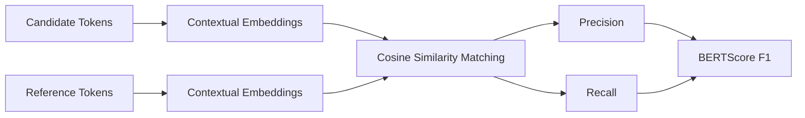
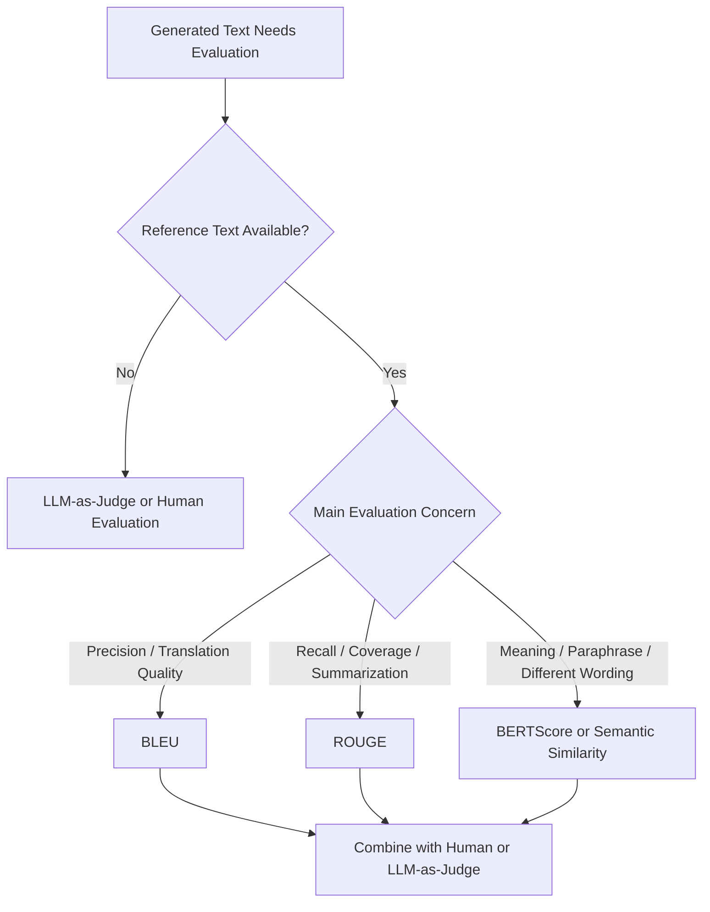
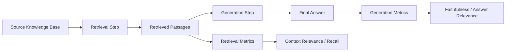

# Task 2.3: ML Model and Foundation Model (FM) Development - Analyze and evaluate the performance of ML and AI systems

## Skill 2.3.8: Apply natural language processing (NLP) evaluation metrics (for example, bilingual evaluation understudy [BLEU], Recall-Oriented Understudy for Gisting Evaluation [ROUGE], BERTScore, semantic similarity)

---

## 1. Why NLP Evaluation Is Different from Traditional ML Evaluation

Traditional classification and regression models often use a single evaluation number such as accuracy, precision, recall, F1, or RMSE. Text generation is different because there can be many correct outputs for the same input.

For example, both of these responses can be correct:

> **Reference:** "The model was trained on a GPU cluster."  
> **Candidate:** "A GPU cluster was used to train the model."

These two sentences have almost no shared n-grams, yet they mean the same thing. Exact-match accuracy would mark the candidate as wrong. NLP evaluation metrics therefore measure:

- **Lexical overlap:** How many words or n-grams are shared.
- **Semantic similarity:** Whether the meaning is similar, even if the wording differs.
- **Precision and recall:** Whether the generated text includes the right content and avoids irrelevant content.

For the AWS MLA-C02 exam, focus on:

| Metric | Primary Type | Main Use |
|---|---|---|
| **BLEU** | Precision-oriented lexical overlap | Machine translation |
| **ROUGE** | Recall-oriented lexical overlap | Summarization |
| **BERTScore** | Embedding-based semantic similarity | Translation, summarization, paraphrase-aware evaluation |
| **Semantic similarity** | Embedding/distance-based meaning comparison | Answer quality, retrieval relevance, paraphrase evaluation |

---

## 2. Reference-Based NLP Evaluation at a Glance

Reference-based NLP metrics compare a **candidate output** generated by the model with a **reference output**, usually written by a human or taken from a curated dataset.

### Key Terms

- **Precision:** Of the content the model generated, how much matches the reference?
- **Recall:** Of the important content in the reference, how much did the model include?
- **F1 Score:** Harmonic mean of precision and recall.
- **N-gram:** A contiguous sequence of N words, such as unigram, bigram, or trigram.
- **Candidate:** The generated text being evaluated.
- **Reference:** The human-created or ground-truth text.

---

## 3. BLEU: Bilingual Evaluation Understudy

### 3.1 Definition

BLEU was originally designed for **machine translation**. It measures how closely a candidate translation matches one or more human reference translations.

BLEU is primarily a **precision-oriented** metric. It asks:

> "How many of the n-grams in the model's output also appear in the reference?"

It uses two main components:

1. **Modified n-gram precision**  
   - Compares n-gram overlap between candidate and reference.
   - Prevents the model from receiving high scores by repeating a correct word too many times.
   - The count of each candidate n-gram is clipped to the maximum count in any single reference.

2. **Brevity penalty**  
   - Penalizes candidate outputs that are shorter than the reference.
   - Prevents a model from producing very short translations that contain only high-confidence words.

### 3.2 BLEU Characteristics

| Property | Detail |
|---|---|
| Focus | Precision of n-gram overlap |
| Penalizes | Overly short outputs via brevity penalty |
| Common range | 0 to 1, often reported as 0 to 100 |
| Best evaluated at | Corpus level, not single-sentence level |
| Best use case | Machine translation with reference translations |
| Weakness | Does not directly measure recall or semantic meaning |

### 3.3 When to Use BLEU

- Evaluating machine-translation quality against human translations.
- Automated evaluation jobs where you need a fast, reference-based metric.
- Comparing multiple translation models on a large test corpus.

### 3.4 Limitations of BLEU

- It is **not good at sentence-level evaluation**. BLEU scores can be unstable for single short sentences.
- It penalizes valid paraphrases.
- It does not measure factual accuracy.
- High BLEU does not guarantee fluency or grammatical correctness.
- It under-appreciates recall because it is precision-centric.

---

## 4. ROUGE: Recall-Oriented Understudy for Gisting Evaluation

### 4.1 Definition

ROUGE was originally developed for **summarization**. It measures how much of the reference content is covered by the candidate text.

ROUGE is primarily a **recall-oriented** metric. It asks:

> "How many of the important n-grams or sequences from the reference were captured in the generated text?"

### 4.2 Common ROUGE Variants

| Variant | What It Measures |
|---|---|
| **ROUGE-N** | Overlap of n-grams, such as ROUGE-1, ROUGE-2 |
| **ROUGE-L** | Longest common subsequence between candidate and reference |
| **ROUGE-S** | Skip-bigram overlap, allowing gaps between words |

### 4.3 ROUGE Characteristics

| Property | Detail |
|---|---|
| Focus | Recall of reference content |
| Best use case | Summarization, abstractive text generation |
| ROUGE-1 | Measures unigram overlap |
| ROUGE-2 | Measures bigram overlap, better captures fluency |
| ROUGE-L | Captures sentence-level structure and sequence ordering |
| Common use | Report ROUGE recall, precision, and F1 |

### 4.4 Limitations of ROUGE

- It is lexical, not semantic.
- A candidate can achieve high ROUGE by copying many reference words into a long, poorly written output.
- It may reward fluent-looking but factually wrong text if shared vocabulary is high.
- ROUGE results depend heavily on tokenization and language style.

---

## 5. BERTScore

### 5.1 Definition

BERTScore uses **contextual word embeddings** from models such as BERT to compare candidate and reference text. Instead of matching exact words or n-grams, it compares tokens in embedding space.

BERTScore computes:

- **Precision:** How well candidate tokens match reference tokens.
- **Recall:** How well reference tokens are matched by candidate tokens.
- **F1 Score:** Harmonic mean of precision and recall.

### 5.2 How BERTScore Works Conceptually

Each token in the candidate and reference is represented as a vector using a pretrained transformer model. For each candidate token, BERTScore finds the most similar reference token using cosine similarity. The same is done in the reverse direction for recall.

### 5.3 BERTScore Characteristics

| Property | Detail |
|---|---|
| Type | Embedding-based semantic similarity |
| Handles | Paraphrases, synonyms, word order changes |
| Produces | Precision, recall, F1 |
| Advantage over BLEU/ROUGE | Captures meaning rather than only exact token overlap |
| Weakness | Requires more computation; not as easily interpretable as n-gram overlap |

### 5.4 When to Use BERTScore

- When generated text uses different words but has the same meaning as the reference.
- When you need to evaluate paraphrase-level accuracy.
- When exact n-gram overlap is too strict.

---

## 6. Semantic Similarity

### 6.1 Definition

Semantic similarity measures how similar two pieces of text are in meaning. It typically uses:

- Sentence embeddings from models such as sentence transformers.
- Cosine similarity between the embedding vectors.

Cosine similarity measures the angle between two vectors:

- **1 or close to 1:** Very similar meaning.
- **0:** Unrelated.
- **Negative:** Opposite or unrelated in direction.

### 6.2 Common Uses in ML Evaluation

| Use Case | Example |
|---|---|
| Answer relevance | Compare a generated answer with the original question or reference answer. |
| Retrieval quality | Compare a query with retrieved passages. |
| Paraphrase detection | Determine whether two sentences mean the same thing. |
| RAG generation quality | Compare generated response with grounded context. |

### 6.3 Semantic Similarity vs BERTScore

| Aspect | Semantic Similarity | BERTScore |
|---|---|---|
| Granularity | Usually sentence-level or passage-level | Token-level, then aggregated |
| Output | One similarity score | Precision, recall, F1 |
| Interpretability | Intuitive cosine score | Less intuitive but more diagnostic |
| Typical use | Retrieval, clustering, answer similarity | Reference-based text generation evaluation |

---

## 7. Metric Selection Decision Flow

### Quick Metric Cheat Sheet

| If the task is... | Prioritize... | Why |
|---|---|---|
| Machine translation | BLEU | Precision-oriented n-gram overlap |
| Summarization | ROUGE | Recall of key content |
| Open-ended QA or paraphrasing | BERTScore / semantic similarity | Meaning can be correct with different wording |
| RAG retrieval | Context relevance / recall | Retrieval failure is separate from generation failure |
| RAG generation | Faithfulness / answer relevance | Checks whether generated answer is grounded in retrieved context |

---

## 8. AWS Service Context

### 8.1 Amazon Bedrock Evaluations

Amazon Bedrock supports multiple evaluation modes:

| Mode | Description |
|---|---|
| **Automatic evaluation** | Uses programmatic metrics such as BLEU, ROUGE-L, and METEOR against a prompt dataset with reference responses. |
| **LLM-as-a-Judge** | Uses a judge model to assess qualities such as helpfulness, correctness, faithfulness, relevance, and harmfulness. |
| **Human evaluation** | Uses human work teams to rate model outputs for subjective quality and safety. |

For the exam, associate:

- **BLEU/ROUGE/METEOR**: Programmatic automatic evaluation metrics.
- **BERTScore / semantic similarity**: Embedding-based evaluation, often implemented through custom pipelines or custom metrics.
- **LLM-as-a-Judge**: Evaluation when you need qualitative or fact-based judgments beyond n-gram overlap.

### 8.2 Amazon Bedrock RAG Evaluation

When evaluating a Retrieval-Augmented Generation application, split the evaluation:

- **Retrieval metrics** measure whether the right source passages were returned.
- **Generation metrics** measure whether the final answer is faithful to those retrieved passages.
- A fluent answer that omits source facts is often a **retrieval problem**, not necessarily a generation problem.

---

## 9. Scenario-Based Exam Examples

### Scenario 1

A machine learning team is evaluating an English-to-German translation model. The model sometimes produces very short translations that contain a few high-confidence words from the reference. The team wants a metric that penalizes unusually short outputs and primarily measures n-gram precision.

**Which metric should the team use?**

- **A.** ROUGE-L
- **B.** BLEU
- **C.** Semantic similarity
- **D.** Exact-match accuracy

**Answer:** **B. BLEU**

**Explanation:** BLEU is precision-oriented and includes a brevity penalty for outputs that are shorter than the reference. ROUGE is recall-oriented and would not directly address the short-output problem. Semantic similarity measures meaning but does not specifically enforce n-gram precision or penalize brevity.

---

### Scenario 2

A summarization model produces grammatically correct summaries but frequently omits important facts found in the source document. A data scientist needs an automated metric that most directly measures how much reference content was included.

**Which metric should be prioritized?**

- **A.** BLEU
- **B.** ROUGE
- **C.** Perplexity
- **D.** Token count

**Answer:** **B. ROUGE**

**Explanation:** ROUGE is recall-oriented and directly measures the overlap of reference content in the candidate summary. BLEU is precision-oriented and would not strongly penalize missing reference content. Perplexity and token count are not used to measure reference coverage.

---

### Scenario 3

A generative QA model produces the following candidate answer:

> **Reference:** "The model can be trained on GPUs."  
> **Candidate:** "GPUs are usable for training the model."

An n-gram overlap metric assigns a low score even though the answer is correct.

**Which metric would better recognize that the candidate and reference are semantically equivalent?**

- **A.** BLEU
- **B.** ROUGE-1
- **C.** BERTScore or semantic similarity
- **D.** Exact-match accuracy

**Answer:** **C. BERTScore or semantic similarity**

**Explanation:** BERTScore and semantic similarity use embeddings to compare meaning rather than exact word matches. They can recognize paraphrases and different word orders. BLEU, ROUGE, and exact-match accuracy rely on surface-level token overlap.

---

### Scenario 4

A team uses Amazon Bedrock evaluations to perform a fully automated, programmatic comparison of generated text against a curated reference dataset. The solution must not require human raters.

**Which metric type should the evaluation job use?**

- **A.** Only human evaluation
- **B.** Only LLM-as-a-Judge
- **C.** Programmatic metrics such as BLEU, ROUGE-L, or METEOR
- **D.** Shadow testing

**Answer:** **C. Programmatic metrics such as BLEU, ROUGE-L, or METEOR**

**Explanation:** Amazon Bedrock automatic evaluation can compute reference-based programmatic metrics without human involvement. LLM-as-a-Judge uses a model judge but is distinct from programmatic n-gram metrics. Shadow testing is for live production traffic comparison, not offline reference evaluation.

---

## 10. Exam Tips and Traps

### Tips

- Remember the core mapping:
  - **BLEU = Precision**
  - **ROUGE = Recall**
  - **BERTScore = Embedding similarity**
  - **Semantic similarity = Meaning**

- Use **BLEU** for machine translation.
- Use **ROUGE** for summarization coverage.
- Use **BERTScore** or **semantic similarity** when paraphrasing or different wording can still be correct.
- Combine overlap-based metrics with embedding-based metrics for stronger evaluation.
- In RAG systems, evaluate retrieval separately from generation.
- Amazon Bedrock programmatic evaluation uses reference-based metrics; Amazon Bedrock RAG evaluation separates retrieval quality from generation quality.

### Traps to Avoid

- **Do not assume BLEU is recall-oriented.** BLEU is precision-oriented. ROUGE is recall-oriented.
- **Do not use BLEU/ROUGE as truthfulness detectors.** They measure lexical similarity, not factual correctness.
- **Do not rely on BLEU for single-sentence quality.** BLEU is most stable at the corpus level.
- **Do not treat semantic similarity as a factual accuracy score.** Semantically similar text can still be factually wrong.
- **Do not assume high BLEU/ROUGE means the answer is fluent and useful.** A generated sentence can overlap heavily with a reference but still be awkward or incomplete.
- **Do not use exact-match accuracy for open-ended generation.** It fails to reward valid paraphrases.
- **Do not evaluate a RAG application only on the final answer.** A fluent answer may hide retrieval failures.

---

## 11. One-Line Memory Anchors

| Metric | One-Line Anchor |
|---|---|
| **BLEU** | Precision for translation |
| **ROUGE** | Recall for summarization |
| **BERTScore** | Contextual embedding F1 for text quality |
| **Semantic similarity** | Meaning over wording |

For the AWS MLA-C02 exam, always match the evaluation metric to the task type and the failure mode you are trying to detect.