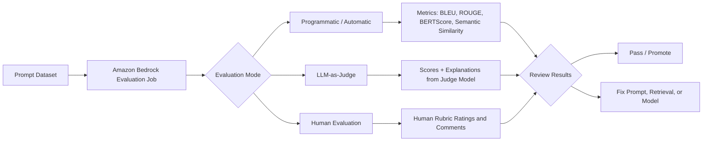
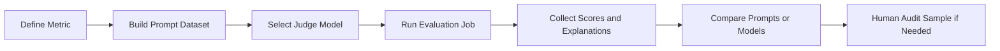
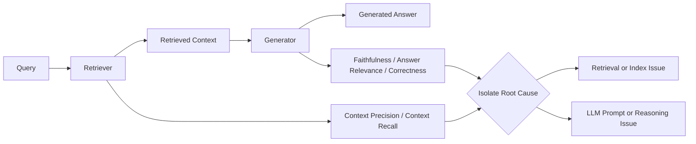

# Task 2.3: ML Model and Foundation Model (FM) Development - Analyze and evaluate the performance of ML and AI systems

## Skill 2.3.9: Perform AI evaluation (for example, model output assessment, content quality validation, bias detection, LLM-as-a-judge frameworks)

---

## 1. Skill Overview

AI evaluation goes beyond traditional accuracy. For foundation models and generative AI, there is often no single correct answer. A response can be correct in many different wordings, may contain harmful or biased content, or may be fluent but factually wrong.

This skill covers:

- Assessing model outputs for quality, relevance, correctness, and safety.
- Validating content quality using automated, human, or judge-based evaluation.
- Detecting bias in model outputs and evaluation processes.
- Using LLM-as-a-judge frameworks to evaluate other models.

AWS services most relevant to this skill:

| AWS Service | Role in AI Evaluation |
| --- | --- |
| **Amazon Bedrock Evaluations** | Runs automatic, LLM-as-a-judge, and human evaluation jobs. |
| **Amazon Bedrock Guardrails** | Enforces content safety, denied topics, and sensitive information filtering. |
| **Amazon SageMaker Clarify** | Detects bias, toxicity, and provides model explainability. |
| **Amazon Bedrock Knowledge Bases** | Supplies retrieved context for RAG evaluation. |
| **Amazon Bedrock Prompt Management** | Versions prompts so evaluations compare the same prompt variants. |
| **Amazon CloudWatch** | Tracks evaluation metrics and operational quality over time. |
| **Amazon SageMaker AI Shadow Tests** | Compares a candidate variant against production using live traffic copies. |

---

## 2. Traditional ML Evaluation vs. GenAI Evaluation

Traditional ML and generative AI are evaluated differently.

| Dimension | Traditional ML | Generative AI / FM |
| --- | --- | --- |
| Ground truth | Usually one correct label | Multiple valid responses possible |
| Common metrics | Accuracy, precision, recall, F1, RMSE, AUC | BLEU, ROUGE, BERTScore, semantic similarity, LLM-as-judge |
| Explainability need | Feature importance, SHAP | Source attribution, retrieved context grounding |
| Quality focus | Correct class or value | Correctness, faithfulness, relevance, safety, tone |
| Evaluation style | Mostly programmatic | Mix of programmatic, judge-based, and human |

A single numeric score is rarely sufficient for generative AI. For example, a correct answer can be phrased many ways, so exact-match accuracy would incorrectly penalize valid outputs.

---

## 3. Core Dimensions of Model Output Assessment

When evaluating an AI or FM output, assess multiple quality dimensions.

| Dimension | What It Measures | Example Question |
| --- | --- | --- |
| **Correctness** | Factual accuracy | Does the answer state verified facts correctly? |
| **Faithfulness / Grounding** | Support by provided context | Is every claim supported by retrieved text or source? |
| **Relevance** | Answer matches the user request | Does the answer address the actual question? |
| **Completeness** | All required parts covered | Did it include all necessary details? |
| **Helpfulness** | Useful and actionable | Does the answer help the user accomplish their goal? |
| **Coherence** | Logical and well structured | Is the answer clear and readable? |
| **Safety / Harmlessness** | No toxic or unsafe content | Does it avoid harmful instructions or hate speech? |
| **Bias / Fairness** | No discriminatory or stereotypical content | Does it treat groups equitably? |
| **Tone / Style** | Appropriate voice | Is it professional, empathetic, or on-brand? |

These dimensions should be measured separately. A response can be helpful but unfaithful, or relevant but biased.

---

## 4. AWS Evaluation Modes

Amazon Bedrock Evaluations supports three main evaluation modes.

### 4.1 Programmatic Evaluation

Programmatic evaluation uses automated metrics to compare model output against reference text.

| Metric | Type | Best Used For | Limitation |
| --- | --- | --- | --- |
| **BLEU** | N-gram precision | Machine translation | Misses valid paraphrases |
| **ROUGE** | N-gram recall | Summarization | Weak for open-ended text |
| **BERTScore** | Token embedding similarity | Semantic similarity between texts | Depends on embedding model |
| **Semantic Similarity** | Vector similarity | Meaning comparison | May miss factual errors |

These are useful for objective, reference-based evaluation but are not enough for generative AI quality.

### 4.2 LLM-as-a-Judge

LLM-as-a-judge uses a strong foundation model to evaluate the output of another model.

Common LLM-as-a-judge patterns:

| Pattern | Description | Example Use |
| --- | --- | --- |
| **Single-score evaluation** | Judge gives a numeric rating per metric | Rate correctness from 1–5 |
| **Rubric-based evaluation** | Judge uses a defined rubric | Score tone, clarity, completeness |
| **Pairwise comparison** | Judge chooses the better of two outputs | Compare two models on the same prompt |
| **Explanation plus score** | Judge returns a score and reasoning | Audit why a response was rated low |

AWS implementation: Amazon Bedrock Evaluations automatically provides LLM-as-a-judge evaluation jobs, including built-in metrics such as helpfulness, correctness, faithfulness, relevance, and harmfulness.

### 4.3 Human Evaluation

Human evaluation uses workers, employees, or subject matter experts to rate responses.

Use human evaluation when:

- The task requires nuanced judgment.
- The output has safety, legal, or regulatory consequences.
- Automated metrics cannot capture the desired quality.
- The team needs final human approval before launch.

In Amazon Bedrock Evaluations, human evaluation jobs require a worker template and a work team. The prompts and responses must be displayed in a browser-facing UI for raters.

Important exam distinction:

| Evaluation Type | Browser Facing UI Required? |
| --- | --- |
| Automatic / programmatic | No |
| LLM-as-judge automatic | No |
| Human evaluation | Yes, so raters can view prompts and responses |

---

## 5. Content Quality Validation

Content quality validation ensures the generated output meets content standards for correctness, safety, tone, and compliance.

### 5.1 Validation Approaches

| Approach | Description | Use Case |
| --- | --- | --- |
| **Automated metrics** | Programmatic scoring using reference text or embeddings | Rapid, large-scale evaluation |
| **LLM-as-judge rubric** | Judge model scores against a custom rubric | Subjective but scalable assessment |
| **Human review** | SMEs or employees rate content | High-stakes, nuance, regulatory |
| **Guardrails** | Automated filters for toxicity, PII, denied topics | Operational content safety |

### 5.2 Content Quality Dimensions

| Quality Attribute | Validation Check |
| --- | --- |
| **Factual accuracy** | Does the response contain verified facts? |
| **Grounding** | Is the response supported by retrieval context? |
| **Safety** | Does it contain hate speech, violence, or harmful instructions? |
| **Privacy** | Does it expose PII or sensitive data? |
| **Tone** | Does it use the required professional or brand voice? |
| **Readability** | Is the structure clear and comprehensible? |

Amazon Bedrock Guardrails can help validate and enforce content quality by blocking or filtering:

- Harmful content
- Denied topics
- Sensitive information
- Prompt injection attempts

However, Guardrails should be used alongside evaluation, not as a replacement for scoring response quality.

---

## 6. Bias Detection

Bias detection evaluates whether the model produces disproportionately harmful, stereotypical, or unfair outputs.

### 6.1 Sources of Bias in AI Systems

| Source | Description |
| --- | --- |
| **Training data bias** | Underrepresentation or overrepresentation of groups |
| **Prompt bias** | Sensitive demographic terms or leading language |
| **Model output bias** | Stereotypes, toxicity, unfair treatment of groups |
| **Retrieval bias** | Source documents that are not representative |
| **Evaluation bias** | Judge model or human raters prefer a particular style |

### 6.2 AWS Tools for Bias Detection

| Tool | Bias Detection Use |
| --- | --- |
| **Amazon SageMaker Clarify** | Pre-training and post-training bias metrics, explainability, toxicity insights |
| **Amazon Bedrock Evaluations** | Automated harmfulness and bias-related evaluation dimensions |
| **Amazon Bedrock Guardrails** | Blocks harmful and biased content in production |
| **Human review** | Detects nuanced social or cultural bias |

### 6.3 Best Practice

Bias detection should not be a one-time check. You should:

- Evaluate outputs across different demographic terms.
- Slice metrics by group where possible.
- Use human reviewers with diverse backgrounds.
- Combine automated toxicity detection with human judgment.
- Monitor live outputs over time using CloudWatch metrics and alarms.

---

## 7. LLM-as-a-Judge Frameworks in Detail

An LLM-as-a-judge framework uses an evaluator model to assess another model. It is common in Amazon Bedrock Evaluations.

### 7.1 Evaluation Flow

### 7.2 Best Practices for LLM-as-a-Judge

| Practice | Reason |
| --- | --- |
| Use clear metric definitions | Vague definitions create inconsistent scores |
| Provide a rubric with score levels | Helps judge model assign meaningful ratings |
| Use the same judge model for all comparisons | Avoids judge model performance differences |
| Use low temperature where possible | Improves evaluation consistency |
| Include reference answers when available | Grounds the judge |
| Ask for score plus explanation | Provides auditability |
| Randomize answer order in pairwise comparisons | Reduces position bias |

### 7.3 Common LLM-as-a-Judge Pitfalls

| Pitfall | Mitigation |
| --- | --- |
| **Position bias** | Preferring the first answer | Randomize order or evaluate both orders |
| **Verbosity bias** | Preferring longer answers | Instruct judge to prefer concise, relevant answers |
| **Self-preference** | Judge favors its own model family | Use an independent judge model |
| **Judge hallucination** | Judge provides inaccurate explanation | Use multiple metrics and human spot checks |
| **Overconfidence** | Treating judge scores as exact truth | Validate with human evaluation |

An LLM judge is not ground truth. It is a scalable, useful signal, but it should be correlated with human review.

---

## 8. Evaluating RAG Systems Separately

For retrieval-augmented generation (RAG), evaluate retrieval and generation separately. A fluent answer that omits facts is often a retrieval failure wearing a generation costume.

### 8.1 RAG Evaluation Metrics

| Layer | Metric | What It Measures |
| --- | --- | --- |
| **Retrieval** | Context relevance | Are retrieved chunks relevant to the query? |
| **Retrieval** | Context recall / coverage | Are all required facts present in retrieved chunks? |
| **Generation** | Faithfulness | Is the answer grounded in retrieved context? |
| **Generation** | Answer relevance | Does the generated answer directly address the query? |
| **Generation** | Answer correctness | Is the answer factually correct? |

AWS implementation: Amazon Bedrock Evaluations supports RAG evaluation jobs that measure retrieval accuracy separately from generation quality using Amazon Bedrock Knowledge Bases.

---

## 9. Choosing the Right Evaluation Approach

| Requirement | Recommended Approach |
| --- | --- |
| Compare candidate vs production using live traffic | Amazon SageMaker AI shadow tests |
| Evaluate generated answer against reference text | Programmatic metrics: BLEU, ROUGE, BERTScore |
| Evaluate subjective content quality at scale | LLM-as-a-judge with rubric |
| Evaluate high-risk or regulatory content | Human evaluation |
| Detect bias and explain model decisions | Amazon SageMaker Clarify |
| Validate retrieval and generation separately | Amazon Bedrock Evaluations RAG evaluation |
| Block toxic content or PII in production | Amazon Bedrock Guardrails |
| Track prompt versions for fair comparisons | Amazon Bedrock Prompt Management |

---

## 10. Scenario-Based Examples

### Scenario 1: Fluent RAG Answers That Omit Facts

A RAG chatbot returns fluent answers but frequently omits facts that are present in the source documents.

**Question:** How should the team isolate the cause?

**Answer:** Measure retrieval separately from generation. Evaluate context recall and context relevance for the retriever. Evaluate faithfulness and answer relevance for the generator.

- If retrieval metrics are low, the issue is chunking, embeddings, or vector search.
- If retrieval metrics are high but faithfulness is low, the LLM is ignoring context.

This isolates whether the problem is retrieval or generation.

---

### Scenario 2: Evaluating Subjective Brand Tone

A company is building a customer-facing assistant and must ensure responses are polite, on-brand, and safe.

**Question:** Which evaluation mode is most appropriate for a custom tone and safety rubric?

**Answer:** LLM-as-a-judge for scalable custom rubric scoring, supplemented by human review for high-risk or ambiguous cases. Amazon Bedrock Evaluations can use a judge model to score responses against custom metric definitions.

If the content is high-risk or regulatory, use a human evaluation job with a work team.

---

### Scenario 3: Comparing Two Foundation Models

A team wants to choose between two foundation models for a summarization use case.

**Question:** What is the best automated evaluation strategy?

**Answer:** Use pairwise LLM-as-a-judge evaluation on the same prompt dataset. Define metrics such as correctness, faithfulness, relevance, and coherence. Randomize response order to reduce position bias. Validate the automated judge results with a human sample before final selection.

---

### Scenario 4: High BLEU but Offensive Outputs

A model scores well on BLEU and ROUGE, but users report offensive completions.

**Question:** What should the team add to its evaluation pipeline?

**Answer:** Add bias and toxicity evaluation. Use Amazon SageMaker Clarify for bias and toxicity insights. Use Amazon Bedrock automatic evaluation for harmfulness. Use Amazon Bedrock Guardrails to block harmful content in production. Add human adversarial testing for sensitive prompts.

High lexical overlap scores do not guarantee safe or unbiased outputs.

---

## 11. Exam Tips and Traps

### 11.1 Exam Tips

| Tip | Explanation |
| --- | --- |
| Use multiple evaluation signals | Single metrics like BLEU or accuracy are weak for GenAI |
| Separate RAG retrieval from generation | Isolates root cause of omissions or wrong answers |
| Use LLM-as-a-judge for subjective but scalable evaluation | Best for custom quality rubrics at scale |
| Use human evaluation for high-stakes or nuanced cases | Includes safety, legal, and regulatory review |
| Treat judge scores as a signal, not ground truth | Validate with human spot checks |
| Use Amazon Bedrock Evaluations for automatic, judge-based, and human jobs | One service covers three modes |
| Use Amazon SageMaker Clarify for bias and explainability | Bias detection is a separate requirement |

### 11.2 Common Exam Traps

| Trap | Correct Understanding |
| --- | --- |
| Assuming high BLEU/ROUGE means high quality | These measures overlap only; they miss meaning, safety, and bias |
| Choosing human evaluation for every routine evaluation | It is costly and slow; use automatic or judge-based first |
| Evaluating only the final RAG answer | You cannot tell whether retrieval or generation failed |
| Treating LLM judge output as perfect | LLM judges can hallucinate or show position/verbosity bias |
| Confusing shadow testing with output evaluation | Shadow testing compares live variants; it does not score output quality |
| Confusing Prompt Management with evaluation | Prompt Management versions prompts; it does not judge outputs |
| Assuming automatic evaluation needs a browser UI | Only human evaluation jobs need a worker-facing UI |
| Using different prompt datasets for candidate comparisons | Results are not comparable unless dataset and metrics are fixed |

---

## 12. Summary

AI evaluation for foundation models requires a multi-dimensional approach. Use programmatic metrics for reference-based scoring, LLM-as-a-judge for scalable subjective quality, and human evaluation for high-stakes judgment. Always evaluate content quality, bias, and RAG retrieval separately. Amazon Bedrock Evaluations, Amazon SageMaker Clarify, Amazon Bedrock Guardrails, and Amazon Bedrock Knowledge Bases form the core AWS toolkit for this skill.