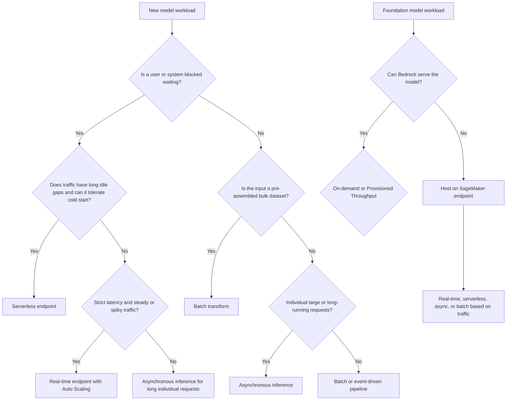

# Task 3.1: Deployment and Orchestration of ML and AI Workflows - Manage deployment infrastructure for ML and AI model types

## Skill 3.1.1: Select appropriate compute environments and deployment targets

### Purpose

Selecting the right compute environment and deployment target is the first and most consequential infrastructure decision in an ML or AI workload. The workload’s requirements—who is waiting for the result, how quickly the answer must return, how large each request is, how traffic arrives, and how much operational control the team needs—point to a specific hosting option.

In the AWS MLA-C02 exam, this skill tests whether you can separate managed hosting from self-managed compute, choose among synchronous and asynchronous inference options, and place foundation models on the right API-based or endpoint-based target.

---

## 1. Compute environments and deployment targets at a glance

| Compute environment / deployment target | What it does | Best fit | Main limitations |
|---|---|---|---|
| **Amazon SageMaker AI real-time endpoint** | Managed endpoint with persistent instances for synchronous inference over HTTP | Interactive workloads with strict latency budgets and steady or spiky-but-continuous traffic | You manage instance types and scaling; idle instances still cost money unless scaled in |
| **Amazon SageMaker AI serverless endpoint** | On-demand compute that scales to zero between requests | Intermittent traffic with long idle periods; small or unpredictable workloads | Cold starts after idle periods; no GPUs, no VPC, no multi-model hosting |
| **Amazon SageMaker AI asynchronous endpoint** | Queued inference for large payloads or long-running single requests | Individual requests that take minutes or have payloads too large for real-time | Caller is not blocked, but response is not immediate |
| **Amazon SageMaker AI batch transform** | Bulk offline inference over an existing dataset in Amazon S3 | Pre-assembled datasets, scheduled jobs, no live caller | Cannot serve dynamic requests; not for real-time use |
| **Amazon SageMaker AI multi-model endpoint** | Many models shared behind one endpoint and one serving container | Large fleets of small models using the same framework | Infrequently used models may incur a load penalty on first call |
| **Amazon SageMaker AI multi-container endpoint** | Up to 15 containers behind one endpoint | Inference pipelines or multiple models with differing containers | Not ideal for hundreds of small models sharing one framework |
| **Amazon Bedrock** | API-based access to hosted foundation models | Generative AI workloads that should use a managed FM API instead of self-hosted endpoints | Limited to supported foundation models and serverless model capacity |
| **Amazon Bedrock Custom Model Import** | Imports supported open-weight models customized outside AWS into Bedrock | Bringing fine-tuned Llama, Mistral, or similar models into a managed API | Only supported architectures and file layouts |
| **Amazon ECS** | AWS-managed container orchestration for long-running services or scheduled tasks | Teams that want containers without running Kubernetes themselves | More operational ownership than SageMaker managed hosting |
| **Amazon EKS** | Managed Kubernetes control plane | Teams already standardized on Kubernetes manifests, controllers, and tooling | Most operational complexity among managed options |
| **AWS Lambda** | Event-driven serverless compute | Lightweight inference, glue logic, invoking endpoints, reacting to pipeline events | Limited runtime, memory, and payload; not suitable for large models |
| **Amazon EC2** | Directly operated virtual machines | Workloads needing full control over instance, storage, networking, or custom acceleration | Maximum operational responsibility |

The core distinction is whether AWS manages the model hosting for you, or whether you provide and operate the compute environment yourself.

---

## 2. Decision framework for compute environments

Use these questions in order:

1. **Who is waiting for the answer?**
   - A user or downstream system is blocked mid-transaction → synchronous/low-latency options.
   - No one is waiting → batch or asynchronous options.

2. **How quickly do they need it?**
   - Milliseconds-to-seconds → real-time endpoint or Bedrock API.
   - Minutes or hours → asynchronous inference or batch transform.

3. **How does the work arrive?**
   - Dynamic individual requests → an endpoint of some kind.
   - A static dataset already assembled in Amazon S3 → batch transform.

4. **How large is each unit of work?**
   - Small payloads and short processing → real-time or serverless.
   - Large payloads or long processing → asynchronous.

5. **Is this a foundation model workload?**
   - Managed API desired → Amazon Bedrock.
   - Custom model with specialized inference code or custom containers → SageMaker endpoints.

6. **How much infrastructure control does the team need?**
   - Minimal management → SageMaker serverless, Bedrock, or Lambda.
   - Specific containers, Kubernetes, networking, or custom hardware → ECS, EKS, or EC2.

---

## 3. SageMaker AI inference options

Amazon SageMaker AI presents four inference strategies that map to different workload shapes.

| Signal | Real-time endpoint | Serverless endpoint | Asynchronous inference | Batch transform |
|---|---|---|---|---|
| Caller blocked? | Yes | Yes | No | No |
| Latency expectation | Milliseconds to seconds | Milliseconds to seconds, but possible cold start | Minutes to hours | Scheduled completion |
| Request arrival | Dynamic, continuous | Dynamic, intermittent | Dynamic, isolated large requests | Bulk dataset in S3 |
| Payload / duration | Small payload, under 60 seconds | Small payload, under 60 seconds | Up to ~1 GB and up to ~15–60 minutes | Large dataset, no per-request timeout |
| Scales to zero? | Yes with inference components and scaling policy | Yes automatically | Yes automatically | No endpoint; compute shuts down after job |
| Cold start risk | If scale-to-zero is configured | Yes after idle periods | Not critical because request is queued | Not applicable |
| Typical use case | Fraud detection, real-time personalization | Prototypes, intermittent internal apps | Large document processing, medical image analysis | Nightly scoring, backfills, large batch predictions |

### Real-time endpoint

A real-time endpoint keeps instances warm and available to answer synchronous requests. Use it when:

- The caller is actively waiting for the prediction.
- Latency must be predictable, with no cold start from idle.
- Traffic is steady enough to justify running instances continuously.
- You can use Auto Scaling to protect latency during spikes.

### Serverless endpoint

A serverless endpoint removes instance management and scales down to zero when idle. Use it when:

- Traffic has real idle gaps.
- You can tolerate a cold start after an idle period.
- You do not need GPUs, VPC configuration, or multi-model hosting.

Serverless is not the same as "always responsive." A request arriving after an idle stretch may encounter provisioning latency unless you keep the endpoint warm with provisioned concurrency.

### Asynchronous inference

Asynchronous inference is for individual requests that are queued rather than answered inline. The service returns an acknowledgment, processes the request after queueing it, and writes results to Amazon S3. Use it when:

- Nobody is blocked waiting for an immediate HTTP response.
- Each request is large or takes minutes to process.
- You want the endpoint to scale to zero when the queue is empty.

### Batch transform

Batch transform processes a pre-assembled dataset in Amazon S3. It provisions compute, runs inference over the data, writes predictions back to S3, and shuts down. Use it when:

- The input dataset already exists and arrives in bulk.
- There is no live caller.
- Inference can run on a schedule or within a completion deadline.

---

## 4. Foundation model deployment targets

For generative AI and foundation models, the main decision is between:

- A fully managed API that serves the model for you.
- A SageMaker endpoint that you size and operate yourself.

### Amazon Bedrock

Amazon Bedrock exposes foundation models through an API, so there is no endpoint or instance to size. Capacity is either:

- **On-Demand**: Pay per token or invocation; best for variable or exploratory traffic.
- **Provisioned Throughput**: Reserve a set level of model units for stable, high-throughput production workloads.

Use Bedrock when:

- A supported base foundation model fits the requirement.
- The team wants no model server operations.
- API-based invocation, latency, and managed scaling are sufficient.

### Amazon Bedrock Custom Model Import

Custom Model Import brings a customized open-weight model from Amazon S3 into Amazon Bedrock if it uses a supported architecture. Use it when:

- The model was fine-tuned or adapted outside AWS or in your own environment.
- You want to serve it through the same managed Bedrock invocation API.
- You do not want to operate an endpoint.

Important distinction:

- Models customized inside Amazon Bedrock are typically served through **Provisioned Throughput**.
- Models brought in through **Custom Model Import** can be invoked on demand, subject to supported architectures.

### SageMaker AI for foundation models

Use a SageMaker endpoint instead of Bedrock when:

- The model is not supported by Bedrock.
- You need a custom inference container, custom preprocessing, or specialized model serving logic.
- You require specific accelerators, instance types, VPC placement, or endpoint configurations.
- You have specialized scaling, multi-model, or traffic-shaping requirements.

---

## 5. Selecting general compute environments

Managed ML hosting is not always the correct answer. Some workloads need container services or directly operated compute.

| Target | Choose when |
|---|---|
| **Lambda** | Lightweight inference, event-driven glue, invoking SageMaker endpoints, API request routing, small custom logic. Not for large models or long-running inference. |
| **ECS** | The team wants containers but not Kubernetes. The model runs as a long-lived service behind a load balancer or as scheduled tasks. |
| **EKS** | The organization already uses Kubernetes. The model must be governed by Kubernetes manifests, controllers, and GitOps workflows. |
| **EC2** | You need full instance-level control: custom networking, local storage, custom accelerators, legacy dependencies, or special compliance requirements. |
| **SageMaker managed hosting** | You want AWS to manage model serving, health checks, scaling, and deployment updates for you. |

In general:

- Choose managed SageMaker hosting when the model fits its supported inference patterns.
- Choose ECS/EKS/EC2 when the workload needs operational control that managed hosting does not expose.
- Choose Lambda for lightweight event-driven tasks, not for heavyweight model inference.

---

## 6. Endpoint packing decisions as deployment targets

When hosting multiple models on SageMaker, the endpoint shape is itself a deployment-target decision.

| Endpoint shape | Assumption | Best fit | Limitation |
|---|---|---|---|
| **Single-model endpoint** | One model, one dedicated fleet | High-throughput or low-latency model with strict isolation needs | Can be expensive for many small models |
| **Multi-model endpoint** | Many models share one serving container and fleet | Many small models using the same framework with uneven traffic | Cold load penalty for rarely used models; shared fleet limits |
| **Multi-container endpoint** | Different containers can run behind one endpoint | Inference pipelines or up to 15 models with different containers | Does not solve large fleets of same-framework models |

A model with much higher throughput or a much tighter latency requirement than its neighbors should usually get its own endpoint, because sharing a fleet means sharing its capacity limits.

---

## 7. Decision flow

---

## 8. Scenario-based exam examples

### Scenario 1: Real-time fraud scoring with spiky traffic

**Situation:** A payments company scores every transaction while the customer waits. Traffic spikes sharply during promotions, and the latency budget is strict.

**Correct selection:** A real-time SageMaker endpoint with an Auto Scaling policy based on an invocation metric.

**Why not serverless?** Payment transactions cannot tolerate a cold start after an idle period. Serverless is for intermittent workloads with idle gaps, not for continuous low-latency traffic.

**Why not asynchronous?** The customer is blocked waiting for an immediate response. Queuing would introduce unacceptable delay.

**Why not batch?** Transactions arrive dynamically and must be scored one at a time, not as an overnight static dataset.

---

### Scenario 2: Overnight bulk document processing

**Situation:** An insurance company receives millions of scanned claim documents each night. Results are due by morning. Files arrive in bulk.

**Correct selection:** SageMaker batch transform.

**Why not real-time?** No one is waiting for each prediction; the entire dataset is already assembled.

**Why not asynchronous?** Asynchronous inference is for individual incoming requests, not a bulk dataset that arrives on a schedule.

**Cost benefit:** Batch transform starts compute on demand, processes the data, writes results to S3, and releases resources. The company does not pay for an idle endpoint between nights.

---

### Scenario 3: Long-running individual requests

**Situation:** During the day, single claims arrive one at a time. Each claim takes several minutes to process. No user is blocked waiting.

**Correct selection:** SageMaker asynchronous inference.

**Why not real-time?** Real-time endpoints have a 60-second timeout. Several minutes of processing would fail or time out.

**Why not batch?** Batch transform expects a pre-assembled static dataset, not individual requests arriving dynamically through the day.

**Why not serverless?** Serverless is synchronous and also has a 60-second processing limit.

---

### Scenario 4: External customized foundation model

**Situation:** A team customized an open-weight foundation model in its own training environment and now wants to serve it through an API without operating an endpoint.

**Correct selection:** Amazon Bedrock Custom Model Import.

**Why not SageMaker endpoint?** SageMaker hosting requires the team to operate and manage endpoint infrastructure.

**Why not Provisioned Throughput on a base model?** Provisioned Throughput reserves capacity for a base or Bedrock-customized model, but it does not import externally customized weights.

---

### Scenario 5: Large portfolio of same-framework models

**Situation:** A team hosts many small models that all use the same framework. A few models receive constant traffic, while the rest are called rarely.

**Correct selection:** A SageMaker multi-model endpoint.

**Why?** A multi-model endpoint shares one serving container and fleet, keeps frequently used models in memory, and dynamically loads rarely used models from S3 when requested.

**Trade-off:** Rarely used models may incur an occasional load penalty on first invocation. This is acceptable when cost is a bigger concern than occasional cold load latency.

---

### Scenario 6: Kubernetes-native organization

**Situation:** A company already standardizes on Kubernetes for deployment, observability, and rollout. The team must deploy a custom model container.

**Correct selection:** Amazon EKS.

**Why not SageMaker?** SageMaker managed hosting is powerful, but this organization’s control plane already lives in Kubernetes. Using EKS preserves existing deployment patterns.

**Why not serverless?** A large custom model may not fit Lambda’s resource limits.

---

## 9. Exam tips and traps

### Tips

- Always ask **who is waiting for the answer** before selecting an inference option. This is the single most useful differentiator.
- If the scenario says “nobody is waiting,” eliminate real-time and serverless first unless there is another synchronous requirement.
- “Traffic is spiky” alone does not mean serverless. Spiky but continuous traffic with a strict latency budget usually points to **real-time with Auto Scaling**.
- Serverless is for **intermittent traffic with real idle gaps** and acceptable cold starts.
- Batch is for **already assembled datasets**. If requests arrive one at a time, batch is usually wrong.
- Asynchronous inference is for **large or long-running individual requests**. It queues work and writes output to Amazon S3.
- For foundation models, prefer **Amazon Bedrock** when a supported model and managed API fit the requirement.
- For a model customized outside Bedrock, consider **Custom Model Import** if it uses a supported open-weight architecture.
- If the scenario mentions VPC configuration, GPUs, multi-model hosting, or special accelerators, serverless endpoints are ruled out.
- Multi-model endpoints assume a **shared framework or serving container**. Multi-container endpoints assume **different containers**.

### Traps

- Do not choose batch transform for individual requests arriving dynamically.
- Do not choose real-time inference for processing that takes several minutes.
- Do not choose serverless just because traffic is variable. If latency cannot absorb cold starts, use real-time with Auto Scaling.
- Do not assume Bedrock is always the answer for foundation models. If the model is unsupported, requires custom inference code, or needs custom network/hardware control, use SageMaker or a container target.
- Do not confuse **multi-model endpoints** with **multi-container endpoints**. The former shares one container across many models; the latter hosts different containers behind one endpoint.
- Do not choose EC2 or EKS when the requirement emphasizes minimal operational overhead and managed hosting. That signals SageMaker managed endpoints, serverless, or Bedrock.
- Do not confuse scale-to-zero behavior:
  - Serverless and asynchronous endpoints can scale to zero automatically.
  - Real-time endpoints can scale to zero only when configured through inference components and a scale-out policy; traffic during full scale-in can be rejected.

---

## 10. Quick recall

- **Real-time endpoint:** Caller blocked, strict latency, steady or spiky traffic, Auto Scaling.
- **Serverless endpoint:** Caller blocked, intermittent traffic, idle gaps, cold starts acceptable.
- **Asynchronous inference:** Caller not blocked, large payload or long processing time, queued requests.
- **Batch transform:** No caller, bulk dataset in S3, scheduled job.
- **Amazon Bedrock:** Managed FM API; on-demand or Provisioned Throughput.
- **Bedrock Custom Model Import:** External open-weight customized model served through Bedrock API.
- **ECS/EKS/EC2:** When managed hosting does not provide needed control or the organization standardizes on containers/Kubernetes.
- **Lambda:** Lightweight inference or event-driven glue, not large model hosting.
- **Multi-model endpoint:** Many same-framework models sharing one container and fleet.
- **Multi-container endpoint:** Different containers behind one endpoint, used for pipelines or direct container invocation.