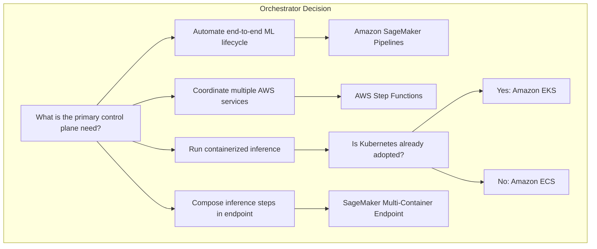
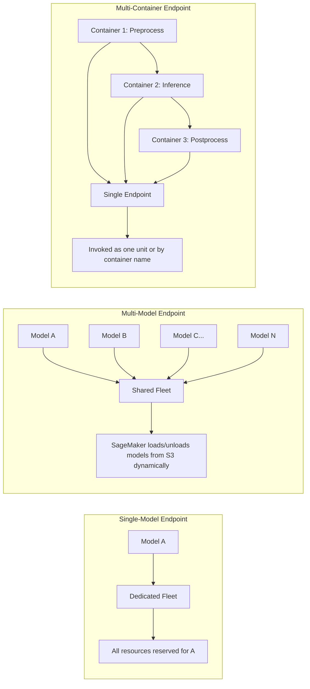
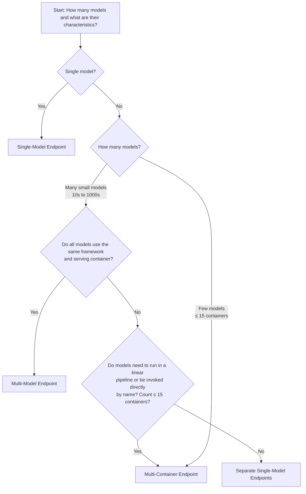

# Task 3.1: Deployment and Orchestration of ML and AI Workflows - Manage Deployment Infrastructure

## Skill 3.1.2: Select Deployment Orchestrators and Multi-Model or Multi-Container Deployment Strategies

---

## Table of Contents
1. [Overview](#overview)
2. [Deployment Orchestrators Explained](#deployment-orchestrators-explained)
3. [Endpoint Types: Single vs. Multi-Model vs. Multi-Container](#endpoint-types)
4. [Decision Frameworks](#decision-frameworks)
5. [Exam-Style Scenarios](#exam-style-scenarios)
6. [Exam Tips and Traps](#exam-tips-and-traps)
7. [Quick Reference Summary](#quick-reference-summary)

---

## Overview

This skill evaluates your ability to:

- **Identify the right deployment orchestrator** for ML workflows based on organizational context, existing infrastructure, and workflow complexity.
- **Choose between endpoint architecture patterns**: single-model endpoints (SME), multi-model endpoints (MME), and multi-container endpoints (MCE).
- **Decide how multiple models should share infrastructure** — or whether they should share at all — based on traffic patterns, framework compatibility, latency requirements, and cost constraints.

---

## Deployment Orchestrators Explained

A **deployment orchestrator** is the control plane that manages the lifecycle of ML workloads: scheduling, sequencing, scaling, and coordinating deployments across multiple components.

### Orchestrator Comparison Table

| Orchestrator | Service Type | Best Fit | Key Characteristics |
| --- | --- | --- | --- |
| **Amazon SageMaker Pipelines** | Managed ML pipeline service | End-to-end ML workflows (training → evaluation → registration → deployment) | Native integration with SageMaker; purpose-built for ML; supports conditional steps, lineage tracking |
| **AWS Step Functions** | Serverless general-purpose workflow orchestration | Multi-service workflows spanning Lambda, ECS, Batch, SageMaker | Visual workflow builder; state machine semantics; error handling and retry logic; supports long-running workflows |
| **Amazon ECS Scheduler** | Container orchestration | Teams running containerized inference as long-lived services or scheduled tasks | Simpler than Kubernetes; AWS-native; integrates with Fargate or EC2 |
| **Amazon EKS (Kubernetes)** | Managed Kubernetes control plane | Teams already standardized on Kubernetes manifests, controllers, and Helm charts | Full Kubernetes ecosystem; portability across environments; complex but familiar to platform teams |
| **SageMaker Inference Pipeline** | Purpose-built inference composition | Deploying a **linear chain of containers** that process data in sequence (preprocessing → prediction → postprocessing) | Not a general orchestrator; works only for deployed inference endpoints; manages traffic flow between up to 15 containers |

### How to Read the Orchestration Requirement

The exam typically signals which orchestrator applies through **organizational context clues** rather than technical feature checklists:

| Context Clue | Likely Orchestrator |
| --- | --- |
| "Team already uses Kubernetes manifests and Helm" | **Amazon EKS** |
| "The ML workflow spans multiple AWS services with branching logic and retries" | **AWS Step Functions** |
| "End-to-end ML workflow with training, evaluation, and deployment in one automated flow" | **Amazon SageMaker Pipelines** |
| "Simple containerized inference service the team wants to operate without Kubernetes overhead" | **Amazon ECS** |
| "Preprocessing and inference must run as a single deployed endpoint with a linear flow" | **SageMaker Inference Pipeline (multi-container endpoint)** |

---

## Endpoint Types: Single vs. Multi-Model vs. Multi-Container

### The Core Question: How Many Models Share a Fleet?

| Endpoint Type | Number of Models | Serving Container | Framework Assumption | Model Loading Behavior | Best Fit |
| --- | --- | --- | --- | --- | --- |
| **Single-Model Endpoint (SME)** | 1 model | 1 dedicated container | Any | Model loaded once at deployment; always resident in memory | High-throughput or strict-latency production models; models needing dedicated GPU/accelerator |
| **Multi-Model Endpoint (MME)** | Hundreds to thousands | 1 shared container | **All must use the same framework** (e.g., all PyTorch or all TensorFlow) | Dynamic load/unload from Amazon S3 as traffic arrives; frequently-used models stay in memory; rarely-used models incur cold-start load penalty | Many small models with uneven traffic; cost optimization; same serving framework |
| **Multi-Container Endpoint (MCE)** | Up to 15 containers | Multiple containers (different frameworks allowed) | **Containers can differ** | All containers loaded at deployment; containers either run sequentially (pipeline) or are invoked directly by name | Inference pipelines requiring preprocessing/postprocessing; models with different runtime environments |

### Shared-Fleet Trade-offs: The Core Mental Model

---

## Detailed Endpoint Analysis

### 1. Multi-Model Endpoints (MME)

**What it is:** A single endpoint that hosts multiple models behind one shared serving container. All models use the same framework (e.g., PyTorch, TensorFlow). SageMaker dynamically loads models from Amazon S3 into memory as requests arrive and unloads them when memory pressure builds.

**Key mechanics:**
- Models are stored in Amazon S3; the endpoint reads them at invocation time.
- Frequently invoked models stay cached in memory for low latency.
- Rarely invoked models incur a **cold-start load penalty** on first invocation (they must be fetched from S3 and loaded into memory).
- Cost-efficient: one fleet serves many models rather than one fleet per model.

**When to choose MME:**
- Many small models that would each waste resources on their own fleet
- Uneven traffic: a few frequently-used models and many rarely-used models
- All models share a single ML framework
- Accept occasional load latency for infrequently called models

**When NOT to choose MME:**
- Models needing different frameworks or serving containers
- A single model with high throughput that would exhaust shared fleet capacity
- Models with strict, consistent latency requirements (cold starts unacceptable)
- Models requiring dedicated accelerators (e.g., GPU) at all times

---

### 2. Multi-Container Endpoints (MCE)

**What it is:** A single endpoint that hosts **up to 15 containers** that may be running different frameworks and serving stacks. Those containers either: run as an **inference pipeline** (sequentially, where each passes output to the next) or are invoked **directly by name** as separate targets behind one endpoint.

**Key mechanics:**
- All containers loaded at deployment time (no dynamic loading like MME).
- Two invocation patterns:
  - **Sequential pipeline:** Request flows through Container 1 → Container 2 → Container 3. Typical use: preprocessing → model inference → postprocessing.
  - **Direct invocation:** Each container has an associated target model name; caller sends `TargetModel` to route to the right container.
- Up to 15 containers per endpoint.

**When to choose MCE:**
- You need to separate preprocessing, inference, and postprocessing steps into different containers (potentially writing in different frameworks).
- You want to combine models or components, each with its own runtime environment.
- You need direct invocation of a small number of distinct models or containers that differ technically.

**When NOT to choose MCE:**
- You need to host hundreds or thousands of small models (use MME)
- You need a single, simple model (use SME)
- All models share a framework and can use one container (use MME)

---

### 3. Single-Model Endpoints (SME)

**What it is:** A dedicated endpoint serving one model with one container. All resources of the endpoint are reserved for that single model.

**Key mechanics:**
- Model loaded at deployment; always resident in memory.
- Full control over scaling, instance type, accelerators, and min/max instance counts.
- No sharing of fleet resources with other models.

**When to choose SME:**
- Model has high throughput and would dominate a shared fleet
- Strict, consistent latency requirements (no cold-start risk from sharing)
- Model needs dedicated accelerators (GPU) or specialized instance types
- Model uses a different framework or needs custom inference code that would not fit in one shared container

**When NOT to choose SME:**
- Many small models where dedicated fleets would be cost-prohibitive
- Low or intermittent traffic where a serverless endpoint may be more appropriate
- Models that can easily share a fleet (use MME)

---

## Decision Frameworks

### Framework 1: Choosing an Endpoint Structure

### Framework 2: Deployment Orchestrator Selection

The orchestrator is often independent from the endpoint type. You can deploy any endpoint type using any orchestrator.

**Key question:** **"What is the organization's existing control plane?"**

| Existing Control Plane | Recommended Orchestrator |
| --- | --- |
| No existing CI/CD; starting fresh; pure ML team | Amazon SageMaker Pipelines |
| General-purpose workflow across Lambda, Batch, Step Functions already used | AWS Step Functions |
| Kubernetes platform already adopted with Helm, Kustomize, GitOps | Amazon EKS |
| Simple container workloads; no need for full K8s | Amazon ECS |
| Endpoint needs linear container composition | SageMaker MCE (not an orchestrator, but endpoint composition) |

---

## Exam-Style Scenarios

### Scenario 1: Many Small Models

**Question:** A fraud-detection team has trained 800 small models, one for each merchant category. All models use the same XGBoost framework and are relatively small in memory. Traffic varies greatly: 20 of the models account for 90% of traffic, while the remaining 780 are invoked only occasionally. The team wants to deploy all models without paying for 800 separate endpoints. Occasional cold-start latency is acceptable for rarely used models.

**Which deployment strategy should the team use?**

- A. A multi-container endpoint with one container per model
- B. A multi-model endpoint with all models stored in Amazon S3
- C. Separate single-model endpoints for the 20 frequently used models, and batch transform for the rest
- D. A single-model endpoint that shares a container for only the top 20 models

??? success "Answer & Explanation"
    **Correct Answer:** **B. A multi-model endpoint with all models stored in Amazon S3**

    **Explanation:**
    MME is designed for hosting a large number (10s to 1000s) of models sharing a single serving container. All models use the same framework (XGBoost). SageMaker dynamically loads models from Amazon S3 into memory when invoked, caches frequently used models for fast response, and unloads rarely used ones. The team can host all 800 models on one endpoint fleet, accepting an occasional cache-miss load penalty for the 780 rarely-used models.

    - **A (MCE with one container per model):** MCE supports a maximum of 15 containers per endpoint. 800 models would require dozens of MCE endpoints and would not have the flexibility of MME's dynamic loading.
    - **C (20 SME endpoints + batch for rest):** Batch transform is asynchronous and offline; cannot serve real-time traffic for the 780 models. Additionally, it fails the requirement to host all models without paying for hundreds of endpoints or complicating architecture.
    - **D (SME sharing a container for top 20):** SME refers to one model per endpoint and does not provide a mechanism for multiple models behind one container. Also fails to cover the remaining 780 models.

---

### Scenario 2: Inference Pipeline

**Question:** An ML engineer must deploy a computer vision application. The app requires: (1) a custom preprocessing container that resizes images and normalizes pixels; (2) a PyTorch model container for inference; and (3) a postprocessing container that applies NMS (non-max suppression) and returns bounding boxes. Each step uses different libraries and has different runtime dependencies. The team wants to deploy all three steps as a single endpoint to keep latency low and reduce complexity.

**Which deployment approach fits this requirement?**

- A. A multi-model endpoint with each container decomposed into a separate model file
- B. A single-model endpoint that combines all three steps into one container
- C. A multi-container endpoint configured as an inference pipeline
- D. Separate single-model endpoints for each step, connected by an application layer

??? success "Answer & Explanation"
    **Correct Answer:** **C. A multi-container endpoint configured as an inference pipeline**

    **Explanation:**
    A multi-container endpoint (MCE) supports up to 15 containers. It can run them **sequentially** as an inference pipeline: the first container handles preprocessing and passes output to the second container, which runs inference and passes results to the third container. Each container can use a different runtime, framework, and library set. This keeps the entire flow under one endpoint, with low latency and simplified data flow.

    - **A (MME with one container per model):** MME hosts multiple models in one shared serving container. It does not decompose into a pipeline of containers. Each container step has different runtime dependencies, so a single shared serving container would not work.
    - **B (SME with all three steps in one container):** While technically possible, this violates the requirement that different runtimes and dependencies exist per step. Combining all into one container leads to image bloat and dependency conflicts.
    - **D (Separate single-model endpoints for each step):** This would scatter the pipeline across multiple endpoint fleets, adding network latency and management complexity.

---

### Scenario 3: Shared Fleet vs. Dedicated Fleet

**Question:** A company hosts two models on a single multi-model endpoint behind one shared serving container:
- Model A: A recommendation model with strict latency requirements (p99 < 50 ms) and consistently high traffic.
- Model B: A product-category classification model called rarely, with occasional usage.

Recently, Model A has started to experience occasional latency spikes. What should the ML engineer do to improve performance?

- A. Move Model A to its own single-model endpoint
- B. Increase the total endpoint instance count
- C. Replace the shared serving container with a multi-container endpoint
- D. Use a more powerful instance type for the shared fleet

??? success "Answer & Explanation"
    **Correct Answer:** **A. Move Model A to its own single-model endpoint**

    **Explanation:**
    In a multi-model endpoint, models share a fleet and serving container. If one model (Model A) has strict latency requirements and high traffic, it may be impacted by the fleet's shared resource contending. Additionally, MME may occasionally load/unload models, affecting memory. The right architectural fix for a high-throughput, strict-latency model in a shared fleet is to move it to a dedicated single-model endpoint, providing dedicated resources, no cross-model contention, and consistent latency.

    - **B (Increase endpoint instance count):** This helps overall capacity but does not remove the resource contention or co-tenant interference; might be more expensive and less targeted.
    - **C (Replace shared container with MCE):** MCE is for different containers within one endpoint. The problem here is resource contention and strict latency, not container composition.
    - **D (Use more powerful instance type):** More powerful resources may reduce latency but won't isolate Model A; at some point the architectural issue remains. Dedicated resources are the clean fix.

---

### Scenario 4: Orchestrator Selection

**Question:** A data science team is building an automated training and deployment workflow that needs to: (1) preprocess data using an AWS Glue job, (2) train a model with SageMaker Training, (3) evaluate the model and conditionally approve deployment based on accuracy metrics, (4) register the model in the Model Registry, and (5) deploy it to production. The team would like a serverless orchestration layer that can handle branching, retries, and monitoring with minimal infrastructure overhead. Which service should they choose?

- A. Amazon EKS with Kubernetes Jobs
- B. Amazon SageMaker Pipelines
- C. Amazon ECS with a scheduled task
- D. AWS Step Functions

??? success "Answer & Explanation"
    **Correct Answer:** **D. AWS Step Functions**

    **Explanation:**
    Step Functions is a fully managed serverless workflow orchestration service. It can orchestrate multiple services (including Glue, SageMaker Training, and SageMaker hosting) with native support for branching, conditionals, retries, error handling, and visual workflow monitoring. Minimal infrastructure overhead aligns with serverless orchestration. While SageMaker Pipelines is also possible, it is more natively integrated with SageMaker steps and provides less flexibility for external service orchestration.

    - **A (Amazon EKS):** Kubernetes is infrastructure-heavy and not "serverless"; more overhead than necessary for this use case.
    - **B (SageMaker Pipelines):** It is a strong fit for end-to-end ML workflows, but the scenario emphasizes orchestrating **glue** and branching across **multiple services**, where Step Functions is more general-purpose and better fits the explicit requirement.
    - **C (ECS with scheduled task):** ECS scheduled tasks lack the branching/retry/conditional logic required.

---

### Scenario 5: MCE Direct Invocation with Different Frameworks

**Question:** A team hosts a chatbot application that uses three different models:
- A text embedding model built with PyTorch
- A sentiment classification model built with TensorFlow
- A named-entity recognition (NER) model built with HuggingFace Transformers

Each model needs its own container/runtime libraries. The team wants to deploy all three models behind a single endpoint to simplify API access and reduce endpoint proliferation. The models will be invoked by name from the client.

**Which deployment strategy is correct?**

- A. A multi-model endpoint with one shared serving container
- B. A multi-container endpoint with one container per model and direct invocation
- C. A single-model endpoint that merges all three models into one container
- D. Three separate single-model endpoints

??? success "Answer & Explanation"
    **Correct Answer:** **B. A multi-container endpoint with one container per model and direct invocation**

    **Explanation:**
    The key clue is: different frameworks per model. MME would require the same serving container and same framework. MCE supports up to 15 containers, each with its own framework and dependencies. The client can invoke a specific container by passing a target model name. So MCE with direct invocation is the best answer.

    - **A (MME):** Requires same framework for all models, which is not met here.
    - **C (SME merging all three):** Mixing three frameworks into one container creates dependency conflicts and is an anti-pattern.
    - **D (Three SME):** Works but spurns the requirement to "reduce endpoint proliferation" and use one endpoint.

---

## Exam Tips and Traps

### Common Traps

| Trap | What the Distractor Says | Why It's Wrong |
| --- | --- | --- |
| **MME vs. MCE confusion** | "A multi-model endpoint with one container per model" | MME uses one shared serving container for all models, not one per model. The "one per model" is MCE's concept. |
| **Orchestrator = endpoint type** | Treating "SageMaker Pipelines" as an endpoint deployment option | Pipelines is for workflow orchestration, not a model-serving endpoint. |
| **MME assumes same framework** | "Host models with TensorFlow and PyTorch in a multi-model endpoint" | MME requires all models to use the same framework and serving container. |
| **MCE for many models** | "Use multi-container endpoint for 500 models" | MCE supports a maximum of 15 containers. Useless for hundreds of models. |
| **Scale to zero vs. shared fleet** | Confusing serverless "scale to zero" with MME's dynamic loading | MME does not scale to zero; it dynamically loads models from S3. Serverless is an inference option, not endpoint topology. |
| **Orchestrator = container scheduler** | Assuming "deployment orchestrator" always means ECS/EKS | Orchestrators can be SageMaker Pipelines, Step Functions, etc. The domain is broader. |
| **Mixed traffic on MME** | "Host a high-throughput model and a low-traffic model on the same MME to save cost" | High-throughput models should not share a fleet; they need a dedicated endpoint. |
| **MME cold-start visibility** | Underestimating the cold-start load penalty for rarely used models on MME | First invocation loads from S3, can cause several seconds delay. This is acceptable only if the use case can tolerate it. |
| **Kubernetes is always the answer** | "Team runs containers, so the best orchestrator is EKS" | If the team does not already use Kubernetes, ECS is simpler and more appropriate. |
| **Pipeline = multi-container endpoint (not multi-model)** | "Use multi-model endpoint for a preprocessing + inference pipeline" | Multi-model endpoints do not sequence containers. A pipeline requires MCE. |

### Key Exam Signals to Watch For

| Signal Wording in Question | Likely Correct Approach |
| --- | --- |
| "Many small models, same framework" | Multi-Model Endpoint |
| "Occasional load penalty acceptable" | Multi-Model Endpoint |
| "Different libraries per step, run sequentially" | Multi-Container Endpoint (inference pipeline) |
| "Invoke by name from client" | Multi-Container Endpoint (direct invocation) |
| "Fewer than 15 containers with different runtimes" | Multi-Container Endpoint |
| "Strict latency, high traffic, dedicated resources" | Single-Model Endpoint |
| "Team already uses Kubernetes / Helm" | Amazon EKS |
| "Serverless orchestration with branching, retries, multi-service" | AWS Step Functions |
| "End-to-end ML workflow with lineage" | SageMaker Pipelines |
| "Simple containerized inference without K8s overhead" | Amazon ECS |

### Critical Memorization

| Concept | Hard Number or Rule |
| --- | --- |
| MME model capacity | Potentially hundreds or thousands of models per endpoint |
| MCE container limit | **Up to 15 containers** per endpoint |
| MME serving container | **One shared serving container**; all models must use same framework |
| MCE invocation patterns | Sequential pipeline (inference pipeline) or direct invocation by `TargetModel` name |
| MCE container sharing | Containers can run **different frameworks** |
| MCE framework | No shared framework requirement |
| MME model storage | Models stored in **Amazon S3** and loaded dynamically at invocation time |
| MME latency for infrequently used models | Cold-start load penalty from S3 |
| SME model count | 1 |
| SME resource isolation | Dedicated fleet, no sharing; best for strict latency and high throughput |
| Orchestrator EKS vs. ECS | EKS if Kubernetes already adopted; ECS if not |
| Step Functions vs. SageMaker Pipelines | Step Functions for multi-service, general-purpose workflows; SageMaker Pipelines for end-to-end ML lifecycle with native SageMaker steps |
| Serverless endpoint MME support | Serverless endpoints do **not** support multi-model hosting |
| MCE direct invocation | Client passes `TargetModel` to indicate which container receives the request |

---

## Quick Reference Summary

### Endpoint Decision Grid

| Decision Factor | Single-Model | Multi-Model | Multi-Container |
| --- | --- | --- | --- |
| Model count | 1 | Many (hundreds/thousands) | ≤ 15 containers |
| Framework | Any | All models must share one framework | Different frameworks allowed |
| Traffic pattern | High, consistent, strict latency | Uneven; many rarely used | Sequential or direct named invocation |
| Loading | At deployment; always resident | Dynamic from S3; cache-based | All at deployment |
| Cold-start risk | None (warm) | Yes for infrequently used models | None (all loaded) |
| Primary cost driver | Dedicated fleet | Shared fleet | Fleet capacity shared by pipeline containers |
| Composition | N/A | N/A | Linear pipeline or direct invocation |

### Orchestrator Decision Grid

| Orchestrator | When to Choose | When to Avoid |
| --- | --- | --- |
| SageMaker Pipelines | End-to-end ML workflow, native SageMaker integration, model registry + lineage | General-purpose workflow spanning many non-ML AWS services |
| AWS Step Functions | Multi-service workflow, branching, retries, serverless | Need SageMaker-native ML step debugging and lineage out-of-the-box |
| Amazon ECS | Simple containerized inference service, no Kubernetes | Heavy orchestration or multi-service workflow |
| Amazon EKS | Kubernetes already adopted, Helm charts, GitOps | Team not familiar with Kubernetes; simpler option works |
| MCE as pipeline | Endpoint composition for linear inference flow | General workflow orchestration (use Step Functions or Pipelines) |
| AWS Lambda | Lightweight glue scripts, invoking endpoints | Long-running or large- payload inference |

---

### Final Takeaways

1. **"Deployment orchestrator" ≠ "endpoint type."** Orchestrators control workflow and deployment; endpoint types (SME, MME, MCE) control how models share hardware.
2. **When many models share one framework and uneven traffic, MME.** Accept cold-start for rarely used models.
3. **When steps have different frameworks and run in a pipeline, MCE.** Up to 15 containers.
4. **When a model has strict latency and high throughput, SME.** Isolation beats sharing.
5. **When picking an orchestrator, follow the existing control plane.** Kubernetes already? EKS. Serverless workflow? Step Functions. Pure ML pipeline? SageMaker Pipelines.
6. **Read the wording carefully.** "Shared serving container" points to MME; "one container per model" points to MCE; "dedicated resources" points to SME.