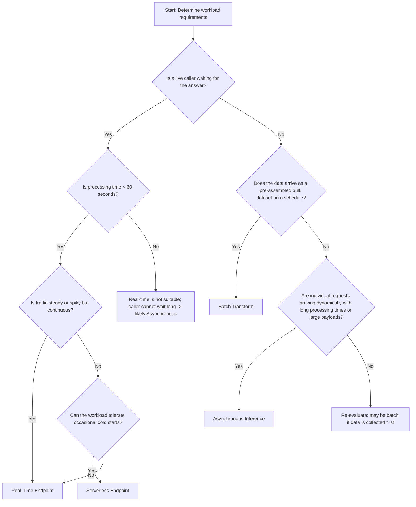

# Task 3.1: Deployment and Orchestration of ML and AI Workflows - Manage deployment infrastructure for ML and AI model types
## Skill 3.1.3: Select model inference strategies (for example, real-time and batch processing)

---

## Overview

Selecting the correct model inference strategy is one of the most foundational decisions in deploying a machine learning model. The choice determines **where the model runs, how requests are served, how costs accrue, and how latency is managed**.

The requirements of the workload—not familiarity or convenience—should drive the selection. The key signals to read are:

- **Who is waiting for the answer?** Is a user, application, or downstream process actively blocked on the response?
- **How fast do they need it?** Is the latency budget milliseconds, seconds, minutes, or simply a completion deadline?
- **How does the work arrive?** Is it a pre-assembled bulk dataset, individual requests arriving dynamically, or intermittent bursts with idle gaps?
- **How large is each unit of work?** Payload size and processing time constraints can rule out certain options.

Amazon SageMaker AI provides four primary inference strategies:

1. **Real-time inference endpoints**
2. **Serverless inference endpoints**
3. **Asynchronous inference endpoints**
4. **Batch transform jobs**

Each fits a distinct workload pattern. Mistaking one for another is a common source of operational failure and cost waste.

---

## The Core Decision Signals

| Signal | What it tells you |
| --- | --- |
| **Who is waiting?** | Determines synchronous vs asynchronous. If someone is blocked mid-transaction, the system must respond inline. If no one waits, the system can queue or schedule. |
| **Latency budget** | Strict millisecond–second budgets demand always-warm compute. Minutes-long processing or overnight batch jobs allow cold starts or scheduled compute. |
| **Data arrival pattern** | Bulk dataset on a schedule → batch. Individual requests arriving dynamically → endpoint. Intermittent traffic with long idle gaps → serverless. |
| **Payload size and processing time** | Real-time and serverless have strict timeouts (typically 60 seconds). Asynchronous handles larger payloads and longer processing. |
| **Cost and idle sensitivity** | Options that scale to zero eliminate idle costs but may introduce cold starts. Options that stay warm offer predictable latency at higher idle cost. |

---

## SageMaker AI Inference Strategies

### 1. Real-Time Inference Endpoints

A **real-time endpoint** is a fully managed, always-on HTTPS endpoint that serves predictions synchronously. The client sends a request and blocks until the response arrives.

#### Characteristics

- Designed for **interactive**, **low-latency** workloads.
- Enforces a strict **60-second request timeout**.
- Maintains warm compute capacity; no cold start under normal operation.
- Supports **Auto Scaling** based on metrics such as invocations per instance.
- Can host one or more models using single-model, multi-model, or multi-container endpoints.

#### Use Cases

- **Payment fraud scoring**: every transaction is scored while the customer waits.
- **Recommendation engines** embedded in web pages or mobile apps.
- **Natural language processing** for chatbots needing immediate response.
- Any application where a live caller is blocked waiting for an answer.

#### Scaling and Cost Behavior

- Uses **Auto Scaling policies** to add or remove instances as traffic changes.
- Prevents latency degradation during spikes without paying for peak capacity all day.
- **Can scale in to zero**, but this is a deliberate configuration requiring **inference components** and an **auto scaling policy** that scales back out on a specific metric emitted when there is no capacity to serve a request. During the scale-out provisioning window, incoming requests **return an error**, not a queued response.
- For most production synchronous workloads, the fleet is kept warm with a minimum instance count.

#### Limitations and Rules Out

- Not suitable for tasks that routinely exceed 60 seconds of processing.
- Not ideal for sporadic, low-traffic workloads with long idle periods; maintaining warm instances for low utilization is costly.

---

### 2. Serverless Inference Endpoints

**Serverless inference** automatically provisions, scales, and manages compute capacity based on incoming traffic—without requiring the user to configure or manage instances.

#### Characteristics

- Best for **intermittent or bursty traffic** with **genuine idle gaps** between requests.
- **Scales down to zero** during idle periods; you pay only for actual execution time and data processed.
- Charged at a per-invocation and per-duration rate rather than per instance-hour.
- **Synchronous**—the caller waits for the response.
- Enforces a **60-second processing limit**.
- Cold starts are possible when a request arrives after an idle period; can be mitigated with **Provisioned Concurrency** to keep capacity warm, at added cost.

#### Use Cases

- Internal tools that send a handful of requests in short bursts, then idle for long periods.
- Prototypes or low-volume applications with unpredictable traffic.
- Workloads where occasional cold-start latency (typically a few seconds) is acceptable.

#### Limitations and Rules Out

- Does **not** support:
  - Accelerated instances (GPUs)
  - VPC configuration
  - Multi-model hosting
  - Custom container configuration in some cases (limitations vary by region and feature)
- If the workload requires any of the above, serverless is already ruled out.
- Not suitable for constant high-throughput, low-latency workloads; real-time is more cost-effective at scale.

#### Important Nuance

- **Real-time vs. serverless** is a common exam trap. Both are synchronous, but real-time is for **steady traffic with strict latency budgets**, while serverless is for **intermittent traffic tolerant of cold starts**.

---

### 3. Asynchronous Inference Endpoints

**Asynchronous inference** serves requests from a managed internal queue, processing them without blocking the caller. The client submits a request and receives an immediate acknowledgement; results are written to Amazon S3 and optionally announced via Amazon SNS.

#### Characteristics

- Designed for **large payloads** (up to **1 GB**) and **long processing times** (up to **15 minutes to 1 hour**, depending on configuration).
- Requests are **queued** rather than answered inline—nobody waits on the connection.
- The API returns `202 Accepted` immediately after accepting the request.
- Results are written to **Amazon S3**; notification can be sent via **Amazon SNS**.
- Can **scale the instance count down to zero** when the queue is empty; the queue holds arriving work until capacity scales back out.

#### Use Cases

- Processing individual document images or PDFs that arrive one at a time and take minutes each to process.
- Video frame analysis, large audio transcription, or complex model inference where processing time exceeds 60 seconds.
- Workloads where callers can be unblocked and poll or be notified later.

#### Limitations and Rules Out

- Not suitable for synchronous, low-latency requests where the caller waits inline.
- Not intended for pre-assembled bulk datasets; batch transform is better for batch offline processing.

#### Key Difference from Real-Time

- **Real-time**: caller waits, maximum 60 seconds.
- **Asynchronous**: caller is unblocked, can take much longer, larger payload.

#### Key Difference from Batch Transform

- **Batch** processes a static dataset all at once on a schedule.
- **Asynchronous** processes individual dynamic requests arriving over time, each queued and processed separately.

---

### 4. Batch Transform

**Batch transform** processes a pre-assembled dataset in bulk. The dataset is stored in Amazon S3, the job reads it, runs predictions offline, writes results back to S3, and then shuts down all compute resources.

#### Characteristics

- Designed for **offline, bulk, scheduled inference**.
- No endpoint exists; compute resources are provisioned at job start and terminated at job completion.
- Processes data from **Amazon S3** input to **Amazon S3** output.
- Can use multiple instances to parallelize processing of large datasets.
- No 60-second timeout; jobs can run for hours if needed.

#### Use Cases

- Nightly processing of millions of scanned claim documents where results are due by morning.
- Periodic re-scoring of an entire customer database.
- Any scenario where the **entire input dataset is already assembled** and there is **no live caller**.

#### Scaling and Cost Behavior

- **Pay only while the job runs.** No idle endpoint cost.
- Scale-out is automatic internally; you choose the instance type and count.
- Not designed for real-time individual request/response patterns.

#### Limitations and Rules Out

- Not for on-demand individual requests.
- Not for use cases where a caller expects immediate results.
- Jobs take at least a few minutes to start up and shut down—there is schedule overhead.

---

## Decision Matrix

| Factor | Real-Time Endpoint | Serverless Endpoint | Asynchronous Inference | Batch Transform |
| --- | --- | --- | --- | --- |
| **Caller waits?** | Yes, synchronously | Yes, synchronously | No, asynchronous | No |
| **Traffic pattern** | Continuous or spiky but active | Intermittent, bursty with idle gaps | Dynamic individual requests, long processing | Pre-assembled bulk dataset on schedule |
| **Latency** | Milliseconds to seconds | Seconds (possible cold start) | Minutes or more | Not applicable (job-level) |
| **Processing timeout** | 60 seconds max | 60 seconds max | Up to 15–60 minutes | No per-request timeout; job runs to completion |
| **Payload size** | Small/medium (< 6 MB typical) | Small (< 6 MB typical) | Large (up to 1 GB) | Whole dataset in S3 |
| **Idle cost** | Instances running, cost accrues | Zero if idle (scales to zero) | Zero if idle (scales to zero) | Zero after job completes |
| **Scaling to zero** | Manual/auto with policy; requests error during scale-out | Automatic; cold start possible | Automatic; queue holds work | Automatic; compute terminates after job |
| **Output delivery** | HTTPS response | HTTPS response | S3 + SNS | S3 |
| **Infrastructure management** | Managed, but user selects instance type and scaling | Fully managed | Managed, user selects instance type and scaling | Managed, user selects instance type and count |

---

## Decision-Making Flowchart

This flowchart simplifies the selection logic. In practice, the first question—**who is waiting for the answer**—sorts the options into synchronous vs asynchronous. Then workload details choose the specific option.

---

## Scenario-Based Examples

### Scenario 1: Payment Fraud Scoring

**Background:** AnyCompany processes credit card transactions. Every transaction must be scored for fraud **while the customer waits** at the point of sale. The average latency must be under **100 milliseconds**. Traffic **spikes sharply** during holiday promotions. Budget is important, but downtime or delayed approvals are unacceptable.

**Question:** Which inference strategy best fits this workload?

**Answer:** **Real-time inference endpoint with Auto Scaling.**

**Explanation:**

- A live customer is waiting mid-payment → synchronous response required.
- Latency budget is extremely strict → cold starts are unacceptable.
- Traffic is spiky but continuous during events → Auto Scaling handles peaks while maintaining warm capacity.

**Why not serverless?** Serverless may spike well but can introduce cold starts after idle periods. The payment flow cannot tolerate multi-second delays.

**Why not asynchronous or batch?** Both are asynchronous; the customer would wait minutes or until a scheduled job, which is impossible for payment authorization.

---

### Scenario 2: Overnight Insurance Claim Document Processing

**Background:** An insurance company receives **millions of scanned claim forms** each night. The files arrive in bulk to an S3 bucket. The document processing model must classify and extract data from every form, and results must be ready by **6:00 AM** for claims adjusters. The company wants to **pay only while the work runs**.

**Question:** Which inference strategy is appropriate?

**Answer:** **Batch Transform.**

**Explanation:**

- No one is waiting for individual predictions; the entire dataset is pre-assembled and processed on a nightly schedule.
- Compute resources start, process all files, write results to S3, and shut down.
- There is no idle endpoint between nightly runs, meeting the cost requirement.

**Why not real-time or serverless?** They are designed for individual dynamic requests, not bulk datasets. Running an always-on endpoint for a nightly batch would waste money.

**Why not asynchronous?** Asynchronous is for individual long-running requests arriving dynamically, not a pre-assembled bulk dataset.

---

### Scenario 3: Daytime Long-Running Document Processing

**Background:** The same insurance company also receives **individual scanned claims** during business hours. Each claim takes **5–10 minutes** to process through the model. The caller is an internal system that can continue working and does not need an inline response. The system should be notified when processing completes.

**Question:** Which inference strategy fits this pattern?

**Answer:** **Asynchronous Inference.**

**Explanation:**

- No live caller is blocked; the system can continue and receive a notification later.
- Individual requests arrive dynamically throughout the day.
- Processing time is far longer than the 60-second real-time limitation.
- The managed queue holds requests until compute is available, and the endpoint can scale to zero when idle.

**Why not real-time?** The 60-second timeout would cause failures.

**Why not batch?** Batch expects the whole dataset at once; these are individual on-demand requests.

---

### Scenario 4: Intermittent Internal Application

**Background:** An internal application sends a **handful of requests in short bursts**, with **long idle stretches** (hours) between bursts. The team wants **no instances to manage** and is willing to accept a few seconds of initial latency when a new burst arrives.

**Question:** Which hosting option fits that description?

**Answer:** **Serverless inference endpoint.**

**Explanation:**

- Traffic is intermittent with genuine idle gaps → serverless scales to zero and avoids idle cost.
- The team wants no instance management → serverless is fully managed.
- Cold-start latency is acceptable per requirements.

**Why not real-time?** Real-time endpoints keep instances warm, incurring cost during long idle stretches, and require manual scaling.

**Why not asynchronous?** The caller is likely waiting for the response in bursts; asynchronous would change the application integration model.

---

## Foundation Model Inference Strategies

Although the core inference strategies above are SageMaker-centric, AWS foundation model (FM) serving has its own equivalent that follows similar logic.

| Strategy | Description | When to use |
| --- | --- | --- |
| **Bedrock On-Demand Invocation** | Serverless API, no instance sizing. Pay per token. | Sporadic or unpredictable FM usage; no need to reserve capacity. |
| **Bedrock Provisioned Throughput** | Reserved model units that guarantee throughput capacity. | Production workloads with predictable baseline traffic or models customized in Bedrock. |
| **Bedrock Custom Model Import** | Import an externally customized open-weight model into Bedrock for on-demand serving. | Bring your own fine-tuned FM without operating endpoints; limited to supported architectures. |
| **SageMaker Real-Time / Serverless for FMs** | Self-host FMs on SageMaker endpoints. | When you need full control over accelerators, scaling, or custom containers. |

Key distinction: **A model customized inside Bedrock (fine-tuned) must be served through Provisioned Throughput**, while an imported custom model is served on-demand through the same API. This creates a real operating difference despite both resulting in a custom model.

---

## Exam Tips and Traps

### Common Traps

1. **Confusing synchronous and asynchronous options.**  
   - Real-time and serverless are **synchronous**; the caller blocks.
   - Asynchronous and batch are **asynchronous**; no caller blocks.
   
2. **Overlooking the 60-second timeout.**  
   - Real-time and serverless enforce a maximum 60-second processing window. If the scenario says processing takes minutes, those are immediately ruled out.

3. **Assuming serverless eliminates all latency concerns.**  
   - Serverless can experience **cold starts** after idle periods. If the scenario emphasizes a strict latency budget, choose real-time with Auto Scaling, not serverless.

4. **Thinking batch transform can handle individual on-demand requests.**  
   - Batch transform processes a pre-existing static dataset. It cannot accept one-off dynamic requests. Use asynchronous for individual long-running requests.

5. **Forgetting about scale-in to zero behavior.**  
   - Real-time endpoints can scale to zero, but during scale-out, incoming requests **fail** (not queue). Serverless and asynchronous handle zero capacity more gracefully.

6. **Ignoring limitations that rule out serverless.**  
   - Serverless does not support GPUs, VPCs, or multi-model hosting. If any of those is required, serverless is not an option.

7. **Payload size as a hidden differentiator.**  
   - Real-time has limited payload size; asynchronous supports up to 1 GB. Large payloads that exceed real-time limits point to asynchronous.

8. **Mixing up batch and async output mechanisms.**  
   - Both write to S3, but batch is for bulk datasets on schedule; async is for individual requests queued dynamically.

### Key Exam Question Patterns

- **"Who is waiting?"** is almost always the first discriminator in an exam scenario.
- Look for words like: *live caller*, *customer waits*, *strict latency*, *bursty traffic*, *idle periods*, *pre-assembled dataset*, *files arrive in bulk*, *results by morning*, *individual requests arrive one at a time*, *payload up to 1 GB*, *processing takes minutes*.
- If a scenario mentions **milliseconds** and **constant availability**, real-time is the safest answer unless there is a specific reason against it.
- If a scenario mentions **no instances to manage** and **bursty, idle-heavy traffic**, serverless is likely intended.
- If a scenario mentions **large payloads** or **processing longer than 60 seconds**, asynchronous is the answer.
- If a scenario mentions **bulk data in S3** and **no live user**, batch transform is correct.

### Quick Recall

**The one question that decides everything:** *Who is waiting for the answer?*

- **Steady traffic, strict latency, live caller** → **Real-Time Endpoint**
- **Intermittent traffic, idle gaps, can tolerate cold start** → **Serverless Endpoint**
- **Individual long-running requests, no caller blocked** → **Asynchronous Inference**
- **Pre-assembled dataset, offline schedule, no caller** → **Batch Transform**

---

## Summary

Selecting a model inference strategy is not about memorizing service names—it is about translating workload requirements into the correct operational pattern.

| Workload Signal | Inference Strategy |
| --- | --- |
| Live caller waiting, latency < 60 s, steady/bursty traffic | SageMaker Real-Time Endpoint |
| Live caller waiting, intermittent traffic, idle gaps, cold start OK | SageMaker Serverless Endpoint |
| No caller waiting, individual dynamic requests, processing > 60 s or payload > 6 MB | SageMaker Asynchronous Inference |
| No caller waiting, bulk dataset in S3, scheduled offline processing | SageMaker Batch Transform |

Always start with the question: **Who is waiting for the answer?** Then evaluate latency, payload, and traffic pattern. That single discipline will consistently lead to the correct inference strategy on the exam and in practice.