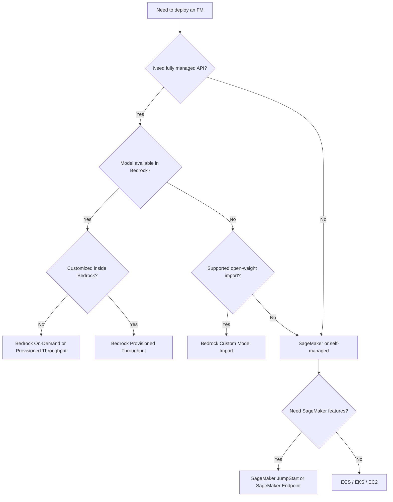

# Task 3.1: Deployment and Orchestration of ML and AI Workflows - Manage deployment infrastructure for ML and AI model types

## Skill 3.1.4: Evaluate and select appropriate foundation model (FM) deployment options

### Overview

Foundation model deployment is not simply about choosing a server size. The key decision is how much of the serving stack AWS manages for you and how much you operate yourself.

For the AWS Certified Machine Learning - Associate exam, you must be able to evaluate these deployment paths:

- **Fully managed model APIs** where AWS serves the model and you call it.
- **Imported custom foundation models** served through a managed API.
- **Managed SageMaker endpoints** where you deploy an FM to infrastructure you configure.
- **Self-managed compute** using containers, Kubernetes, or EC2.

The correct answer usually changes based on a small number of signals:

- Who manages the infrastructure?
- Is the model available in the managed service?
- Was the model customized inside or outside AWS?
- Is traffic steady, spiky, or intermittent?
- What are the latency, throughput, security, and cost requirements?

---

### FM Deployment Options at a Glance

| Deployment Option | What It Does | Infrastructure Ownership | Capacity Model | Best Fit |
| --- | --- | --- | --- | --- |
| **Amazon Bedrock On-Demand** | Serves available FMs through a serverless API | AWS managed | Pay per input/output token | Variable or unpredictable traffic; no capacity planning |
| **Amazon Bedrock Provisioned Throughput** | Reserves dedicated model units for an FM | AWS managed | Model units committed hourly | Stable high throughput; fine-tuned Bedrock models |
| **Amazon Bedrock Custom Model Import** | Imports supported open-weight custom FMs from Amazon S3 into Bedrock | AWS managed | On-demand token-based API | Serverless serving of externally customized open-weight models |
| **Amazon SageMaker JumpStart** | Deploys catalog FMs to a SageMaker endpoint | Customer manages endpoint | Instance-based hourly | Need SageMaker control, VPC, or customization workflows |
| **Amazon SageMaker AI Endpoints** | Hosts custom or open-weight FMs on managed compute | Shared management | Instance fleet, autoscaling | Custom containers, strict control, dedicated low-latency hosting |
| **Amazon ECS / EKS / EC2** | Runs models in containers or on raw compute | Customer operated | Compute resource based | Existing Kubernetes, specialized hardware, advanced orchestration |

---

### Primary FM Deployment Families

#### 1. Amazon Bedrock Managed API

Amazon Bedrock serves foundation models through an API. You do not select an instance type, create an endpoint, or manage scaling.

Two capacity modes matter for the exam:

- **On-Demand**
  - Pay only for input and output tokens.
  - Best for variable traffic, prototyping, or when capacity predictability is not required.
  - No upfront commitment.

- **Provisioned Throughput**
  - You reserve **model units** for a specific model.
  - Provides predictable throughput and often lower per-token cost for high volume.
  - Required for serving models that were fine-tuned directly inside Amazon Bedrock.

**Use Bedrock when:**

- The model is already available in Amazon Bedrock.
- You need a serverless API without operating endpoints.
- You want to avoid instance sizing and autoscaling.
- You can accept a public managed API or can use VPC interface endpoints.

**Avoid Bedrock when:**

- The model architecture is not supported.
- You need direct access to the serving container.
- You require specialized inference code beyond normal model invocation.
- You need fine-grained control over hardware, such as specific GPU accelerators.

---

#### 2. Amazon Bedrock Custom Model Import

Custom Model Import lets you take a model that was fine-tuned or customized outside Amazon Bedrock and serve it through the same managed Bedrock API.

Important characteristics:

- Model weights are uploaded from **Amazon S3**.
- Only **supported open-weight architectures** can be imported.
- After import, the model is invoked through Bedrock without creating a SageMaker endpoint.
- This is different from fine-tuning inside Bedrock. A Bedrock fine-tuned model requires Provisioned Throughput, while an imported custom model is typically served on demand.

**Use Custom Model Import when:**

- A team has fine-tuned an open-weight model such as Llama or Mistral in its own environment.
- The team wants to serve it through a managed API without operating inference infrastructure.
- The model architecture and file format meet Bedrock import requirements.

**Avoid Custom Model Import when:**

- The model is proprietary or uses an unsupported architecture.
- You need to host a custom inference container.
- You need low-level access to servers, accelerators, or networking.
- The model requires custom preprocessing or complex multi-step serving logic that cannot be expressed in Bedrock.

---

#### 3. Amazon SageMaker AI Hosting

SageMaker AI gives you a managed environment for hosting models that you supply. Unlike Bedrock, you choose instance types, scaling policies, and endpoint configurations.

Relevant ways to deploy FMs in SageMaker AI:

- **SageMaker JumpStart**
  - Provides a catalog of pretrained FMs that can be deployed quickly.
  - JumpStart still creates a SageMaker endpoint, so you manage the underlying endpoint to some degree.
  - Good for teams that want a simpler starting point but still need SageMaker features.

- **SageMaker Real-Time Endpoints**
  - Best for synchronous, low-latency FM inference.
  - Useful when traffic is steady or spiky but always requires warm capacity.
  - Supports GPU instances, autoscaling, VPC configuration, and custom containers.

- **SageMaker Asynchronous Endpoints**
  - Best for large payloads or long-running inference where callers are not blocked.
  - Requests are queued and processed asynchronously.

- **SageMaker Batch Transform**
  - Best for large static datasets that arrive in bulk.
  - No persistent endpoint required.

**Use SageMaker FM hosting when:**

- You need a model or container not supported by Bedrock.
- You require VPC isolation or private networking.
- You need custom inference code, custom model files, or specialized hardware.
- You need direct control over autoscaling and instance placement.

**Avoid SageMaker FM hosting when:**

- A managed Bedrock API already satisfies the requirement.
- The primary requirement is “no endpoint to manage.”
- Traffic is intermittent with long idle periods and you cannot tolerate cold starts unless using scheduled scaling or provisioned concurrency.

---

#### 4. Self-Managed Compute

For some use cases, the FM must run on infrastructure you control fully:

- **Amazon ECS** for containerized model serving.
- **Amazon EKS** when Kubernetes is already the deployment control plane.
- **Amazon EC2** when you need direct control over instances, accelerators, or unusual networking.

**Use self-managed compute when:**

- The organization requires Kubernetes-native deployment.
- The model needs custom system-level dependencies.
- You need specialized hardware or multi-model serving not available through SageMaker or Bedrock.
- The team already operates a mature container orchestration platform.

**Avoid self-managed compute when:**

- The requirement emphasizes reducing operational overhead.
- A managed service can satisfy security and performance needs.
- You must serve a supported FM through a simple API.

---

### Selection Framework

---

### Key Decision Factors

#### 1. Model Availability and Importability

- If the base model is available in Bedrock, use Bedrock.
- If the model is open-weight and supported for import, Custom Model Import may remove endpoint management.
- If the model is unsupported or proprietary, host it in SageMaker or on container compute.

#### 2. Customization Location

| Customization Path | Deployment Implication |
| --- | --- |
| Fine-tuned directly in Bedrock | Requires **Provisioned Throughput** |
| Fine-tuned outside Bedrock, but supported for import | Use **Custom Model Import** |
| Custom model not supported by Bedrock | Deploy on **SageMaker AI** or self-managed compute |
| Uses a base Bedrock model without customization | Use **On-Demand** or **Provisioned Throughput** |

#### 3. Traffic Pattern

| Traffic Pattern | Preferred Deployment |
| --- | --- |
| Variable, unpredictable, no capacity commitment | Bedrock On-Demand |
| Stable, high-volume, predictable | Bedrock Provisioned Throughput |
| Strict latency and dedicated capacity | SageMaker real-time endpoint |
| Large bulk datasets | SageMaker Batch Transform |
| Long-running individual requests | SageMaker Asynchronous Inference |
| Intermittent with idle gaps | Bedrock On-Demand or SageMaker serverless where suitable |

#### 4. Control vs. Convenience

| Requirement | Deployment Lean |
| --- | --- |
| No infrastructure to manage | Amazon Bedrock |
| Custom container or inference code | SageMaker AI |
| VPC-only traffic, private networking | SageMaker AI or Bedrock with VPC interface endpoints |
| Kubernetes-native orchestration | Amazon EKS |
| Existing container service | Amazon ECS |

---

### Scenario-Based Examples

#### Scenario 1: Serverless API for a Third-Party FM

A financial services company wants to use a leading open-weight foundation model to summarize financial documents. The company does not want to manage instances or endpoints. Traffic is expected to be variable during business hours.

**Which deployment option should the ML engineer select?**

**Answer:** Amazon Bedrock On-Demand or Custom Model Import if the model is available in Bedrock.

**Explanation:**

The key phrase is **“does not want to manage instances or endpoints.”** That rules out SageMaker endpoints and self-managed compute. If the model is available natively in Bedrock, On-Demand is appropriate. If the organization has customized the model externally, Custom Model Import would be considered.

---

#### Scenario 2: Externally Fine-Tuned Open-Weight Model

A machine learning team fine-tuned a Llama model on company data using Amazon EC2. The team now wants to serve that customized model through a managed API without creating or operating a SageMaker endpoint.

**Which capability supports this?**

**Answer:** Amazon Bedrock Custom Model Import.

**Explanation:**

Custom Model Import brings externally customized open-weight models from Amazon S3 into Amazon Bedrock. It avoids endpoint creation and serves the model through the Bedrock invocation API.

A common wrong answer is **Provisioned Throughput for a base model**. Provisioned Throughput may reserve capacity, but it does not import externally customized weights.

---

#### Scenario 3: Stable High-Volume Production Workload

An application serves thousands of requests per minute to a foundation model. The traffic is steady throughout the day. The organization wants predictable throughput and lower unit cost than on-demand invocation.

**Which deployment option is best?**

**Answer:** Amazon Bedrock Provisioned Throughput.

**Explanation:**

Provisioned Throughput reserves dedicated capacity in the form of model units. This is appropriate for stable, high-volume traffic where predictable throughput and lower committed-use pricing matter.

A SageMaker real-time endpoint could also provide private dedicated capacity, but the phrase **“throughput posture rather than instance count”** and the desire for a managed API point to Provisioned Throughput.

---

#### Scenario 4: Custom Model with Unsupported Architecture

A company has a proprietary foundation model that requires a custom serving container, specialized GPU instances, and private VPC networking. The model architecture is not supported by Bedrock.

**Which deployment approach should be selected?**

**Answer:** Amazon SageMaker AI real-time endpoint.

**Explanation:**

Bedrock is ruled out because the architecture is unsupported. SageMaker allows custom containers, VPC configuration, and selection of GPU instance types. Self-managed compute is possible, but SageMaker provides managed hosting while still allowing the required customization.

---

### Exam Tips and Traps

#### Important Exam Signal Words

| Signal Phrase | Likely Correct Answer |
| --- | --- |
| “No endpoints or instances to manage” | Amazon Bedrock |
| “Serverless API for a foundation model” | Amazon Bedrock On-Demand |
| “Reserve capacity” or “model units” | Amazon Bedrock Provisioned Throughput |
| “Fine-tuned a model outside AWS” | Amazon Bedrock Custom Model Import if supported |
| “Requires VPC” or “custom container” | Amazon SageMaker AI endpoint |
| “Use Kubernetes” | Amazon EKS |
| “Pre-assembled dataset, no live caller” | SageMaker Batch Transform |
| “Large payload, asynchronous, no blocked caller” | SageMaker Asynchronous Inference |

#### Common Traps

1. **Treating all serverless options as identical**
   - Amazon Bedrock On-Demand is for supported FMs.
   - SageMaker Serverless Inference is for models you host.
   - Do not choose SageMaker Serverless when the scenario says the model is already available in Bedrock and no endpoint is desired.

2. **Confusing Provisioned Throughput with Custom Model Import**
   - Provisioned Throughput reserves capacity for a model.
   - Custom Model Import brings externally fine-tuned weights into Bedrock.
   - A model customized inside Bedrock requires Provisioned Throughput.
   - A supported externally customized model can often be imported and invoked on demand.

3. **Assuming all custom models can be imported**
   - Bedrock Custom Model Import supports only specific open-weight architectures and file formats.
   - If unsupported, the correct answer is usually SageMaker AI.

4. **Choosing SageMaker endpoints when the requirement is “no infrastructure”**
   - SageMaker endpoints, even managed, still require instance selection, scaling, and capacity planning.
   - If the question explicitly says no endpoints or no instances, Bedrock is often the stronger answer.

5. **Overlooking traffic pattern**
   - Stable high-volume traffic often favors Provisioned Throughput or a real-time endpoint.
   - Intermittent traffic with idle periods may favor Bedrock On-Demand or SageMaker Serverless.
   - Batch workloads with no live caller should use Batch Transform, not real-time hosting.

6. **Assuming Import is always serverless and fully equivalent to base Bedrock models**
   - Custom Model Import is managed, but it has support limitations.
   - Check whether the exam scenario explicitly states the model is a supported open-weight architecture.

---

### Quick Recall

To select an FM deployment option, ask:

1. **Is the model already available in Amazon Bedrock?**
   - Yes: use Bedrock On-Demand or Provisioned Throughput.
   - No: check if it can be imported.

2. **Was the model customized?**
   - Inside Bedrock: Provisioned Throughput.
   - Outside Bedrock but supported: Custom Model Import.
   - Outside Bedrock and unsupported: SageMaker AI or self-managed compute.

3. **Do you need direct infrastructure control?**
   - Yes: SageMaker AI, ECS, EKS, or EC2.
   - No: Amazon Bedrock.

4. **What is the traffic pattern?**
   - Variable: On-Demand.
   - Stable and high-volume: Provisioned Throughput.
   - Strict synchronous latency with custom hosting: SageMaker real-time endpoint.
   - Bulk data: SageMaker Batch Transform.
   - Long processing without a blocked caller: SageMaker Asynchronous Inference.

The exam rewards matching the wording of the scenario to the deployment option that best removes the stated operational burden while satisfying latency, cost, and control requirements.