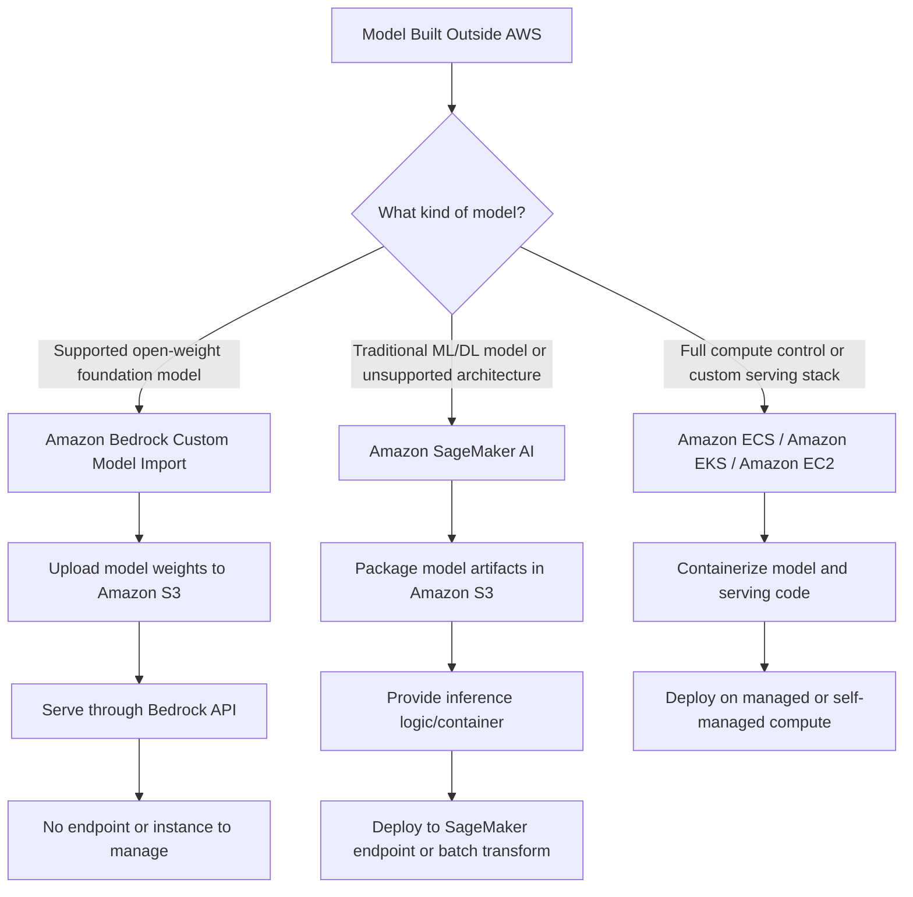
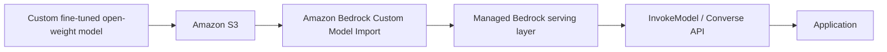
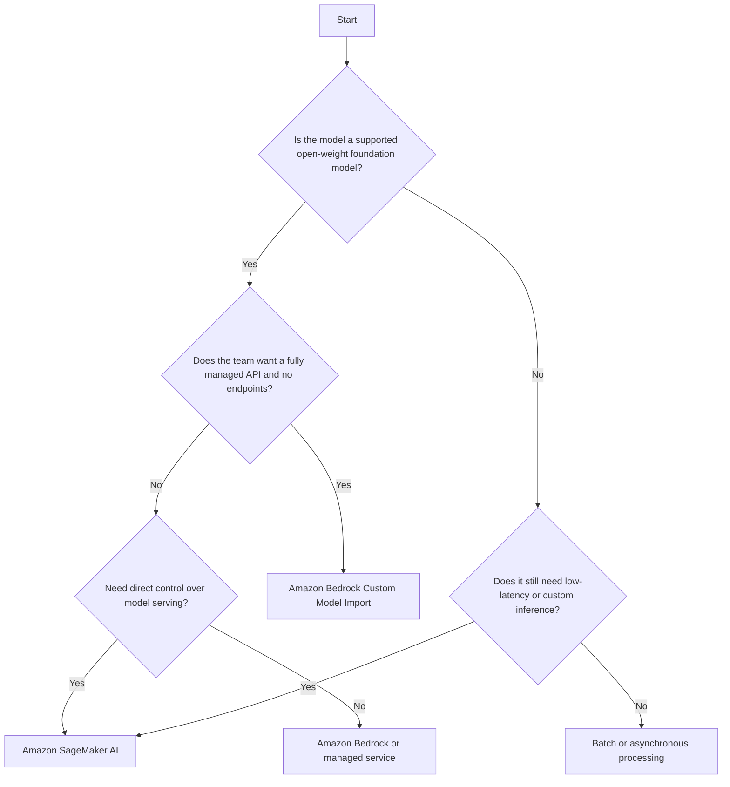

# Task 3.1: Deployment and Orchestration of ML and AI Workflows - Manage deployment infrastructure for ML and AI model types

## Skill 3.1.5: Deploy models that were built outside of AWS into AWS environments (for example, Amazon SageMaker AI, Amazon Bedrock Custom Model Import)

---

## Overview

This skill is about moving a model that was trained, fine-tuned, or otherwise produced outside AWS into an AWS environment where it can be served or consumed. The exam will test whether you can choose the correct deployment path based on:

- The type of model being imported.
- Whether the team wants a managed API or direct hosting control.
- Whether the model is a foundation model or a traditional ML model.
- Whether the team is willing to manage containers, endpoints, or instances.
- Whether the target model is supported by the import destination.

AWS provides multiple paths for external models:

| Deployment Path | Best Fit |
| --- | --- |
| **Amazon SageMaker AI** | Traditional ML models, deep learning models, any framework, custom inference logic, models requiring endpoint control, multi-model hosting, or custom serving containers. |
| **Amazon Bedrock Custom Model Import** | Supported open-weight foundation models that were fine-tuned or customized outside AWS and need to be served through a managed Bedrock API. |
| **Amazon ECS / Amazon EKS / Amazon EC2** | Models requiring full infrastructure control, custom orchestration, long-running containerized inference services, or integration with existing Kubernetes-based systems. |
| **AWS Lambda** | Lightweight inference or orchestration around a model, not large model hosting. |

---

## Core Concept: Two Main Paths

Most exam questions will ask you to distinguish between two primary patterns:

1. **SageMaker AI path:** You supply model artifacts, inference logic, and often a container. You control the endpoint and the compute.
2. **Amazon Bedrock Custom Model Import path:** You supply a supported open-weight foundation model from Amazon S3. AWS retains ownership of the serving infrastructure, and you invoke the model through Bedrock APIs.

The rest of this study note focuses primarily on the two managed AWS paths most likely to appear on the exam: **Amazon SageMaker AI** and **Amazon Bedrock Custom Model Import**.

---

## Amazon SageMaker AI: Importing Models Built Elsewhere

### What It Means

Amazon SageMaker AI is not only for models trained inside SageMaker. A model trained locally, on premises, in another cloud, or on Amazon EC2 can be deployed into SageMaker AI as long as its artifacts and serving requirements can be packaged correctly.

SageMaker AI gives you control over the model, the inference code, the container that serves the model, and the endpoint type.

### Required Components for SageMaker AI Deployment

To bring an external model into SageMaker AI, you need the following conceptual pieces:

| Component | Purpose |
| --- | --- |
| **Model artifacts** | The trained weights or model files stored in Amazon S3. |
| **Inference code** | Logic that loads the model and processes incoming data for prediction. |
| **Container** | Runtime environment containing framework dependencies, libraries, and the serving stack. |
| **Model package or model group** | A versioned, reusable definition of the model, often stored in SageMaker Model Registry. |
| **Endpoint configuration** | The compute instance type, scaling behavior, and endpoint settings. |

### Common Deployment Strategies in SageMaker AI

#### 1. Use SageMaker Built-In Containers

SageMaker provides prebuilt containers for common frameworks such as:

- PyTorch
- TensorFlow
- Hugging Face
- XGBoost
- Scikit-learn

If your external model was built in one of these frameworks, you can often supply model artifacts and inference scripts without building a custom container. This is sometimes called script mode.

#### 2. Bring Your Own Container

If your model requires:

- Non-standard dependencies.
- A custom HTTP serving stack.
- Uncommon model formats.
- Custom pre/post-processing logic.

You can package your own container and store it in Amazon Elastic Container Registry (Amazon ECR). SageMaker AI then deploys that container to the endpoint.

This is useful for models built in frameworks that SageMaker does not natively support or for situations where the serving logic must remain under your control.

#### 3. Import Model Artifacts into a SageMaker Model Package

A SageMaker model package can include:

- Model artifact location in S3.
- Container image.
- Environment variables.
- Inference code.
- Metadata.

You can register versions in **Amazon SageMaker Model Registry**, then deploy an approved version to an endpoint.

---

## Supported SageMaker AI Deployment Targets

Once the model is packaged, you can deploy it using one of the following inference options:

| Deployment Target | Use When |
| --- | --- |
| **Real-time endpoint** | Interactive traffic, low-latency responses, synchronous callers. |
| **Serverless endpoint** | Intermittent traffic, idle periods, no need to manage instances, cold starts acceptable. |
| **Asynchronous endpoint** | Requests queued individually, payload size up to 1 GB, processing time up to 15–60 minutes. |
| **Batch transform** | Pre-assembled dataset, offline processing, results written to Amazon S3. |
| **Multi-model endpoint** | Many small models sharing the same serving container and framework. |
| **Multi-container endpoint** | Up to 15 different containers running on one endpoint, used for inference pipelines or multiple serving stacks. |

The fact that a model was built outside AWS does not change the endpoint selection criteria. The workload pattern still decides the deployment target.

---

## Amazon Bedrock Custom Model Import

### What It Is

Amazon Bedrock Custom Model Import allows you to bring a customized or fine-tuned open-weight foundation model into Amazon Bedrock and serve it through the same managed Bedrock API used by base foundation models.

This path is ideal when a team wants:

- A fully managed foundation model API.
- No endpoint deployment or instance management.
- Integration with Bedrock APIs, guardrails, logging, and other managed capabilities.
- A serverless operational model.

### How It Works at a Conceptual Level

You upload the model artifacts to an S3 bucket, create an import job, and after import, the model appears as a usable model in Amazon Bedrock.

### Important Characteristics

| Characteristic | Description |
| --- | --- |
| **Model types** | Supported open-weight foundation model architectures, such as selected Llama and Mistral family models. The exam expects you to know that this is not a general-purpose model import service. |
| **Serving model** | Fully managed by Amazon Bedrock. There is no SageMaker endpoint, instance, or container to manage. |
| **Access pattern** | Invoked through the standard Bedrock API. |
| **Customization path** | The model is customized outside AWS and then imported into Bedrock. This is different from Bedrock Model Customization, where fine-tuning happens inside Bedrock. |
| **Operational overhead** | Much lower than self-hosting. No need to author a serving container or configure auto scaling. |
| **Scope limitation** | Only certain open-weight architectures and model file layouts are accepted. A traditional custom model such as an XGBoost fraud model is not supported here. |

### Key Exam Distinction

| Path | Where Customization Happened | Serving Requirement |
| --- | --- | --- |
| **Bedrock Custom Model Import** | Outside AWS, then imported from S3 | Typically invoked on demand through Bedrock API |
| **Bedrock Model Customization** | Inside Amazon Bedrock | Requires Provisioned Throughput or reserved capacity for custom models |
| **SageMaker AI hosting** | Anywhere, then packaged and deployed | You operate an endpoint or batch job |

This distinction matters in exam scenarios. A model customized inside Bedrock goes through Bedrock Model Customization. A model customized elsewhere and then brought into Bedrock goes through Custom Model Import.

---

## SageMaker AI vs. Amazon Bedrock Custom Model Import

| Decision Factor | Amazon SageMaker AI | Amazon Bedrock Custom Model Import |
| --- | --- | --- |
| **Model type** | Any framework or model type that can be packaged. | Supported open-weight foundation model architectures only. |
| **Serving control** | You choose instance types, scaling, model routing, and endpoint shape. | AWS manages serving; you do not manage a fleet. |
| **Serving surface** | Endpoint, batch transform, or container service. | Bedrock API. |
| **Inference customization** | You can provide custom inference code and containers. | Limited to the supported serving format for imported model weights. |
| **Operational burden** | Higher, but more flexible. | Lower, but more constrained. |
| **Best for** | Traditional ML, deep learning models, unsupported FMs, custom logic, models requiring VPC or specialized hardware control. | Fine-tuned open-weight FMs that can be served through a managed LLM API. |
| **Multi-model behavior** | Supports multi-model endpoints and multi-container endpoints. | Not the same endpoint-level multi-model control. |
| **Typical buyer** | ML platform team that wants control. | Application team that wants managed AI APIs. |

---

## Decision Framework

Use this sequence to identify the correct AWS service in the exam.

A simpler mental model:

- **Foundation model + managed API + supported architecture** → Bedrock Custom Model Import.
- **Any other imported model + endpoint or batch control** → SageMaker AI.
- **Full infrastructure control + custom container orchestration** → ECS, EKS, or EC2.

---

## Scenario-Based Examples

### Scenario 1: Custom Fraud Model Built Outside AWS

**Scenario:**  
A financial services company trained a custom XGBoost fraud detection model on premises. The model must serve online transactions with millisecond latency. The team wants to use a managed endpoint but must keep custom feature engineering logic in the inference path.

**Analysis:**  
The model is not a foundation model, so Amazon Bedrock Custom Model Import is not appropriate. SageMaker AI can host the XGBoost model through a real-time endpoint and run custom inference logic.

**Best answer:**  
Deploy the model to a SageMaker real-time endpoint using a SageMaker XGBoost container or a custom container that includes the feature engineering logic.

---

### Scenario 2: Fine-Tuned Open-Weight LLM Imported from Another Cloud

**Scenario:**  
A startup fine-tuned a supported Llama-family open-weight model in its own training environment. The application team wants to call the model through an API, does not want to manage containers or endpoints, and wants to avoid sizing instances.

**Analysis:**  
The model is a supported open-weight foundation model. The team wants a managed API and no operational overhead. Amazon Bedrock Custom Model Import is the correct choice.

**Best answer:**  
Upload the model weights to Amazon S3 and import the model into Amazon Bedrock using Custom Model Import. Serve it through the Bedrock API.

---

### Scenario 3: Unsupported Foundation Model Architecture

**Scenario:**  
A company built a custom large language model using a new architecture that is not listed in Amazon Bedrock Custom Model Import supported architectures. The team still wants to deploy it on AWS with GPU inference.

**Analysis:**  
Because Bedrock Custom Model Import only supports certain open-weight architectures, this model cannot be imported into Bedrock through this path. The team must self-host using SageMaker AI, Amazon ECS, or Amazon EKS.

**Best answer:**  
Package the model in a custom container and deploy it to a SageMaker real-time endpoint on GPU instances.

---

### Scenario 4: External Model with Bursty Traffic and Long Idle Periods

**Scenario:**  
A data science team trained a custom PyTorch model outside AWS. It will be called only a few times per day, but each call requires synchronous prediction. The team does not want to manage instances and can tolerate occasional cold starts.

**Analysis:**  
The model is not a foundation model, so Bedrock Custom Model Import is out. The traffic is intermittent, which matches SageMaker Serverless Inference.

**Best answer:**  
Deploy the model to a SageMaker serverless endpoint.

---

## Exam Tips and Traps

### Tip 1: Match the Model Type to the Import Service

If the question describes a traditional ML model such as:

- XGBoost
- Scikit-learn
- TensorFlow
- PyTorch recommendation model
- Custom fraud model

Do not choose Amazon Bedrock Custom Model Import. Use SageMaker AI.

Amazon Bedrock Custom Model Import is only for supported open-weight foundation model architectures.

---

### Tip 2: Recognize the Difference Between Bedrock Custom Model Import and Bedrock Model Customization

- **Custom Model Import:** Model was customized outside AWS and imported from S3.
- **Model Customization:** Model was fine-tuned or continually pretrained inside Amazon Bedrock.

Exam questions often use the phrase:

> "A team fine-tuned a model in its own environment and wants to use Bedrock."

That points to Custom Model Import.

---

### Tip 3: "Managed API" Usually Rules Out SageMaker Endpoints

If the scenario says:

- "No endpoints to manage"
- "Managed foundation model API"
- "No instance sizing"
- "Call through Bedrock"

Choose Amazon Bedrock or Amazon Bedrock Custom Model Import.

If the scenario says:

- "Custom serving container"
- "VPC endpoint"
- "GPU instance type"
- "Auto Scaling policy"
- "Multi-model endpoint"

These point to SageMaker AI or self-managed compute.

---

### Tip 4: Custom Import Still Requires Amazon S3

Amazon Bedrock Custom Model Import does not pull models directly from an on-premises location or another cloud. The model artifacts must be uploaded to Amazon S3 first.

A question that says "import directly from an on-premises file share into Bedrock" is incorrect.

---

### Tip 5: Model Registry Does Not Replace an Endpoint

SageMaker Model Registry stores and versions model packages. Registering a model in the registry does not make it available for inference. You still need to deploy it to an endpoint, serverless endpoint, asynchronous endpoint, or batch transform.

---

### Trap: Assuming All External Models Can Be Imported into Bedrock

A common wrong answer is:

> "Use Amazon Bedrock Custom Model Import for a custom PyTorch image classifier."

This is incorrect because Custom Model Import is not a general-purpose model import service. SageMaker AI is the correct option for general ML model hosting.

---

### Trap: Confusing Endpoint Type with Import Path

The endpoint type you choose in SageMaker AI depends on workload characteristics:

- Real-time endpoint: synchronous, low latency, continuous traffic.
- Serverless endpoint: intermittent traffic, idle periods.
- Asynchronous endpoint: queued requests, large payloads, multi-minute processing.
- Batch transform: pre-assembled datasets processed in bulk.

The fact that a model was built outside AWS does not change this decision.

---

### Trap: Ignoring Existing Infrastructure

If an organization already runs Kubernetes workloads and wants to use the same deployment orchestration for inference, Amazon EKS or Amazon ECS may be the answer, even though SageMaker AI or Bedrock is often more managed.

Exam questions sometimes include a phrase like:

> "The organization wants to use its existing Kubernetes tooling."

That is a signal to select Amazon EKS or a container service rather than SageMaker managed endpoints.

---

## Quick Summary

| Model Situation | Recommended AWS Path |
| --- | --- |
| Custom traditional ML model built outside AWS | SageMaker AI endpoint or batch transform |
| Supported open-weight LLM fine-tuned outside AWS | Amazon Bedrock Custom Model Import |
| Custom model with unusual dependencies | SageMaker AI with bring-your-own-container |
| Many small models sharing the same framework | SageMaker Multi-Model Endpoint |
| Model requiring Kubernetes-based orchestration | Amazon EKS |
| Lightweight inference or event-based model invocation | AWS Lambda |
| Batch processing of a pre-assembled dataset | SageMaker Batch Transform |
| Queued individual requests with long processing times | SageMaker Asynchronous Inference |
| Model fine-tuned inside Amazon Bedrock | Bedrock Model Customization with Provisioned Throughput |

---

## Final Exam-Readiness Check

If you can answer these questions, you are well prepared for Skill 3.1.5:

1. What is the difference between Amazon SageMaker AI deployment and Amazon Bedrock Custom Model Import?
2. Why is Custom Model Import limited to supported open-weight foundation models?
3. What artifacts are required to bring a non-AWS model into SageMaker AI?
4. When should a team use SageMaker multi-model endpoints instead of separate endpoints?
5. How do SageMaker real-time, serverless, asynchronous, and batch inference differ?
6. What is the difference between a model customized outside Bedrock and a model customized inside Bedrock?
7. Which AWS services are best for self-managed containerized inference?