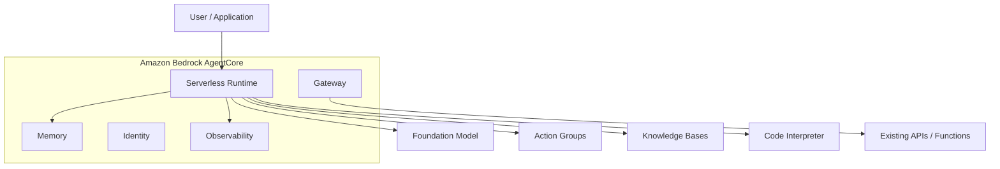
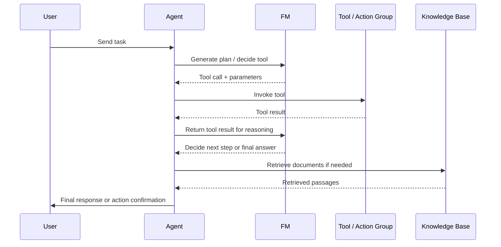
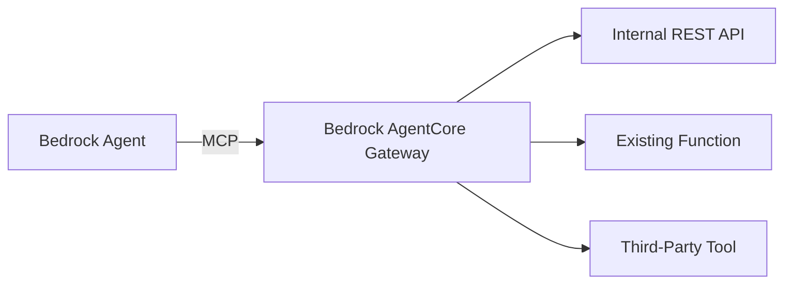
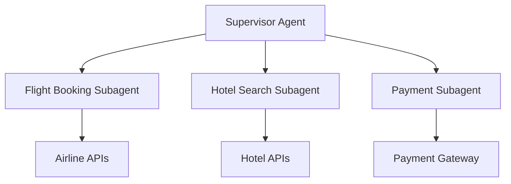
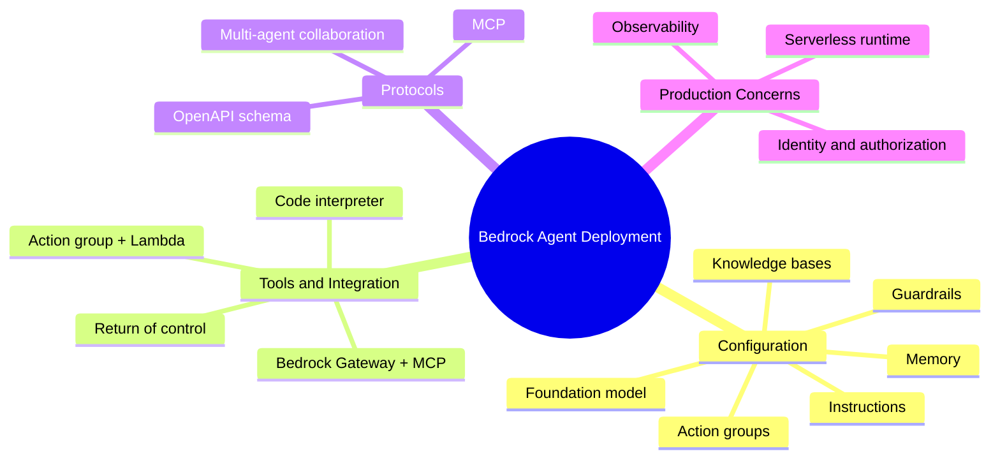

# Task 3.1: Deployment and Orchestration of ML and AI Workflows - Manage deployment infrastructure for ML and AI model types

## Skill 3.1.6: Deploy and configure agents for specific tasks, integration with other services and tools, and agent communication protocols

---

## 1. What Is an AI Agent in AWS?

An **AI agent** is an application that uses a foundation model (FM) to reason, plan, and complete multi-step tasks on a user’s behalf. Unlike a simple model invocation that returns a single text response, an agent can:

- Break a complex task into steps.
- Decide which tools to call.
- Retrieve external knowledge.
- Execute business logic.
- Maintain context across a conversation.
- Return a final answer or take an action.

On AWS, the primary managed service for building and deploying agents is **Amazon Bedrock Agents** and the newer **Amazon Bedrock AgentCore** family of production agent services.

> **Exam relevance:**  
> The MLA-C02 exam expects you to know when and how to deploy agents in Amazon Bedrock, how they integrate with tools, and what protocols enable those integrations.

---

## 2. Amazon Bedrock AgentCore at a Glance

Amazon Bedrock AgentCore is a set of managed, serverless capabilities for running agents in production. You do not manage instances, queues, or container orchestration. The key components are:

| Component | Purpose |
|-----------|---------|
| **Serverless runtime** | Executes the agent loop: FM reasoning, tool selection, action invocation, and final response composition. |
| **Memory** | Maintains conversation history, session state, and user facts across turns so the agent can handle multi-step interactions. |
| **Gateway** | Exposes existing APIs and functions as agent tools through open protocols such as **Model Context Protocol (MCP)**. |
| **Identity** | Controls who can access the agent and what each tool is allowed to do. Uses IAM roles and external identity providers. |
| **Observability** | Provides logs, metrics, and tracing for agent reasoning, tool calls, and latency through Amazon CloudWatch and AWS X-Ray. |

---

## 3. Deploying and Configuring an Agent for a Specific Task

### 3.1 Core Configuration Elements

When you deploy an agent in Amazon Bedrock, you configure several components to specialize it for a task.

| Element | What It Does | Example |
|---------|--------------|---------|
| **Foundation model** | The FM that performs the agent’s reasoning and planning. | Claude 3.5 Sonnet, Amazon Nova Pro |
| **Instructions** | System prompt that defines the agent’s identity, task boundary, tone, and step-by-step behavior. | “You are a claims support agent. Always ask for the claim ID before accessing data.” |
| **Action groups** | Tools that the agent can call to perform real-world actions. Each action group includes an API schema and an AWS Lambda function. | Check order status, update CRM, create support ticket. |
| **Knowledge bases** | Retrieval Augmented Generation sources the agent can query for domain knowledge. | Product manuals, insurance policy documents, internal FAQs. |
| **Memory** | Stores conversation state and user-provided facts for multi-turn consistency. | Remember customer name, policy number, conversation intent. |
| **Guardrails** | Content filtering, sensitive data redaction, and topic restrictions. | Block PII exposure, prevent harmful responses, restrict out-of-scope topics. |
| **Code interpreter** | Enables the agent to generate and execute code in a sandbox for calculations, charting, or data analysis. | Analyze a CSV file inside the agent session. |
| **Return of control** | Allows the agent to pause after generating tool parameters and hand control back to the client or user. | Request human approval before processing a refund. |

### 3.2 How an Agent Runs

The FM is the decision-maker. The agent runtime handles the loop: call the FM, honor its tool requests, return tool results, and continue until the FM produces a final answer.

---

## 4. Integration with Other Services and Tools

### 4.1 Action Groups: The Main Tool Mechanism

An **action group** defines what an agent can do. It has two required parts:

1. **API schema** — Describes the parameters, operations, and input/output shapes for the tool. Typically defined using the OpenAPI schema format.
2. **AWS Lambda function** — Executes the actual business logic when the agent calls the tool.

The agent uses the API schema to understand how to call the tool and what parameters to supply. The Lambda function can connect to:

- Amazon DynamoDB
- Amazon RDS
- Amazon S3
- External REST APIs
- Internal microservices
- Third-party SaaS platforms

**Example:**  
A customer support agent needs to check order status. You create an action group named `CheckOrderStatus` with an OpenAPI schema defining an operation `GET /orders/{orderId}` and connect it to a Lambda function that queries DynamoDB.

### 4.2 Amazon Bedrock Gateway and Model Context Protocol

For organizations with many existing APIs, writing a Lambda wrapper for every tool can be inefficient. **Amazon Bedrock AgentCore Gateway** addresses this by exposing existing APIs and functions directly as agent tools through the **Model Context Protocol (MCP)**.

MCP is an open standard that standardizes how agents discover tools, call them, and receive results. With Bedrock Gateway:

- Existing internal APIs can become agent tools without replacing them with Lambda wrappers.
- Agents can connect to tools hosted inside AWS, on premises, or in third-party environments.
- Tool access is governed by identity and authorization policies.

**When to use Gateway vs. Action Groups:**

| Requirement | Recommended Approach |
|-------------|----------------------|
| New tool, simple logic, or AWS-native integration | Action group with Lambda |
| Existing API that should be reused directly | Bedrock Gateway with MCP |
| Complex workflow requiring long-running execution | AWS Step Functions behind Lambda or gateway |
| Tool must run inside a VPC and access private resources | Lambda in VPC or gateway with private connectivity |

### 4.3 Other AWS Service Integrations

| AWS Service | How It Integrates with Agents |
|-------------|------------------------------|
| **AWS Lambda** | Executes action group business logic. |
| **Amazon S3** | Stores files for code interpreter, knowledge base source documents, and agent output. |
| **Amazon DynamoDB / RDS** | Backing data stores for tools that query or update records. |
| **Amazon Bedrock Knowledge Bases** | Provides managed RAG retrieval for agent context. |
| **Amazon CloudWatch** | Logs agent traces and metrics for monitoring. |
| **AWS X-Ray** | Distributed tracing for agent requests and tool calls. |
| **AWS IAM Identity Center / OAuth** | Controls external user and tool identity. |
| **AWS Step Functions** | Orchestrates complex human-in-the-loop or long-running workflows that may invoke agents. |
| **Amazon EventBridge** | Triggers agent invocations based on events. |

---

## 5. Agent Communication Protocols

### 5.1 Model Context Protocol (MCP)

MCP is the key open protocol for agent-to-tool communication in modern AWS agent architectures.

| Attribute | Description |
|-----------|-------------|
| **Purpose** | Standardize how agents discover, invoke, and receive results from tools. |
| **Used by** | Amazon Bedrock AgentCore Gateway |
| **Benefit** | Removes the need to write custom Lambda wrappers for every existing API. |
| **Exam signal** | If the question mentions exposing existing APIs/functions to agents without rewriting them, think MCP and Bedrock Gateway. |

### 5.2 OpenAPI Schema for Action Groups

Inside Amazon Bedrock Agents, action groups use **OpenAPI schemas** as the contract between the FM and the Lambda tool. This is not a network protocol but a machine-readable API description that lets the model know:

- What operations are available.
- What parameters are required.
- What format the response takes.

### 5.3 Multi-Agent Collaboration

For complex tasks that span multiple domains, AWS supports **multi-agent collaboration**. A supervisor agent can delegate subtasks to specialized subagents.

Each subagent has its own instructions, tools, and knowledge bases. The supervisor controls delegation and combines results into a unified response.

**Use multi-agent when:**
- The task naturally splits into separate domains.
- Different teams own different tools or APIs.
- A single agent would need too many tools or instructions to be reliable.

**Do not overcomplicate a simple task:**  
If a single agent with a few action groups and one knowledge base can solve the problem, a multi-agent setup is unnecessary.

---

## 6. Scenario-Based Examples

### 6.1 Customer Support Agent with RAG and Business Actions

**Scenario:**  
A retail company wants an agent that can answer product questions from its manual and check order status for customers. The agent must provide real-time order details and retrieve product information.

**Correct architecture:**

- Deploy an Amazon Bedrock agent.
- Attach a **knowledge base** pointed at the product manuals stored in S3.
- Create an **action group** named `OrderStatus` with an OpenAPI schema and a Lambda function that queries DynamoDB for order records.
- Enable **memory** so the agent can remember the order number across turns.

**Why this works:**  
The knowledge base handles retrieval of unstructured knowledge. The action group handles a transactional lookup. The agent decides when to use each.

### 6.2 Reusing Existing APIs Through Bedrock Gateway

**Scenario:**  
An enterprise has thirty existing internal REST APIs. The team wants its agent to use those APIs directly without writing a Lambda wrapper for each one.

**Recommended solution:**  
Use **Amazon Bedrock AgentCore Gateway** with **MCP** to expose the existing APIs as tools. Configure identity and permissions to control which APIs each agent may call.

**Why not action groups with Lambda?**  
Action groups require one Lambda per tool or per logical action. That would create significant operational overhead for thirty existing APIs. Gateway/MCP avoids that duplication.

### 6.3 Human Approval and Sensitive Data Redaction

**Scenario:**  
A banking agent can provide account summaries and sometimes issue refunds. The bank requires that refunds need a human approval step, and the agent must never expose full credit card numbers.

**Correct solution:**

- Use **Amazon Bedrock Guardrails** to redact sensitive financial data and block out-of-scope topics.
- Configure the refund tool to use **return of control** so that after the agent generates the refund parameters, it pauses and returns control to the client application.
- The client application presents the refund request to a human approver before execution.

**Exam insight:**  
Return of control is the correct feature when an agent must pause for external execution, human approval, or custom client-side handling.

### 6.4 Multi-Agent Travel Planning

**Scenario:**  
A travel company needs an agent that can search flights, recommend hotels, and prepare an itinerary. Flight and hotel data come from separate teams and APIs.

**Recommended design:**  
Use a **supervisor agent** and two subagents:

- Flight Booking subagent with airline APIs.
- Hotel Search subagent with hotel APIs.

The supervisor delegates tasks and merges the results into one itinerary.

**Why multi-agent?**  
The task has clear domain separation, separate tool sets, and distinct instructions. Multi-agent collaboration isolates failures and makes each subagent easier to maintain.

---

## 7. Exam Tips and Traps

### 7.1 Key Exam Tips

| Tip | Explanation |
|-----|-------------|
| **Know the AgentCore components** | Serverless runtime, memory, gateway, identity, observability. |
| **Action groups always need two things** | An API schema and a Lambda function. |
| **MCP is for existing tools** | Use Bedrock AgentCore Gateway with MCP when the question says “existing APIs” or “without writing new Lambda functions.” |
| **Return of control means pause** | Use it for human approval, client-side execution, or custom workflows. |
| **Guardrails protect agent behavior** | Use them for PII redaction, content filtering, and topic boundaries. |
| **Knowledge bases provide retrieval** | Agents can use KBs for RAG-based answers; action groups handle real-time transactions. |
| **Memory enables multi-turn context** | Enable memory when the agent must remember user facts or conversation state. |
| **Multi-agent for domain separation** | Use supervisor/subagent patterns for complex, multi-domain tasks. |
| **Agents are serverless** | You do not manage instances, containers, or endpoints when using managed Bedrock Agents/AgentCore. |
| **Observability is built in** | CloudWatch logs and X-Ray traces help debug agent tool calls and reasoning. |

### 7.2 Common Traps

| Trap | Correct Reasoning |
|------|-------------------|
| **Choosing a SageMaker real-time endpoint for agent hosting** | Agents use Amazon Bedrock Agents/AgentCore, which is fully managed and serverless. SageMaker endpoints host models, not the agent loop. |
| **Assuming a Lambda alone is enough for a tool** | The action group must also include an API schema. The FM needs the schema to know how to call the tool. |
| **Creating a multi-agent system for a simple task** | A single agent with action groups and a knowledge base is usually sufficient. Multi-agent adds complexity. |
| **Using action groups with Lambda for dozens of existing APIs** | Prefer Bedrock Gateway with MCP to avoid writing and maintaining many Lambda wrappers. |
| **Confusing return of control with an error or failure** | Return of control is a deliberate pause for external handling or approval, not an error. |
| **Using knowledge bases for real-time transactional lookups** | Knowledge bases retrieve unstructured content. For order status, account balances, or CRM updates, use an action group. |
| **Ignoring guardrails and memory** | Many exam questions include multi-turn conversations or sensitive data. Memory and guardrails are often the correct supporting capabilities. |
| **Choosing MCP for every integration** | MCP/Gateway is most relevant when reusing existing APIs. For new AWS-native tools, Lambda action groups are still valid. |
| **Thinking AgentCore requires container orchestration** | Bedrock Agents/AgentCore is serverless. You do not configure ECS, EKS, or EC2 for managed agents. |

---

## 8. Quick Recall Summary

