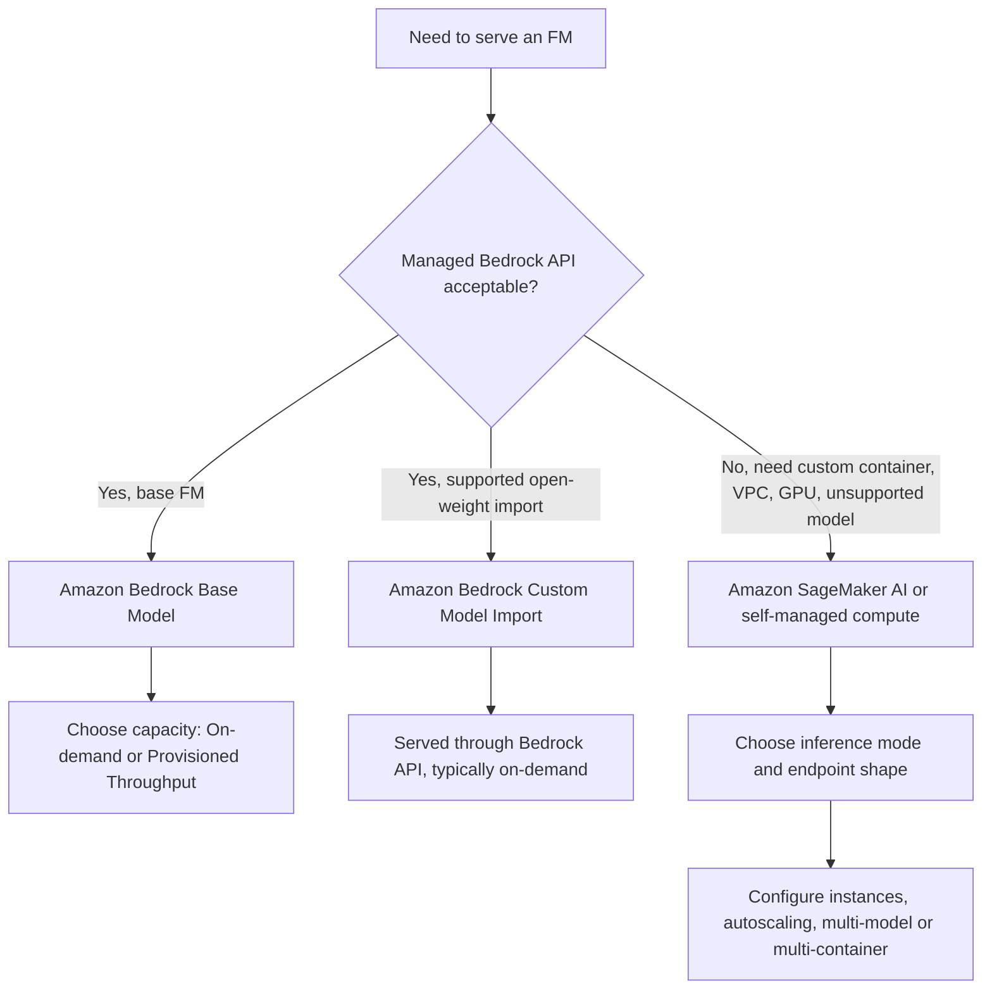
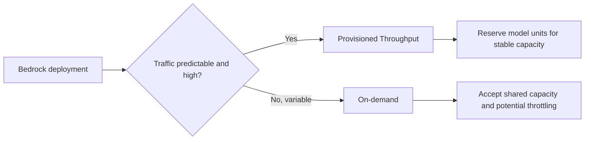
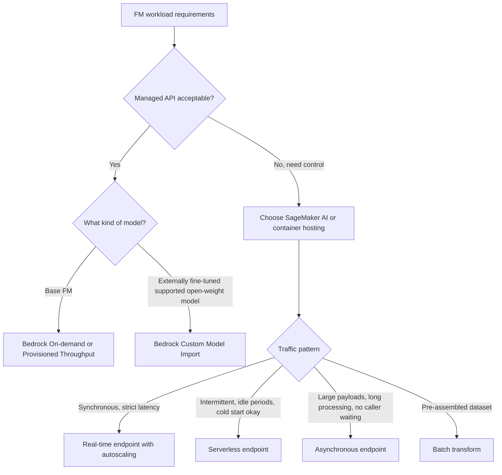

# Task 3.1: Deployment and Orchestration of ML and AI Workflows - Manage deployment infrastructure for ML and AI model types

## Skill 3.1.7: Configure FM deployment, model hosting, and resource allocation

### Purpose

This skill covers how to choose where a foundation model (FM) runs, how requests reach it, and how compute capacity is allocated. For the exam, the key distinction is whether you are consuming a managed FM API—such as Amazon Bedrock—or hosting a model yourself on SageMaker AI or container infrastructure.

The correct answer usually comes from three signals:

1. Who is waiting for the answer?
2. How strict is the latency requirement?
3. How does inference traffic arrive: continuous, bursty, queued, or bulk?

---

## 1. FM deployment options at a glance

| Deployment option | Model source | Management model | Resource allocation | Best for |
| --- | --- | --- | --- | --- |
| Amazon Bedrock base FMs | AWS-managed foundation models | Fully managed API; no endpoint or instances | On-demand or Provisioned Throughput | Fast access to popular FMs without hosting |
| Amazon Bedrock Custom Model Import | Custom weights in S3 from supported open-weight architectures | Fully managed API; no endpoint | On-demand invocation | Bringing externally fine-tuned open models into Bedrock |
| Amazon SageMaker JumpStart | Prebuilt open model catalog | Managed SageMaker endpoint | Instance type, count, autoscaling | Quick deployment of popular models with more control |
| Amazon SageMaker AI endpoints | Model you supply or import | Managed hosting with endpoint | Instances, autoscaling, multi-model packaging | Custom containers, unsupported architectures, VPC, GPU control |
| Amazon ECS/EKS/EC2 | Model you containerize or install directly | Self-managed compute | Cluster or instance sizing | Teams needing full infrastructure control |

### Deployment decision flow

---

## 2. Configuring FM deployment in Amazon Bedrock

Amazon Bedrock is the primary managed FM API. There is no endpoint or instance to size in the traditional sense, but you still make an explicit resource allocation decision.

### Base model access modes

| Mode | What it means | When to use |
| --- | --- | --- |
| On-demand | Shared capacity with no upfront commitment | Variable traffic, prototyping, unknown demand |
| Provisioned Throughput | Reserved model processing capacity for a set level of throughput | Production steady-state traffic, guaranteed capacity, custom models fine-tuned in Bedrock |

### Key exam facts

- **On-demand** does not reserve capacity. Under heavy load, requests can be throttled.
- **Provisioned Throughput** reserves capacity for predictable high-throughput workloads.
- A model customized inside Amazon Bedrock is served through **Provisioned Throughput**, not on-demand.
- A model imported through **Custom Model Import** can generally be served on-demand.
- There is still no endpoint or instance to manage with Bedrock; you allocate throughput, not VMs.

### Amazon Bedrock Custom Model Import

This feature lets you bring a model customized outside AWS into Amazon Bedrock.

Requirements and constraints:

- The model must be stored in Amazon S3.
- The architecture must be one of the supported open-weight architectures.
- Once imported, the model is invoked through the standard Bedrock API.
- This is not the same as hosting on SageMaker; you do not choose GPU instances or VPC placement.

Use Custom Model Import when the question says:

- The team fine-tuned an open-weight model in its own environment.
- The team wants a managed API.
- The team does not want to operate an endpoint.
- The model architecture is supported.

Do not use Custom Model Import when:

- The architecture is unsupported or proprietary.
- The team needs a custom inference container.
- The workload requires VPC-only deployment, GPU instance types, or specialized networking.

---

## 3. Configuring FM hosting on Amazon SageMaker AI

Amazon SageMaker AI is the correct choice when Bedrock cannot satisfy the requirements. This includes:

- Unsupported model architecture
- Custom inference code or container
- Specific GPU or accelerator requirements
- VPC isolation
- Multi-model endpoint or multi-container pipeline requirements
- Tight control over autoscaling

### SageMaker AI inference options for FMs

| Inference option | Workload pattern | Latency expectation | Scaling behavior |
| --- | --- | --- | --- |
| Real-time endpoint | Continuous or spiky synchronous traffic | Millisecond to low-second responses | Autoscales based on invocation metrics |
| Serverless endpoint | Intermittent traffic with real idle periods | Can tolerate cold starts unless provisioned concurrency is used | Scales to zero; pay only for execution |
| Asynchronous endpoint | Large payloads or long processing per request | Caller receives acknowledgment; not blocked | Requests queued; can scale to zero |
| Batch transform | Pre-assembled dataset in S3 | No live caller | Compute runs, writes results, shuts down |

### SageMaker endpoint shapes

| Endpoint shape | Assumption | Use case |
| --- | --- | --- |
| Single-model endpoint | One model on a dedicated fleet | High throughput or strict latency model |
| Multi-model endpoint | Models share a serving container and framework | Many small models with uneven traffic |
| Multi-container endpoint | Different containers on one endpoint | Inference pipelines or directly invoked containers |
| Inference components | Multiple models on an instance with separate resource allocation | Fine-grained CPU/GPU sharing and independent scaling |

### Multi-model endpoint trap

A multi-model endpoint assumes the models use the same framework and serving container. Models are loaded from Amazon S3 into memory when traffic arrives.

Rarely used models can have a load penalty on first invocation. This is acceptable when cost is more important than cold-start latency for rarely used models.

A multi-container endpoint is different. The containers can differ and are either invoked directly or run in sequence as a pipeline.

---

## 4. Resource allocation and capacity planning

### Resource allocation in Amazon Bedrock

For Bedrock, resource allocation is a throughput decision:

- On-demand: no reserved capacity; suitable for variable traffic.
- Provisioned Throughput: commit throughput capacity; suitable for production workloads.
- Provisioned Throughput does not mean you manage instances; it means you reserve Bedrock capacity.

### Resource allocation in SageMaker AI

For SageMaker endpoints, resource allocation includes:

| Resource lever | What it controls |
| --- | --- |
| Instance type | CPU, GPU, AWS Inferentia or Trainium accelerators, memory |
| Instance count | Total concurrency and throughput |
| Autoscaling policy | How instance count follows invocation metrics |
| Serverless provisioned concurrency | Warm capacity to reduce cold starts |
| Endpoint shape | Single-model, multi-model, multi-container, or inference components |

### Real-time vs serverless resource allocation

- **Real-time endpoints** maintain warm instances. They are best for strict latency.
- **Serverless endpoints** scale to zero. Cold starts are possible.
- Serverless endpoints do not support accelerated instances, VPC configuration, or multi-model hosting.
- If a scenario mentions VPC, GPU, or multi-model, serverless is often ruled out.

### Scale-to-zero behavior

A real-time endpoint can scale to zero, but it is not a single simple switch:

- It requires inference components plus an autoscaling policy.
- While scaled to zero, a new request can fail until an instance is provisioned.
- This is dangerous for synchronous, user-facing workloads.

---

## 5. Summary decision framework

---

## 6. Scenario-based examples

### Scenario 1: Externally fine-tuned model through managed API

**Question example**

A company fine-tuned an open-weight Llama model in its own training environment. The model artifacts are stored in Amazon S3. The ML team wants to serve this model through a managed API without operating an endpoint or sizing instances.

Which approach should the team use?

**Answer**

Amazon Bedrock Custom Model Import.

**Explanation**

Custom Model Import brings supported open-weight models into Amazon Bedrock from Amazon S3. The model is then served through the Bedrock invocation API without managing instances.

Why not the other options?

- SageMaker real-time endpoint requires instance and endpoint management.
- SageMaker batch transform is offline, not a managed API.
- Provisioned Throughput alone does not import externally customized model weights.

---

### Scenario 2: Production FM with guaranteed throughput

**Question example**

A customer-facing generative AI application uses an Amazon Bedrock base model. Traffic is steady during business hours, and the application cannot tolerate throttling during peak usage.

Which configuration is most appropriate?

**Answer**

Purchase Provisioned Throughput for the Bedrock model.

**Explanation**

Provisioned Throughput reserves model processing capacity for production workloads that need stable, predictable throughput. On-demand mode uses shared capacity and may throttle under high concurrency.

Why not the other options?

- On-demand is for variable or unpredictable traffic.
- Moving to SageMaker is unnecessary if Bedrock already supports the model.
- Enabling autoscaling does not apply to Bedrock in the same way it does to SageMaker endpoints.

---

### Scenario 3: Need for GPU, VPC, and custom serving container

**Question example**

An organization needs to deploy a custom foundation model that requires a specific GPU accelerator, must run inside a VPC, and uses a custom inference container. The model architecture is not supported by Amazon Bedrock Custom Model Import.

Which hosting option should the organization select?

**Answer**

A SageMaker AI real-time endpoint with the appropriate GPU instance type.

**Explanation**

SageMaker provides control over instance type, VPC placement, and custom serving containers. Bedrock Custom Model Import cannot support unsupported architectures, custom GPU requirements, or custom containers.

---

### Scenario 4: Many small FMs with uneven traffic

**Question example**

A team has many small models built on the same framework. A few are called continuously, but most are used occasionally. The team wants to minimize cost while maintaining a single endpoint.

Which endpoint shape should the team use?

**Answer**

A SageMaker multi-model endpoint.

**Explanation**

A multi-model endpoint hosts many models behind one shared serving container. Frequently used models remain loaded. Rarely used models are loaded from S3 when requested, accepting a cold-load penalty.

Why not separate endpoints?

Separate single-model endpoints would leave many instances idle and increase cost.

---

## 7. Exam tips and traps

### Exam tips

- For managed FM access, consider Amazon Bedrock first.
- For custom control, consider SageMaker AI.
- Separate capacity decisions from instance decisions.
- Bedrock capacity is chosen through on-demand or Provisioned Throughput.
- SageMaker capacity is chosen through instance type, count, and autoscaling.
- Use real-time endpoints for synchronous, user-blocking traffic.
- Use serverless endpoints for intermittent traffic with idle periods.
- Use asynchronous inference for queued individual requests with long processing times.
- Use batch transform for pre-assembled datasets.

### Common traps

- **Trap:** Choosing Bedrock for every FM scenario.
  - Bedrock cannot handle unsupported architectures, custom containers, VPC-only requirements, or specific GPU instance selection.
- **Trap:** Assuming Custom Model Import works for any model.
  - It only supports specific open-weight architectures and file layouts.
- **Trap:** Thinking a Bedrock customized model behaves like an imported model.
  - A model customized inside Bedrock normally requires Provisioned Throughput.
  - A model brought in through Custom Model Import is typically served on-demand.
- **Trap:** Equating SageMaker serverless with real-time.
  - Serverless can scale to zero and may cause cold starts.
- **Trap:** Choosing serverless when the question mentions GPU, VPC, or multi-model.
  - SageMaker serverless does not support these configurations.
- **Trap:** Using batch transform for individual dynamic requests.
  - Batch transform expects a static dataset, not live request traffic.
- **Trap:** Confusing multi-model and multi-container endpoints.
  - Multi-model: same framework and serving container.
  - Multi-container: different containers, often as a pipeline.

---

## 8. Quick recall

- Managed FM API = Amazon Bedrock.
- Externally fine-tuned open-weight model + managed API = Bedrock Custom Model Import.
- Bedrock capacity modes = on-demand vs Provisioned Throughput.
- SageMaker managed hosting = real-time, serverless, asynchronous, batch.
- Strict latency + steady traffic = real-time endpoint.
- Idle periods + bursty low volume = serverless.
- Large individual queued requests = asynchronous.
- Pre-assembled dataset = batch transform.
- Many small models sharing a framework = multi-model endpoint.