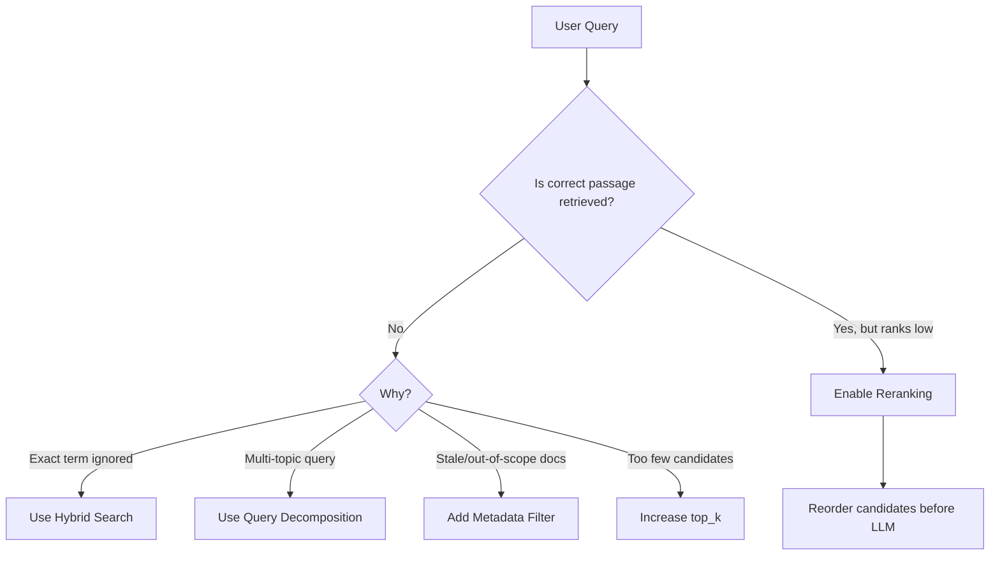

# Task 3.1: Deployment and Orchestration of ML and AI Workflows - Manage deployment infrastructure for ML and AI model types

## Skill 3.1.8: Apply Retrieval Augmented Generation (RAG) system configurations (for example, retrieval strategies, reranking)

---

## 1. Introduction to RAG

Retrieval Augmented Generation (RAG) is a pattern that improves large language model (LLM) responses by providing verified, task-specific context from an external knowledge source before the model generates an answer. Instead of relying solely on parametric memory, RAG systems retrieve relevant documents or text passages and place them directly into the LLM's prompt as context.

The core benefits of RAG are:

- Reduces hallucinations by grounding responses in real, retrieved data.
- Provides access to up-to-date or private information without retraining the foundation model.
- Adds source transparency and often includes citations from retrieved passages.
- Separates long-term knowledge storage from model weights.

A RAG workflow can be represented as follows:

In this two-stage architecture:

1. **Retrieval stage:** An efficient model, often a bi-encoder or hybrid search, fetches a candidate set of passages from a knowledge base.
2. **Reranking stage:** A more precise model, often a cross-encoder reranker, reorders that candidate set so only the most relevant passages enter the LLM's context window.

---

## 2. RAG System Configuration Overview

When configuring a RAG system in AWS, the main levers are:

- **Retrieval strategy:** How documents are found from the knowledge base.
- **Number of retrieved passages:** How many candidate passages come back from the first stage.
- **Metadata filtering:** Which documents are eligible for retrieval at all.
- **Reranking:** Whether and how the retrieved passages are reordered before final prompting.
- **Ingestion settings:** How documents are chunked and embedded before retrieval.

The table below summarizes the effect of each configuration lever:

| Configuration Lever | What It Changes | Main Trade-Off |
| --- | --- | --- |
| Retrieval strategy | Which search algorithm finds candidates | Semantic meaning vs. exact keyword matching |
| Number of retrieved passages (top_k) | Size of candidate set returned | Higher recall vs. more irrelevant noise |
| Metadata filtering | Narrows eligible documents before retrieval | Precision vs. risk of missing valid content |
| Reranking | Reorders candidates by deeper relevance | Higher precision vs. additional latency and cost |
| Query decomposition | Splits compound questions into sub-queries | Better topical retrieval vs. more backend steps |

---

## 3. Retrieval Strategies

Retrieval strategies define how the system compares the user query against the knowledge base. The main options are semantic search, hybrid search, and metadata-filtered search.

### 3.1 Semantic Vector Search

Semantic search embeds both the query and the documents into a shared vector space. It retrieves documents whose embeddings are nearest to the query embedding.

- **Strengths:** Captures conceptual similarity, synonyms, and paraphrases.
- **Limitations:** Can miss exact identifiers, SKU codes, product names, legal citations, or error codes that embeddings may blur.

### 3.2 Hybrid Search

Hybrid search combines semantic vector similarity with a lexical keyword match, such as BM25. It retrieves candidates that match either the meaning or the exact text.

- **Strengths:** Recovers precise terms that semantic search alone might miss.
- **Limitations:** Requires a vector store that supports both dense vector search and keyword search on a text field.
- **Best for:** Documentation with serial numbers, product IDs, compliance codes, or exact technical terms.

### 3.3 Metadata Filtering

Metadata filtering reduces the candidate set before similarity retrieval is applied. Filters can target attributes such as document date, category, language, source, or version.

- **Strengths:** Prevents stale, out-of-scope, or irrelevant documents from ever being considered.
- **Limitations:** Overly aggressive filters can exclude valid documents.
- **Key timing:** Metadata filters are applied before similarity scoring, not after retrieval.

### 3.4 Query Decomposition

Query decomposition breaks a compound query into multiple sub-queries, each targeting a distinct topic. Each sub-query retrieves separate relevant passages, and the results are combined.

- **Best for:** Questions such as "Compare the return policy for electronics with the return policy for furniture."
- **Effect:** Improves recall for multi-topic prompts by preventing one dominant topic from drowning out another.

### 3.5 Retrieval Strategy Comparison

| Strategy | Mechanism | Best Use Case | Key Dependencies |
| --- | --- | --- | --- |
| Semantic search | Dense vector nearest-neighbor | Broad conceptual questions | Embedding model, vector store |
| Hybrid search | Vector similarity + BM25 keyword | Documentation with exact identifiers | Vector store with text field support |
| Metadata filtering | Pre-filter by document attributes | Stale or out-of-scope content control | Indexed metadata fields |
| Query decomposition | Split query into sub-queries | Multi-topic compound questions | Orchestration layer supporting multi-query |

---

## 4. Reranking

Reranking is a second-pass scoring process applied after the initial retrieval returns a candidate list. It improves the **ordering** of already retrieved passages.

### 4.1 Bi-Encoder vs. Cross-Encoder

| Property | Bi-Encoder | Cross-Encoder Reranker |
| --- | --- | --- |
| Speed | Very fast, can precompute document embeddings | Slower, computes query-document pair jointly |
| Accuracy | Approximate similarity | High-precision relevance scoring |
| Use in RAG | Stage 1 retrieval | Stage 2 reranking |
| Example | Titan Embeddings, Cohere Embed | Amazon Rerank, Cohere Rerank |

### 4.2 What Reranking Fixes

Reranking directly fixes the problem of a relevant passage appearing far down in the initial retrieval list.

For example:

- A knowledge base retrieves 20 passages.
- The correct passage is at position 12.
- A reranking model re-evaluates all 20 candidates alongside the query.
- The correct passage moves to position 1 or 2 before being passed to the LLM.

### 4.3 What Reranking Cannot Fix

Reranking cannot rescue a passage that was never retrieved by the initial search. If the correct passage was not in the top-K candidate set, reranking cannot add it back.

This is the core distinction:

- **Retrieval controls recall:** Did we retrieve the relevant passage at all?
- **Reranking controls precision/ordering:** Among retrieved passages, which are most relevant and should appear first?

### 4.4 Reranking Configuration Impacts

| Change | Effect | Risk |
| --- | --- | --- |
| Enable reranking | Reorders initial candidates by semantic relevance | Adds latency and cost |
| Reduce top_k after retrieval | Sends fewer passages to LLM | Can drop a low-ranked correct passage |
| Rerank to smaller N | Keeps only highest-ranked candidates | Improves precision if reranker is accurate |
| Keep top_k too high | More context, more recall | Adds noise and prompt bloat |

---

## 5. Amazon Bedrock Knowledge Bases Configuration

Amazon Bedrock Knowledge Bases provides a managed RAG pipeline that handles ingestion, vector storage, retrieval, and optional generation. Its configurable parameters map directly to the RAG levers described above.

### 5.1 Common Configurable Settings

| Bedrock Knowledge Base Setting | RAG Lever | Typical Values / Options |
| --- | --- | --- |
| Search type | Retrieval strategy | `Hybrid`, `Semantic`, or `Default` |
| Number of results | top_k | Configurable, often 1–20 |
| Metadata filtering | Pre-retrieval eligibility | Equals, not-equals, greater-than, etc. |
| Reranking model | Reranking pass | Amazon Bedrock Rerank or Cohere Rerank |
| Chunking strategy | Ingestion | Fixed-size, semantic, hierarchical, none |
| Embedding model | Vector representation | Amazon Titan Embeddings, Cohere Embed |

### 5.2 Search Type in Bedrock Knowledge Bases

- **Default:** Uses the vector store's recommended retrieval method.
- **Semantic:** Pure vector similarity search.
- **Hybrid:** Combines vector search with keyword search. Requires a vector store that supports hybrid search.
- **Manual search:** Enables custom retrieval using your own logic, but does not use Bedrock's managed retrieval directly.

### 5.3 Metadata Filtering in Bedrock

Metadata filtering in Amazon Bedrock Knowledge Bases allows filtering retrieved documents by custom attributes before the similarity search runs.

Use cases include:

- Filtering documents to a specific calendar year or date range.
- Restricting retrieval to a department-specific knowledge base partition.
- Excluding outdated document versions.
- Ensuring compliance by allowing only documents from an approved source.

### 5.4 Reranking in Bedrock

When reranking is enabled, Bedrock Knowledge Bases first retrieves a larger candidate set, then applies the reranking model to select or reorder the most relevant passages.

Configuration decisions include:

- Which reranking model to use.
- How many final passages to include in the LLM context after reranking.
- Whether to enable reranking at all for latency-sensitive workloads.

---

## 6. Scenario-Based Examples

### Scenario 1: E-commerce Product Support Assistant

**Requirement:** A retail company builds a customer support chatbot over thousands of product manuals. Users often ask for specific SKU numbers, error codes, and model names. Semantic search alone frequently misses exact part numbers.

**Analysis:**

- The knowledge base contains precise identifiers that embeddings do not reliably preserve.
- Hybrid search will combine semantic understanding with exact keyword matching.
- The vector store must support a filterable text field for keyword search.

**Correct configuration:**

- Enable **Hybrid Search**.
- Ensure the vector store supports both dense vectors and BM25-style text search.
- Optionally add metadata filtering for product category to narrow the retrieval space.

**Why not pure semantic search?**  
A vector embedding of "Error 403A" may be close to "Error 401B" or generic authentication errors. Hybrid search preserves the exact string.

---

### Scenario 2: Financial Policy Assistant with Document Dates

**Requirement:** A bank maintains years of financial policy documents. Users complain that outdated policies from prior years continue to appear in answers, even though a current policy exists.

**Analysis:**

- The correct current policy may be semantically similar to older versions, so vector similarity returns stale documents.
- The right tool is metadata filtering on document effective date or policy version before any retrieval occurs.

**Correct configuration:**

- Apply metadata filter: `Year = 2025` or `Status = Active`.
- Do not rely solely on reducing top_k because the current document may still be missing.

**Key exam trap:**  
Metadata filtering is a **pre-retrieval** action. It narrows eligible candidates before similarity search runs.

---

### Scenario 3: Legal Research with Compound Questions

**Requirement:** A legal assistant RAG system receives questions such as: "What are the retention requirements for employee records in the EU compared with the US?"

**Analysis:**

- A single embedding of the full query blends two distinct topics.
- Retrieval may disproportionately favor one region.
- Query decomposition splits the question into two sub-queries: EU retention requirements and US retention requirements.

**Correct configuration:**

- Use query decomposition or multiple retrieval calls.
- Aggregate results from both sub-queries before generation.
- Reranking can then order the combined candidates by relevance to the overall question.

**Key exam trap:**  
Reranking alone cannot solve the imbalance. If the first retrieval pass never returns both topical sets, reranking cannot manufacture them.

---

### Scenario 4: Relevant Passage Present but Low in the List

**Requirement:** A managed Bedrock Knowledge Base returns the right document, but it appears at position 14 of 20 while weaker passages rank above it. The generated answer therefore misses the critical passage.

**Analysis:**

- The correct passage was retrieved, so recall is fine.
- The problem is precision and ordering.

**Correct configuration:**

- Enable a reranking model.
- Keep the initial top_k high enough to include the correct passage early in stage 1.
- Allow the reranker to reorder candidates and pass only the top final N passages to the LLM.

**What not to do:**

- Do not reduce top_k from 20 to 10 to remove weak passages. That would drop the correct passage at position 14.
- Do not switch vector stores just to improve ordering; the issue is ranking, not vector storage.
- Do not re-embed documents with more dimensions as a primary fix; that requires a full re-index and still may not solve cross-encoder ordering.

---

## 7. Exam Tips and Traps

### Tip 1: Distinguish Recall from Precision

- **Recall problem:** Correct passage is not retrieved at all. Fix with retrieval strategy changes: hybrid search, query decomposition, higher top_k, better chunking, or metadata filter changes.
- **Precision/ordering problem:** Correct passage is retrieved but ranks low. Fix with reranking.

### Tip 2: Reranking Does Not Increase Recall

A reranker can only reorder the candidate set already returned by the first-stage retriever. If the correct passage is missing from the candidate set, enabling reranking will not help.

### Tip 3: Reducing top_k Can Hurt More Than Help

If a correct passage is ranked low, lowering top_k can remove the only relevant passage. Prefer reranking over top_k reduction when the complaint is weak ordering.

### Tip 4: Hybrid Search Depends on Infrastructure

Hybrid search requires a vector store or search engine that supports keyword match alongside dense vectors. Not all vector databases can do this. In Amazon Bedrock Knowledge Bases, hybrid search availability depends on the chosen vector store.

### Tip 5: Metadata Filtering Happens First

Metadata filters reduce the candidate set before similarity search is applied. Use metadata filtering when stale, out-of-scope, or unauthorized documents keep appearing, especially when past versions are semantically similar to current ones.

### Tip 6: Query Decomposition for Multi-Topic Questions

If a question contains multiple independent topics, a single query vector may retrieve only one topic. Query decomposition or multiple targeted retrievals improve recall for compound questions.

### Tip 7: Reranking Adds Latency and Cost

Enabling reranking adds a second model call and increases the inference time. For strict real-time applications, weigh the precision benefit against the added latency. For offline or asynchronous RAG workloads, reranking is often a clear win.

### Trap 1: Choosing Semantic Search for Exact Identifiers

Many candidates incorrectly select pure semantic search for product IDs, SKUs, invoice numbers, or error codes. Hybrid search is the better choice when exact terms must be preserved.

### Trap 2: Re-embedding to Fix Ordering

Some scenarios propose re-embedding all documents with higher-dimensional embeddings to improve ranking. While embeddings matter, a cross-encoder reranker is more direct and less operationally expensive for fixing ordering.

### Trap 3: Treating Reranking as a Replacement Retrieval Engine

Reranking is not a replacement for the initial retriever. It sits after retrieval and cannot scan the entire knowledge base. It only refines the retrieved candidate set.

---

## 8. Quick Recall Summary

- **RAG retrieval levers:** search type, top_k, metadata filtering, query decomposition.
- **Reranking levers:** rerank model, number of final passages.
- **Semantic search:** meaning-based, can miss exact terms.
- **Hybrid search:** meaning plus keyword, ideal for precise identifiers.
- **Metadata filter:** applied before retrieval, ideal for outdated or out-of-scope content.
- **Query decomposition:** splits questions into topical sub-queries.
- **Reranking:** reorders existing candidates; does not fix failed recall.

### Decision Flow

