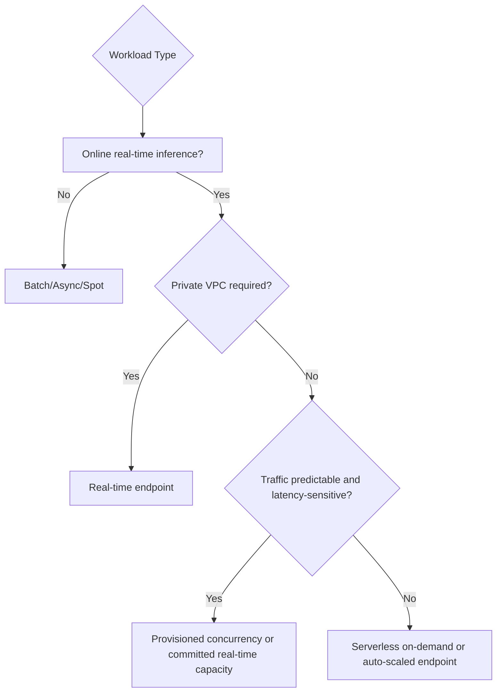

# Task 3.2: Deployment and Orchestration of ML and AI Workflows - Provision and configure resources for ML and AI workloads based on existing architecture and requirements.

## Skill 3.2.1: Optimize resource provisioning between on-demand and provisioned resources for performance and cost efficiency.

This skill is about choosing the right capacity posture for ML and AI workloads. You must balance:

- **Performance** – low latency, predictable throughput, no cold starts, no throttling
- **Cost** – pay only for what you consume, avoid idle resources, use commitment discounts
- **Architecture constraints** – VPC requirements, GPU availability, endpoint type, model hosting service

The exam often tests your ability to choose between:

- **On-demand capacity** – elastic, pay-per-use, no long-term commitment
- **Provisioned capacity** – pre-allocated, committed or reserved, predictable performance

---

## 1. Core On-Demand vs. Provisioned Concept

| Dimension | On-Demand Resources | Provisioned Resources |
|---|---|---|
| Payment | Pay per invocation, token, instance-hour actually used | Pay for committed or reserved capacity, even if idle |
| Scaling | Elastic, often automatic | Fixed or manually adjusted baseline |
| Cold starts | More likely in serverless or idle hosted options | Reduced or eliminated because capacity is warm |
| Availability | Subject to service quotas and capacity availability | Guaranteed capacity or throughput |
| Best for | Spiky, intermittent, experimental, unpredictable workloads | Steady-state, production, latency-sensitive, high-throughput workloads |
| Main risk | Throttling, slow scale-up, higher unit cost | Idle capacity waste, over-provisioning cost |

In ML and AI workloads, "provisioned" can mean several different things depending on the AWS service:

- Amazon SageMaker AI real-time endpoint with fixed instances
- SageMaker AI serverless inference with provisioned concurrency
- Amazon Bedrock provisioned throughput
- Reserved Instances, Savings Plans, or Capacity Blocks for GPU-backed compute

---

## 2. Provisioning Choices by AWS Service

### 2.1 Amazon SageMaker AI Inference

SageMaker AI offers several inference options. The capacity decision often comes down to:

| Option | Capacity Model | Cost Behavior | Performance Behavior | Use Case |
|---|---|---|---|---|
| Real-time endpoint | Always-on instances, scaled by Application Auto Scaling | Pay per instance-hour; Savings Plans/Reserved Instances can reduce cost | Low latency, warm instances, supports VPC and GPUs | Steady or high-performance online inference |
| Serverless inference – on-demand | Fully managed, scales to zero | Pay per invocation and duration; no idle cost | Cold starts possible | Intermittent, spiky, low-to-moderate traffic |
| Serverless inference – provisioned concurrency | Pre-warmed serverless capacity | Pay for provisioned concurrency even when idle | Reduces serverless cold starts, predictable concurrency | Predictable baseline with latency sensitivity |
| Asynchronous inference | Queued, scales based on queue depth | Pay for underlying compute while processing | No immediate latency requirement | Large payloads, long inference times |
| Batch Transform | Scheduled or triggered job | Pay for job duration | No online latency concern | Large offline batch scoring |

#### Key Decision Points for SageMaker AI

- **Private VPC required?**
  - Real-time endpoints support VPC network configuration.
  - SageMaker serverless endpoints do not support VPC network isolation.
  - If compliance or architecture requires private subnets, private endpoints, and security groups, use a real-time endpoint.

- **Traffic drops to zero?**
  - Real-time endpoint instances continue running and billing unless scaled down.
  - Serverless on-demand can scale to zero and stop charging for idle capacity.
  - This makes serverless on-demand more cost-efficient for intermittent workloads.

- **Latency-sensitive with cold-start concerns?**
  - Serverless on-demand can experience cold starts.
  - Serverless provisioned concurrency keeps capacity warm.
  - Real-time endpoints are also warm because instances remain running.

---

### 2.2 Amazon Bedrock On-Demand vs. Provisioned Throughput

Amazon Bedrock is commonly used for foundation model inference. The capacity choice is:

| Option | Payment | Throughput | Best For |
|---|---|---|---|
| On-demand | Pay per input/output token | Shared, subject to account/region quotas | Experimentation, variable traffic, early development |
| Provisioned throughput | Purchase Model Units with 1- or 6-month commitment | Guaranteed throughput, no throttling due to shared capacity | Production workloads requiring stable token throughput |

#### Important Bedrock Details

- **Model Units (MUs)** represent guaranteed input and output token throughput.
- Provisioned throughput is billed hourly for the committed term, regardless of actual token usage.
- Provisioned throughput is often required for certain custom model or performance-sensitive workloads.
- On-demand can throttle if you exceed default token or request quotas.
- Use provisioned throughput when a business event, product launch, or production application must meet a guaranteed token-per-minute requirement.

---

### 2.3 Training Workloads and GPU Capacity

For model training and GPU-heavy AI workloads:

| Provisioning Choice | Cost | Risk | Use Case |
|---|---|---|---|
| On-demand training instances | Standard hourly price | Minimal risk | Deadline-critical training, short runs |
| Managed Spot training | Up to ~90% discount | Can be interrupted | Fault-tolerant, checkpointed, long-running training |
| SageMaker HyperPod | Provisioned resilient accelerator cluster | Higher commitment | Large-scale distributed training requiring automatic fault recovery |
| Capacity Blocks/Reserved GPU capacity | Committed capacity, possible discount | Pay even if temporarily unused | Guaranteeing access to scarce GPU instance types |

#### Training Provisioning Strategy

- Use **Managed Spot** when the job can tolerate interruption and supports checkpointing.
- Use **on-demand** or **HyperPod** when training must complete by a strict deadline.
- Use **HyperPod** for long-running distributed training jobs because it can replace faulty nodes automatically.
- Use **Capacity Blocks** when you need short-term guaranteed GPU capacity for a critical launch or evaluation.

---

## 3. Cost-Performance Decision Framework

### 3.1 Recommended Choices by Workload Pattern

| Workload Pattern | Cost-Efficient Choice | Performance-Sensitive Choice |
|---|---|---|
| Low, unpredictable, intermittent traffic | Serverless on-demand or auto-scaled endpoint | Real-time endpoint with smaller instance count |
| Steady, predictable production traffic | Real-time endpoint with Savings Plans/Reserved Instances | Real-time endpoint with provisioned GPUs or auto scaling |
| Bursty inference with cold-start concern | Serverless provisioned concurrency only during active hours | Real-time endpoint with auto scaling |
| High token throughput from foundation model | Bedrock on-demand if quota is sufficient | Bedrock provisioned throughput |
| Long-running training that tolerates interruptions | Managed Spot training | On-demand or HyperPod |
| Short-term GPU capacity guarantee | Capacity Blocks | Same |

---

## 4. Scenario-Based Examples

### Scenario 1: Intermittent Internal Chatbot

A company runs an internal generative AI chatbot that is used only sporadically. Traffic often drops to zero overnight. The current real-time SageMaker endpoint runs a GPU instance 24/7, causing high cost.

**Best optimization:**  
Migrate to **SageMaker serverless inference on-demand** so the endpoint can scale to zero and stop billing during idle periods.

**Why:**  
The workload is not latency-sensitive enough to require warm instances. On-demand serverless eliminates idle instance-hour costs.

---

### Scenario 2: Production Fraud Model with Strict Latency

A financial services company deploys a fraud detection model. It receives steady traffic during business hours, with consistent request shape and strict p99 latency requirements.

**Best optimization:**  
Use a **SageMaker real-time endpoint** with an appropriate instance family and purchase **SageMaker Savings Plans** or Reserved capacity for the long-running baseline.

**Why:**  
The workload is predictable and latency-sensitive. Real-time instances remain warm, and committed capacity reduces the effective hourly cost.

---

### Scenario 3: Bedrock LLM Application Launch

A team is launching an external-facing summarization feature built on Amazon Bedrock. During the launch, traffic is expected to be high and sustained. They are concerned about Bedrock on-demand throttling.

**Best optimization:**  
Purchase **Bedrock provisioned throughput** using Model Units for the duration of the launch.

**Why:**  
Provisioned throughput provides guaranteed token throughput and prevents throttling, even if the baseline is not perfectly known in advance.

---

### Scenario 4: Long-Running Training Job

A data science team needs to fine-tune a transformer model. The job can take hours and the team already saves checkpoints. Cost is a major concern.

**Best optimization:**  
Use **SageMaker Managed Spot training** with checkpointing.

**Why:**  
Spot training can significantly reduce cost. Checkpoints allow the job to resume if interrupted.

---

## 5. Exam Tips and Traps

### Exam Tips

- **Match the provisioning choice to the traffic pattern.**
  - Predictable, steady, latency-sensitive → provisioned capacity
  - Spiky, intermittent, unpredictable → on-demand or serverless

- **Remember that serverless on-demand is not the best choice when VPC or GPU requirements exist.**
  - SageMaker serverless endpoints do not support VPC network isolation.
  - Real-time endpoints are required for VPC deployment.

- **Know the difference between SageMaker real-time endpoints and serverless inference.**
  - Real-time endpoints use provisioned instances.
  - Serverless inference has on-demand and provisioned concurrency modes.

- **Understand Amazon Bedrock provisioned throughput.**
  - It is purchased in Model Units.
  - It guarantees throughput.
  - It requires a commitment and bills hourly.

- **For training cost optimization**, consider Managed Spot if the job can tolerate interruption and supports checkpoints.

- **For stable real-time endpoint baselines**, use SageMaker Savings Plans or Reserved Instances rather than paying full on-demand instance prices.

- **For GPU capacity shortages**, Capacity Blocks or provisioned GPU capacity can guarantee availability.

### Common Traps

1. **Assuming provisioned concurrency always reduces cost.**
   - If traffic is low or zero, provisioned concurrency may cost more than on-demand serverless because you pay for reserved concurrency while idle.

2. **Confusing SageMaker provisioned concurrency with Bedrock provisioned throughput.**
   - SageMaker provisioned concurrency is about serverless endpoints and concurrency.
   - Bedrock provisioned throughput is about foundation model token throughput and Model Units.

3. **Choosing serverless inference when VPC placement is required.**
   - Serverless inference does not support VPC network configuration.
   - A private network requirement forces a real-time endpoint or another VPC-capable hosting option.

4. **Using Spot for deadline-critical training without recovery strategy.**
   - Spot instances can be interrupted.
   - If training cannot resume or must finish by a deadline, use on-demand or HyperPod.

5. **Ignoring Bedrock on-demand quotas.**
   - On-demand may throttle under high concurrent token load.
   - A production or launch scenario often needs provisioned throughput.

6. **Assuming auto scaling replaces committed cost savings.**
   - Auto scaling controls capacity dynamically, but for a steady baseline, Savings Plans or Reserved Instances still reduce the hourly rate for the instances that are running.

---

## 6. Quick Reference Table

| Service/Hosting Option | Provisioning Choice | Best Use Case |
|---|---|---|
| SageMaker real-time endpoint | On-demand instances + Savings Plans/Reserved | Steady, low-latency, VPC-enabled online inference |
| SageMaker serverless on-demand | On-demand serverless | Intermittent, spiky, unknown low traffic |
| SageMaker serverless provisioned concurrency | Provisioned serverless concurrency | Predictable serverless traffic with cold-start sensitivity |
| SageMaker Managed Spot training | Spot capacity | Fault-tolerant, checkpointed training |
| SageMaker HyperPod | Provisioned resilient cluster | Long-running, large-scale training |
| Amazon Bedrock on-demand | On-demand token usage | Variable, experimental, low-volume foundation model usage |
| Amazon Bedrock provisioned throughput | Model Units commitment | High-volume, production LLM workloads with guaranteed throughput |
| EC2/SageMaker Capacity Blocks | Reserved GPU capacity | Short-term guaranteed GPU access |

---

## 7. Summary

Optimizing resource provisioning between on-demand and provisioned resources requires you to evaluate three things:

1. **Traffic pattern** – predictable vs. spiky
2. **Performance requirements** – cold start tolerance, latency, throughput, GPU availability
3. **Architecture constraints** – VPC placement, endpoint type, existing infrastructure

Use:

- **On-demand** for unknown, variable, or low-utilization workloads.
- **Provisioned** for steady, high-performance, low-latency, or guaranteed-throughput workloads.
- **Spot** for cost-efficient, interruption-tolerant training.
- **Savings Plans/Reserved Instances** for stable real-time endpoint baselines.
- **Bedrock provisioned throughput** when foundation model token throughput must be guaranteed.
- **Provisioned concurrency** for serverless inference when reducing cold starts is critical, but only if the baseline load justifies the idle cost.

The exam will typically ask you to select the most cost-effective or most performant provisioning strategy based on a scenario. Always identify whether the workload is predictable and latency-sensitive, and whether any network or service-specific constraints exist before choosing.