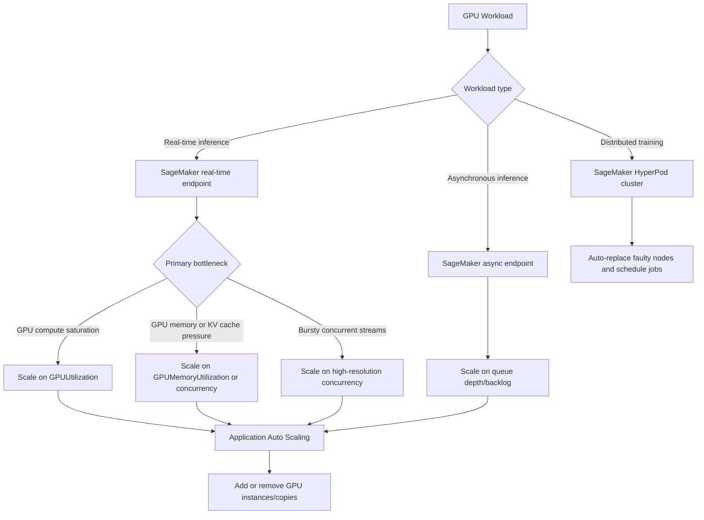
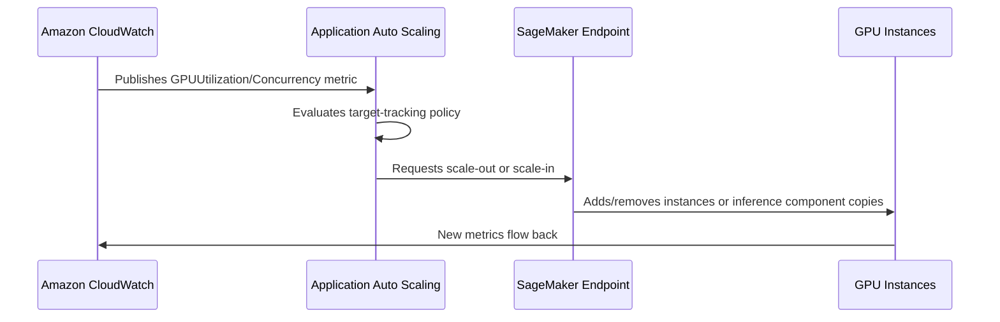

# Task 3.2: Provision and configure resources for ML and AI workloads based on existing architecture and requirements.

## Skill 3.2.10: Implement AI-specific resource scaling for GPU workloads.

| AWS Exam Blueprint Focus | What you must understand |
|---|---|
| GPU workload scaling | Scale hosted GPU inference endpoints using Application Auto Scaling. |
| AI-specific signals | Choose GPU utilization, GPU memory, or high-resolution concurrency instead of CPU or raw invocation count. |
| Inference components | Scale individual models independently on shared GPU infrastructure. |
| Cost and performance trade-offs | Pack multiple models onto GPUs where traffic is low, and scale out dedicated capacity where traffic is high. |
| Training workloads | Use resilient GPU clusters such as Amazon SageMaker HyperPod rather than request-based auto scaling. |

---

## 1. Why GPU scaling is different

GPU-based ML models behave differently from CPU-based applications:

- **GPU compute utilization** can be high even when CPU utilization is low.
- **GPU memory** can become the bottleneck before compute becomes saturated, especially for LLMs with large key-value caches, large batch sizes, or long sequence lengths.
- **Traffic spikes** can cause queuing and latency degradation quickly because GPU instances are expensive and often run near saturation.
- **Scaling out takes time** because GPU instances and model containers must be initialized and loaded into GPU memory.

Therefore, scaling GPU workloads effectively means:

1. Selecting the correct scaling metric for the actual bottleneck.
2. Leaving enough GPU memory and compute headroom to absorb traffic spikes.
3. Using Application Auto Scaling to adjust capacity automatically.
4. Avoiding CPU-based metrics unless CPU is truly the bottleneck.

---

## 2. Services and components involved

| AWS service/feature | Role in GPU scaling |
|---|---|
| **Amazon SageMaker AI real-time endpoints** | Host GPU-backed models for synchronous inference. |
| **Amazon SageMaker AI async endpoints** | Handle large payloads asynchronously and can scale to zero. |
| **Amazon SageMaker AI inference components** | Allow multiple models to share GPU compute on one endpoint. |
| **Amazon SageMaker AI multi-model endpoints** | Host many low-traffic models on a shared GPU endpoint. |
| **Application Auto Scaling** | Registers SageMaker endpoint variants or inference components as scalable targets and applies scaling policies. |
| **Amazon CloudWatch** | Publishes GPU utilization, GPU memory, invocation, and concurrency metrics. |
| **Amazon SageMaker HyperPod** | Provides resilient, self-healing GPU clusters for large-scale training. |

---

## 3. Scaling mental model for GPU workloads

---

## 4. Key GPU-specific scaling signals

### 4.1 GPU utilization

- Metric: **GPUUtilization**
- Best for:
  - Compute-bound models.
  - Shorter inference requests that continuously saturate GPU compute.
  - Throughput-heavy model serving.
- Typical target:
  - 75–85% average GPU utilization.
- Trap:
  - Do not target 90–100% because there is no headroom for request bursts.
  - If requests are long-running or streaming, GPU utilization may already be high before autoscaling reacts.

### 4.2 GPU memory utilization

- Metric: **GPUMemoryUtilization**
- Best for:
  - Memory-bound models.
  - LLMs with large KV caches.
  - Models where batch size or sequence length determines capacity.
- Typical target:
  - 70–85% depending on workload volatility.
- Trap:
  - Memory exhaustion can cause out-of-memory errors. Set a lower target and scale earlier.

### 4.3 High-resolution concurrency

- Metric: **ConcurrentRequestsPerCopyHighResolution** or **ConcurrentRequestsPerModelHighResolution**
- Best for:
  - Streaming responses.
  - Long-running inference requests.
  - Sudden concurrent request spikes that need fast scale-out.
- Advantage:
  - Emits at approximately 10-second intervals, allowing faster reaction than standard 1-minute metrics.
- Trap:
  - Must be paired with appropriate cooldowns to avoid over-provisioning.

### 4.4 Invocations per instance

- Metric: **SageMakerVariantInvocationsPerInstance**
- Best for:
  - Lightweight, synchronous inference with consistent payload sizes.
- Limitation:
  - Does not capture GPU compute or memory saturation.
  - Can be misleading when request payloads vary significantly or when one request uses far more GPU resources than another.

### Metric selection summary

| Scaling signal | Best use case | Reaction speed | Main limitation |
|---|---:|---:|---|
| **GPUUtilization** | Compute-bound inference | Standard 1-minute | May react too late to bursty traffic |
| **GPUMemoryUtilization** | VRAM/KV cache-bound models | Standard 1-minute | Memory can saturate quickly |
| **High-resolution concurrency** | Streaming LLM responses and rapid spikes | ~10 seconds | Requires tuning cooldowns |
| **InvocationsPerInstance** | Simple, short requests with stable resource usage | Standard 1-minute | Ignores GPU saturation |
| **CPUUtilization** | Rarely appropriate for GPU endpoints | Standard 1-minute | CPU may remain low while GPU is maxed |

---

## 5. Application Auto Scaling for GPU endpoints

### Scaling architecture

### How it works

1. Register the SageMaker endpoint variant or inference component as a scalable target.
2. Define a scaling policy:
   - Target tracking scaling is preferred for most GPU inference workloads.
   - Step scaling can be used when you need more direct control.
3. Set minimum and maximum capacity.
4. Set cooldown periods.

### Recommended cooldown guidance

| Cooldown type | Recommendation | Reason |
|---|---:|---|
| Scale-out | Short, but not too short: 60–300 seconds | Allows capacity to come online before another scale-out |
| Scale-in | Longer: 300–900 seconds | Avoids removing capacity immediately after a spike or during model warm-up |

GPU endpoints can take minutes to initialize because the model must be loaded into GPU memory. Aggressive scale-in causes thrashing and cold-start-like latency.

---

## 6. Inference components: scaling models independently on shared GPUs

Inference components enable you to:

- Run multiple models on the same SageMaker endpoint.
- Allocate each model a specific amount of CPU, GPU, and memory.
- Scale each model independently using Application Auto Scaling.

This is useful when:

- You have several models with different traffic patterns.
- One model is memory-bound and another is compute-bound.
- You want to improve GPU utilization without dedicating an entire GPU instance to one low-traffic model.

### Important concepts

| Concept | Description |
|---|---|
| **Endpoint** | The hosting environment with one or more GPU instances. |
| **Inference component** | A model deployment with its own container, model artifact, and resource allocation. |
| **Copies** | Number of runnable instances of the inference component. |
| **Scaling target** | Can be the inference component itself, allowing independent scaling. |

### GPU allocation traps

- Sum of GPU allocations for all inference components must not exceed the GPU capacity of the instance.
- Scaling out an inference component beyond available GPU capacity will fail or cause endpoint health issues.
- Use per-component metrics to determine which model needs more copies or more GPU memory.

---

## 7. Multi-model endpoints and GPU packing

For many low-traffic models:

- Use a **multi-model endpoint** to pack multiple models onto a single GPU instance.
- Traffic is often spiky per model, but aggregate traffic is stable.
- Scale the endpoint based on aggregate GPU utilization if aggregate traffic grows.

Best candidates for multi-model endpoints:

- Many models with low request rates.
- Similar model sizes and latency requirements.
- Predictable aggregate traffic patterns.

Avoid multi-model endpoints when:

- One model has very high traffic.
- Models have strict isolation or capacity requirements.
- Traffic spikes are per model and require independent scaling.

---

## 8. Asynchronous inference for GPU workloads

SageMaker asynchronous inference:

- Accepts large payloads.
- Queues requests internally.
- Can scale down to zero instances when idle.
- Scales based on queue depth rather than GPU utilization in many cases.

Choose asynchronous inference when:

- Inference requests are large or long-running.
- Clients do not need an immediate response.
- You want to reduce cost by scaling to zero between bursts.

For GPU-based async endpoints:

- Use queue-based scaling signals.
- Ensure scale-out is fast enough to process the backlog.
- Avoid scaling in too early if large payloads are still being processed.

---

## 9. Scaling training GPU workloads

Training is not typically scaled by Application Auto Scaling based on incoming traffic. Instead, training resource scaling focuses on:

- Provisioning the right number of GPUs for the job.
- Distributing the workload across multiple GPUs and nodes.
- Maintaining cluster health during long-running training jobs.

### Amazon SageMaker HyperPod

| Capability | Importance for GPU training |
|---|---|
| Resilient accelerator clusters | Automatically detects and replaces faulty GPU nodes. |
| Workload manager support | Integrates with Slurm or Kubernetes. |
| Checkpointing and automatic recovery | Long training jobs survive hardware failures. |
| EFA networking | Low-latency communication for distributed GPU training. |

Exam expectation:

- Recognize that **SageMaker HyperPod** provides resilient GPU infrastructure for training.
- Do not confuse HyperPod with Application Auto Scaling.
- Do not use standard endpoint scaling policies for training workloads.

---

## 10. Cost-efficiency considerations

| Technique | Description |
|---|---|
| **Right-size GPU instances** | Use the smallest GPU instance that meets memory and compute requirements. |
| **Use multi-model endpoints** | Pack low-traffic models onto shared GPUs. |
| **Use inference components** | Share GPU instances across models with independent scaling. |
| **Use Savings Plans or reservations** | For predictable baseline GPU inference capacity. |
| **Use Spot instances for training** | For fault-tolerant distributed training workloads. |
| **Use SageMaker HyperPod** | To reduce cost from repeated hardware failures or idle cluster time. |
| **Avoid over-provisioning** | Set scaling thresholds with enough headroom but not excessive capacity. |

---

## 11. Scenario-based examples

### Scenario 1: GPU compute-bound inference

A company deploys a computer vision model on a SageMaker real-time endpoint using a GPU instance. The operations team has configured auto scaling on `InvocationsPerInstance`. However, during traffic spikes, the endpoint queues requests and latency increases, even though CPU utilization stays below 30%.

**Question:**  
Which change would most improve scaling behavior?

**Options:**

- A. Change the scaling metric to target exactly 95% GPU utilization.
- B. Add more CPU cores to the existing GPU instance.
- C. Use target tracking on `GPUUtilization` or high-resolution concurrency.
- D. Disable scale-in completely.

**Correct Answer:** **C**

**Explanation:**  
The workload is GPU-bound. CPU utilization is not the bottleneck. Tracking `GPUUtilization` or a concurrency metric detects actual model-serving pressure and adds GPU capacity before the endpoint becomes overloaded.

---

### Scenario 2: LLM with streaming responses and sudden concurrency spikes

A team deploys a streaming LLM on a SageMaker real-time GPU endpoint. Requests can remain open for many seconds. The current scaling policy uses `SageMakerVariantInvocationsPerInstance`, but the endpoint reacts too slowly during rapid spikes, causing timeouts.

**Question:**  
Which scaling change addresses this issue?

**Options:**

- A. Increase the scale-out cooldown period.
- B. Use target tracking on a high-resolution concurrency metric.
- C. Use a scheduled scaling action every minute.
- D. Reduce the maximum capacity of the endpoint.

**Correct Answer:** **B**

**Explanation:**  
Streaming and long-running requests create in-flight concurrency that invocation count alone may not catch quickly. High-resolution concurrency metrics emit much faster, enabling Application Auto Scaling to react to sudden spikes before the endpoint becomes overwhelmed.

---

### Scenario 3: GPU memory pressure in an LLM

An LLM endpoint becomes unhealthy when several requests create a large KV cache. The team currently scales on GPU utilization, but the instances run out of GPU memory before GPU compute reaches the scaling threshold.

**Question:**  
Which scaling signal should the team use?

**Options:**

- A. CPU utilization
- B. Disk utilization
- C. GPU memory utilization or concurrent copies
- D. Number of HTTP 200 responses

**Correct Answer:** **C**

**Explanation:**  
The bottleneck is GPU memory, not compute. `GPUMemoryUtilization` or per-copy concurrency metrics help the endpoint scale out before VRAM is exhausted.

---

## 12. Exam tips and traps

| Tip/Trap | Explanation |
|---|---|
| **Do not scale GPU endpoints on CPU alone** | CPU utilization can remain low while GPU utilization or GPU memory is saturated. |
| **Use GPU-specific metrics for GPU-bound models** | Prefer `GPUUtilization` or `GPUMemoryUtilization` when GPU is the bottleneck. |
| **Use high-resolution concurrency for streaming workloads** | Streaming responses and long-lived requests require faster scale-out than standard 1-minute metrics. |
| **Set realistic targets below 100%** | GPU memory or compute targets should leave headroom. |
| **Do not make scale-in too aggressive** | GPU model loading and initialization takes time. Rapid scale-in can cause latency and thrashing. |
| **Real-time endpoints cannot scale to zero** | Only async endpoints can scale to zero. Real-time endpoints require at least one instance. |
| **Training does not use Application Auto Scaling** | Use SageMaker HyperPod or workload orchestrators for GPU training clusters. |
| **Inference components scale independently** | Ensure the sum of GPU allocations does not exceed the GPU capacity of the underlying instance. |
| **Multi-model endpoints are for aggregate traffic** | If individual models have high variable traffic, dedicated endpoints or inference components are better. |
| **Batch transform is not auto-scaled** | You choose instance count and type; it does not scale dynamically with traffic. |

---

## 13. High-level comparison: Real-time vs async vs training GPU scaling

| Workload type | Scaling mechanism | Scale to zero? | Common scaling signal |
|---|---:|---:|---|
| Real-time GPU endpoint | Application Auto Scaling | No | `GPUUtilization`, `GPUMemoryUtilization`, high-resolution concurrency |
| Async GPU endpoint | Application Auto Scaling | Yes | Queue depth/backlog |
| Multi-model GPU endpoint | Application Auto Scaling | No | Aggregate GPU utilization or invocations |
| Inference components | Application Auto Scaling per component | No for real-time | Per-component concurrency or GPU metrics |
| Distributed GPU training | HyperPod, Slurm/Kubernetes job scheduling | Not request-based; provisioned for job | Cluster health, node recovery, job status |
| Batch GPU inference | Manual instance selection | No | Not applicable |

---

## 14. Summary

To implement AI-specific resource scaling for GPU workloads:

1. Identify whether the workload is real-time inference, asynchronous inference, training, or batch.
2. Determine the true bottleneck:
   - GPU compute
   - GPU memory
   - In-flight concurrency
3. Configure Application Auto Scaling using the appropriate SageMaker or CloudWatch metric.
4. Use high-resolution concurrency metrics for streaming and bursty workloads.
5. Use GPU metrics for compute-bound or memory-bound models.
6. Set sensible scale-out and scale-in cooldowns.
7. Use inference components or multi-model endpoints to improve GPU efficiency when appropriate.
8. For training, use resilient GPU clusters such as SageMaker HyperPod, not request-driven autoscaling.