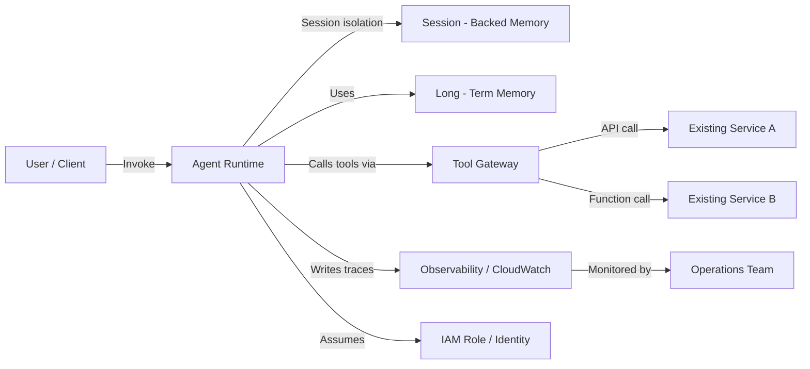

# Task 3.2: Provision and configure resources for ML and AI workloads based on existing architecture and requirements

## Skill 3.2.11: Deploy agentic workflow infrastructure

### Overview

Deploying agentic workflow infrastructure means standing up the production runtime, memory, tool access, identity, and observability needed for AI agents to operate reliably and securely. Instead of hand-building these pieces, AWS provides managed services—primarily **Amazon Bedrock AgentCore**—that give agents a production-grade foundation: isolated execution environments per session, short‑term and long‑term memory, a gateway that exposes existing APIs as tools, and tracing that records every step an agent takes.

This skill focuses on the *infrastructure* layer. You must understand how to configure the runtime, memory, tool gateway, and observability so that agent behavior is correct, secure, and auditable.

---

### Key Components of Agentic Workflow Infrastructure

| Component | Purpose | AWS Implementation |
|-----------|---------|--------------------|
| **Runtime** | Executes agent logic and isolates each session’s working state | Amazon Bedrock AgentCore runtime |
| **Short‑term memory** | Retains conversation history within a single session | Built into runtime, scoped by `sessionId` |
| **Long‑term memory** | Persists user/actor context across sessions and visits | AgentCore Memory (configurable retention) |
| **Gateway** | Exposes existing APIs/functions to the agent as tools using standard protocols | Amazon API Gateway or Bedrock AgentCore tool gateway |
| **Identity** | Gives the agent credentials to call other AWS services or external APIs | IAM roles, AWS PrivateLink, OAuth/OIDC for external tools |
| **Observability** | Records agent steps, tool calls, inputs/outputs for debugging and audit | AWS CloudTrail, Amazon CloudWatch, Bedrock AgentCore traces |

---

### Deployment Architecture

The diagram below shows how the major components fit together in a typical Bedrock AgentCore deployment.

**Key design points:**

- Each agent invocation is tied to a `sessionId`, which scopes both execution state and short‑term memory.
- Long‑term memory is stored separately and survives session termination.
- The gateway translates agent tool calls into API or function calls to existing services, so those services do not need to be rebuilt.
- Observability records the agent’s reasoning steps, tool selection, tool input/output, and final response.

---

### Agent State Management

#### Short‑Term Memory vs. Long‑Term Memory

| Characteristic | Short‑Term Memory | Long‑Term Memory |
|----------------|-------------------|------------------|
| **Scope** | Single session (`sessionId`) | Cross‑session, scoped to user/actor |
| **Content** | Conversation turns, tool outputs, temporary context | User preferences, summaries, facts, historical context |
| **Lifetime** | Cleared when session ends or times out | Persists according to configured retention policy |
| **Sharing** | Not shared across sessions or agents | Can be shared across sessions and multiple agents |
| **AWS feature** | Built into runtime session state | Amazon Bedrock AgentCore Memory |
| **Primary use** | Resolving follow‑up questions, multi‑turn dialogue | Avoiding repeated context, personalization, continuity |

**Exam relevance:** A behavior complaint such as “the agent understands follow‑ups within one conversation but forgets the user on the next visit” points to needing **long‑term memory**, not stronger session isolation or more tools.

#### Session Isolation

Session isolation is a **runtime property**, not a memory store feature. Each `sessionId` gets its own execution environment and temporary working state. This prevents:

- One conversation from reading another conversation’s in‑progress state.
- Cross‑tenant contamination in multi‑user deployments.
- Accidental leakage of temporary tool outputs between sessions.

Session isolation alone does **not** provide persistence across sessions.

---

### Tool Exposure via a Gateway

To let an agent call existing services, you expose those services as tools through a gateway. The gateway translates between the agent’s protocol and the service’s API.

- **Protocol translation:** The agent may send a tool call as a structured JSON request; the gateway maps that to an HTTP API, Lambda function, or other backend.
- **No rebuilding required:** Existing microservices, databases, or third‑party APIs remain unchanged; only a wrapper or API definition is added.
- **Security:** The agent assumes an identity (IAM role) that grants least‑privilege access to only the tools it needs.
- **Private connectivity:** If the downstream service is inside a VPC, use AWS PrivateLink or VPC endpoints so traffic stays on the private network.

**Example:** A customer‑support agent calls a `get_order_status` tool exposed via Amazon API Gateway. The API Gateway integrates with an internal order management system. The agent does not need direct database access—it only calls the tool.

---

### Identity and Security

Agents require an identity to call AWS services or external APIs.

- **IAM roles for AWS services:** The agent runtime assumes an IAM role. The role must have permissions for each tool’s backing service (e.g., `bedrock:InvokeModel`, `lambda:InvokeFunction`, `dynamodb:GetItem`).
- **External APIs:** Use OAuth 2.0/OIDC tokens for third‑party services. The identity is managed by the gateway or the agent configuration.
- **Network isolation:** For private services, deploy the agent runtime inside a VPC with appropriate subnets, security groups, and VPC endpoints.

---

### Observability and Debugging

An agent failure is often a tool call that returned unexpected data. Observability records the exact sequence:

1. User input
2. Agent reasoning step
3. Tool selected
4. Tool input and output
5. Next reasoning step
6. Final answer

**AWS services for observability:**

- **Amazon CloudWatch Logs** – captures application and tool execution logs.
- **AWS CloudTrail** – records API calls made by the agent (e.g., `InvokeAgent`).
- **Bedrock AgentCore traces** – provides a step‑by‑step view of the agent’s decision loop and tool invocations.

Without observability, debugging a misbehaving agent becomes guesswork.

---

### Scenario‑Based Examples

#### Example 1: Returning User Context

**Scenario:** A financial advisory agent correctly answers multi‑turn questions in a single session: the user asks “What’s my portfolio balance?” then “How does that compare to last month?” The agent uses the previous answer. However, when the same user returns the next day, the agent asks “Can you tell me your account number again?” even though the user provided it yesterday.

**Question:** What is the most likely missing capability?

- A. Stronger session isolation in the runtime
- B. A gateway that exposes more tools to the agent
- C. Long‑term memory that persists across sessions
- D. A larger result count in the retrieval configuration

**Answer:** C. Long‑term memory that persists across sessions.

**Explanation:** The agent already manages multi‑turn correctly within a session, so short‑term memory works. The issue is forgetting context between visits. Long‑term memory stores user facts across sessions, allowing the agent to recall account number and preferences.

#### Example 2: Multi‑Tenant Agent Isolation

**Scenario:** Two enterprise customers use the same agent platform. Customer A’s agent session runs a tool that writes a temporary file. Customer B’s simultaneous session must not see that file. The platform must also prevent Customer B from accessing Customer A’s conversation history.

**Question:** Which design best satisfies these requirements?

- A. Use one global memory store shared by all sessions
- B. Isolate each session in its own runtime environment and enforce per‑tenant IAM policies
- C. Store all conversation history in a single DynamoDB table without partition keys
- D. Allow cross‑session memory sharing to improve context

**Answer:** B. Isolate each session in its own runtime environment and enforce per‑tenant IAM policies.

**Explanation:** Session isolation in the runtime prevents temporary working state leakage. Per‑tenant IAM policies ensure that each tenant’s tools and data remain separate. Cross‑session sharing (D) would break isolation.

#### Example 3: Debugging a Failing Agent

**Scenario:** An agent that books travel sometimes returns “I could not complete the booking” without further detail. The team suspects a tool call failed, but they cannot tell which tool or why.

**Question:** What should be configured to diagnose the failure?

- A. Long‑term memory to store the failure
- B. Observability that records every agent step and tool call
- C. A gateway that exposes more tools
- D. Session isolation to prevent state leakage

**Answer:** B. Observability that records every agent step and tool call.

**Explanation:** Agent failures are often caused by tool calls returning unexpected data. Tracing the agent’s decision loop and tool inputs/outputs shows exactly which step failed and why. Memory, gateway, and isolation do not provide step‑level debugging.

---

### Exam Tips and Traps

#### Tips

- **Know the difference between short‑term and long‑term memory.** Questions often describe a symptom (e.g., “agent forgets user after session ends”) that maps directly to long‑term memory.
- **Session isolation ≠ persistence.** Isolation prevents leakage within a session; it does not store context across sessions.
- **Gateway is for exposing tools to the agent, not for exposing the agent to users.** The gateway translates tool calls to existing services.
- **Observability is essential.** Without traces, agent failures are opaque. Look for choices that mention logging or tracing when the problem is “why did the agent do that?”
- **Amazon Bedrock AgentCore** is the managed service that provides runtime, memory, gateway, identity, and observability. Recognize that it handles the heavy lifting for production agent infrastructure.
- **Security:** Agents need IAM roles with least‑privilege access. For private services, use VPC endpoints so traffic stays on the private network.

#### Traps

- **Choosing “longer result count in retrieval configuration”** when the issue is memory. Retrieval `top_k` only affects how many chunks are returned from a knowledge base, not user context.
- **Choosing “stronger session isolation”** when the needed fix is persistence. Session isolation is about preventing leakage, not remembering across visits.
- **Confusing the gateway with an API that exposes the agent to end users.** The gateway is for tool access from the agent to backend services.
- **Assuming that agent state is automatically persistent.** By default, session state is temporary. Long‑term memory must be explicitly configured.
- **Overlooking observability.** Some questions may ask about debugging agent behavior; the correct answer often includes CloudTrail, CloudWatch, or Bedrock AgentCore traces.
- **Thinking that any memory store can be shared between tenants.** Multi‑tenant isolation requires per‑session isolation and proper IAM scoping; shared memory without partitioning is a security risk.

---

### Summary Table: Deploying Agentic Workflow Infrastructure

| Requirement | Solution | AWS Service/Feature |
|-------------|----------|---------------------|
| Maintain conversation context within one session | Short‑term memory | Runtime session state |
| Remember user across visits | Long‑term memory | Bedrock AgentCore Memory |
| Prevent cross‑session data leakage | Session isolation | Runtime session isolation |
| Let agent call existing APIs/functions | Tool gateway | Amazon API Gateway / Bedrock tool gateway |
| Give agent permission to call AWS services | IAM role | AWS IAM |
| Keep traffic private to internal services | VPC endpoints / PrivateLink | Amazon VPC |
| Debug agent tool failures | Step‑by‑step traces | CloudWatch, CloudTrail, Bedrock traces |
| Scale agent runtime | Auto scaling of compute backing the runtime | SageMaker AI, ECS/Fargate if self‑managed |

---

By mastering **Deploy agentic workflow infrastructure**, you ensure that AI agents run as production‑grade systems—isolated, memory‑aware, tool‑connected, secured, and observable. The exam will test your ability to choose the correct component for a given behavioral or operational requirement.