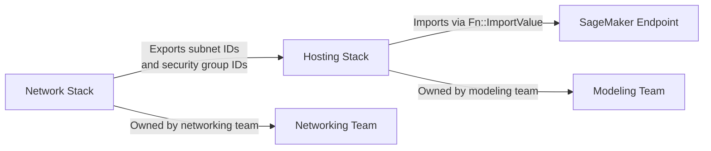
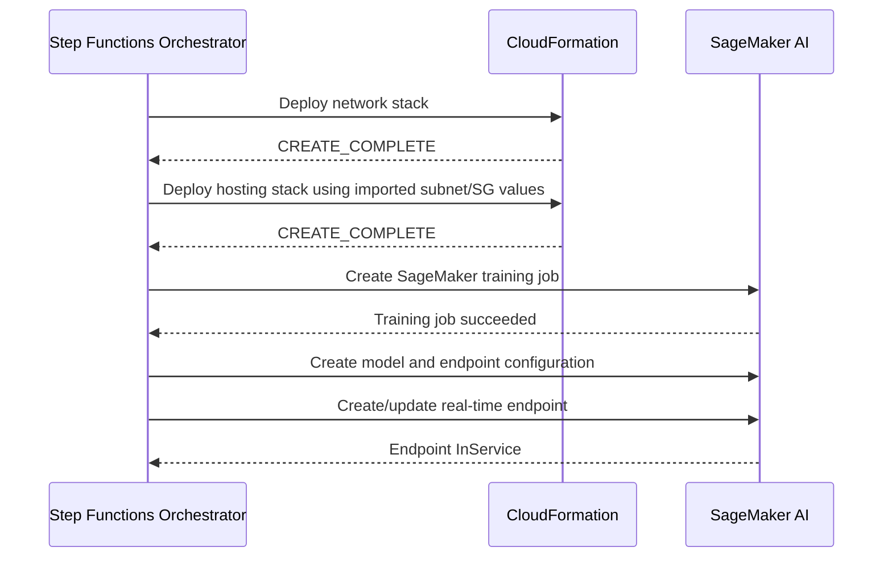

# Task 3.2: Deployment and Orchestration of ML and AI Workflows - Provision and configure resources for ML and AI workloads based on existing architecture and requirements.

## Skill 3.2.2: Automate compute resource provisioning with integrated communication between stacks and orchestration services.

### Purpose of This Skill

Provisioning compute for ML and AI workloads usually involves multiple dependent resources: networking, IAM roles, container images, training jobs, model hosting endpoints, and scaling policies. Manually creating these resources in the correct order is slow, error-prone, and difficult to reproduce.

This skill focuses on:

- Declaring compute and hosting resources as code.
- Connecting separately owned AWS CloudFormation stacks so teams can share resources without hardcoding identifiers.
- Coordinating stack deployments and ML resource creation with orchestration services.
- Handling ordering, failure, retries, and dependencies automatically.

The phrase to remember for the exam is **existing architecture**. You are not designing a new system from scratch. You are automating provisioning within constraints already defined by the organization: existing VPCs, security groups, account boundaries, and deployment processes.

---

### Key Concepts

| Concept | Description |
| --- | --- |
| **Infrastructure as Code (IaC)** | Describing AWS resources in a declarative or programmatic format so environments are repeatable and auditable. |
| **Stack** | A unit of deployment in AWS CloudFormation. A stack can contain networks, IAM roles, SageMaker endpoints, training jobs, and more. |
| **Cross-stack reference** | A mechanism where one stack exports a value and another stack imports that value. This avoids copying resource identifiers. |
| **Orchestration service** | A service such as AWS Step Functions, Amazon EventBridge, or AWS CodePipeline that coordinates the order and conditions of provisioning tasks. |
| **Integrated communication** | Passing values, statuses, and events between stacks and orchestration steps without manual intervention. |
| **ML compute resource** | A SageMaker training job, processing job, hyperparameter tuning job, real-time endpoint, batch transform job, inference component, or HyperPod cluster. |

---

### Infrastructure as Code on AWS

The two primary IaC services on AWS are AWS CloudFormation and AWS Cloud Development Kit (AWS CDK).

| Service | Description | Best Use Case |
| --- | --- | --- |
| **AWS CloudFormation** | Declares resources in JSON or YAML templates. Supports outputs, exports, parameters, conditions, mappings, and rollback behavior. | Teams that want a purely declarative, auditable template tracked in version control. |
| **AWS Cloud Development Kit (AWS CDK)** | Defines AWS infrastructure using general-purpose programming languages such as Python, TypeScript, Java, or C#. Synthesizes to CloudFormation templates. | Teams that prefer abstraction, reuse, looping, and conditional logic in code. |
| **AWS CloudFormation StackSets** | Deploys the same stack to multiple accounts and Regions in a single operation. | Standardizing ML compute baselines across an organization. |

For the exam, treat CloudFormation and CDK as different interfaces to the same provisioning engine. CDK code ultimately becomes a CloudFormation template.

---

### Cross-Stack Communication Patterns

When a network team owns subnets and security groups, and a modeling team owns the SageMaker endpoint stack, they should not copy identifiers manually. Instead, use one of the following patterns.

| Mechanism | How It Works | When to Use |
| --- | --- | --- |
| **CloudFormation Export/Import** | One stack exports an output name. Another stack references that value with `Fn::ImportValue`. | Separate stack ownership, stable values that change only through the owning stack. |
| **Nested stack parameters** | A parent stack passes parameters to a nested stack template. | Single team owns the entire deployment. Lifecycle is shared. |
| **AWS Systems Manager Parameter Store** | Stores values outside CloudFormation. Stacks retrieve values dynamically. | Values change independently, such as AMI IDs, model artifact versions, or environment-specific settings. |
| **AWS CDK cross-stack references** | CDK detects when a resource from one stack is referenced in another and automatically creates the underlying CloudFormation export/import. | CDK-based deployments with multiple stacks. |

The most common exam scenario is the first one: **CloudFormation export from a network stack imported by a hosting stack**.

The following diagram shows the integration.

Using exported outputs keeps the dependency explicit. If the networking team changes a subnet ID, the hosting stack can reference the updated value without duplicating it.

---

### Orchestration Services for Provisioning Automation

Orchestration services coordinate the deployment of stacks and ML compute resources in a defined order, with handling for failures.

| Service | Role in Provisioning Automation |
| --- | --- |
| **AWS Step Functions** | Runs state machines that call AWS CloudFormation, Amazon SageMaker, and other AWS APIs directly. Supports sequence, wait, choice, retry, and error handling. |
| **Amazon EventBridge** | Reacts to events from CloudFormation stack status changes, SageMaker training job completion, or endpoint updates. Triggers Lambda functions, Step Functions state machines, or CodePipeline actions. |
| **AWS CodePipeline** | Provides a release pipeline with stages for source, build, test, and deploy. Can deploy CloudFormation templates or call SageMaker actions. |
| **AWS Lambda** | Custom glue logic in an event-driven provisioning flow. Usually triggered by EventBridge or Step Functions. |

For the exam, AWS Step Functions is the strongest answer when the question asks for:

- A defined order of provisioning actions.
- Retry and failure handling.
- Workflow waiting for a long-running ML job to complete.
- Passing outputs from one provisioning step to another.

Amazon EventBridge is the strongest answer when the question asks for an event-driven reaction, such as:

- A CloudFormation stack reaches `CREATE_COMPLETE`.
- A training job changes to `Completed`.
- An endpoint becomes `InService`.

The following sequence diagram shows a common orchestration flow.

This pattern avoids the problem of attempting to create a SageMaker endpoint before the VPC and security groups exist.

---

### Automating ML Compute Resource Provisioning

ML workloads include several compute resource types that can be provisioned through templates and orchestration services.

| ML Compute Resource | Provisioning Consideration |
| --- | --- |
| **SageMaker training job** | Requires instance type, instance count, container image, training data location, IAM role, VPC configuration. |
| **SageMaker real-time endpoint** | Requires model, endpoint configuration, instance type, initial instance count, VPC subnets, security groups. |
| **SageMaker batch transform job** | Requires model, input/output locations, instance type, instance count. |
| **SageMaker inference component** | Can be attached to an endpoint for granular scaling of generative AI models. |
| **SageMaker HyperPod cluster** | Requires accelerator instance groups, lifecycle scripts, VPC subnets, security groups, and often an orchestration layer such as Kubernetes or Amazon EKS. |
| **SageMaker serverless endpoint** | Provision concurrency from zero or a configured value. Does not use VPC network configuration in the same way as real-time endpoints. |

CloudFormation can define each of these as a resource. Step Functions can then call the corresponding APIs in order.

---

### Integrated Communication Between Stacks and Orchestration Services

Integrated communication means that the provisioning system handles dependencies and data hand-offs automatically.

Common integration points:

1. **CloudFormation output to Step Functions input**
   - A CloudFormation stack outputs a SageMaker endpoint ARN.
   - Step Functions reads that output and uses it in the next state.

2. **EventBridge rule to trigger a provisioning workflow**
   - A CloudFormation stack emits an event such as `CREATE_COMPLETE`.
   - EventBridge routes that event to a Step Functions state machine or Lambda function.

3. **SageMaker training job result to endpoint deployment**
   - A Step Functions state machine waits for the training job to finish.
   - The state machine then creates a model from the resulting model artifacts.
   - The state machine creates or updates the endpoint.

4. **CDK cross-stack reference to a networking stack**
   - A CDK app contains a network stack and a hosting stack.
   - The hosting stack refers to the VPC object from the network stack.
   - CDK synthesizes the necessary CloudFormation export and import automatically.

Using these integrations removes manual copy-paste steps and reduces configuration drift.

---

### Scenario-Based Examples

#### Scenario 1: Cross-Stack Network References

A networking team owns all VPC subnets and security groups. A modeling team owns the SageMaker endpoints. The modeling team must deploy endpoints into private subnets without manually copying subnet IDs.

**Which mechanism should the modeling team use?**

**A.** Store the subnet IDs in a local configuration file in the model repository.  
**B.** Have the networking stack export the subnet and security group IDs, and the endpoint stack import those values.  
**C.** Deploy the endpoint first and then attach networking resources afterward.  
**D.** Use a SageMaker scaling policy to discover available subnets.

**Correct Answer: B**

**Explanation:**  
The networking stack should export its subnet IDs and security group IDs through CloudFormation outputs with `Export`. The modeling stack can then reference those values with `Fn::ImportValue` or an equivalent CDK cross-stack reference. This keeps the two stacks integrated while preserving separate ownership.

---

#### Scenario 2: Ordered ML Provisioning with Failure Handling

A company needs to automate the following workflow:

1. Deploy an updated training cluster.
2. Run a training job.
3. If training succeeds, create a new model.
4. Update the production endpoint.
5. If any step fails, send an alert and stop the pipeline.

**Which AWS service best implements this workflow?**

**A.** Amazon EventBridge rule only  
**B.** AWS Step Functions state machine  
**C.** Amazon ElastiCache  
**D.** Amazon S3 lifecycle policy

**Correct Answer: B**

**Explanation:**  
AWS Step Functions can coordinate multiple AWS services directly through service integrations. It provides sequences, waits for long-running tasks, retries, choices, and failure handling. The state machine can call SageMaker APIs such as `CreateTrainingJob`, `CreateModel`, and `UpdateEndpoint`. EventBridge alone can react to events but is not designed to manage the entire ordered workflow with branching and retry logic.

---

### Exam Tips and Traps

- **Use exported outputs, not copied values.**  
  If a question says one team owns networking and another owns the endpoint stack, the correct pattern is CloudFormation export/import or CDK cross-stack references.

- **Step Functions is the orchestration answer.**  
  When the scenario requires ordering, waiting for a training job, passing values between steps, retry, or conditional deployment, choose AWS Step Functions.

- **EventBridge is the event-driven trigger answer.**  
  When the scenario says, “When stack creation finishes, trigger the next deployment,” that is EventBridge reacting to a CloudFormation event.

- **Cross-stack exports create dependency boundaries.**  
  Avoid choosing an option that copies resource IDs into parameters or stores them as hardcoded strings in a template.

- **Nested stacks are for single-owner shared lifecycle.**  
  If a single team controls both network and hosting resources, nested stacks may be appropriate. For separate team ownership, cross-stack references are better.

- **The stack output must be exported before it can be imported.**  
  An imported value cannot be changed directly by the consuming stack. Only the exporting stack owns the value.

- **Treat CloudFormation and CDK as two views of the same result.**  
  The exam may describe a CDK deployment, but the underlying CloudFormation export/import behavior remains the same.

- **Do not choose scaling policies to solve resource-ordering problems.**  
  Scaling policies adjust compute capacity based on traffic. They do not create network resources, pass outputs between stacks, or orchestrate deployment order.

- **Do not choose serverless endpoints solely for private networking.**  
  Serverless endpoints do not accept VPC network configuration in the same way as real-time endpoints. A private networking requirement should direct you to real-time endpoints in a VPC with proper private connectivity.

- **Orchestration is not the same as a single CloudFormation template.**  
  A single template can create many resources, but Step Functions is needed when the workflow must wait on a long-running operation, branch based on status, or retry only part of the provisioning flow.

---

### Summary

To automate compute provisioning with integrated communication:

1. Define the existing architecture boundaries, including which team owns networking and which team owns ML hosting.
2. Use CloudFormation or AWS CDK to declare compute resources.
3. Link stacks through exported outputs and imported values instead of copying identifiers.
4. Use AWS Step Functions to orchestrate ordered provisioning and ML lifecycle steps.
5. Use Amazon EventBridge to react to stack and job events when event-driven automation is required.
6. Keep failure handling and rollback semantics in mind.

This skill is about building an automated, reproducible path from shared infrastructure to a running ML compute resource while respecting existing architecture and ownership boundaries.