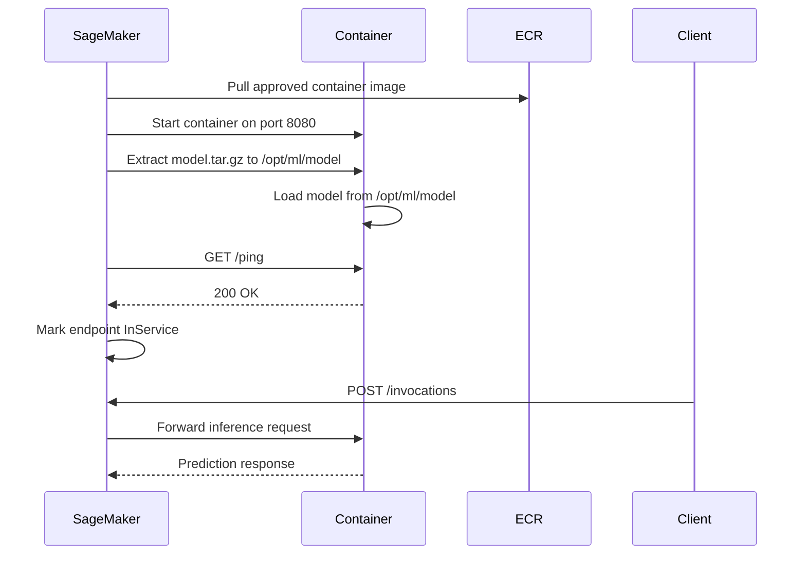
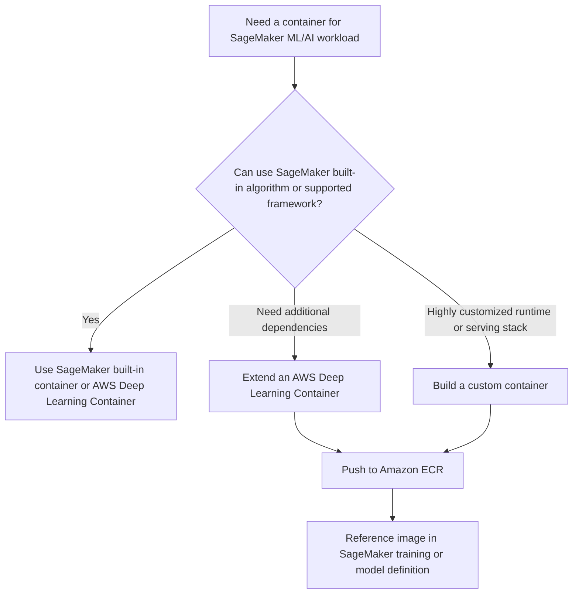
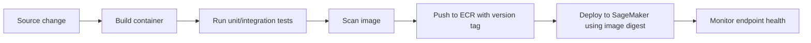
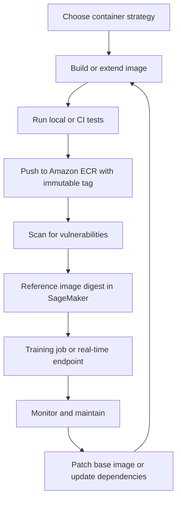

# Task 3.2: Deployment and Orchestration of ML and AI Workflows - Provision and configure resources for ML and AI workloads based on existing architecture and requirements

## Skill 3.2.3: Build and maintain containers for ML and AI workloads

### Purpose and context

Building and maintaining containers for ML and AI workloads is about packaging model code, dependencies, runtime versions, and serving logic into an immutable, portable unit that Amazon SageMaker AI can run consistently for training, inference, or batch evaluation.

On the AWS MLA-C02 exam, this skill is tested through scenarios such as:

- Choosing between a prebuilt SageMaker container, an AWS Deep Learning Container, or a fully custom container.
- Understanding what SageMaker AI expects from a training or inference container.
- Managing container images in Amazon ECR for repeatable deployments.
- Maintaining images over time with versioning, scanning, and lifecycle policies.
- Ensuring containers work within existing VPC, security, and compliance requirements.

---

### 1. Why containers matter in SageMaker AI

SageMaker AI runs ML workloads inside Docker-compatible containers. Containers bundle:

- Model training or inference code.
- Python or other runtime dependencies.
- Framework versions such as PyTorch, TensorFlow, or XGBoost.
- GPU driver compatibility for accelerated workloads.
- The HTTP server required for real-time inference.

Using containers provides:

| Benefit | Why it matters |
|---|---|
| Reproducibility | The same image can run in training, staging, and production. |
| Portability | The same container can be used across SageMaker hosting options. |
| Dependency isolation | Avoids conflicts between libraries and system packages. |
| Version control | ECR stores and versions immutable images. |
| Operational consistency | SageMaker knows how to run any compliant container. |

---

### 2. Training containers vs inference containers

SageMaker AI uses different container contracts for training and inference. A container built for one is not automatically suitable for the other.

| Characteristic | Training container | Inference container |
|---|---|---|
| Purpose | Fit a model on input data | Serve predictions from a trained model |
| Data access | Reads from SageMaker input channels | Usually does not read training data |
| Model handling | Writes model artifacts to `/opt/ml/model` | Loads model artifacts from `/opt/ml/model` |
| HTTP server | Not required | Required for real-time endpoints |
| Health endpoint | Not used | Must respond to `/ping` |
| Invocation endpoint | Not used | Must respond to `/invocations` |
| Common runtime | Training job terminates after completion | Long-running web service |

---

### 3. SageMaker container directory and configuration contract

SageMaker AI provides a well-defined directory structure to containers. Understanding this contract is critical for the exam.

#### Training container directories

| Path | Purpose |
|---|---|
| `/opt/ml/input/config` | Contains `hyperparameters.json`, `resourceconfig.json`, and other job configuration |
| `/opt/ml/input/data/<channel_name>` | Training data for each named input channel |
| `/opt/ml/model` | The container must write trained model artifacts here |
| `/opt/ml/output` | Training output and logs |
| `/opt/ml/code` | Optional custom source code mounted into the container |

#### Inference container directories

| Path | Purpose |
|---|---|
| `/opt/ml/model` | Contains the extracted `model.tar.gz` artifacts to load |
| `/opt/ml/code` | Optional custom inference code |
| `/opt/ml/config` | Optional inference configuration |

#### Important environment variables

| Environment variable | Typical use |
|---|---|
| `SAGEMAKER_PROGRAM` | The script SageMaker runs inside the container |
| `SAGEMAKER_SUBMIT_DIRECTORY` | Directory containing the script package |
| `SAGEMAKER_MODEL_SERVER_TIMEOUT` | Time allowed for the model server to start |
| `SAGEMAKER_MODEL_SERVER_WORKERS` | Number of model server worker processes |
| `SM_MODEL_DIR` | Often used to identify model output directory |
| `SM_CHANNEL_<channel_name>` | Used by training containers for input channel paths |

---

### 4. Inference container serving contract

For a real-time SageMaker endpoint, a custom inference container must implement a web server that listens on port `8080` and exposes:

| Requirement | Description |
|---|---|
| `GET /ping` | Health check endpoint; must return HTTP 200 when the model is loaded and ready |
| `POST /invocations` | Inference endpoint; receives client requests and returns predictions |
| Port | Container must listen on port `8080` |
| Model loading | Model must be loaded from `/opt/ml/model` before the container is considered healthy |

If a custom container does not implement these endpoints correctly, the endpoint health check fails and the endpoint may not reach `InService`.

#### Simplified inference startup flow

---

### 5. Choosing a container strategy

SageMaker AI supports three main container strategies. The choice depends on required customization, operational maturity, and compliance.

| Container type | Use case | Operational burden | Example |
|---|---|---|---|
| SageMaker built-in algorithm container | Common algorithms such as XGBoost, Linear Learner, K-Means | Lowest | Use built-in XGBoost training |
| AWS Deep Learning Container | Standard PyTorch, TensorFlow, MXNet, or Hugging Face workloads | Low | PyTorch GPU training and inference |
| Extended Deep Learning Container | Need extra Python packages or custom scripts on top of a standard framework | Medium | Add proprietary data processing libraries to PyTorch |
| Fully custom container | Non-standard runtime, custom HTTP server, unusual dependency stack | Highest | Custom C++ model with gRPC server, or Java-based inference |

---

### 6. Using AWS Deep Learning Containers

AWS Deep Learning Containers are prebuilt, tested, and maintained by AWS. They are available through Amazon ECR.

Key benefits:

- Include compatible deep learning framework versions.
- Include NVIDIA CUDA, cuDNN, and other GPU dependencies where applicable.
- Are patched and updated by AWS.
- Are optimized for SageMaker training and inference.
- Reduce the effort required to maintain GPU driver compatibility.

When to prefer a Deep Learning Container:

- The workload uses PyTorch, TensorFlow, Hugging Face Transformers, or another supported framework.
- The team wants a supported, patched root image rather than maintaining one from scratch.
- GPU training or inference is required.
- The deployment must be compliant and reproducible without custom OS patching.

---

### 7. Extending a prebuilt container

If a standard framework container is close enough but missing one or more dependencies, you can extend it.

Typical approach:

1. Start from a supported AWS Deep Learning Container.
2. Install additional Python packages or system libraries.
3. Add custom model loading or inference logic.
4. Build the new image locally or in CI/CD.
5. Push the result to Amazon ECR under a new immutable version tag.

Important considerations:

- Extending a supported image preserves the base framework, CUDA, and SageMaker compatibility.
- Avoid modifying the container entrypoint in ways that break SageMaker startup.
- Maintain ownership of the new image because you are responsible for patching it after extension.
- Use versioned tags and image digests so production does not accidentally consume untested updates.

---

### 8. Building a custom container

A custom container is required when the runtime cannot be satisfied by extending a standard framework image.

For training, a custom container must:

- Read training data from SageMaker input channels.
- Optionally read hyperparameters.
- Perform training.
- Write the final model artifacts to `/opt/ml/model`.

For inference, a custom container must:

- Load the model from `/opt/ml/model`.
- Run a web server on port `8080`.
- Implement `GET /ping` for health checks.
- Implement `POST /invocations` for predictions.
- Return responses in a format the client understands.

Custom containers are appropriate for:

- Unsupported frameworks or languages.
- Specialized serving stacks such as Triton, TensorFlow Serving, or custom gRPC services.
- Custom preprocessing or postprocessing tightly coupled to the model.
- Very strict security or runtime requirements.

---

### 9. Amazon ECR as the container registry

SageMaker AI pulls custom container images from Amazon Elastic Container Registry.

Key ECR capabilities relevant to the exam:

| Capability | Purpose |
|---|---|
| Private repository | Stores container images used by SageMaker |
| Image tagging | Identifies versions such as `v1.2.0`, `sha256:...` |
| Tag immutability | Prevents overwriting an existing tag |
| Image scanning | Detects known OS and package vulnerabilities |
| Lifecycle policies | Automatically expires old or untracked images |
| Cross-account replication | Replicates images to another account or Region |
| Resource-based permissions | Controls which principals can pull images |

For SageMaker to pull a custom image, the SageMaker execution role must have permission to access the ECR repository.

---

### 10. Maintaining container images over time

Maintaining containers is just as important as building them. The exam often tests whether a candidate can recognize good image maintenance practices.

#### Versioning strategy

| Practice | Recommendation |
|---|---|
| Avoid mutable tags | Do not deploy `latest` as the production image reference |
| Use semantic versioning | Example: `model-inference:1.4.2` |
| Pin image digest | Reference `@sha256:...` in production for exact reproducibility |
| Separate model and code versions | Model weights and container code change independently |

#### Security and patching

- Rebuild the container when the base image or framework receives security patches.
- Enable ECR image scanning.
- Remediate critical or high findings before deployment.
- Use ECR tag immutability to prevent silent replacement of tested images.

#### Lifecycle management

- Use ECR lifecycle rules to delete old, non-prod images.
- Keep only images that are currently deployed or required for rollback.
- Example lifecycle rule: count-based rule retaining the last 20 images.

#### CI/CD integration

A mature container maintenance workflow includes:

---

### 11. Network and security considerations for containers

When building and maintaining containers for ML workloads, the existing architecture often imposes network and security constraints.

| Requirement | Container implication |
|---|---|
| Private VPC only | SageMaker endpoint must be placed in private subnets with security groups |
| No internet access | Model container images must be pulled through VPC endpoints |
| Access to Amazon ECR | Use VPC interface endpoints for ECR API and gateway endpoint for S3 layer storage |
| Data protection | Do not embed credentials in container images; use execution roles |
| GPU instances | Container must include compatible NVIDIA drivers and CUDA libraries |
| Compliance | Use ECR scanning and avoid unapproved base images |

If an endpoint is private and cannot reach the internet, the container image pull can fail unless the VPC has the required ECR and S3 private connectivity.

---

### 12. Scenario-based exam examples

#### Scenario 1: Custom inference container health check failure

A data science team builds a custom SageMaker inference container. The endpoint is created, but SageMaker reports that the endpoint health check is failing.

Which requirement is most likely missing?

**A.** The container must write model artifacts to `/opt/ml/input`  
**B.** The container must implement `GET /ping` and return HTTP 200 on port 8080  
**C.** The container must use only Python 3.11  
**D.** The container must store logs in Amazon S3  

**Correct answer:** **B**

**Explanation:**  
SageMaker real-time inference containers must run a web server on port `8080` and must respond to `GET /ping` with HTTP 200 when the model is loaded. Without that, the endpoint cannot become healthy.

---

#### Scenario 2: GPU framework container maintenance

An ML team must deploy a PyTorch model on a GPU instance. The team currently builds its own PyTorch container from an Ubuntu base image, but encounters frequent CUDA driver incompatibilities and security patch delays.

Which approach best reduces this operational burden?

**A.** Build a new container from scratch for each PyTorch release.  
**B.** Use an AWS Deep Learning Container for PyTorch GPU and extend it if needed.  
**C.** Run the model without a container.  
**D.** Disable ECR image scanning.  

**Correct answer:** **B**

**Explanation:**  
AWS Deep Learning Containers are maintained by AWS and include compatible PyTorch, CUDA, and GPU libraries. Extending an AWS DLC provides a supported base while allowing custom dependencies.

---

#### Scenario 3: Reproducible production deployment

A production SageMaker endpoint must always deploy the exact same tested container version, even if a new image is pushed with the same tag.

Which practice should the team use?

**A.** Tag every image as `latest`  
**B.** Use an ECR lifecycle policy to delete old images  
**C.** Reference the container by image digest in the SageMaker model definition  
**D.** Store the image in Amazon S3  

**Correct answer:** **C**

**Explanation:**  
Image tags can be overwritten, but an image digest uniquely identifies one specific image. Referencing the digest ensures that the same tested image is always used.

---

#### Scenario 4: Private VPC container pull

A SageMaker endpoint is deployed in a private subnet with no internet route. The endpoint fails during creation because it cannot pull the container image from Amazon ECR.

What should be configured?

**A.** Attach a larger instance type.  
**B.** Add a NAT gateway to make the subnet public.  
**C.** Create VPC endpoints for ECR and S3 so the image can be pulled privately.  
**D.** Move the endpoint to a public subnet.  

**Correct answer:** **C**

**Explanation:**  
For private network access to ECR, the VPC needs interface VPC endpoints for Amazon ECR and a gateway endpoint for Amazon S3. This allows image pulls without internet access.

---

### 13. Exam tips and traps

#### Exam tips

| Tip | Explanation |
|---|---|
| Remember the inference contract | Real-time custom containers need port `8080`, `/ping`, and `/invocations`. |
| Know where artifacts go | Training containers must write models to `/opt/ml/model`. |
| Prefer AWS Deep Learning Containers | They reduce GPU driver and framework maintenance. |
| Extend before building from scratch | Extending a supported base is often better than fully custom. |
| Use ECR with digest pinning | Digest pinning guarantees reproducible deployments. |
| Consider VPC connectivity | Private endpoints need ECR and S3 VPC endpoints for image pulls. |
| Separate container image from model version | The container holds code; the model artifact is separate in S3. |

#### Common traps

| Trap | Why it is wrong |
|---|---|
| Treat `latest` as a safe production tag | It can point to an untested image and is not reproducible. |
| Assume a training container works for inference | Inference containers must implement an HTTP server and health endpoint. |
| Forget to write model output to `/opt/ml/model` | SageMaker expects trained artifacts there. |
| Use public internet access for a private endpoint | Compliance and network policy may require VPC endpoints instead. |
| Overlook ECR image permissions | SageMaker execution role must have ECR pull access. |
| Confuse `/invocations` with `/ping` | `/ping` is health; `/invocations` is prediction. |
| Build a custom GPU container when a DLC exists | This adds unnecessary driver, CUDA, and patching burden. |

---

### 14. End-to-end container lifecycle summary

---

### Summary

For the AWS Certified Machine Learning - Associate exam, building and maintaining containers for ML and AI workloads means understanding the SageMaker container contract, selecting the right container strategy, using Amazon ECR for versioned and secure storage, and maintaining images with strong lifecycle and security practices. The correct answer is often the one that maximizes reproducibility, reduces manual GPU dependency management, and respects existing network architecture.