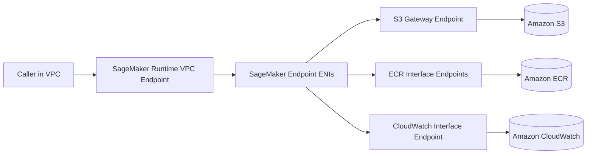

# Task 3.2: Deployment and Orchestration of ML and AI Workflows - Provision and configure resources for ML and AI workloads based on existing architecture and requirements

## Skill 3.2.4: Configure SageMaker AI endpoints within VPC network environments

### Overview

This skill focuses on placing SageMaker AI hosted endpoints inside an Amazon Virtual Private Cloud (Amazon VPC) so that model compute, model artifacts, container images, and downstream service calls can remain within a private network boundary.

Configuring an endpoint inside a VPC is not just a networking checkbox. It determines:

- Whether the endpoint can reach Amazon S3 to download model artifacts.
- Whether the endpoint can pull its inference container from Amazon ECR.
- Whether the endpoint can reach other AWS services without internet access.
- Whether clients in the VPC can invoke the endpoint using private IP addresses.
- Whether security and compliance requirements are satisfied.

---

## Key Concepts

### 1. What VPC Configuration Means for SageMaker AI Endpoints

When you configure a SageMaker AI real-time endpoint with VPC settings, SageMaker launches the endpoint's compute resources into the subnets you provide and attaches the security groups you specify.

SageMaker creates Elastic Network Interfaces (ENIs) in those subnets. The endpoint compute then uses private IP addresses inside the VPC.

This is called **network isolation** or **VPC integration**.

The endpoint compute does not need a public IP address or an internet gateway.

---

## SageMaker AI Hosting Options and VPC Support

| Hosting Option | Supports VPC Network Configuration? | Notes |
|---|---|---|
| Real-time endpoint | Yes | The primary focus of this skill. |
| Asynchronous endpoint | Yes | Used when inference requests are large or processing is long. |
| Batch transform | Yes | Used for offline batch inference jobs. |
| Serverless endpoint | No, per the AWS MLA-C02 exam scope | Do not choose serverless if the requirement is VPC network isolation. |

**Exam note:** The exam may explicitly state that a solution requires a SageMaker endpoint to run inside private subnets. In that case, serverless inference is not a valid option.

---

## Core Components for SageMaker AI VPC Configuration

| Component | Purpose |
|---|---|
| Private subnets | Provide private IP addresses for the endpoint ENIs. |
| Multiple Availability Zones | High availability; SageMaker expects subnets in multiple AZs. |
| Security groups | Act as a stateful firewall around the endpoint compute. |
|69s IAM execution role | Must allow SageMaker to create and manage network interfaces. |
| VPC gateway endpoints | Provide private paths to services such as Amazon S3 without internet. |
| VPC interface endpoints | Provide PrivateLink-based access to services such as ECR, SageMaker Runtime, and CloudWatch. |
| Route tables | Must route traffic to the S3 gateway endpoint from the private subnets. |

---

## VPC Endpoint Types

### Gateway Endpoint

- Used for Amazon S3 and Amazon DynamoDB.
- Added to the subnet route table.
- Does not require an ENI.
- Keeps traffic to S3 inside the AWS network.

### Interface Endpoint

- Uses AWS PrivateLink.
- Creates an ENI with a private IP address.
- Used for most AWS services, including ECR, SageMaker Runtime, CloudWatch Logs, CloudWatch Monitoring, and others.
- Enables private DNS resolution when private DNS is enabled.

| Required Access | Recommended Private Path |
|---|---|
| Download model artifacts from Amazon S3 | S3 Gateway Endpoint in the subnet route table |
| Pull container images from Amazon ECR | ECR API interface endpoint and ECR Docker interface endpoint, plus S3 Gateway Endpoint for image layers |
| Invoke SageMaker endpoint from inside VPC without internet | SageMaker Runtime Interface Endpoint |
| Send logs and metrics to CloudWatch | CloudWatch Logs and CloudWatch Monitoring Interface Endpoints |
| Access other AWS services privately | Service-specific interface endpoints |
| Access external internet from private subnet | NAT Gateway; not private and not allowed under strict no-internet requirements |

---

## Step-by-Step Configuration Concept

1. Identify existing VPC resources from the organization's architecture.
2. Select private subnets in at least two Availability Zones.
3. Attach security groups that allow expected inbound traffic and required outbound private traffic.
4. Configure an S3 Gateway Endpoint and attach it to the relevant route tables.
5. Configure ECR Interface Endpoints if the model uses a custom container in Amazon ECR.
6. Configure CloudWatch Interface Endpoints if private network logging and monitoring are required.
7. Configure a SageMaker Runtime Interface Endpoint if callers must invoke the endpoint without internet.
8. Ensure the IAM role used has permissions to create, describe, and delete network interfaces.
9. Deploy the endpoint with VPC configuration pointing to the selected subnets and security groups.
10. Validate that the endpoint reaches S3, ECR, CloudWatch, and downstream services.

---

## Common Failure Scenarios and Resolutions

| Failure Scenario | Likely Cause | Resolution |
|---|---|---|
| Endpoint fails to start because it cannot download model artifacts from S3. | No S3 gateway endpoint or no route from private subnets to S3. | Add an S3 gateway endpoint and update route tables. |
| Endpoint fails to pull the inference image from Amazon ECR. | Missing ECR interface endpoints or missing S3 gateway endpoint for image layers. | Add ECR API/DKR interface endpoints and S3 gateway endpoint. |
| Endpoint creation fails with a network interface error. | IAM role lacks EC2 network interface permissions or subnets have no available IP addresses. | Add required IAM permissions or provide subnets with available IPs. |
| Endpoint cannot send logs to CloudWatch. | No CloudWatch Logs or CloudWatch Monitoring interface endpoints. | Configure CloudWatch interface endpoints. |
| Lambda or application in the VPC cannot call the SageMaker endpoint without internet. | No SageMaker Runtime interface endpoint. | Add a SageMaker Runtime interface endpoint. |
| Endpoint uses a private subnet but needs to call an external public API. | No NAT Gateway or internet route. | If external access is allowed, add a NAT Gateway. If traffic must stay private, replace the external call with an AWS PrivateLink endpoint or VPC endpoint. |
| Endpoint is configured with only one subnet. | SageMaker endpoints require multiple subnets. | Provide subnets in at least two Availability Zones. |

---

## Scenario-Based Exam Practice

### Scenario 1: Private Model Artifact Download

A company requires a SageMaker real-time endpoint to run entirely inside a private VPC with no internet access. The model artifacts are stored in an Amazon S3 bucket. During startup, the endpoint fails because it cannot access the S3 bucket.

**What should be done?**

**Correct answer:** Add an S3 Gateway Endpoint to the VPC and update the private subnet route tables to send S3 traffic through that endpoint.

**Why:** An S3 Gateway Endpoint provides a private route to Amazon S3 without requiring an internet gateway or NAT device. Without this route, the endpoint in a private subnet cannot reach S3.

---

### Scenario 2: Private ECR Image Pull

A data science team stores a custom inference container in Amazon ECR. The SageMaker endpoint must run in private subnets without internet access. The endpoint cannot pull the container image.

**Which combination of network resources is required?**

**Correct answer:** VPC Interface Endpoints for ECR API and Docker, plus an S3 Gateway Endpoint for the image layers.

**Why:** Amazon ECR image pulls require access to the ECR API and Docker endpoints. The image layers are stored in S3, so the private subnet also needs a route to S3 through an S3 Gateway Endpoint.

---

### Scenario 3: Private Invocation from a Lambda Function

A Lambda function runs inside a VPC and must call a SageMaker real-time endpoint. The VPC has no internet access. The Lambda function times out when calling the endpoint.

**What should be added?**

**Correct answer:** A SageMaker Runtime Interface Endpoint in the VPC.

**Why:** The SageMaker Runtime API is normally reached through public endpoints. To keep traffic private and within the VPC, create an interface endpoint for SageMaker Runtime.

---

### Scenario 4: Choosing Hosting Based on Network Requirements

A security policy requires that model hosting must attach to private subnets and use security groups. The team wants to minimize operational overhead and originally considered serverless inference.

**Which solution meets the requirement?**

**Correct answer:** Configure a real-time endpoint with VPC network integration.

**Why:** In the context of the AWS MLA-C02 exam, serverless endpoints do not provide VPC network configuration. Real-time endpoints, asynchronous endpoints, and batch transform jobs support VPC attachment.

---

## Comparison: NAT Gateway vs VPC Endpoints

| Requirement | Correct Choice |
|---|---|
| Keep AWS API and storage traffic private | VPC Gateway Endpoint or Interface Endpoint |
| Allow private instances to reach public non-AWS destinations | NAT Gateway |
| Meet strict compliance that traffic must not leave the AWS private network | VPC endpoints, not NAT |
| Allow on-premises systems to privately call SageMaker Runtime | SageMaker Runtime Interface Endpoint over AWS Direct Connect or VPN |

**Exam trap:** A NAT Gateway gives private subnets a path to the internet, but it does not keep traffic private. If the requirement says "no traffic may leave the private network," a NAT Gateway is not the correct answer.

---

## Security Group Best Practices

- Allow inbound traffic only from the application tier or trusted CIDR ranges.
- Allow outbound traffic only to required private endpoints, such as S3, ECR, CloudWatch, and downstream AWS services.
- Prefer least-privilege rules over broad `0.0.0.0/0` access.
- Security groups are stateful, so return traffic is automatically allowed when an inbound rule permits a connection.

---

## IAM Role Requirements

The IAM role used with the endpoint must allow SageMaker to create and manage ENIs in the VPC.

Required conceptual permissions include:

- Create network interfaces
- Delete network interfaces
- Describe network interfaces
- Describe subnets
- Describe security groups
- Describe VPCs

Without these permissions, SageMaker cannot attach the endpoint to the VPC and the deployment may fail.

---

## CloudFormation and Existing Architecture

In many organizations, the networking team owns the VPC, subnets, and security groups. The machine learning team owns the SageMaker endpoint stack.

Instead of copying subnet IDs and security group IDs manually, use CloudFormation cross-stack references:

- Networking stack exports subnet IDs and security group IDs as stack outputs.
- SageMaker endpoint stack imports those exported values.

This prevents configuration drift and keeps the endpoint aligned with the existing VPC architecture.

---

## Exam Tips and Traps

| Tip or Trap | Guidance |
|---|---|
| Serverless endpoint with VPC | Do not choose serverless when VPC isolation is explicitly required for the exam. |
| Single subnet deployment | SageMaker requires subnets in multiple Availability Zones. |
| S3 access in private subnet | A route to an S3 Gateway Endpoint is required. |
| ECR access in private subnet | Requires ECR Interface Endpoints and often an S3 Gateway Endpoint. |
| NAT Gateway as a privacy solution | NAT provides internet access; it is not a private AWS service access solution. |
| Private DNS on interface endpoints | Keep private DNS enabled so AWS SDK calls resolve to private IP addresses. |
| Network interface permission failure | Check the IAM role for missing EC2 network interface permissions. |
| CloudWatch logs missing | Add CloudWatch Interface Endpoints for private log delivery. |
| Existing architecture constraint | Reuse exported network resources from the network stack rather than duplicating IDs. |
| Endpoint startup failure | First check network paths to S3 and ECR before changing instance types or scaling settings. |

---

## Summary

To configure SageMaker AI endpoints within VPC network environments:

1. Use real-time, asynchronous, or batch transform hosting when VPC integration is required.
2. Provide private subnets in multiple Availability Zones.
3. Attach least-privilege security groups.
4. Use S3 Gateway Endpoints for model artifact access.
5. Use ECR Interface Endpoints for container image access.
6. Use CloudWatch Interface Endpoints for private logging.
7. Use SageMaker Runtime Interface Endpoints for private invocation.
8. Ensure the IAM role has network interface management permissions.
9. Reuse existing VPC resources through CloudFormation exports when possible.
10. Prefer VPC endpoints over NAT gateways when traffic must remain private.