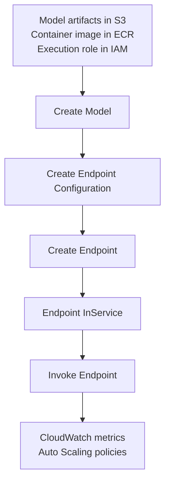
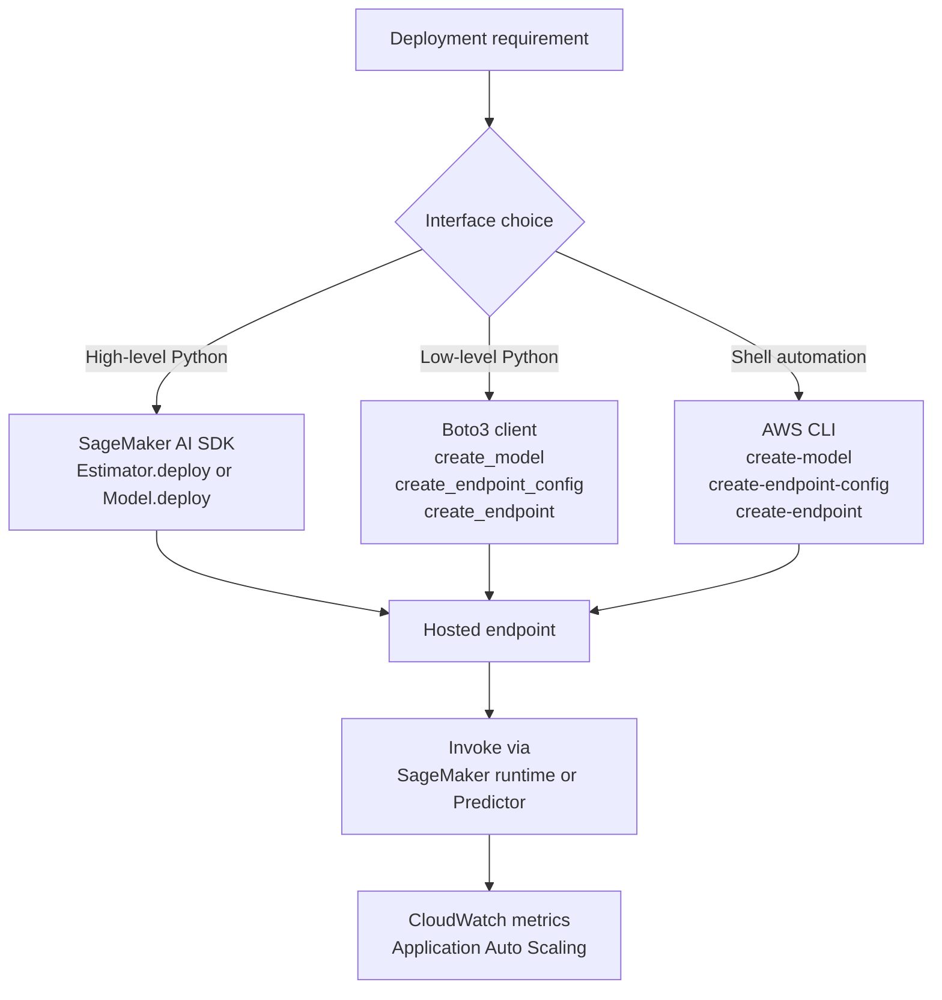

# Task 3.2: Deployment and Orchestration of ML and AI Workflows - Provision and configure resources for ML and AI workloads based on existing architecture and requirements

## Skill 3.2.5: Deploy and host models programmatically (for example, by using the SageMaker AI SDK for Python, AWS CLI, Boto3)

---

## Overview

Programmatic deployment means creating, hosting, updating, and invoking SageMaker AI endpoints through code or command-line automation rather than manually using the AWS Management Console. The exam expects you to understand:

- The difference between the high-level **SageMaker AI SDK for Python**, the low-level **Boto3** AWS SDK, and the **AWS CLI**
- The required deployment sequence:
  1. Create a model
  2. Create an endpoint configuration
  3. Create or update an endpoint
  4. Invoke the endpoint
- How existing architecture constraints, such as VPC networking, IAM roles, container repositories, and scaling requirements, affect deployment choices

This skill is not just about running a command. It is about selecting the right deployment interface for a given operational context and understanding what SageMaker AI needs to host a model successfully.

---

## Programmatic deployment interfaces

SageMaker AI offers layered programming surfaces. The high-level SageMaker AI SDK simplifies typical ML workflows, while Boto3 and the AWS CLI expose the underlying SageMaker API actions directly.

| Interface | Abstraction level | Typical use case | How it deploys |
| --- | --- | --- | --- |
| **SageMaker AI SDK for Python** | High-level, object-oriented | ML engineers and data scientists building models in notebooks or SageMaker Studio | Uses `Estimator.deploy()` or `Model.deploy()` to create model, endpoint configuration, and endpoint in fewer steps |
| **Boto3** | Low-level AWS SDK for Python | Applications, AWS Lambda functions, or custom automation requiring direct control | Calls `create_model`, `create_endpoint_config`, `create_endpoint` separately |
| **AWS CLI** | Low-level command-line interface | Shell scripts, CI/CD pipelines, operational automation without Python | Runs commands like `aws sagemaker create-model`, `aws sagemaker create-endpoint-config`, and `aws sagemaker create-endpoint` |
| **AWS CloudFormation / CDK** | Infrastructure as code | Reproducible deployment of entire environments, not primarily model deployment | Declares `AWS::SageMaker::Model`, `AWS::SageMaker::EndpointConfig`, and `AWS::SageMaker::Endpoint` resources |

The SageMaker AI SDK for Python is the most concise option for model hosting. Boto3 and the AWS CLI offer more explicit control over each API call.

---

## Core deployment workflow

Regardless of the interface, SageMaker AI hosting follows a consistent logical sequence.

### 1. Create the model

A SageMaker AI model is a logical reference that includes:

- **Model artifact location**: usually an Amazon S3 URI containing trained model weights
- **Container image**: a prebuilt SageMaker AI deep learning container or a custom image in Amazon ECR
- **Execution role**: the IAM role SageMaker AI uses to access S3, ECR, and other AWS resources on behalf of the model
- **Environment variables**: optional runtime configuration for the container
- **Network settings**: optional VPC subnets, security groups, and network isolation settings

### 2. Create an endpoint configuration

An endpoint configuration is an immutable blueprint for hosting. It defines:

- One or more production variants
- Model name for each variant
- Instance type and initial instance count for real-time endpoints
- Serverless memory and concurrency for serverless endpoints
- Optionally, traffic weights across variants for A/B or canary deployments

Endpoint configurations cannot be edited after creation. To change a model, instance type, or network settings, you create a new endpoint configuration and point the endpoint to it.

### 3. Create an endpoint

The endpoint is the provisioned hosting resource. It exposes an HTTPS endpoint that applications call for real-time inference. The endpoint creation process provisions the specified compute capacity and downloads the model artifacts and container image.

### 4. Invoke the endpoint

Invocation is performed through:

- **SageMaker AI SDK**: the `Predictor.predict()` method
- **Boto3**: `sagemaker-runtime` client using `invoke_endpoint`
- **AWS CLI**: `aws sagemaker-runtime invoke-endpoint`

A common exam trap is confusing the `sagemaker` client with the `sagemaker-runtime` client. The management client creates and updates endpoints; the runtime client sends actual inference requests.

---

## High-level SageMaker AI SDK deployment

The SageMaker AI SDK for Python is designed to reduce the number of steps required to deploy a model.

| SDK object | Purpose | Deployment behavior |
| --- | --- | --- |
| **Estimator** | Represents a training job and the resulting model | `Estimator.deploy()` can create the model, endpoint configuration, and endpoint from a completed training job |
| **Model** | Represents a trained model from explicit artifacts and container image | `Model.deploy()` creates the model, endpoint configuration, and endpoint |
| **Predictor** | Represents a deployed endpoint for inference | `Predictor.predict()` serializes input and invokes the endpoint |
| **PipelineModel** or **SerialInferencePipeline** | Represents a sequence of containers for inference pipelines | Deploys a multi-container endpoint |

When the requirement says “with the least amount of code” or “minimize operational overhead for a data scientist,” the high-level SageMaker AI SDK is usually the best answer.

However, the high-level SDK may not provide complete control over every API field. When a deployment needs unusual configuration, explicit Boto3 or AWS CLI calls may be more appropriate.

---

## Low-level Boto3 and AWS CLI deployment

Boto3 and AWS CLI expose the same underlying SageMaker AI API. The main operational difference is whether the deployment is driven from Python code or from shell automation.

| Step | Boto3 action | AWS CLI command |
| --- | --- | --- |
| Register model | `create_model` | `aws sagemaker create-model` |
| Define hosting blueprint | `create_endpoint_config` | `aws sagemaker create-endpoint-config` |
| Provision endpoint | `create_endpoint` | `aws sagemaker create-endpoint` |
| Wait until ready | `describe_endpoint` / waiter | `aws sagemaker wait endpoint-in-service` |
| Invoke model | `sagemaker-runtime.invoke_endpoint` | `aws sagemaker-runtime invoke-endpoint` |
| Deploy a new version | `update_endpoint` | `aws sagemaker update-endpoint` |

Use Boto3 when:

- The deployment is part of a Python application or AWS Lambda function
- You need direct control over individual API parameters
- You want to automate deployment without introducing a high-level SDK dependency

Use AWS CLI when:

- The environment is primarily shell-based
- The team uses CI/CD pipelines, Jenkins, or operational scripts
- No Python runtime is available or preferred

---

## Updating a hosted model

To update an endpoint programmatically:

1. Create a new model or reference a new registered model version
2. Create a new endpoint configuration with the new model
3. Call `update_endpoint` to point the existing endpoint to the new endpoint configuration
4. SageMaker AI performs a rolling deployment to the new variant

You do not modify an existing endpoint configuration. Endpoint configurations are immutable.

If you need a managed rollout with traffic shifting, you can define multiple production variants with different `InitialVariantWeight` values and update the endpoint configuration to route traffic gradually.

---

## Real-time vs serverless endpoints

| Characteristic | Real-time endpoint | Serverless endpoint |
| --- | --- | --- |
| Instance management | You specify instance type and count | No instance selection; SageMaker AI manages capacity |
| Configuration inputs | `InstanceType`, `InitialInstanceCount` | `MemorySizeInMB`, `MaxConcurrency` |
| VPC networking | Supported | Not supported |
| Provisioned concurrency | Not applicable; capacity is always provisioned | Can use provisioned concurrency to reduce cold starts |
| Best fit | Steady, predictable production traffic | Intermittent or spiky traffic with scale-to-zero |
| Scaling | Application Auto Scaling on metrics or schedules | Automatic scale-to-zero and concurrency control |

If a question states that the endpoint must remain entirely inside a private VPC, serverless is not the answer. Use a real-time endpoint with VPC subnets, security groups, and VPC endpoints for required AWS services.

---

## Networking and IAM considerations

Programmatic deployment must align with existing network and security architecture.

| Consideration | Detail |
| --- | --- |
| VPC subnets | Provide at least two subnets across different Availability Zones for a real-time endpoint |
| Security groups | Control inbound and outbound traffic to the hosting instances |
| S3 access | The execution role must have `s3:GetObject` for model artifacts |
| ECR access | The execution role must be able to pull the inference container image |
| VPC endpoints | Required for private access to S3, ECR, CloudWatch, and other AWS services when internet access is disabled |
| Network interface permissions | The SageMaker AI execution role must have permissions to create and attach elastic network interfaces in the VPC |

A deployment failure inside a VPC is often caused by a missing private path to S3 or ECR rather than by a lack of model permissions.

---

## Selecting the right programmatic interface

| Requirement | Recommended interface |
| --- | --- |
| Data scientist wants to deploy quickly from a notebook | SageMaker AI SDK for Python |
| Python application or Lambda function needs deployment automation | Boto3 |
| CI/CD pipeline runs shell commands | AWS CLI |
| Full environment must be reproducible through infrastructure as code | AWS CloudFormation or AWS CDK |
| Deployment must fit existing architecture with cross-stack outputs | CloudFormation/CDK importing exported VPC IDs and role ARNs |
| Need to invoke an endpoint | SageMaker runtime client, not the SageMaker management client |

---

## Model hosting inputs at a glance

| Input | Purpose |
| --- | --- |
| Model data URL | S3 URI to trained model artifacts |
| Container image | Prebuilt or custom inference container in ECR |
| Execution role IAM ARN | Grants SageMaker AI access to model artifacts and services |
| Instance type | Compute instance family and size for real-time hosting |
| Initial instance count | Number of instances to provision initially |
| Production variant name | Logical identifier for a hosted model version |
| Initial variant weight | Traffic percentage assigned to the variant |
| VPC configuration | Subnets and security groups for private hosting |
| Serverless configuration | Memory size and maximum concurrency for serverless endpoints |
| Environment variables | Runtime settings passed to the container |

---

## Mermaid: High-level vs low-level deployment flow

---

## Scenario-based exam style questions

### Scenario 1: Least-code deployment

**Question:**  
A data scientist has just completed a SageMaker training job and wants to deploy the trained model to a real-time endpoint using the fewest possible Python statements. Which approach should they use?

**Answer:**  
Use the high-level **SageMaker AI SDK for Python** and deploy directly from the `Estimator` or `Model` object. This creates the model, endpoint configuration, and endpoint in a single high-level call. Boto3 and AWS CLI would require explicitly calling three separate APIs.

**Why the wrong options are wrong:**  
- Boto3 provides more control but requires more lines and steps.
- AWS CLI is scriptable but not optimized for Python notebooks.
- CloudFormation/CDK is useful for reproducible infrastructure, not concise model deployment from a notebook.

---

### Scenario 2: Shell-based CI/CD pipeline

**Question:**  
An operations team uses a Jenkins pipeline that runs shell scripts. They need to programmatically deploy a pre-trained model to a new SageMaker endpoint. The team does not use Python. Which interface should they use?

**Answer:**  
Use the **AWS CLI** with `aws sagemaker create-model`, `create-endpoint-config`, and `create-endpoint`, followed by `aws sagemaker wait endpoint-in-service`.

**Explanation:**  
The AWS CLI is designed for shell automation and does not require Python. It calls the same SageMaker AI APIs as Boto3.

---

### Scenario 3: Updating an existing endpoint

**Question:**  
A company has a SageMaker real-time endpoint serving model version 1. The ML team has trained model version 2 and wants to deploy it without creating a new endpoint name or deleting the existing endpoint. Which sequence should they use?

**Answer:**  
1. Create a new SageMaker model for version 2  
2. Create a new endpoint configuration referencing the new model  
3. Call `update_endpoint` to point the existing endpoint to the new endpoint configuration  

**Explanation:**  
Endpoint configurations are immutable. You cannot modify the existing endpoint configuration in place. The endpoint itself can be updated to use the new configuration without downtime.

---

### Scenario 4: Private network deployment

**Question:**  
A compliance requirement states that a hosted model must remain entirely within a private VPC and must access its model artifacts and downstream services without traffic leaving the AWS private network. Which deployment configuration should be used?

**Answer:**  
Deploy a **real-time endpoint** with:

- At least two private subnets in different Availability Zones
- Security groups restricting traffic
- VPC endpoints for Amazon S3 and Amazon ECR
- An IAM execution role with network interface permissions

**Explanation:**  
Serverless endpoints do not support VPC networking and therefore cannot satisfy the private-network requirement. A real-time endpoint can be attached to VPC subnets and use private endpoints for S3 and ECR access.

---

## Exam tips and traps

### Key exam tips

- Remember the required order: **model → endpoint configuration → endpoint**.
- For invocation, use **`sagemaker-runtime`**, not the `sagemaker` management client.
- Endpoint configurations are **immutable**. Create a new one to change any hosting detail.
- Use **`update_endpoint`** to deploy a new model version without creating a new endpoint.
- Choose **SageMaker AI SDK** when the question asks for the least operational effort.
- Choose **AWS CLI** when the scenario is shell or CI/CD based.
- Choose **Boto3** when the scenario is a Python application or Lambda function requiring low-level control.
- A **private VPC requirement** means real-time endpoint with VPC networking, not serverless.
- Model deployment by itself does **not** configure auto scaling. Auto scaling is configured separately through Application Auto Scaling.
- If using custom container images, use pinned image digests or immutable tags to avoid unpredictable deployment.

### Common traps

| Trap | Why it is wrong |
| --- | --- |
| Creating only an endpoint configuration and expecting the endpoint to exist | The endpoint must be created separately |
| Using `aws sagemaker invoke-endpoint` for inference | Inference uses `aws sagemaker-runtime invoke-endpoint` |
| Choosing serverless for a VPC-isolated endpoint | Serverless endpoints do not support VPC configuration |
| Editing an existing endpoint configuration | Endpoint configurations are immutable |
| Assuming deployment configures auto scaling | Initial instance count is not the same as an auto scaling policy |
| Ignoring VPC endpoints for S3/ECR in private subnets | The endpoint may fail while loading artifacts or container images |
| Forgetting that a deployment role needs S3 and ECR permissions | The endpoint will fail at startup or remain in `Failed` status |

---

## Summary

For programmatic deployment and hosting:

1. Understand the three core deployment resources: model, endpoint configuration, and endpoint.
2. Choose the right interface: SageMaker AI SDK for compact Python deployment, Boto3 for low-level Python automation, AWS CLI for shell automation.
3. Provide the correct inputs: model artifacts in Amazon S3, container image in Amazon ECR, IAM execution role, instance or serverless settings, and optional VPC networking.
4. Update endpoints by creating a new endpoint configuration and calling `update_endpoint`.
5. Invoke hosted models through the SageMaker runtime client, not the SageMaker management client.
6. Align deployment with existing architecture, especially network isolation, IAM roles, and private connectivity.