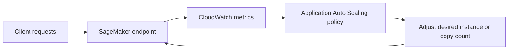
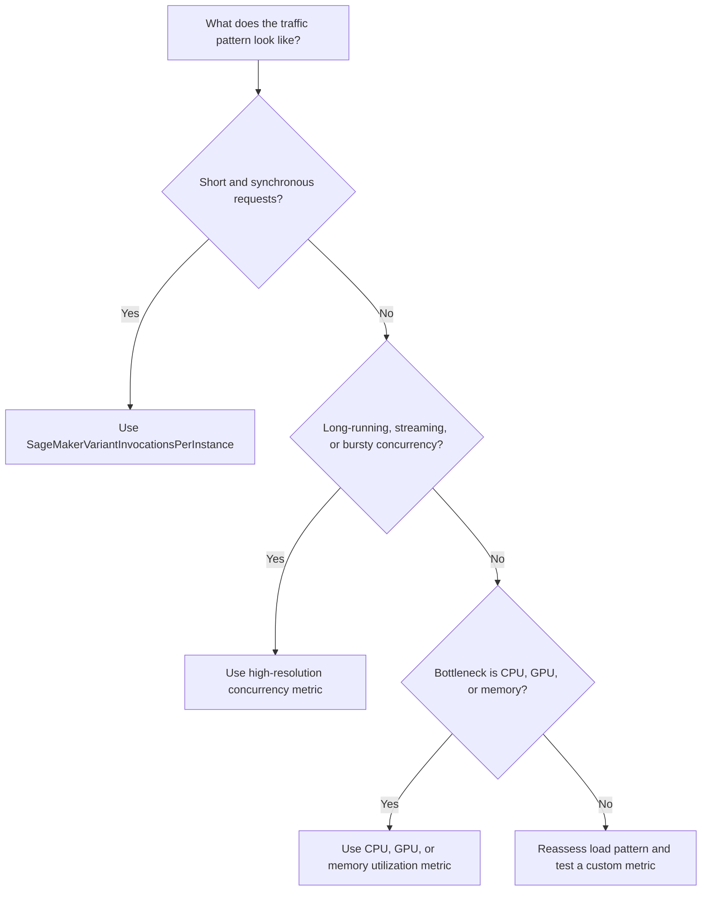

# Task 3.2: Deployment and Orchestration of ML and AI Workflows - Provision and configure resources for ML and AI workloads based on existing architecture and requirements.

## Skill 3.2.6: Select specific metrics for auto scaling implementations.

### 1. What This Skill Covers

Auto scaling for ML inference is only as good as the signal that triggers it. This skill focuses on selecting the correct Amazon CloudWatch metric for an Application Auto Scaling policy that controls Amazon SageMaker AI hosted resources.

The central idea is:

**The metric you choose determines how quickly, accurately, and cost-effectively your endpoint responds to traffic changes.**

A model endpoint can be under-provisioned because it scaled too late, or over-provisioned because it scaled on the wrong signal. Metric selection is therefore not just an operational detail—it directly affects availability, latency, and cost.

---

### 2. Where Auto Scaling Fits in SageMaker AI

For SageMaker AI real-time inference, Application Auto Scaling can automatically adjust:

| Scalable target | What it changes | Typical use case |
|---|---|---|
| SageMaker real-time endpoint production variant | Desired instance count | Classic endpoint with one or more production variants |
| SageMaker inference component | Desired copy count | Multiple models deployed on shared instances; each model can scale independently |

Scaling uses a policy that monitors a CloudWatch metric, compares it to a target, and then increases or decreases capacity as needed.

---

### 3. Core Metric Categories

For SageMaker AI auto scaling, metrics generally fall into three categories.

| Metric category | Example metrics | What it measures | Best used for |
|---|---|---|---|
| Request throughput per instance | `SageMakerVariantInvocationsPerInstance` | Average invocations per minute per instance | Many short, finite request/response calls |
| Concurrency | `SageMakerVariantConcurrentRequestsPerModel` `SageMakerVariantConcurrentRequestsPerCopy` | Number of in-flight requests at a given time | Streaming responses, long-running sessions, fast concurrency spikes |
| Resource utilization | `CPUUtilization`, `GPUUtilization`, `MemoryUtilization`, `DiskUtilization`, custom CloudWatch metrics | Saturation of underlying hardware | GPU- or CPU-bound inference where request count is less representative |

#### Key distinction

A **request count** tracks completed or initiated calls.

A **concurrency metric** tracks how many calls are open right now.

For a model that answers a short request in 100 ms, these two signals are closely related. But for a streaming model that holds a response open for 60 seconds, total invocations can look low while the endpoint is already saturated with concurrent sessions.

---

### 4. Metric Selection Decision Flow

---

### 5. Choosing the Metric by Workload Profile

#### 5.1 Short request/response workloads

These are typical real-time inference endpoints:

- Fraud detection
- Product recommendation
- Text classification
- Search ranking snippets

The traffic pattern is many short, finite requests. The best starting point is a target tracking policy on **`SageMakerVariantInvocationsPerInstance`**.

Why:

- It is a predefined SageMaker metric.
- It normalizes by instance count.
- It matches the dominant cost driver: request volume per instance.
- It publishes at standard one-minute resolution, which is sufficient for most non-streaming workloads.

Example:

> An e-commerce model receives thousands of short recommendation calls per minute. Each call completes in under 200 ms. The team should scale on average invocations per instance, not on CPU alone.

#### 5.2 Streaming and long-running model requests

Streaming responses and long-lived sessions break the assumption that request counts reflect current load. A request could remain open for minutes while the model streams tokens or audio.

In this case, choose a high-resolution concurrency metric:

- **`SageMakerVariantConcurrentRequestsPerModel`**
- **`SageMakerVariantConcurrentRequestsPerCopy`**

These metrics measure the number of in-flight requests at a sub-minute interval, commonly around 10 seconds. This allows Application Auto Scaling to react much faster than a standard one-minute invocation metric.

Example:

> A generative AI assistant streams long responses to users. During a live event, concurrent sessions jump from 500 to 5,000 within seconds. Invocations per minute would react too slowly. A high-resolution concurrency metric detects the in-flight spike and scales out earlier.

#### 5.3 GPU- or hardware-bound inference

Some workloads do not scale linearly with request count:

- Image generation
- Medical imaging
- Video processing
- LLM inference on GPU instances

Here, request count per instance can stay within a safe range while GPU memory and compute are saturated.

Use resource-utilization metrics such as:

- `GPUUtilization`
- `MemoryUtilization`
- `CPUUtilization`
- A custom CloudWatch metric published by the application

Important caveat:

> A custom utilization metric must be load-tested before production. Unlike request-based metrics, there is no guarantee that the metric moves proportionally to capacity.

Example:

> A medical imaging endpoint processes variable-size images on GPU instances. The number of requests is low, but each request can consume large GPU resources. The team should scale on GPU utilization or memory utilization after testing a safe target value.

---

### 6. Standard vs. High-Resolution Metrics

This is one of the most important exam distinctions.

| Characteristic | Standard invocation metric | High-resolution concurrency metric |
|---|---|---|
| Example | `SageMakerVariantInvocationsPerInstance` | `SageMakerVariantConcurrentRequestsPerModel` `SageMakerVariantConcurrentRequestsPerCopy` |
| Typical resolution | About 1 minute | Sub-minute, approximately 10 seconds |
| Best for | Predictable minute-level request volume | Fast spikes in concurrent in-flight sessions |
| Reacts to | Completed or initiated requests over time | Live requests currently being handled |

The phrase in a scenario that points to concurrency is often:

- "requests spike in seconds"
- "streams responses over a long window"
- "long-lived sessions"
- "in-flight requests grow rapidly"

The phrase that points to throughput is often:

- "many short requests"
- "request volume doubles during business hours"
- "requests per minute"

---

### 7. Custom Metrics and Resource Utilization

Application Auto Scaling can also use custom CloudWatch metrics. This is useful when:

- The workload is hardware-bound.
- Request count does not reflect real headroom.
- The model has an application-specific capacity metric.

Example of a custom metric:

> The model container publishes `active_video_jobs` to CloudWatch. Auto scaling targets an average of 10 active jobs per instance.

Before using a custom metric, validate:

- The metric changes in proportion to actual load.
- It reflects capacity headroom.
- It does not create scaling flapping due to noise.
- It is published at a useful frequency.

Common SageMaker resource metrics include:

| Metric | Common use |
|---|---|
| `CPUUtilization` | CPU-bound preprocessing or feature engineering |
| `MemoryUtilization` | Large models or in-memory caches |
| `GPUUtilization` | GPU inference bottlenecks |
| `DiskUtilization` | Models reading large local datasets |

---

### 8. Cooldowns and Scaling Stability

Metric selection alone does not guarantee stable scaling. Cooldown settings prevent the endpoint from oscillating.

Two main cooldown types:

| Cooldown | Purpose |
|---|---|
| Scale-out cooldown | Prevents a short burst from causing repeated scale-out actions |
| Scale-in cooldown | Prevents a dip in traffic from immediately removing capacity |

Example problem:

> A traffic burst triggers scale-out, but the metric quickly drops. Without an appropriate cooldown, the endpoint might scale in immediately and then scale out again.

The combination of the right metric and appropriate cooldown settings keeps capacity aligned with actual demand.

---

### 9. Auto Scaling Policy Types at a Glance

Metric selection matters most in target tracking, but it is useful to know the policy types that consume metrics.

| Policy type | How it works | Typical use |
|---|---|---|
| Target tracking | Maintains a specified metric target value | Most common; recommended for SageMaker endpoints |
| Step scaling | Adds or removes capacity in steps based on CloudWatch alarm thresholds | Discrete workload changes |
| Scheduled scaling | Changes capacity at defined dates or times | Known calendar-driven traffic patterns |

For dynamic traffic spikes, **target tracking on the correct metric** is preferred.

---

### 10. Scenario-Based Examples

#### Scenario 1

A company runs a real-time product classification model behind a SageMaker endpoint. The API receives a large number of short requests during checkout. Traffic grows gradually throughout the day and falls at night.

Which auto scaling metric should the company use?

**Answer:**  
Target tracking on **`SageMakerVariantInvocationsPerInstance`**.

**Explanation:**  
The workload consists of short, finite requests. Invocations per instance are a direct measure of how many requests each instance is handling. Since the traffic change is minute-level and predictable, the standard resolution is acceptable.

#### Scenario 2

A media application uses SageMaker to host a generative model that streams responses. Users watch responses arrive over several minutes. During a product launch, concurrent requests spike from 300 to 4,000 in under 15 seconds.

Which metric choice addresses this?

**Answer:**  
A high-resolution concurrency metric such as **`SageMakerVariantConcurrentRequestsPerModel`** or **`SageMakerVariantConcurrentRequestsPerCopy`**.

**Explanation:**  
The issue is not the number of completed requests, but how many requests are open simultaneously. These metrics publish far more often than one-minute invocations per instance, allowing the scaling policy to respond within seconds.

#### Scenario 3

A healthcare imaging company uses GPU-backed SageMaker endpoints. Each request processes variable-size images and can consume a large amount of GPU memory. Request count per instance remains low, but the endpoint occasionally becomes unresponsive.

Which scaling metric should be evaluated?

**Answer:**  
A resource-utilization metric such as `GPUUtilization` or `MemoryUtilization`, or a custom metric based on queued image processing jobs.

**Explanation:**  
The bottleneck is hardware saturation, not request throughput. The company should load-test GPU utilization against safe capacity limits and scale on that signal.

---

### 11. Exam Tips and Traps

#### Tips

- For ordinary short-request inference, choose **`SageMakerVariantInvocationsPerInstance`**.
- For streaming, long-lived, or bursty concurrent requests, choose a **high-resolution concurrency metric**.
- For GPU- or CPU-bound workloads, consider **resource utilization** or a **custom metric**.
- Remember that high-resolution metrics allow scaling to react in seconds, while standard invocation metrics typically react at minute-level resolution.
- Use **load testing** to set realistic target values for metrics, especially for concurrency and GPU utilization.
- Consider **cooldown settings** to prevent rapid scale-out and scale-in flapping.

#### Traps

- Do not select **CPU utilization** by default for all workloads. A request-driven model may become saturated with queued requests before CPU reaches a high threshold.
- Do not use total **`Invocations`** as a scaling target if instance count changes. A per-instance metric is a better saturation signal.
- Do not assume that invocations per minute will catch streaming bottlenecks. If responses are long-running, a model can be overloaded even when invocations per minute look low.
- Do not use a custom metric in production without validating that it changes proportionally to capacity.
- Do not choose scheduled scaling for rapid, unpredictable traffic spikes. Scheduled scaling is for known calendar patterns.
- Do not confuse Application Auto Scaling for SageMaker endpoints with EC2 Auto Scaling. SageMaker scaling uses Application Auto Scaling.
- Do not use serverless endpoint instance count scaling as a metric selection scenario. Serverless inference handles compute capacity differently from instance-based real-time endpoints.

---

### 12. Key Takeaways

1. **Metric selection is the primary scaling signal.** It determines when scaling occurs and how fast the endpoint reacts.
2. **Use request throughput metrics** for short, synchronous inference.
3. **Use high-resolution concurrency metrics** for streaming, long-held requests, or fast traffic spikes.
4. **Use resource-utilization metrics** when hardware saturation, not request count, is the limiting factor.
5. **Match metric resolution to traffic volatility.** The faster the spike, the higher the resolution required.
6. **Always test custom metrics before production** to ensure they are correlated with capacity headroom.
7. **Combine the right metric with proper cooldown settings** to prevent scaling flapping and unnecessary cost.