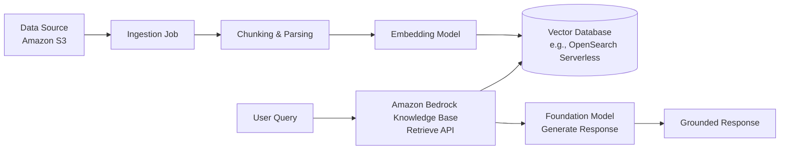
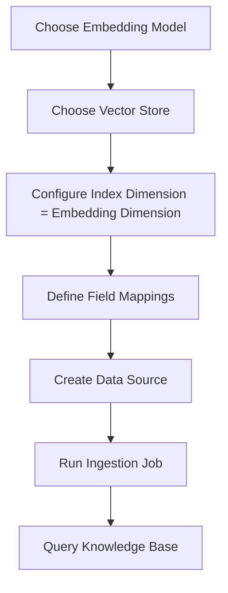
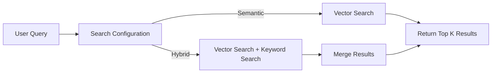

# Task 3.2: Deployment and Orchestration of ML and AI Workflows - Provision and configure resources for ML and AI workloads based on existing architecture and requirements.

## Skill 3.2.7: Create and manage Amazon Bedrock knowledge bases with vector database configurations, document indexing, and retrieval optimization.

---

## 1. What Is an Amazon Bedrock Knowledge Base?

Amazon Bedrock Knowledge Bases is a **fully managed Retrieval-Augmented Generation (RAG) capability** that connects foundation models (FMs) to your proprietary company data. It automates the end-to-end ingestion and retrieval pipeline:

- **Ingestion** – ingests documents from a data source, chunks them, generates embeddings using an embedding model, and stores the vectors in a vector database.
- **Retrieval** – takes a user query, converts it into an embedding, retrieves the most relevant chunks from the vector database, and returns them as context to a foundation model for grounded generation.

Instead of building and maintaining your own RAG pipeline, Amazon Bedrock Knowledge Bases manages the components shown in the following diagram:

---

## 2. Key Components and Concepts

| Component | Description |
| --- | --- |
| **Knowledge base** | A logical container that combines a data source, an embedding model, and a vector database configuration. |
| **Data source** | The origin of documents, most commonly Amazon S3, but also web crawlers, Salesforce, SharePoint, Confluence, and others. |
| **Vector index** | The index within the vector database that stores document embeddings and associated text and metadata. |
| **Embedding model** | A foundation model that converts text chunks into fixed-length numeric vectors representing semantic meaning. |
| **Chunking strategy** | How documents are split into smaller passages before embedding. This affects retrieval granularity. |
| **Metadata** | Structured information attached to chunks (e.g., file name, source URL, custom fields) used for filtering during retrieval. |
| **Ingestion job / sync** | The process of reading, transforming, embedding, and storing document chunks into the vector database. |

---

## 3. Vector Database Configurations

### 3.1 Supported Vector Store Options

Amazon Bedrock Knowledge Bases supports several vector store options. The choice has long-term consequences for retrieval behavior, cost, and operational fit.

| Vector Store | Category | Hybrid Search | Metadata Filtering | Typical Use Case |
| --- | --- | --- | --- | --- |
| **Amazon OpenSearch Serverless** | Managed search service | ✅ Yes | ✅ Yes | Default choice, fully managed, supports hybrid and semantic search, quick setup |
| **Amazon OpenSearch Managed Cluster** | Managed search service | ✅ Yes | ✅ Yes | Existing OpenSearch clusters, custom scaling, fine-grained control |
| **Amazon Aurora PostgreSQL (pgvector)** | Relational database | Limited / via SQL | ✅ SQL filtering | Keeping embeddings in the same RDBMS as application data |
| **Pinecone** | External managed vector DB | ❌ Primarily vector | ✅ Metadata filters | High-dimensional vector search, external managed vector stores |
| **Redis Enterprise Cloud** | In-memory store | ❌ Primarily vector | ✅ Metadata filters | Low-latency real-time retrieval, in-memory performance |
| **MongoDB Atlas** | Document database | ❌ Primarily vector | ✅ Metadata filters | Existing MongoDB workloads, document-oriented RAG |

> **Key exam point:** Hybrid search is not supported by every vector store. If the use case requires **hybrid search** (lexical + semantic), select **Amazon OpenSearch** as the vector store.

### 3.2 Index Dimension and Field Mapping

Creating the vector index correctly is critical. The **vector dimension** of the index must **match the dimension of the embedding model** you select.

For example:

- **Amazon Titan Text Embeddings v2** supports dimensions such as 256, 512, or 1024.
- **Cohere Embed** typically produces 1024 dimensions.
- If your vector index is configured for **384-dimensional** vectors but your embedding model produces **1024-dimensional** vectors, ingestion fails.

You must also define the **field mapping** before ingestion. Typical fields include:

| Field Type | Purpose |
| --- | --- |
| **Vector field** | Stores the actual embedding vectors. |
| **Text field** | Stores the original text chunk, used for hybrid searches and retrieval results. |
| **Metadata field** | Stores structured metadata such as document name, source, date, or custom fields. |
| **Filterable text field** | Required for hybrid search. This field must be indexed for keyword/full-text search capability. |

> **Important:** Field mappings cannot be changed after ingestion without **re-indexing** the entire knowledge base.

### 3.3 Configuration Steps for a Knowledge Base

1. Choose an embedding model with known vector dimensions.
2. Choose a vector store (e.g., Amazon OpenSearch Serverless).
3. Configure the vector index with the matching dimension and distance metric (usually cosine or inner product).
4. Define field mappings for vector, text, and metadata.
5. Create a data source (e.g., an S3 bucket) and attach it to the knowledge base.
6. Run an ingestion job to populate the vector index.

---

## 4. Document Indexing

### 4.1 Data Sources

Amazon Bedrock Knowledge Bases supports multiple data source types. The most common for the exam is **Amazon S3**. Other possible sources include:

- **Web crawler**
- **Salesforce**
- **SharePoint**
- **Confluence**

For an S3 data source, you can specify a bucket and prefix, such as `s3://my-documents/`. The IAM role attached to the knowledge base must have permission to read from that bucket.

### 4.2 Chunking and Parsing

Documents are parsed and divided into chunks before embedding. The chunking strategy affects how well retrieval works.

| Chunking Strategy | Description |
| --- | --- |
| **Default chunking** | Automatically splits text into chunks around 300 tokens with a default overlap percentage (approximately 20%). |
| **Fixed-size chunking** | Splits documents into a fixed number of tokens with a configurable overlap. |
| **No chunking** | Treats each document as a single chunk. Useful for short documents. |
| **Hierarchical chunking** | Creates parent and child chunks to preserve broader context during retrieval while maintaining detail. |
| **Semantic chunking** | Splits documents based on semantic boundaries, using embedding similarity to group related content. |

### 4.3 Metadata Enrichment

Metadata is essential for filtering during retrieval. When documents are ingested from S3, the knowledge base automatically captures standard metadata such as:

- `s3_uri`
- `x-amz-bedrock-kb-source-uri`
- `file_type`
- `file_name`

You can also provide a custom metadata file alongside each document or attach metadata during ingestion. This enables filtering on attributes like department, product category, or document version.

### 4.4 Ingestion Jobs and Sync

An ingestion job processes documents from the data source and loads them into the vector index.

| Sync Type | Behavior |
| --- | --- |
| **Full sync / initial ingestion** | Processes all documents in the data source from scratch. |
| **Incremental sync** | Processes only new, modified, or deleted documents since the last sync. Default for subsequent syncs where change detection is available. |
| **Forced full sync** | Re-processes all documents, which can be used if you change the embedding model or index configuration and must re-index everything. |

> **Key concept:** A resync typically processes only what changed since the last sync. If you modify the vector index dimension, embedding model, or field mappings, a full re-index is generally required.

---

## 5. Retrieval Optimization

Retrieval quality directly affects the quality of generated responses. Amazon Bedrock Knowledge Bases provides several levers to optimize retrieval:

### 5.1 Search Type

| Search Type | Description |
| --- | --- |
| **Semantic** | Uses vector similarity only. Finds chunks that are semantically similar to the query. Good for natural language queries, but may miss exact keyword matches. |
| **Hybrid** | Combines vector similarity with lexical/keyword search (e.g., BM25 over a filterable text field). Supports exact identifiers like part numbers, SKUs, and error codes. Requires a vector store that supports hybrid search, such as OpenSearch. |
| **Default** | Uses hybrid search if the vector store and field mappings support it; otherwise, falls back to semantic search. |

### 5.2 Number of Results (Top K)

The number of retrieved chunks affects:

- **Context richness** – too few results may omit relevant information.
- **Latency and cost** – too many results increase input token count and inference time.
- **Relevance** – a large `top_k` may include noise that distracts the model.

Typical values range from 2 to 10 for RAG workflows. You can tune this based on the downstream model's context window and the required answer quality.

### 5.3 Metadata Filtering

Metadata filters restrict the candidate set before similarity is measured, improving both speed and relevance.

Example use cases:

- Retrieving only documents from a specific department:
  - `department = "engineering"`
- Retrieving only documents after a certain date:
  - `date_published > "2025-01-01"`
- Retrieving only documents with a specific product line:
  - `product_line IN ("ML", "AI")`

Metadata filtering is a **query-time operation**, not an ingestion-time operation. The metadata must already exist in the vector database.

### 5.4 Reranking

Amazon Bedrock Knowledge Bases can be integrated with **Amazon Bedrock Rerank models**. Reranking takes the initially retrieved chunks (e.g., 10–20 results) and re-evaluates their relevance to the query using a more precise cross-encoder model. The top few results are then provided as context.

| Without Reranking | With Reranking |
| --- | --- |
| Retrieves top K by initial similarity; may include less relevant chunks. | Re-scores the candidate set and returns only the most relevant chunks. |
| Larger K to avoid missing relevant content, increasing input tokens. | Smaller final K with improved relevance, reducing latency and cost. |
| Prone to keyword/vector mismatch issues. | Better alignment with the actual generative task. |

Reranking is especially useful when you want to keep `top_k` high for recall but need to reduce the final number of chunks for precision.

### 5.5 Retrieval APIs

Amazon Bedrock Knowledge Bases offers two primary query methods:

| API | Purpose |
| --- | --- |
| **Retrieve** | Returns the retrieved chunks from the knowledge base without generating a response. Useful when you want to use the retrieved context in your own orchestration or with a custom prompt. |
| **RetrieveAndGenerate** | Combines retrieval and generation. It retrieves the relevant chunks and automatically passes them to a foundation model to generate a grounded answer. Useful for quickly building RAG applications. |

---

## 6. Management and Security

### 6.1 IAM Permissions

Amazon Bedrock Knowledge Bases requires IAM roles with least-privilege permissions for:

- **Data source access** – e.g., `s3:GetObject`, `s3:ListBucket` for an S3 data source.
- **Embedding model access** – permission to invoke the selected embedding model in Amazon Bedrock.
- **Vector store access** – permissions to write and read from the selected vector database, e.g., OpenSearch Serverless data access policies.
- **Rerank model access** – if reranking is enabled.
- **Foundation model access** – for `RetrieveAndGenerate` to call the generator model.

### 6.2 Encryption

- **At rest** – S3 data sources, OpenSearch Serverless collections, and other vector stores support encryption at rest using AWS KMS.
- **In transit** – communication between Bedrock, data sources, vector stores, and downstream models uses TLS.

### 6.3 Network Configuration

- **OpenSearch Serverless** supports private network access through VPC endpoints.
- You can configure vector stores to be accessible only from your VPC to meet compliance requirements.
- For private data sources, ensure VPC endpoints exist for Amazon S3 if traffic must stay within the private network.

### 6.4 Monitoring and Tags

- Use **Amazon CloudWatch** to monitor ingestion job status, retrieval latency, and error metrics.
- Tag knowledge bases, data sources, and vector stores for cost allocation and governance.

---

## 7. Scenario-Based Examples

### Scenario 1: Exact Part Number and Semantic Text

> A manufacturing company wants to build a RAG system that can answer both:
> - “What is the torque specification for part XJ-447?”
> - “What are common installation mistakes for our engine mounts?”

They must return **exact part number matches** as well as **semantically similar text**.

**Solution:**

- Choose **Amazon OpenSearch Serverless** as the vector store.
- Enable **hybrid search**.
- Ensure a **filterable text field** is mapped alongside the vector field.
- Configure the retrieval to use **hybrid search** so the exact part number can be matched lexically while related concepts are matched vectorially.

> **Exam cue:** If a scenario mentions exact identifiers, SKUs, part numbers, or product codes, the correct vector store is one that supports **hybrid search**, typically Amazon OpenSearch.

---

### Scenario 2: Dimension Mismatch During Ingestion

> A data science team creates a knowledge base with an OpenSearch Serverless index dimension of 384. They later switch the embedding model to one that produces 1024-dimensional vectors. The ingestion job now fails.

**Root cause:**

- The vector index dimension must match the embedding model output.

**Solution options:**

1. Recreate the vector index with dimension set to 1024, or
2. Select an embedding model that produces 384-dimensional vectors.

After fixing the dimension, run a full ingestion job.

---

### Scenario 3: Frequently Updated Documents

> A support team stores policy documents in S3. The documents are updated several times per day. The RAG system must always return current policy information without fully re-ingesting the entire document set each time.

**Solution:**

- Use **incremental sync**.
- The first sync is a full sync. Subsequent syncs automatically process only new, modified, or deleted documents based on S3 change detection.
- If a full re-index is ever required, trigger a manual full sync.

> **Exam cue:** “Resync only changed documents” is the hallmark of **incremental sync**.

---

### Scenario 4: Retrieval Returns Irrelevant Chunks

> A legal chatbot retrieves 20 chunks per query, but the generated answers often reference irrelevant cases. The team wants to improve answer quality without increasing latency.

**Solution:**

- Apply **metadata filtering** to restrict retrieval to practice areas, jurisdictions, or date ranges.
- Use **reranking** after initial retrieval to keep the most relevant few chunks.
- Reduce the final number of chunks passed to the generator so the model focuses on high-quality context.

---

## 8. Practice Questions

### Question 1

A financial services company uses Amazon Bedrock Knowledge Bases to retrieve product documentation. Users frequently search by exact product ID (e.g., “FX-8920”) and by natural language descriptions. Which configuration best supports both query types? *(Choose 1)*

- **A.** A vector store with semantic search only
- **B.** Amazon OpenSearch with hybrid search enabled and a filterable text field
- **C.** A relational vector store with no text indexing
- **D.** An in-memory vector store with metadata filtering only

??? success "Answer & Explanation"
    **Correct Answer:** **B. Amazon OpenSearch with hybrid search enabled and a filterable text field**

    **Explanation:**  
    Hybrid search combines dense vector search for semantic meaning with lexical keyword search for exact identifiers. Amazon OpenSearch supports hybrid search when a filterable text field is present. Semantic-only search may miss exact product IDs, while metadata filtering alone does not provide keyword matching over the text field.

---

### Question 2

A data engineer changes the embedding model for an existing knowledge base from one producing 384-dimensional vectors to one producing 1024-dimensional vectors. The subsequent ingestion job fails. What is the most likely cause?

- **A.** The IAM role lacks S3 permissions
- **B.** The vector index dimension does not match the embedding model output
- **C.** The data source was not configured
- **D.** The retrieval API was called before ingestion completed

??? success "Answer & Explanation"
    **Correct Answer:** **B. The vector index dimension does not match the embedding model output**

    **Explanation:**  
    Vector indexes require a fixed dimension. If the embedding model output changes, the vector index must be recreated with the new dimension, or the original embedding model must be used. Ingestion fails when there is a dimension mismatch.

---

## 9. Exam Tips and Traps

| Tip / Trap | Guidance |
| --- | --- |
| **Trap:** All vector stores support hybrid search | Not true. Hybrid search requires OpenSearch or a store with lexical text search capabilities. If exact keyword matching is needed, choose OpenSearch. |
| **Trap:** You can change field mappings after ingestion | Field mappings are set before ingestion. Changing them requires re-indexing. |
| **Trap:** Vector dimension is not important | Dimension mismatch causes ingestion failures. Always match the index dimension to the embedding model. |
| **Tip:** Use metadata filters at retrieval time | Filters narrow the candidate set before similarity is measured, improving both relevance and speed. |
| **Tip:** Use reranking for better precision | Reranking helps reduce noise and improves answer quality when you must retrieve a larger initial K for recall. |
| **Trap:** Incremental sync always works automatically | S3 change detection requires event notifications or versioning in some configurations. If changes are not detected, a full sync may be needed. |
| **Tip:** Know the difference between Retrieve and RetrieveAndGenerate | `Retrieve` returns chunks only; `RetrieveAndGenerate` returns a grounded answer. |
| **Trap:** Larger top K is always better | Larger `top_k` increases input tokens, latency, and cost, and can dilute the model's focus. Use filters and reranking to keep it small. |

---

## 10. Summary Checklist

- [ ] I know what Amazon Bedrock Knowledge Bases is and how it fits into a RAG workflow.
- [ ] I can list supported vector store options and select the best one for a given requirement, especially hybrid search.
- [ ] I understand that vector index dimensions must match the embedding model output.
- [ ] I can describe field mappings for vector, text, metadata, and filterable text.
- [ ] I know the difference between full sync and incremental sync.
- [ ] I can identify common document chunking strategies and when to use them.
- [ ] I know how to optimize retrieval using search type, top K, metadata filtering, and reranking.
- [ ] I understand the roles of `Retrieve` and `RetrieveAndGenerate`.
- [ ] I can troubleshoot common issues like dimension mismatch, missing hybrid support, and stale document sync.

---