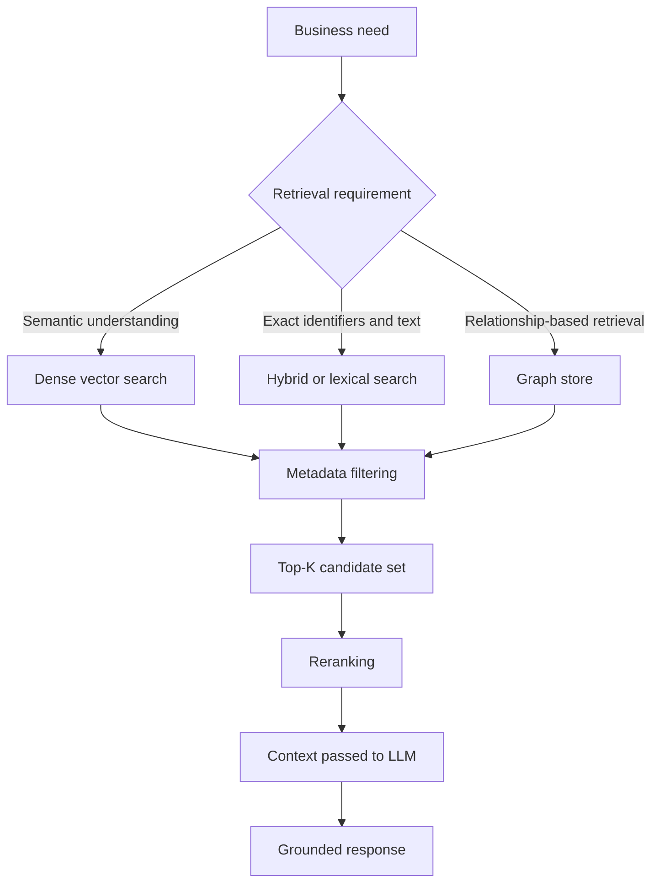
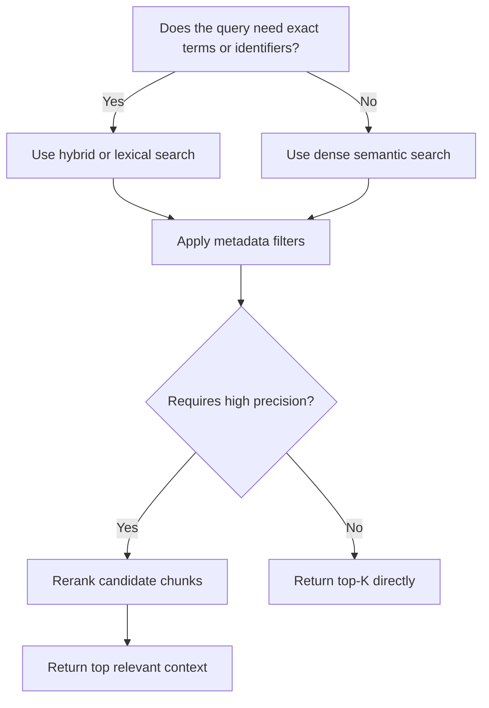

# Task 3.2: Deployment and Orchestration of ML and AI Workflows - Provision and configure resources for ML and AI workloads based on existing architecture and requirements.

## Skill 3.2.8: Implement retrieval pipelines to meet business needs.

### Skill Overview

A retrieval pipeline is the runtime path that takes a user query, searches an index of source material, and returns the most relevant text chunks to ground a generative AI response. In AWS, this is commonly implemented through **Amazon Bedrock Knowledge Bases**, but it can also be built as a custom pipeline using services such as **Amazon OpenSearch Service**, **Amazon Aurora PostgreSQL with pgvector**, or a customer-managed vector database.

The goal of this skill is not simply to create a knowledge base. The goal is to design and implement a retrieval pipeline that satisfies a specific business requirement, such as:

- Returning exact product identifiers and semantically similar support text
- Restricting answers to a particular time period, region, or tenant
- Improving retrieval quality through reranking
- Keeping documents fresh through incremental ingestion
- Supporting graph-based retrieval where entity relationships matter
- Operating inside an existing VPC and data architecture

A strong mental model is:

---

### Core Building Blocks of a Retrieval Pipeline

#### 1. Data Source and Ingestion

Amazon Bedrock Knowledge Bases supports data sources such as Amazon S3, web content, Salesforce, Confluence, SharePoint, and other connectors. When a data source is synchronized:

- Documents are parsed and chunked.
- Each chunk is embedded using a configured embedding model.
- Embeddings and text are written into a vector store.
- Metadata is stored for filtering and citation.

Two important synchronization concepts:

| Sync type | Behavior | Common use case |
| --- | --- | --- |
| Full sync | Re-processes the entire data source | Initial ingestion, major index changes, schema changes |
| Incremental sync | Processes new, changed, or deleted documents | Frequent document updates, freshness requirements |

For business needs such as “support articles updated constantly,” incremental synchronization is preferred over repeated full syncs.

---

#### 2. Chunking Strategy

Chunking directly affects retrieval quality. If chunks are too large, they may cover multiple topics and reduce precision. If they are too small, they may lose the context needed to answer the query.

| Chunking approach | Best suited for |
| --- | --- |
| Fixed-size chunks | Generic documents without strong section structure |
| Hierarchical chunks | Long policies, manuals, or contracts with parent-child sections |
| Semantic chunking | Content where topic boundaries are meaningful |
| Overlapping chunks | Preserving context at chunk boundaries |

The business requirement should drive chunking. For example, a legal review system may need hierarchical chunking to retain section context.

---

#### 3. Embedding Model and Vector Dimension

The embedding model converts text chunks into dense vectors. The vector index must be created with the same dimension size as the chosen embedding model.

| Embedding model | Example vector dimension |
| --- | --- |
| Amazon Titan Embeddings models | 256, 384, 1024, 1536 depending on model version |
| Cohere Embed models | Model-dependent dimension |
| Third-party or custom embedding model | Must be known before index creation |

A dimension mismatch causes ingestion or query failure. The field mapping and dimension should be configured before ingestion. If a change is required later, a reindex or index rebuild is usually necessary.

---

#### 4. Vector Store Selection

The vector store decision has long-term impact on what the retrieval pipeline can do.

| Store option | Strengths | Common use cases |
| --- | --- | --- |
| Amazon OpenSearch Serverless or provisioned cluster | Supports hybrid search, metadata filtering, scalable text search | Managed RAG, hybrid retrieval, production generative AI |
| Amazon Aurora PostgreSQL with pgvector | Stores embeddings alongside relational data | Applications that need joins between vectors and transactional records |
| Amazon Neptune or Neptune Analytics | Graph traversal and relationship-based retrieval | Knowledge graphs, entity relationship queries |
| Pinecone, Redis Enterprise Cloud, MongoDB Atlas | Dedicated vector database options, existing organizational adoption | Teams already standardized on a specific vector store |
| Object storage for vector data | Low cost for large vector sets queried infrequently | Offline or batch semantic analysis |

The phrase from the exam domain, “based on existing architecture,” is important here. If the organization already runs OpenSearch, that is often the natural vector store candidate. If the organization runs a large relational application on Aurora, pgvector may reduce data movement.

---

#### 5. Index Field Mapping

Before ingestion, the vector index should define the fields that retrieval will later use.

| Field type | Purpose |
| --- | --- |
| Vector field | Stores the embedding; dimension must match the embedding model |
| Text field | Stores the original chunk text; must be filterable if hybrid search is used |
| Metadata fields | Store source, date, category, tenant ID, document type, language, etc. |
| Document ID | Used for citation, deletion, and deduplication |

Business requirements determine which metadata fields should be captured. For example:

- Multi-tenant SaaS application → `tenant_id`
- Date-restricted answers → `year` or `last_modified`
- Regulated document search → `document_class`
- Source citation → `source_uri`

Metadata filters are applied at query time to narrow the candidate set before or during similarity search.

---

### Query-Time Retrieval Design

#### Search Types

| Search mode | What it does | When to use |
| --- | --- | --- |
| Dense vector search | Compares query embedding with document embeddings | Paraphrase, semantic similarity, contextual questions |
| Lexical search | Matches exact terms using keyword-based retrieval such as BM25 | Part numbers, SKUs, error codes, legal citations |
| Hybrid search | Combines dense vector and lexical search | When you need both semantic understanding and exact keyword matching |
| Metadata-filtered search | Restricts candidates based on structured fields | Date, region, tenant, content type |

#### Top-K or Number of Results

The result count controls how many text chunks are returned as candidate context.

- Too low → may miss the right context and reduce recall.
- Too high → may introduce irrelevant chunks, increase latency, and overflow the model context.

A common pattern is to retrieve a larger candidate set and then rerank it down to a smaller final set.

#### Reranking

Reranking reorders retrieved chunks using a more powerful relevance model, such as **Amazon Bedrock Rerank**. It improves precision by placing the most useful chunks at the top before they are passed to the language model.

Reranking does not search the entire corpus. It only reorders the candidates already retrieved. Therefore, initial retrieval must have enough candidate depth to allow reranking to be effective.

---

### Mapping Business Needs to Pipeline Decisions

| Business requirement | Retrieval pipeline design |
| --- | --- |
| “Find exact part numbers and semantically related descriptions” | Hybrid search over a filterable text field |
| “Only use documents from the current year” | Metadata filter on `year` |
| “Returning users should not see content from another tenant” | Metadata filter on `tenant_id` at query time |
| “The model should cite its sources” | Return text chunks plus metadata such as `source_uri` |
| “Support documents update frequently” | Incremental sync |
| “Answers require both recall and precision” | Retrieve enough candidates, then rerank |
| “Documents contain complex entity relationships” | Graph-based retrieval using Amazon Neptune |
| “Existing application uses PostgreSQL” | Consider Amazon Aurora PostgreSQL with pgvector |
| “Need low-latency RAG at scale” | Amazon OpenSearch Serverless with managed scaling |

---

### Reference Architecture

---

### Decision Flow for Implementing Retrieval Pipelines

---

### Scenario-Based Examples

#### Scenario 1: Industrial Parts Search

A manufacturer wants a generative AI assistant that can answer both:

- “What are the installation guidelines for centrifugal pumps?”
- “What is the specification for part number P-88231?”

The system needs exact part number matching and semantic retrieval in one query.

**Question:** Which vector store and search configuration should be used?

**A.** A graph store with entity relationship queries  
**B.** An object storage vector store with only dense vector search  
**C.** Amazon OpenSearch Service with hybrid search over a filterable text field  
**D.** A relational database without vector search  

**Answer:** C

**Explanation:** Exact part numbers require lexical or hybrid search. Amazon OpenSearch Service supports hybrid search, which combines keyword matching with dense vector similarity. A graph store is used for entity relationships, not exact alphanumeric identifiers. Dense vector search alone often fails on precise part numbers.

---

#### Scenario 2: Multi-Tenant Knowledge Base

A SaaS company builds a customer support assistant. Each customer must only retrieve information from their own documents.

**Question:** What is the most important retrieval pipeline control?

**A.** Increase the top-K result count for each tenant  
**B.** Use a tenant-specific metadata filter at query time  
**C.** Run a full sync before each query  
**D.** Use a larger embedding dimension for each tenant  

**Answer:** B

**Explanation:** Metadata filtering on `tenant_id` restricts retrieval to the correct tenant’s documents. Increasing top-K does not isolate tenants. Full sync before each query is inefficient and does not enforce tenant boundaries. Embedding dimension should match the chosen embedding model and is unrelated to tenant isolation.

---

#### Scenario 3: Improving Relevance in a Dense Retrieval Pipeline

A legal research assistant retrieves 50 candidate chunks, but the most relevant chunk often appears in position 20 or lower. The language model sometimes receives too much irrelevant context.

**Question:** Which design change improves precision?

**A.** Increase the result count and send all chunks to the model  
**B.** Add a metadata filter that selects random documents  
**C.** Add a reranking step after initial retrieval  
**D.** Replace the embedding model with a smaller dimension  

**Answer:** C

**Explanation:** Reranking reorders the already retrieved candidates based on deep relevance to the query. Retrieving 50 candidates is acceptable if a reranker then selects the top few. Sending all chunks to the model increases noise. A smaller embedding dimension changes vector quality and may not improve precision.

---

#### Scenario 4: Vector Index Dimension Mismatch

A team creates an OpenSearch index with a vector dimension of 1536. They then configure a Bedrock Knowledge Base with an embedding model that outputs vectors of dimension 1024.

**Question:** What is the likely result?

**A.** Ingestion automatically resizes the index  
**B.** Ingestion or query failure because the vector dimensions do not match  
**C.** Retrieval works but ignores the extra dimensions  
**D.** The embedding model changes its output dimension to match the index  

**Answer:** B

**Explanation:** The vector field dimension in the index must match the embedding model output. A mismatch causes ingestion or query errors. The index cannot automatically resize the vector field. If a change is required, the index must be recreated or reindexed with the correct dimension.

---

### Exam Tips and Traps

| Tip or trap | What to remember |
| --- | --- |
| Exact identifiers require hybrid search, not just semantic search | Part numbers, SKUs, error codes, and citations need lexical matching alongside vector search. |
| A graph store is for relationship traversal | Do not choose a graph store simply because data has relationships. Use it when retrieval must follow entity connections. |
| Increasing top-K can improve recall but reduce precision | If the LLM receives too much irrelevant context, consider reranking or stronger filtering. |
| Reranking does not replace initial retrieval | It reorders candidates already retrieved. You still need a useful initial candidate set. |
| Metadata filtering must be planned during ingestion | If a field is not mapped and populated in the index, it cannot be used as a runtime filter. |
| Embedding dimension must match the vector index | This must be configured before ingestion. Changing it usually requires reindexing. |
| Incremental sync addresses freshness, not search mode | A scheduled incremental sync keeps documents updated but does not implement hybrid search, filtering, or reranking. |
| Managed Knowledge Bases reduce overhead | Use Amazon Bedrock Knowledge Bases for managed ingestion and retrieval when it meets business needs. Use a custom pipeline when you need more control over chunking, store choice, or custom query logic. |
| Existing architecture matters | If an organization already operates OpenSearch, Aurora PostgreSQL, or a specific vector database, that often influences the retrieval store choice. |
| VPC and security requirements apply | If the retrieval store must be private, configure the vector database inside the appropriate VPC with required security groups and VPC endpoints. |

---

### Summary

Implementing a retrieval pipeline to meet business needs requires more than standing up a vector database. It requires aligning ingestion, chunking, embedding, index mapping, search type, filtering, result count, and reranking with the stated business outcome.

A successful design answers:

- What kind of retrieval is required: semantic, exact, or both?
- Which vector store fits the existing architecture and retrieval behavior?
- Which metadata fields are required for filtering and compliance?
- How fresh must the documents be?
- How much context should be returned to the model?
- Does quality require reranking?

On the AWS exam, remember that retrieval pipeline questions usually focus on the business need first, then the technical control that satisfies it. Avoid defaulting to a technology choice without connecting it to the stated requirement.