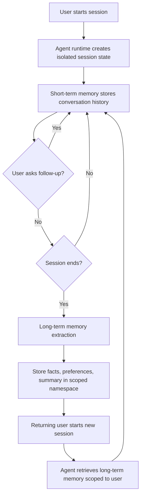

# Task 3.2: Provision and configure resources for ML and AI workloads based on existing architecture and requirements

## Skill 3.2.9: Implement agent state management systems

---

## Table of Contents

1. [Introduction to Agent State Management](#introduction)
2. [Core Concepts](#core-concepts)
3. [AWS Services for Agent State Management](#aws-services)
4. [Short-Term vs Long-Term Memory](#memory-types)
5. [Session Isolation and Scoping](#session-isolation)
6. [Implementing Agent State Management](#implementation)
7. [Scenario-Based Examples](#scenarios)
8. [Exam Tips and Traps](#exam-tips)
9. [Summary](#summary)

---

## 1. Introduction to Agent State Management {#introduction}

Agent state management is the practice of preserving, organizing, and controlling the information an AI agent uses to maintain context during and across conversations. In production agentic systems (e.g., chatbots, virtual assistants, workflow automation), agents must remember:

- **What was said earlier in the current conversation** (short-term context)
- **Who the user is, their preferences, and past interaction history** (long-term persistence)

Without proper state management, an agent loses track of context after each turn or session, forcing users to repeat themselves and degrading the experience.

**Key challenge:** Balancing context retention with security, privacy, and performance.

---

## 2. Core Concepts {#core-concepts}

| Concept | Description | Example |
|---------|-------------|---------|
| **Agent State** | The data that represents the current and historical context of an agent's interactions. | Conversation history, extracted facts, session variables. |
| **Short-Term Memory (STM)** | Transient memory that exists only during a single session or conversation. It enables multi-turn dialogue. | "The user said they prefer red." |
| **Long-Term Memory (LTM)** | Persistent memory that survives across sessions, often keyed by user or agent identifier. | "This user's name is Alice; she has premium support plan." |
| **Session** | A single, uninterrupted interaction between a user and an agent, identified by a unique session ID. | `sessionId = abc123` |
| **Session Isolation** | Runtime guarantee that one session's state cannot be accessed by another session. | User A cannot see User B's conversation. |
| **Memory Scope** | The namespace or identifier under which memory is stored (e.g., per user, per agent, per application). | `/preferences/{actorId}/` |
| **Retention** | How long memory is kept before automatic deletion or archival. | Store long-term memory for 30 days. |

---

## 3. AWS Services for Agent State Management {#aws-services}

The primary AWS service for building and running agents with state management is **Amazon Bedrock AgentCore** (often referred to as Bedrock Agents).

| Service | Role in Agent State Management |
|---------|-------------------------------|
| **Amazon Bedrock AgentCore** | Provides the runtime, memory, gateway, and identity for production agents. It offers built-in short-term and long-term memory management. |
| **Amazon DynamoDB** | Can be used as a custom state store for session state or long-term memory when building agents from scratch or extending Bedrock. |
| **Amazon OpenSearch Service** | Can store vectorized memory for semantic recall of past conversations (retrieval-augmented memory). |
| **AWS Lambda** | Executes custom logic for state extraction, consolidation, and memory updates. |
| **Amazon CloudWatch** | Captures logs, metrics, and traces for agent step-by-step execution, enabling observability of state changes. |

**Note:** Bedrock AgentCore is the recommended managed service because it abstracts session management, memory, and tool orchestration.

---

## 4. Short-Term vs Long-Term Memory {#memory-types}

The distinction between short-term and long-term memory is the most critical concept for the exam.

| Feature | Short-Term Memory (STM) | Long-Term Memory (LTM) |
|---------|--------------------------|--------------------------|
| **Lifetime** | Within a single session (session-scoped) | Persists across sessions and can be shared between agents |
| **Purpose** | Enable multi-turn conversation context (e.g., follow-up questions) | Retain user preferences, facts, summaries, and historical context |
| **Storage** | Managed automatically by the agent runtime (in-memory, transient) | Managed by the memory service (persistent, durable) |
| **Examples** | "What did I just ask you?" | "Remember that I prefer vegetarian options." |
| **Isolation** | Separate per session automatically | Scoped by actor/user ID or application namespace |
| **Privacy** | Cleared after session ends | Requires explicit retention and access policies |
| **Managed By** | Bedrock AgentCore runtime (session storage) | Bedrock AgentCore memory service (structured store) |

**Best Practice:** Use short-term memory for the current dialogue and long-term memory for cross-session user context.

---

## 5. Session Isolation and Scoping {#session-isolation}

### Session Isolation

Session isolation is a runtime property that ensures each session has its own execution environment and temporary state. It prevents:

- One user reading another user's conversation.
- State leakage between unrelated requests.
- Cross-session contamination of working memory.

**Implementation:** Each session is assigned a unique `sessionId`. The agent runtime maintains separate containers/isolated state for each session.

### Memory Scoping

Long-term memory must be scoped to a specific **actor** (user, device, application) to avoid mixing data. The scope is often a namespace path like:

```
/preferences/{actorId}/
/facts/{actorId}/
/history/{actorId}/
```

This ensures that when a returning user starts a new session, the agent can retrieve only that user's memory.

**Exam Trap:** Session isolation does **not** provide long-term persistence; it only enforces separation. Long-term memory requires explicit configuration of scope and retention.

---

## 6. Implementing Agent State Management {#implementation}

### Steps to Implement with Amazon Bedrock AgentCore

1. **Create an Agent**  
   Define the agent's system prompt, base model, and tools (e.g., knowledge bases, Lambda functions, APIs).

2. **Enable Memory**  
   Configure the agent to use memory for long-term retention. Choose the retention period (e.g., 30 days) and whether memory is per-user or shared.

3. **Define Memory Scope**  
   Specify the actor identifier (e.g., user ID from identity provider) to partition memory. This is crucial for multi-tenant applications.

4. **Use Session IDs for Short-Term State**  
   When invoking the agent, pass a unique `sessionId` per conversation. The runtime automatically maintains conversation history within that session.

5. **Let the Agent Extract Facts**  
   Bedrock AgentCore can automatically summarize and extract facts from conversations into long-term memory (e.g., "User prefers email notifications").

6. **Configure Retention and Deletion**  
   Set how long memory is kept. Compliance may require periodic purging.

7. **Enable Observability**  
   Use CloudWatch logs and X-Ray traces to record each agent step, tool call, and state change. This helps debug unexpected behavior.

### Memory Types in Bedrock AgentCore

| Memory Type | Description |
|-------------|-------------|
| **Conversation History** | Raw or summarized transcript of the current session (short-term). |
| **Session Summary** | A summarized version of the session stored to long-term memory after session end. |
| **Extracted User Facts** | Structured key-value pairs extracted from dialogues (e.g., "name=Alice"). |
| **User Preferences** | Explicit or inferred preferences stored for personalization. |

### Mermaid Diagram: Agent State Flow



---

## 7. Scenario-Based Examples {#scenarios}

### Scenario 1: Multi-Turn Follow-Up Within a Session

**Context:** A customer support agent handles a conversation about a billing issue. The user asks, "Can you check my last payment?" after earlier stating their account number.

**Requirement:** The agent must remember the account number within the same conversation.

**Solution:** Use short-term memory. The agent runtime automatically maintains conversation history in the session. No extra configuration is needed beyond passing a consistent `sessionId`.

**Exam Question Style:**  
*Which memory type allows the agent to answer follow-up questions within the same session?*  
**Answer:** Short-term memory (conversation history).

---

### Scenario 2: Returning User Must Not Repeat Context

**Context:** A travel booking assistant remembers user preferences (e.g., preferred airline, seat type) across multiple visits. On a new visit, the agent should greet the user by name and apply preferences without asking again.

**Requirement:** Persist user preferences across sessions.

**Solution:** Enable long-term memory in Bedrock AgentCore with scope `/preferences/{userId}`. The agent extracts facts during conversations and retrieves them in future sessions.

**Exam Question Style:**  
*An agent handles multi-turn conversations correctly within a session, but returning users must repeat context they supplied on a previous visit. Which capability addresses that?*  
**Answer:** Long-term memory that persists across sessions.

---

### Scenario 3: Multi-Tenant Isolation

**Context:** A SaaS application deploys a single agent for multiple enterprise customers. A user from Company A must never see conversation data from Company B.

**Requirement:** Ensure strict state separation.

**Solution:**  
- Use unique `sessionId` for every conversation (short-term isolation).  
- Scope long-term memory to the tenant ID and user ID, e.g., `/companyA/user123/`.  
- Configure IAM policies and resource-based permissions to restrict memory access.

**Exam Question Style:**  
*How do you prevent one session's working state from being read by another session?*  
**Answer:** Session isolation in the agent runtime.

---

### Scenario 4: Observability of Agent State

**Context:** An agent occasionally gives incorrect answers due to a tool returning unexpected data. The team needs to trace which tool call led to the error.

**Requirement:** Record steps and state changes.

**Solution:** Use CloudWatch Logs and AWS X-Ray for tracing. Enable detailed logging of memory updates, tool calls, and state transitions.

**Exam Question Style:**  
*Which AWS service provides traces that show each step an agent took, including tool calls and state changes?*  
**Answer:** AWS X-Ray (or CloudWatch Logs for step-level logs).

---

## 8. Exam Tips and Traps {#exam-tips}

### Tips

- **Remember the short vs long distinction:** Short-term = session; long-term = across sessions.
- **Understand memory scoping:** Long-term memory must be scoped to an actor/user; otherwise, data leaks.
- **Know that session isolation is a runtime property**, not something you configure in the memory store.
- **Bedrock AgentCore is the managed service** that provides both short-term and long-term memory; you don't need to build custom DynamoDB tables unless custom logic is required.
- **Retention and privacy are explicit design decisions** for long-term memory. Compliance often dictates retention limits.
- **Observability is part of state management** because you need to debug why an agent remembered or forgot something.

### Traps

1. **Confusing "session isolation" with "long-term memory."**  
   - Session isolation prevents cross-session leakage but does not persist data.  
   - Long-term memory persists data but requires correct scoping.

2. **Assuming all memory is shared across agents by default.**  
   - Long-term memory can be shared, but it must be explicitly configured with a common namespace or actor ID.

3. **Selecting DynamoDB as the only answer for agent memory.**  
   - While DynamoDB can be used, the exam expects you to know that Amazon Bedrock AgentCore offers built-in memory management.

4. **Ignoring the need for a session ID.**  
   - Without a session ID, the agent cannot maintain short-term conversation history.

5. **Overlooking retention policies.**  
   - Long-term memory should have a defined retention period to comply with data privacy regulations.

6. **Thinking that scaling or networking settings affect memory.**  
   - Memory is independent of endpoint scaling or VPC config; it's an application-level service.

---

## 9. Summary {#summary}

Agent state management is essential for building useful, context-aware AI agents. The core task is to distinguish between short-term memory (session-scoped) and long-term memory (persistent, user-scoped). Amazon Bedrock AgentCore provides the managed runtime and memory service that simplifies this. Key implementation steps include enabling memory, setting scope and retention, using session IDs for isolation, and enabling observability. For the exam, focus on the conceptual differences and know which service components handle each aspect.

---

**Remember:**  
- **Short-term** = current conversation → handled by session runtime.  
- **Long-term** = across sessions → configured memory with scope and retention.  
- **Isolation** = runtime property per session.  
- **Observability** = trace agent steps with CloudWatch/X-Ray.