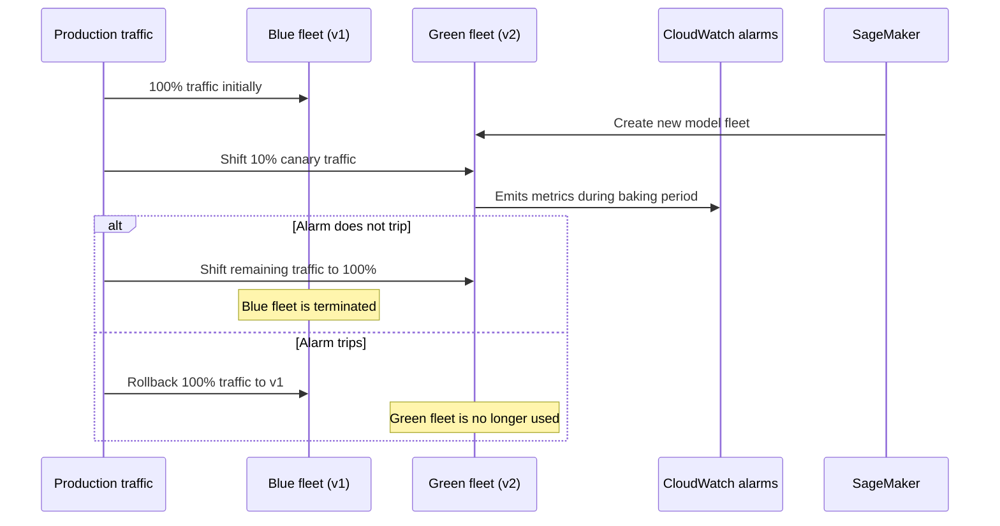

# Task 3.3: Deployment and Orchestration of ML and AI Workflows - Implement automated orchestration and continuous integration and continuous delivery (CI/CD) pipelines for MLOps and AI workloads

## Skill 3.3.1: Implement automated deployment strategies and rollback actions

### Overview

Automated deployment strategies define how a new model, inference application, or AI workload version is exposed to production traffic. A rollback action is the mechanism that restores the previous version when the new deployment misbehaves.

For MLOps and AI workloads, the terms usually cover:

- The **traffic-shifting shape**: how quickly traffic moves from the old version to the new version.
- The **rollback signal**: which CloudWatch alarm or failure condition triggers an automatic return to the previous version.
- The **baking period**: how long the new version is observed before the old version is removed.
- The **deployment target**: Amazon SageMaker endpoints, AWS Lambda, Amazon ECS, Amazon EC2, or another compute target.

A deployment strategy is only as safe as the alarm that guards it. A rollout with no alarm configured has no automatic failure signal and can complete a bad deployment as confidently as a good one.

---

### Core Concepts

| Concept | Description |
| --- | --- |
| **Blue fleet** | The current production model or application version receiving live traffic. |
| **Green fleet** | The newly deployed version running alongside the blue fleet before it receives all traffic. |
| **Traffic shifting** | The process of moving a percentage of inference requests from the blue fleet to the green fleet. |
| **Baking period** | A defined window during which the new version is monitored before the old version is removed. |
| **CloudWatch alarm** | The monitoring signal that can trigger an automatic rollback if a metric such as error rate or latency breaches a threshold. |
| **Rollback** | Returning traffic to the previous blue fleet or redeploying the previous model version. |
| **Deployment Guardrails** | Amazon SageMaker AI feature that provides managed blue/green traffic shifting and automatic rollback for real-time inference endpoints. |

---

### Deployment Strategies for ML Workloads

#### Common Traffic-Shifting Shapes

| Strategy | How It Works | Best For | Risk Profile |
| --- | --- | --- | --- |
| **All-at-once** | Shifts 100% of traffic to the new version immediately after the green fleet is ready. | Low-risk updates after strong pre-deployment testing. | High immediate exposure if the new model fails. |
| **Canary** | Moves a small percentage of traffic, such as 5–10%, to the new version. If alarms do not trip during the baking period, the remaining traffic shifts over. | High-risk models, production-critical endpoints, and validation with limited real traffic. | Lower initial risk; requires a longer deployment window. |
| **Linear** | Shifts traffic in equal, incremental steps over a defined interval. Example: 10% every 5 minutes. | Gradual exposure when a longer validation window is required. | Moderate risk; easier to observe and interrupt. |
| **Rolling / in-place** | Replaces capacity in batches on the existing deployment target. | Container or compute workloads where a separate blue/green fleet is not required. | Moderate risk; less isolated rollback than blue/green because the old version is replaced gradually. |

For Amazon SageMaker managed blue/green deployments, the supported traffic shapes are **all-at-once**, **canary**, and **linear**. Rolling and in-place updates are more common with AWS CodeDeploy for Lambda, ECS, and EC2 workloads.

---

### Rollback Actions and Rollback Signals

A rollback can be:

- **Automatic**: triggered by a CloudWatch alarm entering the `ALARM` state during the baking period.
- **Pipeline-level**: the CI/CD pipeline stops and deploys the previous model version.
- **Manual**: an operator redeploys the previous approved model package from the model registry or updates the endpoint configuration.

#### Common Rollback Triggers for SageMaker Endpoints

| CloudWatch Metric | Why It Is Used |
| --- | --- |
| `Invocation5XXErrors` | Server-side model or endpoint errors. |
| `Invocation4XXErrors` | Client-side errors, which may indicate input mismatch or serving issues. |
| `ModelLatency` | Unexpected latency from the new model version. |
| `CPUUtilization` / `MemoryUtilization` | Resource saturation on the new fleet. |
| **Custom metric** | Business-specific signals such as toxicity score, relevance score, or fraud false-positive rate. |

A rollback alarm must exist before the deployment starts. If no alarm is linked to the deployment, the new version can serve 100% of traffic even while producing errors.

---

### How Amazon SageMaker Blue/Green Deployment Works

Amazon SageMaker Deployment Guardrails creates a new green fleet alongside the existing blue fleet. Traffic is moved to the green fleet according to the selected shape. During the baking period, CloudWatch alarms are watched. If no alarm trips, the blue fleet is retired. If an alarm trips, traffic is routed back to the blue fleet.

The key point is that the old blue fleet is retained until the new version is considered healthy. That retained old fleet is what makes automatic rollback possible without redeploying from scratch.

---

### AWS Services Used for Deployment and Rollback

| AWS Service | Role in Automated Deployment |
| --- | --- |
| **Amazon SageMaker Deployment Guardrails** | Managed blue/green traffic shifting and automatic rollback for SageMaker real-time endpoints. |
| **AWS CodeDeploy** | Deploys applications to Lambda, ECS, or EC2 and manages canary or linear traffic shifts with alarms and automatic rollback. |
| **Amazon CloudWatch** | Stores metrics and hosts alarms that trigger rollback actions. |
| **AWS CodePipeline** | Orchestrates CI/CD stages but does not directly execute the traffic-level rollback. |
| **Amazon SageMaker Model Registry** | Stores previous approved model versions, providing a rollback target when a manual or pipeline rollback is required. |
| **AWS CodeBuild** | Builds, tests, and packages model or application artifacts before deployment. |

---

### Scenario-Based Examples

#### Scenario 1: Canary Deployment with Automatic Rollback

**Question**  
A fraud detection model is deployed on an Amazon SageMaker real-time endpoint. The team wants to deploy a new version so that 10% of production traffic reaches the new model for 20 minutes. If server-side errors exceed 2%, traffic must automatically return to the previous version.

Which configuration meets these requirements?

**A.** Shift all traffic at once and manually inspect the error rate after 20 minutes.  
**B.** Use a canary traffic shift with a CloudWatch alarm on `Invocation5XXErrors` and a 20-minute baking period.  
**C.** Create a second endpoint and ask the application to choose between endpoints.  
**D.** Add a scaling policy that increases instance count when error rates rise.  

**Answer:** **B**

**Explanation:**  
A canary traffic shift sends a small slice of traffic to the new model. With an `AutoRollbackConfiguration` linked to a CloudWatch alarm on `Invocation5XXErrors`, SageMaker can automatically route traffic back to the blue fleet if the alarm trips during the baking period. Creating a second endpoint moves complexity into the application, and a scaling policy only changes compute capacity; it cannot revert a bad model deployment.

---

#### Scenario 2: Bad Deployment Completes Successfully

**Question**  
A new model version was deployed to a SageMaker endpoint using a linear traffic-shifting strategy. The rollout completed successfully, but the new model returned a very high error rate.

What is the most likely reason the rollout did not automatically roll back?

**A.** The rollout used linear shifting instead of canary shifting.  
**B.** No CloudWatch alarm was configured for the deployment to watch during the baking period.  
**C.** The endpoint had too many instances.  
**D.** The model did not have an approval status in the model registry.  

**Answer:** **B**

**Explanation:**  
Automatic rollback depends on a CloudWatch alarm. Without a configured alarm, SageMaker has no signal that the new model is unhealthy. Once the baking period expires without an alarm trip, SageMaker completes the deployment and removes the old fleet. The traffic-shifting strategy itself does not trigger a rollback.

---

#### Scenario 3: AWS CodeDeploy for an Inference Application

**Question**  
A company serves an ML inference application using AWS Lambda. The application code is deployed through AWS CodePipeline. The team wants to shift traffic in increments of 10% every 5 minutes and automatically roll back if invocation errors exceed 3%.

Which AWS CodeDeploy feature supports this requirement?

**A.** An AWS CodeDeploy deployment group with a linear traffic-shifting configuration and an associated CloudWatch alarm.  
**B.** A SageMaker endpoint with all-at-once traffic shifting.  
**C.** A CodeBuild action that stops Lambda functions when errors occur.  
**D.** An Amazon EventBridge rule that disables the Lambda function when the error metric rises.  

**Answer:** **A**

**Explanation:**  
AWS CodeDeploy supports canary and linear traffic shifting for AWS Lambda deployments. A linear configuration can move traffic in equal steps, such as 10% every 5 minutes. When a CloudWatch alarm on invocation errors is associated with the deployment group, CodeDeploy can automatically roll back the deployment if the alarm triggers.

---

### Exam Tips and Traps

- **No alarm means no automatic rollback.** A canary or linear shape only controls how traffic moves. It does not create a rollback signal by itself.

- **The alarm must be configured before deployment.** Attaching a rollback alarm after traffic has already shifted does not protect the deployment from an early failure.

- **The old fleet is the rollback target.** In SageMaker blue/green deployments, automatic rollback works because the blue fleet remains available during the baking period. If the blue fleet is removed too early, rollback is not automatic.

- **Automatic rollback is monitored during the baking period.** After the old fleet is terminated, there is no automatic rollback mechanism for that deployment. Recovery would require redeploying the previous model version.

- **Use inference metrics for rollback.** A common mistake is to alarm on a training evaluation metric. Rollback alarms must be based on metrics emitted by the production endpoint, such as `Invocation5XXErrors` or `ModelLatency`.

- **Do not confuse scaling with rollback.** Application Auto Scaling adds or removes compute capacity based on load. It cannot revert traffic to a previous model version.

- **SageMaker Deployment Guardrails applies to supported real-time endpoint deployments.** Verify the hosting option supports managed traffic shifting before designing a release around it.

- **Model Registry is your manual rollback source.** When an automatic rollback fails or is not available, the safest rollback is to redeploy the previously approved model version recorded in Amazon SageMaker Model Registry.

---

### Key Takeaways

1. A successful automated deployment strategy requires both a traffic-shifting shape and a rollback signal.
2. SageMaker blue/green deployments support all-at-once, canary, and linear traffic shifting.
3. CloudWatch alarms on production metrics such as `Invocation5XXErrors` and `ModelLatency` trigger automatic rollback.
4. Without an alarm configured during the baking period, a faulty model can be fully deployed without interruption.
5. The previous blue fleet is the automatic rollback destination; once it is removed, recovery requires redeploying the previous model.
6. AWS CodeDeploy provides similar traffic-shifting and rollback capabilities for Lambda, ECS, and EC2 application deployments.
7. Amazon SageMaker Model Registry is essential for tracking previous model versions that can be used for manual or pipeline-level rollback.