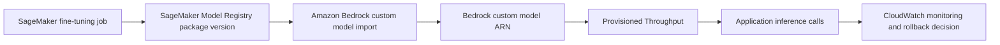
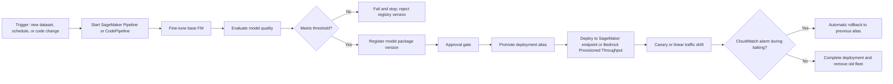

# Task 3.3: Deployment and Orchestration of ML and AI Workflows - Implement automated orchestration and continuous integration and continuous delivery (CI/CD) pipelines for MLOps and AI workloads

## Skill 3.3.10: Configure FM Deployment Automation with Fine-Tuned Model Versioning

### Skill Overview

This skill focuses on deploying foundation models (FMs) that have been fine-tuned or customized, while preserving version control, auditability, and automated release behavior. In MLOps, a fine-tuned FM is not simply a model file in Amazon S3. It is a versioned artifact that must be promoted through a pipeline, approved, deployed by a stable identifier, and rolled back safely if needed.

The key idea is that every behavior-changing artifact must be immutable and identifiable. For fine-tuned FMs, this means each fine-tuning run should produce a distinct model version, with recorded lineage back to:

- The base FM version
- The training or fine-tuning dataset
- Hyperparameters
- Evaluation metrics
- The training job or fine-tuning job that produced it

Deployment automation then moves that version from registration through approval to production, using traffic-shifting strategies and alarms to protect the rollout.

---

### Why Fine-Tuned FM Versioning Matters

A foundation model has multiple layers of versioning:

| Artifact | Versioning Need | Example |
| --- | --- | --- |
| Base FM | Provider updates can change behavior | Amazon Bedrock base model ID or SageMaker JumpStart model version |
| Fine-tuned weights | The result of one fine-tuning job | A SageMaker Model Registry package version |
| Prompt or system instructions | Prompt changes alter behavior even if weights do not change | Amazon Bedrock Prompt Management version, application config version |
| Inference container and configuration | Model serving settings affect latency and compatibility | Container image tag, environment variables |
| Knowledge base or retrieval index | RAG behavior changes when documents or embedding models change | Bedrock Knowledge Base sync or index version |

For audit and reversible deployment, the fine-tuned FM should not be referenced by a mutable path like a latest S3 prefix or a training job name alone. Instead, it should be referenced by a registered immutable model package version or a stable alias.

---

### AWS Services for FM Deployment Automation

| AWS Service | Role in Fine-Tuned FM Deployment Automation |
| --- | --- |
| **Amazon SageMaker Training** | Runs the fine-tuning job on a base FM using domain-specific data |
| **Amazon SageMaker Pipelines** | Orchestrates fine-tuning, evaluation, registration, and deployment or approval steps |
| **Amazon SageMaker Model Registry** | Stores immutable model package versions, approval states, aliases, and lineage |
| **Amazon SageMaker Endpoint** | Hosts a fine-tuned FM for real-time inference |
| **Amazon Bedrock** | Provides access to base FMs, supports Bedrock fine-tuning, and can serve imported custom models |
| **Amazon Bedrock Provisioned Throughput** | Provides dedicated capacity for custom fine-tuned or imported Bedrock models |
| **Amazon Bedrock Custom Model Import** | Brings a SageMaker fine-tuned model into Amazon Bedrock for inference |
| **AWS CodePipeline / CodeBuild** | Provides CI/CD release orchestration, build stages, tests, and deployment gates |
| **Amazon EventBridge** | Triggers pipelines on schedules, S3 events, or registry events |
| **Amazon CloudWatch Alarms** | Monitors deployed FM behavior and signals automatic rollback |

---

### Fine-Tuned Model Versioning with SageMaker Model Registry

Amazon SageMaker Model Registry is the central service for versioning fine-tuned FMs in MLOps workflows.

#### Important Registry Concepts

| Concept | Meaning | Deployment and Audit Use |
| --- | --- | --- |
| **Model group** | Logical collection for versions of the same model family or problem | Group all versions of a fine-tuned FM together, such as `claims-summarizer-llama3` |
| **Model package version** | An immutable record of a single model artifact and its metadata | Deploy a specific version by ARN; audit what served traffic |
| **Alias** | A named movable pointer to a model package version | Use `prod`, `staging`, or `champion` to promote and roll back easily |
| **Approval status** | `PendingManualApproval`, `Approved`, or `Rejected` | Gates a model version before deployment |
| **Lineage** | Tracks the training job, dataset URI, code, hyperparameters, and metrics | Reconstructs how a model version was created |

#### Why Aliases Are Important for FM Deployment Automation

Aliases allow a deployment pipeline to reference a stable pointer instead of hard-coding a new model version number for every release.

For example:

- Model version `7` is approved and assigned alias `prod`
- Model version `8` is registered and assigned alias `incoming`
- The application or pipeline deploys the `prod` alias
- If version `8` fails, promote version `7` back to `prod` or move the alias back

This makes one-step rollout and rollback possible.

---

### Deployment Automation Patterns for Fine-Tuned FMs

There are two common deployment targets for fine-tuned FMs on AWS:

#### 1. Deployment to Amazon SageMaker Endpoint

This is the main pattern when you fine-tune and host the model on SageMaker.

Automation should:

1. Run a SageMaker fine-tuning job
2. Evaluate the fine-tuned model on a held-out test set
3. Register the model as a new SageMaker Model Registry package version
4. Apply approval state
5. Promote a deployment alias such as `prod`
6. Update the endpoint with the new model package version or alias
7. Use a managed deployment strategy such as `CANARY`, `LINEAR`, or `ALL_AT_ONCE`
8. Link CloudWatch alarms for rollback

SageMaker deployment guardrails provide blue/green deployment with a baking period. During the baking period, CloudWatch alarms can automatically roll traffic back to the old fine-tuned model if error rates or latency breach thresholds.

#### 2. Deployment to Amazon Bedrock with Provisioned Throughput

Amazon Bedrock supports fine-tuning some base models and also supports importing fine-tuned models from SageMaker.

For Bedrock custom fine-tuned models:

- Each fine-tuned or imported model gets a unique Bedrock model ARN or identifier
- A custom fine-tuned model requires **Provisioned Throughput** to serve inference
- On-demand inference is generally available for eligible base models, not for custom fine-tuned models
- A deployment pipeline should create or update Provisioned Throughput for a specific fine-tuned model identifier
- The application must reference the new model identifier or ARN

If you use SageMaker to fine-tune a model and then bring it to Bedrock, the flow is:

This preserves SageMaker-side versioning and lineage while allowing Bedrock serving.

---

### End-to-End CI/CD Pipeline for Fine-Tuned FM Versioning

A typical automated pipeline for fine-tuned FM deployment looks like this:

This pipeline separates concerns:

- The **ML orchestration** builds, evaluates, and version-registers the fine-tuned model.
- The **release/deployment orchestration** decides when and how to expose that model to production traffic.
- The **registry approval gate** ensures a human or policy can review the new model before production.

---

### Versioning Beyond Model Weights

Fine-tuned FM deployment automation should also coordinate versions for artifacts that affect behavior.

#### Prompt Versioning

Prompts are frequently part of FM applications. A prompt change can affect behavior as much as a model weight change. In a CI/CD pipeline, prompts should be:

- Stored as versioned resources
- Tested against a golden prompt set
- Released alongside or independently from the fine-tuned model version
- Referenced by identifier, not embedded directly in application code

Amazon Bedrock Prompt Management supports versioned prompts and comparable variants.

#### Retrieval and Knowledge Base Updates

For retrieval-augmented generation (RAG) applications, changing documents, embedding models, or chunking strategies can change behavior. A full reindex is different from an incremental ingestion sync:

| Update Type | Action | Cost |
| --- | --- | --- |
| Individual document added, modified, or deleted | Incremental ingestion resync | Low |
| Embedding model or chunking strategy changed | Full reindex required | High |
| Copying an index to a new one without re-embedding | Does not update stale vectors | Misleading |

Deployment automation should reflect whether the pipeline is updating documents or changing the retrieval configuration itself.

---

### Scenario-Based Examples

#### Scenario 1: Automatic Rollback for a Fine-Tuned SageMaker Model

A financial services team fine-tunes a Llama 3 model on SageMaker using customer support transcripts. They want a new version to receive only 10% of traffic before full rollout. If `Invocation5XXErrors` rises above 2%, traffic must automatically return to the previous version.

**Required configuration:**

- Register the fine-tuned model as a new package version in SageMaker Model Registry
- Deploy using a canary traffic shift
- Set a baking period
- Attach a CloudWatch alarm on `Invocation5XXErrors` with threshold 2%
- Configure automatic rollback
- Use a `prod` alias for the currently approved version

Without the CloudWatch alarm, the canary could complete despite high errors because SageMaker has no signal to trigger rollback.

---

#### Scenario 2: Deploying a Fine-Tuned Model on Amazon Bedrock

A company fine-tunes an Amazon Bedrock model for internal contract summarization. The pipeline must automate deployment to production and maintain a version history.

**Correct approach:**

1. Run Bedrock fine-tuning or import a SageMaker fine-tuned model
2. Obtain the resulting custom model ARN
3. Create Provisioned Throughput for that exact custom model ARN
4. Update the application to call that model identifier
5. Record the mapping between the application release and the Bedrock custom model ARN
6. Monitor inference errors and roll back by provisioning or switching to the previous custom model identifier

The critical exam point is that a custom fine-tuned Bedrock model requires Provisioned Throughput. It cannot use on-demand inference.

---

#### Scenario 3: Audit and Reproducibility

After an incident, auditors need to know which fine-tuned model version served production traffic and which training run created it.

**Correct evidence:**

- The production alias in SageMaker Model Registry as it existed during the incident
- The immutable model package version ARN
- The lineage recorded in the registry, which links back to:
  - The training job ARN
  - The dataset S3 URI
  - The hyperparameters
  - The evaluation metrics
  - The code commit or container image

A pipeline definition as it exists today is not sufficient because it may have changed since the incident.

---

### Knowledge Check

#### Question 1

A team has multiple fine-tuned FM versions in SageMaker Model Registry. They want deployment automation to always promote the latest approved version and allow one-step rollback. Which practice should they use?

- **A.** Store the model artifact in an S3 bucket with a key ending in `latest`
- **B.** Use a model group alias such as `prod` that points to the approved model package version
- **C.** Deploy by training job name instead of model package ARN
- **D.** Use Amazon EventBridge to copy the model to a new endpoint for each release

??? success "Answer & Explanation"

    **Correct Answer:** **B. Use a model group alias such as `prod` that points to the approved model package version**

    **Explanation:**  
    SageMaker Model Registry aliases are movable pointers to immutable model package versions. A pipeline can deploy the `prod` alias, and rollback is as simple as moving the alias back to the previous version. Using `latest` S3 keys or training job names is mutable and not a reliable audit or deployment identifier.

---

#### Question 2

An organization has a fine-tuned model in Amazon Bedrock and wants to serve it in production. What is required for inference?

- **A.** On-demand inference with the base model ID
- **B.** Provisioned Throughput associated with the fine-tuned model ARN
- **C.** AWS Lambda with the model package URI
- **D.** An Application Auto Scaling policy on the model registry

??? success "Answer & Explanation"

    **Correct Answer:** **B. Provisioned Throughput associated with the fine-tuned model ARN**

    **Explanation:**  
    Amazon Bedrock custom fine-tuned or imported models require Provisioned Throughput for inference. On-demand inference is generally available for eligible base models, not for custom fine-tuned models.

---

#### Question 3

A new fine-tuned model version is deployed using a canary shift, but high error rates do not trigger rollback. What is the most likely cause?

- **A.** The alias was moved too early
- **B.** The endpoint had too many instances
- **C.** No CloudWatch alarm was configured for the baking period
- **D.** The model registry approval status was `Approved`

??? success "Answer & Explanation"

    **Correct Answer:** **C. No CloudWatch alarm was configured for the baking period**

    **Explanation:**  
    SageMaker deployment guardrails rely on CloudWatch alarms during the baking period to detect model failure. If no alarm is linked, there is no automatic rollback signal, and the deployment can complete despite high error rates.

---

### Exam Tips and Traps

- **Do not treat a fine-tuned FM as only an S3 artifact.** Register it as a model package version in SageMaker Model Registry.
- **Deploy by stable identifier.** Use a model package ARN or a registry alias, not a mutable S3 prefix or a training job name.
- **Use aliases for promotion and rollback.** The `prod` alias should point to the currently approved model version. Rollback is moving the alias, not recreating infrastructure.
- **Custom Bedrock fine-tuned models require Provisioned Throughput.** This is a common exam trap. On-demand inference is for eligible base models.
- **A canary or linear rollout does not guarantee rollback.** You must attach CloudWatch alarms and set a baking period.
- **Registry approval status is a gate.** A pipeline that registers a version but does not check approval can deploy an unapproved model.
- **Lineage is required for audit.** Model Registry lineage should connect the fine-tuned model to the exact training job, dataset, and Hyperparameters.
- **Prompt and model versions can both change behavior.** In a generative AI CI/CD pipeline, test and version prompts separately.
- **RAG pipeline updates differ by type.** Incremental document ingestion is cheap; embedding model or chunking changes require full reindexing.
- **Do not overwrite a production endpoint in place without guardrails.** A deployment guardrail with traffic shifting and alarms is safer than an all-at-once update with no monitoring.

---

### Summary Checklist

To correctly configure FM deployment automation with fine-tuned model versioning, ensure you can do the following:

1. Register every fine-tuned FM run as an immutable SageMaker Model Registry package version.
2. Track lineage from model version back to training job, dataset, code, and evaluation.
3. Use approval statuses and aliases to gate and promote deployments.
4. Automate fine-tuning, evaluation, registration, approval, and deployment in SageMaker Pipelines or CodePipeline.
5. Deploy to SageMaker endpoints with traffic shifting and CloudWatch alarm rollback.
6. Deploy custom fine-tuned FMs to Amazon Bedrock using Provisioned Throughput.
7. Coordinate model versions with prompt versions and retrieval index changes.
8. Use stable identifiers for audit and rollback instead of mutable artifacts.