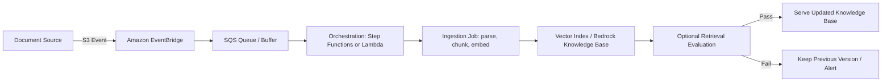
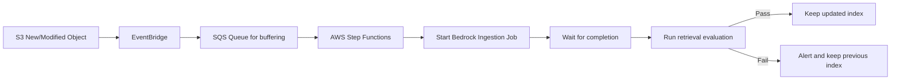
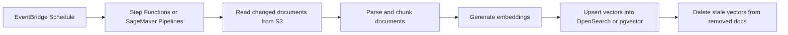

# Task 3.3: Deployment and Orchestration of ML and AI Workflows - Implement automated orchestration and continuous integration and continuous delivery (CI/CD) pipelines for MLOps and AI workloads

## Skill 3.3.11: Configure AI-specific pipeline orchestration for RAG system updates and knowledge base refresh cycles

### Overview

A Retrieval-Augmented Generation (RAG) system answers questions by retrieving relevant passages from an indexed knowledge base and passing those passages to a foundation model as context. The model itself is usually not retrained when the knowledge base changes. Instead, new documents, edits, and deletions must be detected, processed, embedded, and written into a vector index.

This skill is about building the orchestration that keeps the knowledge base fresh, accurate, cost-efficient, and reversible. It includes choosing the correct update trigger, separating incremental refresh from full reindexing, and integrating the data refresh into an overall CI/CD/Mlops workflow.

---

### Why This Matters in an AI Workflow

| Concept | Meaning |
| --- | --- |
| **RAG knowledge base** | A corpus of documents stored as vector embeddings in a vector database. |
| **Refresh/resync** | Incrementally update only documents that were added, changed, or removed since the last run. |
| **Reindex** | Reprocess the entire corpus because the embedding model, chunking strategy, or vector schema changed. |
| **Document source** | The origin of raw files, such as Amazon S3, SharePoint, Confluence, Salesforce, or a web crawler. |
| **Ingestion job** | The job that parses documents, chunks them, creates embeddings, and writes those embeddings into the vector index. |

A RAG retrieval update is not the same as model retraining. If the foundation model remains unchanged, the LLM does not need to be retrained. The MLOps challenge is to make the knowledge base update pipeline automated, testable, and safe.

---

### AWS Services for RAG Update Orchestration

| AWS Service | Role in RAG Refresh |
| --- | --- |
| **Amazon S3** | Common document source. S3 events can signal new, modified, or deleted objects. |
| **Amazon EventBridge** | Routes source-change events or schedules to start an ingestion pipeline. |
| **AWS Lambda** | Lightweight event handler that can call an ingestion API or start an orchestration flow. |
| **AWS Step Functions** | Orchestrates multi-step ingestion, including parsing, embedding, index updates, and validation. |
| **Amazon SageMaker Pipelines** | ML-first pipeline service for more complex embedding or custom processing jobs. |
| **Amazon Bedrock Knowledge Bases** | Fully managed RAG service that creates and maintains a vector index from source documents. |
| **Amazon OpenSearch Serverless** | Common vector store that holds embeddings and powers vector similarity search. |
| **Amazon Aurora PostgreSQL with pgvector** | Alternative vector storage option for retrieval. |
| **Amazon SQS** | Durable buffer for S3 or EventBridge events, enabling batching, retries, and backpressure. |
| **AWS CodePipeline** | CI/CD pipeline that can wrap ingestion, testing, and deployment stages. |
| **Amazon CloudWatch** | Alarms and logs that track ingestion job status, duration, errors, and freshness. |

---

### RAG Refresh Lifecycle

The pipeline should be designed so that:

1. A source change triggers an update.
2. The update is processed idempotently.
3. Only changed documents are processed during a refresh when possible.
4. The updated index is tested against retrieval quality before full cutover.
5. A bad update can be rolled back or isolated.

---

### Incremental Resync vs. Full Reindex

This distinction is critical for cost control and design decisions in RAG orchestration.

| Factor | Incremental Resync | Full Reindex |
| --- | --- | --- |
| **Trigger** | Documents added, modified, or deleted in the source | Change to embedding model, chunking strategy, vector dimensions, or metadata schema |
| **Scope** | Only changed documents | Every document in the corpus |
| **Cost** | Small and proportional to changes | Large and proportional to entire corpus |
| **Latency** | Usually fast | Can be long |
| **Use case** | Routine updates, new files, corrections | Switching embedding model, new chunking method, new index schema |
| **Typical frequency** | Near real-time, hourly, or daily | Rare, planned migration |
| **Stale vectors risk** | Low | High if only copied instead of regenerated |

**Key insight:** Copying an existing vector index does not create new embeddings. If the embedding model changes, the old vectors are still the old vectors. A full reindex must regenerate every vector by running every document through the new embedding process.

---

### Triggering the Knowledge Base Refresh

#### 1. Event-Driven Refresh

An event-driven refresh starts the pipeline when a real document change occurs.

- S3 emits an event when an object is created, modified, or deleted.
- Amazon EventBridge receives the event.
- EventBridge invokes a Lambda function or starts a Step Functions state machine.
- The pipeline calls the knowledge base ingestion job or runs a custom embedding job.

**Best for:** Irregular document uploads, low-latency freshness requirements, and cost-sensitive workloads.

#### 2. Scheduled Refresh

A scheduled refresh starts the pipeline on a fixed cadence.

- Amazon EventBridge schedules a rule using a cron expression.
- The rule starts the ingestion pipeline.
- The ingestion job checks the source and processes only changed documents.

**Best for:** Systems with predictable publication cycles, such as daily document drops or weekly content updates.

#### 3. Manual Refresh

A human starts the ingestion job manually through the AWS Management Console, API, or pipeline approval.

**Best for:** Initial setup, troubleshooting, one-time migrations, and environments where change control requires human approval.

| Trigger Type | Pros | Cons |
| --- | --- | --- |
| **Event-driven** | Fast freshness, efficient use of compute | Needs S3 events or source connectors, more moving parts |
| **Scheduled** | Simple, predictable | Can run even when nothing changed; may miss time-sensitive updates |
| **Manual** | Full control, good for testing | Slow, error-prone, does not scale |

---

### Configuring Amazon Bedrock Knowledge Base Refresh

Amazon Bedrock Knowledge Bases provides a managed RAG workflow. The update orchestration should include these concepts:

1. **Create a data source**
   - Point to an Amazon S3 bucket or use a built-in connector such as SharePoint, Confluence, or Salesforce.

2. **Choose chunking and embedding**
   - Configure chunking strategy, such as fixed-size, semantic, hierarchical, or custom.
   - Select the embedding model, such as Amazon Titan Text Embeddings or Cohere Embed.

3. **Select the vector store**
   - Use Amazon OpenSearch Serverless, Aurora PostgreSQL with pgvector, Pinecone, Redis Enterprise Cloud, or MongoDB Atlas.

4. **Set up ingestion permissions**
   - The Bedrock Knowledge Base needs an IAM role that can read from the source bucket and call the chosen embedding model.

5. **Start ingestion job**
   - An ingestion job parses, chunks, embeds, and indexes documents.
   - For a normal content update, the ingestion job performs an incremental resync of changed documents.

6. **Automate the trigger**
   - Configure an S3 event to Amazon EventBridge.
   - Use EventBridge to invoke an orchestration layer that starts the ingestion job.

7. **Monitor and verify**
   - Track CloudWatch metrics for ingestion status.
   - After refresh, validate retrieval quality with a fixed set of golden queries before making the updated knowledge base the production default.

---

### Common RAG Orchestration Patterns

#### Pattern 1: S3 Event to Step Functions to Bedrock Ingestion

This pattern handles bursty uploads, batches events, retries failures, and gates the final cutover.

#### Pattern 2: Scheduled Refresh with Custom Embedding Pipeline

This pattern is useful when using a custom vector pipeline rather than Amazon Bedrock Knowledge Bases.

---

### Scenario-Based Exam Example 1

**Scenario:** A company stores its policy documents in Amazon S3. When a policy document is updated, the RAG application should reflect the change within minutes. The current solution performs a nightly full reindex, which is expensive and slow.

**Which approach should the team use?**

A. Continue the nightly full reindex but increase compute resources.  
B. Use an S3 event to trigger an EventBridge rule that starts an incremental ingestion job.  
C. Copy the existing vector index to a new index after each document update.  
D. Retrain the foundation model whenever the document changes.

**Correct answer:** B

**Explanation:** S3 events provide immediate, event-driven triggering. EventBridge starts an ingestion job that only processes changed documents, making the refresh fast and inexpensive. Retraining the foundation model is unnecessary for new document content. Copying an index does not parse, embed, or update document changes.

---

### Scenario-Based Exam Example 2

**Scenario:** A team is using RAG with Amazon Bedrock Knowledge Bases. They decide to change from Titan embedding model to a different embedding model. They want the production knowledge base to use the new model.

**What must happen?**

A. Start an incremental resync of only recently changed documents.  
B. Copy the current vector index into a new collection and point the application to it.  
C. Perform a full reindex of all source documents through the new embedding model.  
D. Update the prompt template only.

**Correct answer:** C

**Explanation:** Changing the embedding model changes the meaning and dimensions of the vectors. All documents must be re-embedded. A copy of the old index would leave stale vectors created with the old model. A full reindex rebuilds the index with the new embedding model.

---

### Scenario-Based Exam Example 3

**Scenario:** A RAG system receives thousands of new documents per hour into an S3 bucket. Starting an ingestion job for every single S3 object causes throttling and high cost.

**What orchestration improvement should the engineer make?**

A. Start a full reindex every hour.  
B. Buffer S3 events with Amazon SQS and batch the ingestion job.  
C. Increase the timeout of the Lambda function.  
D. Disable all event notifications.

**Correct answer:** B

**Explanation:** Amazon SQS can batch rapid S3 events so that ingestion jobs process multiple document changes together. This reduces throttling, costs, and duplicate processing. Increasing Lambda timeout does not change event volume or batching behavior.

---

### Exam Tips and Traps

| Tip / Trap | Explanation |
| --- | --- |
| **Do not confuse RAG refresh with model retraining** | A document change requires a knowledge base update, not foundation model fine-tuning. |
| **Incremental resync is the default for content changes** | For new, updated, or deleted documents, process only those changes. |
| **Full reindex is for configuration changes, not normal content refresh** | Changing embedding model, chunking strategy, or vector dimensions requires reprocessing every document. |
| **Copying an index does not regenerate embeddings** | If the embedding model changes, the old vectors remain stale unless every document is re-embedded. |
| **Event-driven is best for irregular data** | S3 events provide immediate updates and avoid wasted scheduled runs. |
| **Scheduled refresh may still be acceptable for predictable sources** | Choose a schedule when content changes on a known cadence and freshness latency is not critical. |
| **Batch and buffer high-throughput events** | Use Amazon SQS between EventBridge and Step Functions or Lambda to handle bursts and avoid throttling. |
| **Add idempotency and retries to the pipeline** | Duplicate S3 events can occur. The ingestion job should not create duplicate vectors or incomplete states. |
| **Monitor the ingestion job status** | Use CloudWatch alarms to detect failed or long-running ingestion jobs. |
| **Validate retrieval quality before cutover** | Run golden queries after a refresh to ensure retrieval results have not degraded. |
| **Keep the previous index available for rollback** | A blue/green index cutover or snapshot can protect production from a bad document update. |
| **Do not forget delete handling** | When a source document is deleted, the ingestion resync must remove its vectors from the index. |
| **Check IAM permissions carefully** | The knowledge base needs read access to the source and permissions to call the embedding model. |

---

### Key Takeaways for the Exam

1. A RAG knowledge base refresh is an AI-specific data pipeline, not a model training pipeline.
2. Use an event-driven trigger for irregular source changes; use a schedule for predictable updates.
3. An incremental resync processes only added, changed, and removed documents, which is cost-efficient.
4. A full reindex is required when the embedding model, chunking strategy, or vector schema changes.
5. Amazon Bedrock Knowledge Bases orchestrates ingestion, embedding, and indexing; EventBridge and Step Functions automate the refresh cycle.
6. After any refresh or reindex, evaluate retrieval quality before promoting the updated index to production.
7. Maintain previous index versions or snapshots so a bad update can be rolled back safely.
8. Always separate content refresh from model retraining and prompt versioning, but manage all three changes through controlled pipeline automation.