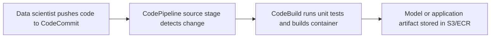
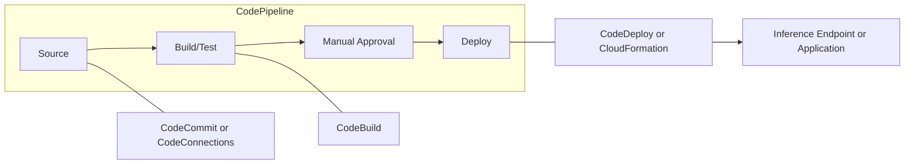
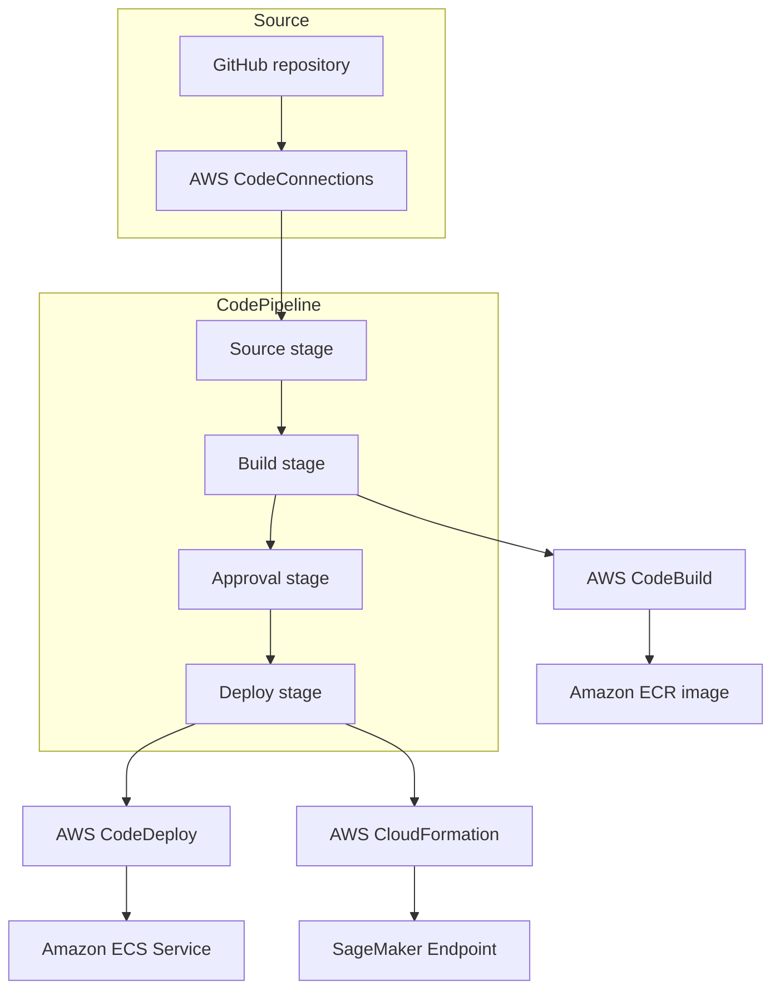
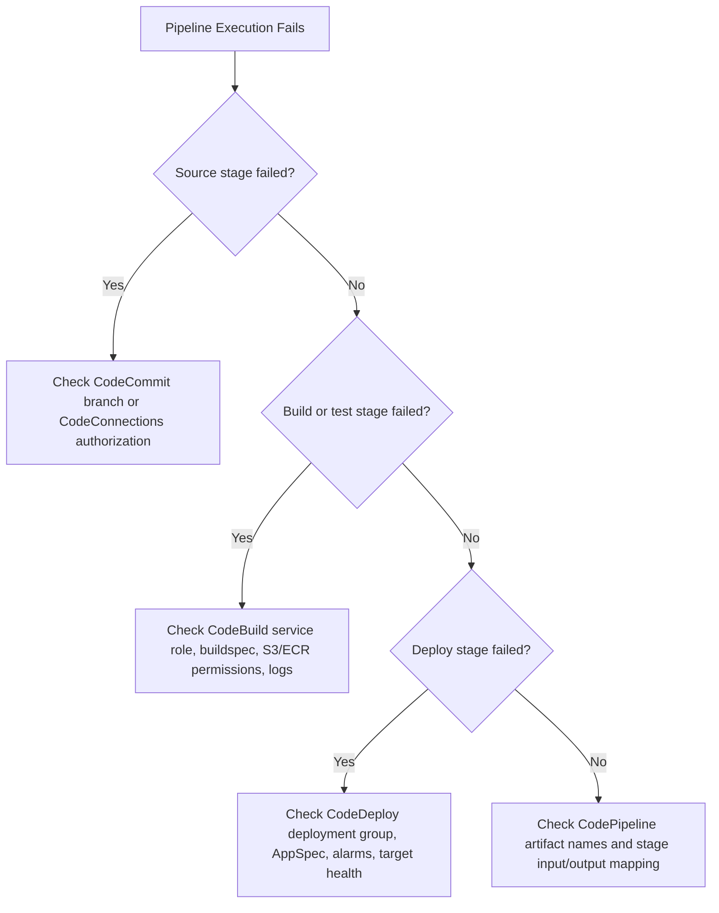

# Task 3.3: Deployment and Orchestration of ML and AI Workflows - Implement automated orchestration and continuous integration and continuous delivery (CI/CD) pipelines for MLOps and AI workloads

## Skill 3.3.2: Configure and troubleshoot AWS CodeBuild, AWS CodeCommit, AWS CodeDeploy, AWS CodePipeline, and AWS CodeConnections

> **Purpose:** This skill covers the CI/CD developer tools that move an ML or AI change from source control into a production deployment. For the exam, you need to know which service owns which part of the workflow, how the services pass artifacts to one another, and where to look first when a pipeline stage fails.

---

### 1. Service Responsibility Map

| AWS Service | Primary Role | What It Does Not Do |
|---|---|---|
| **AWS CodeCommit** | Hosts private Git repositories inside AWS | Does not run builds or deploy applications |
| **AWS CodeBuild** | Runs build, test, and evaluation commands in a managed environment | Does not orchestrate multiple stages or host Git repositories |
| **AWS CodeDeploy** | Automates deployment to EC2, ECS, Lambda, and on-premises compute | Does not train models or build containers |
| **AWS CodePipeline** | Orchestrates CI/CD stages and moves artifacts between actions | Does not perform builds or deployments directly |
| **AWS CodeConnections** | Provides a secure connection to Git repositories hosted outside AWS | Does not store source code or run build/deploy jobs |

A common exam trap is confusing CodeBuild with CodePipeline. **CodePipeline is the orchestration layer**; **CodeBuild is an execution engine**.

---

### 2. AWS CodeCommit

#### Overview

**AWS CodeCommit** is a fully managed, private Git repository service inside your AWS account. It stores source code, configuration files, prompts, evaluation scripts, and pipeline definitions under version control.

In ML/AI workloads, CodeCommit commonly stores:

- Model training and inference source code
- Feature engineering scripts
- Prompt templates and prompt evaluation datasets
- CodeBuild build specification files
- Infrastructure-as-code templates for endpoints and pipelines
- Unit tests and evaluation scripts

#### Key Configuration Concepts

| Concept | Description |
|---|---|
| **Repository** | A Git repository hosted in AWS. |
| **Branch protection** | Prevent direct commits to critical branches, require pull requests, and enforce code review. |
| **IAM repository access** | IAM policies control who can clone, push, or create branches. |
| **Git credentials** | Users use IAM-based HTTP credentials or SSH keys. |
| **Event integration** | Repository events can trigger CodePipeline or EventBridge rules when a branch changes. |

#### MLOps Usage

A common pattern:

#### Troubleshooting CodeCommit

| Symptom | Likely Cause | Resolution |
|---|---|---|
| Developer cannot clone repository | Missing IAM policy or correct Git credentials | Ensure IAM policy grants `codecommit:GitPull` and correct `codecommit:GitPush` permissions; check HTTPS/SSH configuration |
| Pipeline source action cannot find commit | Branch name mismatch or missing commit ID | Confirm branch exists; ensure the pipeline source action references the correct repository and branch |
| Push is rejected | Branch protection rule enabled | Open a pull request or modify branch protection settings |
| Repository event does not trigger pipeline | Missing event integration | Connect CodeCommit to CodePipeline using a source action or EventBridge rule |

---

### 3. AWS CodeBuild

#### Overview

**AWS CodeBuild** is a managed build service that runs commands in a temporary build environment. CodeBuild is the workhorse for CI tasks such as code testing, container image building, dataset validation, and model evaluation scripts.

#### Key Configuration Concepts

| Concept | Description |
|---|---|
| **Build environment** | Managed container image, compute type, environment type. |
| **Build specification** | The build specification file defines phases and artifacts. |
| **Service role** | IAM role that grants CodeBuild access to S3, ECR, CloudWatch Logs, and other AWS services. |
| **Artifacts** | Output files or container images stored in S3 or ECR. |
| **Cache** | Dependency cache, such as S3 cache or local cache, to speed up builds. |
| **VPC configuration** | Optionally run builds inside a VPC to access private resources. |

Typical CodeBuild phases in a build specification:

| Phase | Example Purpose |
|---|---|
| `install` | Install Python packages or system dependencies |
| `pre_build` | Log in to Amazon ECR, download dataset metadata |
| `build` | Run unit tests, build inference container, run model evaluation |
| `post_build` | Package artifacts, generate reports |

#### MLOps Usage

CodeBuild is commonly used for:

- Running unit tests for ML application code
- Building inference Docker images and pushing them to Amazon ECR
- Running deterministic validation scripts before training
- Running evaluation scripts against a trained model artifact
- Running prompt evaluation for generative AI applications when the evaluation itself is deterministic enough to run in CodeBuild

> **Exam Tip:** Heavy model training is usually done in **Amazon SageMaker**, not CodeBuild. CodeBuild is for tests, container builds, and lightweight validation before or after training.

#### Troubleshooting CodeBuild

| Symptom | Likely Cause | Resolution |
|---|---|---|
| Build cannot access S3 dataset | CodeBuild service role missing `s3:GetObject`, `s3:ListBucket` | Add least-privilege S3 permissions to the CodeBuild service role |
| Build cannot reach private resources | VPC configuration lacks required endpoints or networking | Add VPC endpoints for S3, ECR, CloudWatch, or review subnet route tables and security groups |
| Build times out | Compute resources insufficient or long-running command | Increase timeout, select a larger compute type, or move heavy training to SageMaker |
| Docker push to ECR fails | No permissions or wrong repository URI | Grant `ecr:GetAuthorizationToken` and ECR push permissions; verify repository exists |
| Artifact not found by downstream stage | Output artifact name mismatch | Match CodeBuild output artifact names with the input artifact names expected by the next CodePipeline stage |

---

### 4. AWS CodeDeploy

#### Overview

**AWS CodeDeploy** automates application deployments to compute targets such as Amazon EC2, AWS Lambda, Amazon ECS, and on-premises servers. In ML/AI workloads, CodeDeploy is best suited for deploying inference APIs, application containers, or serverless endpoints, not for directly deploying a SageMaker model version.

#### Key Configuration Concepts

| Concept | Description |
|---|---|
| **Deployment group** | A set of target instances, Lambda functions, or ECS services receiving a deployment. |
| **Deployment configuration** | Controls how traffic is shifted, such as all-at-once, rolling, canary, or blue/green. |
| **AppSpec file** | Defines deployment lifecycle hooks for the target compute service. |
| **Rollback settings** | Automatic rollback on deployment failure or when CloudWatch alarms trigger. |
| **Service role** | IAM role CodeDeploy assumes to interact with compute targets. |

#### Deployment Strategies

| Strategy | Use Case |
|---|---|
| **AllAtOnce** | Fast but risky; all targets updated at the same time. |
| **Rolling** | Updates targets in batches to maintain availability. |
| **Canary** | Sends a small amount of traffic to the new version first. |
| **Blue/green** | Creates a replacement environment and shifts traffic, enabling fast rollback. |

#### MLOps Usage

CodeDeploy is useful when deploying:

- An AWS Lambda inference function behind an API gateway
- An inference container to Amazon ECS
- An ML application server to Amazon EC2

For Amazon SageMaker hosted endpoints, the deployment is often performed by **AWS CloudFormation**, **Amazon SageMaker deployment guardrails**, or a custom Lambda action inside CodePipeline rather than CodeDeploy directly.

#### Troubleshooting CodeDeploy

| Symptom | Likely Cause | Resolution |
|---|---|---|
| EC2 deployment is stuck in `In Progress` | CodeDeploy agent not installed or not running | Install and start the CodeDeploy agent; verify IAM instance profile |
| Deployment fails before application starts | AppSpec file syntax error or wrong file path | Validate AppSpec file and verify file locations in source artifact |
| Blue/green deployment does not shift traffic | Health checks failing or lifecycle hook error | Check target group health, ECS service health, or Lambda alias routing |
| Automatic rollback does not happen | CloudWatch alarms not configured on deployment group | Add correct CloudWatch alarms to CodeDeploy rollback settings |
| ECS deployment fails | ECR image unavailable or task definition mismatch | Verify ECR image URI and task definition version |

---

### 5. AWS CodePipeline

#### Overview

**AWS CodePipeline** is a managed continuous delivery service that orchestrates the entire release workflow. It models the release process as stages and actions, moving artifacts through source, build, test, approval, and deployment stages.

#### Key Configuration Concepts

| Concept | Description |
|---|---|
| **Pipeline** | A workflow with named stages. |
| **Stage** | A logical grouping of actions, such as source, build, deploy. |
| **Action** | A single task within a stage, such as a CodeBuild build or manual approval. |
| **Artifact** | Files passed between stages through the pipeline artifact store in Amazon S3. |
| **Manual approval** | A human gate that pauses the pipeline until approved or rejected. |
| **Execution mode** | Standard or parallel execution. |
| **Service role** | IAM role for CodePipeline to access Amazon S3, CodeBuild, CodeDeploy, and other action providers. |

#### MLOps Pipeline Pattern

A common MLOps CI/CD flow with CodePipeline:

In ML workflows, a **manual approval stage** often represents a human review of a model in the **SageMaker Model Registry** before deployment.

#### Troubleshooting CodePipeline

| Symptom | Likely Cause | Resolution |
|---|---|---|
| Pipeline does not start when code changes | Source action not connected to repository or branch | Verify source action, repository name, branch, and CodeConnections status |
| Build stage succeeds but deploy stage fails with missing artifact | Artifact name mismatch between CodeBuild output and CodeDeploy input | Ensure output artifact names in CodeBuild match input artifact names in CodeDeploy |
| Pipeline fails with `Access Denied` | CodePipeline service role lacks permissions | Add least-privilege permissions for S3, CodeBuild, CodeDeploy, Lambda, and ECR |
| Approval stage never sends notification | Amazon SNS topic or notification rule not configured | Configure an Amazon SNS topic for manual approval actions |
| Pipeline overwrites running execution incorrectly | Execution mode set incorrectly | Use the appropriate execution mode; avoid non-idempotent stages when parallel execution is enabled |

---

### 6. AWS CodeConnections

#### Overview

**AWS CodeConnections** provides a named, managed connection between AWS services and Git repositories hosted outside AWS, such as GitHub, GitLab, and Bitbucket. It was formerly called **AWS CodeStar Connections**.

#### Key Configuration Concepts

| Concept | Description |
|---|---|
| **Connection** | A resource that holds a secure authentication link to an external Git provider. |
| **OAuth or app-based connection** | Uses the external provider's OAuth handshake or GitHub App for authentication. |
| **Status** | Connection can be `Pending`, `Available`, or `Error`. |
| **IAM integration** | The pipeline assumes an IAM role and uses the connection to access the external repository. |

#### Why Use CodeConnections?

- The Git repository is outside AWS, such as GitHub or GitLab.
- You do not want to store personal access tokens or long-lived credentials inside the pipeline definition.
- You want the external repository change events to trigger the pipeline.

#### Troubleshooting CodeConnections

| Symptom | Likely Cause | Resolution |
|---|---|---|
| Connection status is `Pending` | The OAuth handshake was not completed | Complete authentication with the external Git provider |
| Connection status is `Error` or expired | OAuth token revoked, expired, or permissions changed | Reauthorize the connection and check repository access permissions |
| Pipeline source action cannot list repository | The connected account does not have access to the repository | Grant the external account access to the repository |
| No webhook trigger when external repo changes | Webhook not created or events not enabled | Confirm the external repository integration is active; reinstall GitHub App if needed |

---

### 7. Service-to-Stage Mapping in an MLOps CI/CD Pipeline

| ML/AI CI/CD Stage | Typical AWS Service | Example MLOps Action |
|---|---|---|
| Source | CodeCommit or CodeConnections | Store training code, prompt templates, evaluation scripts |
| Build | CodeBuild | Run unit tests, build inference container, validate data |
| Approve | CodePipeline manual approval | Human review of model registry version |
| Deploy | CodeDeploy, CloudFormation, SageMaker | Deploy inference API, update SageMaker endpoint |
| Validate after deploy | CodeBuild, Lambda, SageMaker | Run smoke tests, compare prompt responses, check metrics |

---

### 8. Architecture Pattern: CI/CD Pipeline for an ML Inference Application

---

### 9. Scenario-Based Exam Practice

#### Scenario 1

A machine learning team manages inference application code in an external GitHub repository. The team wants CodePipeline to start automatically when a pull request is merged. Credentials must not be stored inside the pipeline configuration.

**Which service should be used in the source stage?**

- **A.** AWS CodeCommit
- **B.** AWS CodeBuild
- **C.** AWS CodeConnections
- **D.** AWS CodeDeploy

**Correct Answer:** **C. AWS CodeConnections**

**Explanation:** CodeConnections creates a secure OAuth or GitHub App connection between CodePipeline and an external Git provider. CodeCommit is an AWS-hosted repository, not an external connection. CodeBuild runs builds, and CodeDeploy deploys applications.

---

#### Scenario 2

A pipeline has a CodeBuild stage that runs a model evaluation script. The stage fails with an `AccessDenied` error when reading generated evaluation data from an Amazon S3 bucket.

**Which role most likely needs the missing permission?**

- **A.** The Amazon S3 bucket policy only
- **B.** The CodePipeline service role only
- **C.** The CodeBuild service role
- **D.** The CodeDeploy service role

**Correct Answer:** **C. The CodeBuild service role**

**Explanation:** CodeBuild uses its own service role to access AWS resources such as Amazon S3 and Amazon ECR. The CodePipeline service role calls CodeBuild, but CodeBuild performs the actual S3 read operation using its own role.

---

#### Scenario 3

An ML team deploys an inference API to Amazon ECS. The deployment is configured as blue/green with automatic rollback. The team wants the deployment to return to the previous version when error rates increase during the first five minutes after traffic shifts.

**Which CodeDeploy feature should be configured?**

- **A.** A manual approval action in CodePipeline
- **B.** A CloudWatch alarm linked to the deployment group rollback settings
- **C.** A branch protection rule in CodeCommit
- **D.** A cache setting in CodeBuild

**Correct Answer:** **B. A CloudWatch alarm linked to the deployment group rollback settings**

**Explanation:** CodeDeploy can automatically roll back a deployment when CloudWatch alarms trigger. The alarm must be associated with the deployment group's rollback configuration.

---

### 10. Exam Tips and Traps

#### Key Distinctions

| Trap | Correct Understanding |
|---|---|
| CodeBuild is a build service | CodeBuild runs commands; it does not model stages or approvals by itself |
| CodePipeline is orchestration | CodePipeline moves changes through source, build, and deploy stages |
| CodeCommit is an AWS-hosted Git repository | CodeCommit is not used to connect to GitHub or GitLab |
| CodeConnections connects to external repositories | CodeConnections is not a repository; it is a secure link to an external Git provider |
| CodeDeploy deploys applications to compute targets | For SageMaker endpoints, deployment is often performed by CloudFormation, Lambda custom actions, or SageMaker deployment guardrails |
| CodePipeline requires an artifact store | Pipeline artifacts are stored in Amazon S3; the S3 bucket must be versioned when used with CodePipeline |
| Manual approval is a pipeline action | It pauses the pipeline for human review and is not a CodeBuild feature |

#### Exam Tips

- If a question asks for a service that **runs the tests and builds the container**, choose **CodeBuild**.
- If a question asks for a service that **connects to a GitHub repository**, choose **CodeConnections**.
- If a question asks for a service that **stores Git repositories inside AWS**, choose **CodeCommit**.
- If a question asks for a service that **automates deployment to EC2 or ECS**, choose **CodeDeploy**.
- If a question asks for a service that **orchestrates the whole CI/CD workflow**, choose **CodePipeline**.

#### Troubleshooting Mindset

Use this decision flow when a pipeline fails:

#### Common MLOps Pitfalls

- Running heavy training jobs in CodeBuild instead of Amazon SageMaker training jobs. CodeBuild is for build and test, not large model training.
- Forgetting to store prompts and evaluation datasets in version control. CodeCommit or CodeConnections should manage prompt versions alongside code.
- Using CodeDeploy to deploy a SageMaker endpoint when the intended tool is CloudFormation or SageMaker deployment guardrails.
- Not configuring a CloudWatch alarm for rollback. A CodeDeploy blue/green deployment without an alarm can complete successfully even when the new version misbehaves.
- Storing long-lived Git credentials in a pipeline definition instead of using AWS CodeConnections.

---

### 11. Summary

| Service | Configure | Troubleshoot |
|---|---|---|
| **CodeCommit** | Private Git repository, branch protection, IAM access | Clone/push issues, branch mismatch, event triggers |
| **CodeBuild** | Build environment, service role, buildspec, VPC, cache, artifacts | IAM permissions, VPC endpoints, timeout, artifact names |
| **CodeDeploy** | Deployment group, deployment configuration, AppSpec, rollback alarms | Agent issues, AppSpec errors, health checks, automatic rollback |
| **CodePipeline** | Stages, actions, manual approval, S3 artifact bucket, service role | Artifact mismatch, missing permissions, source not triggering |
| **CodeConnections** | OAuth or GitHub App connection to external repo | Pending or expired status, no webhook, missing repository access |

For the **MLA-C02 exam**, remember that these five services form the release automation backbone for ML and AI workloads. The exam will expect you to map a requirement to the correct service, identify which role or configuration object is responsible for a failure, and understand the handoff between source, build, and deployment stages.