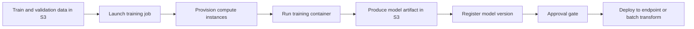
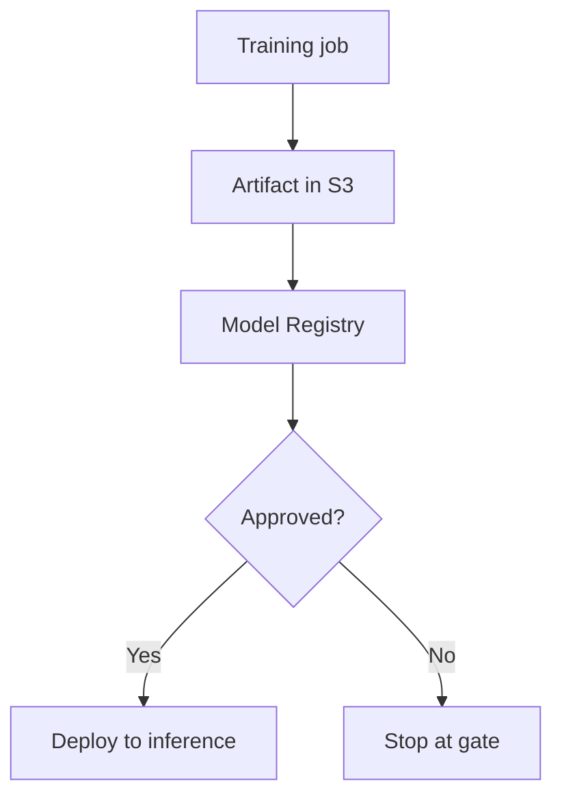
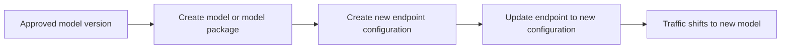
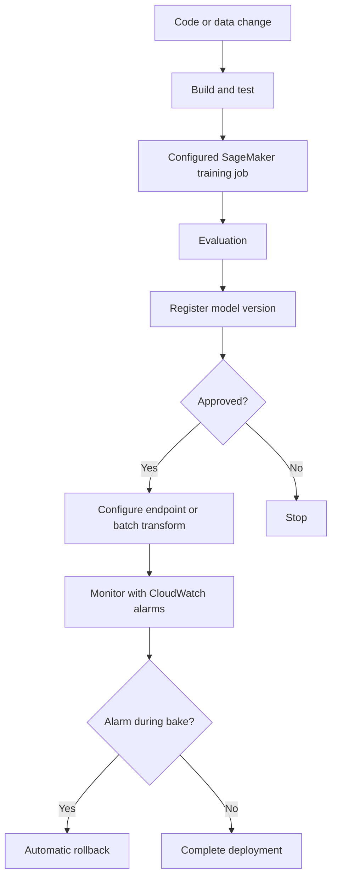

# Task 3.3: Deployment and Orchestration of ML and AI Workflows - Implement automated orchestration and continuous integration and continuous delivery (CI/CD) pipelines for MLOps and AI workloads

## Skill 3.3.3: Configure training and inference jobs

---

## 1. Overview

Configuring training and inference jobs is a foundational MLOps skill. A well-configured training job produces a reproducible model artifact, while a well-configured inference job makes that artifact available for predictions in a cost-efficient, scalable, and reliable way.

In AWS, Amazon SageMaker AI provides managed training and inference job capabilities. A training job is the compute run that learns model parameters from input data. An inference job can be:

- A real-time endpoint that serves predictions with low latency.
- A batch transform job that processes large datasets asynchronously.
- A serverless endpoint that does not require provisioning instances.
- An asynchronous endpoint that handles large or long-running inference requests.

A CI/CD pipeline typically automates the transition from a configured training job to a configured inference deployment, with model registry approval in between.

---

## 2. Core training job configuration

A SageMaker training job requires several key configuration elements. You must be able to identify the purpose of each element and troubleshoot common misconfigurations.

| Configuration element | Purpose |
| --- | --- |
| **Algorithm or container image** | Specifies what training code or algorithm runs, either a built-in algorithm, a prebuilt framework container, or a custom container image stored in Amazon ECR. |
| **Instance type** | Determines the compute hardware, such as CPU, GPU, or accelerated instances. Choose based on the model type and data size. |
| **Instance count** | Number of compute instances. A count greater than one enables distributed training if supported by the algorithm and framework. |
| **Input data channels** | Defines where the training data and validation data live in Amazon S3, how they are named, and how they are read. |
| **Output path** | The S3 location where the trained model artifact, checkpoints, and log output are written. |
| **Execution role** | The IAM role that gives SageMaker permission to access S3, ECR, CloudWatch, and other required AWS services. |
| **Hyperparameters** | Key-value pairs that control training behavior, such as learning rate, batch size, and number of epochs. |
| **Tags and metadata** | Used for cost tracking, governance, and pipeline lineage. |
| **Checkpoint configuration** | Saves model checkpoints to S3 during training. Required for fault recovery, especially with Spot Instances. |
| **VPC configuration** | Places the training job inside a private VPC, which requires proper NAT or VPC endpoints for S3, ECR, and CloudWatch. |

Typical training job flow:

---

## 3. Input data channels and input modes

SageMaker training jobs read data through named input channels. A training step typically defines at least two channels:

- `train` — the training dataset.
- `validation` — the validation or evaluation dataset.

You can add additional channels such as `test`, `metadata`, or `features`.

SageMaker supports different input modes:

| Input mode | Behavior | Common use case |
| --- | --- | --- |
| **File mode** | Downloads all input data from S3 to local disk before training starts. | Smaller datasets or when the algorithm expects all files locally. |
| **Pipe mode** | Streams data directly from S3 during training without downloading the full dataset. | Large datasets, reduced startup time, limited local disk. |
| **FastFile mode** | Uses high-speed parallel file copying from S3 to local storage. | Datasets with many small files when you want local file access but faster than standard File mode. |

**Exam focus:** Understand that Pipe mode is preferred when training data is large and you want to avoid long download times or disk constraints. File mode is simpler and often used for smaller data or algorithms that require local file access.

---

## 4. Compute, instance types, and distributed training

Choosing the right compute configuration is a common exam topic.

| Model type | Typical instance choice |
| --- | --- |
| Traditional ML, small tabular data | CPU instances such as `ml.m5.*` or `ml.c5.*` |
| Deep learning, image or text models | GPU instances such as `ml.g4dn.*`, `ml.p3.*`, `ml.g5.*`, `ml.p4d.*` |
| Large language model fine-tuning | Multi-GPU instances or distributed GPU training |
| High memory or large feature spaces | Memory-optimized instances such as `ml.r5.*` |

Distributed training can be configured with:

- **Data parallelism:** Splits data across multiple workers. Each worker has a copy of the model.
- **Model parallelism:** Splits the model itself across multiple devices or instances. Used for very large models that do not fit on one device.
- **Hybrid approaches:** Both data and model parallelism may be combined for large language models.

SageMaker also offers **Managed Spot Training**, which reduces cost by using Spot Instances. However, Spot Instances can be interrupted. Therefore, checkpointing to S3 is essential so training can resume from the last saved state.

---

## 5. Security, IAM roles, and networking

A training job must assume an execution role that grants:

- `s3:GetObject` on input data locations.
- `s3:PutObject` on the output path.
- `ecr:GetDownloadUrlForLayer`, `ecr:BatchGetImage`, and `ecr:GetAuthorizationToken` if using a custom container.
- `cloudwatch:PutMetricData`, `logs:CreateLogGroup`, `logs:CreateLogStream`, and `logs:PutLogEvents` for logging.

Common failure: A training job starts and immediately fails with `AccessDenied` because the execution role lacks S3 read or write permissions.

If the training job runs inside a VPC, it must have network access to S3, ECR, and CloudWatch. This can be achieved with:

- VPC endpoints for Amazon S3, ECR, and CloudWatch Logs.
- Or a NAT gateway for internet-bound traffic.

---

## 6. Training output and model registration

At the end of a training job, SageMaker writes the model artifact to the specified S3 output path. The artifact is typically:

- A `model.tar.gz` file containing trained weights and metadata.
- Saved checkpoints if configured.

After training succeeds, the artifact is often registered in the **SageMaker Model Registry**.

The registry:

- Creates a model version within a model group.
- Records training job lineage, dataset location, hyperparameters, and evaluation metrics.
- Carries an approval status such as `PendingManualApproval`, `Approved`, or `Rejected`.
- Allows the CI/CD pipeline to read the approval status before deploying.

This separation is critical: **training outputs an artifact; deployment reads the approved registry version.**

---

## 7. Inference job configuration

Inference job configuration depends on the serving pattern. SageMaker AI offers several options.

### 7.1 Real-time inference

Real-time endpoints provide low-latency, synchronous predictions.

Configuration requirements:

- **Model artifact location:** S3 path to the trained model.
- **Inference container image:** The serving image, usually a framework container or custom container.
- **Instance type and initial instance count:** Determines baseline compute capacity.
- **Endpoint configuration:** Defines the model or models, instance settings, and variant weights.
- **Scaling policy:** Application Auto Scaling can adjust instance count based on traffic or custom metrics.

Real-time endpoints are appropriate for:

- Interactive applications.
- APIs with millisecond-to-second latency requirements.
- Continuous, predictable request patterns.

### 7.2 Serverless inference

Serverless inference removes the need to provision or manage instances. You configure:

- **Max concurrency:** Maximum simultaneous invocations.
- **Memory size:** Allocated memory in MB.

Serverless inference is appropriate for:

- Intermittent or unpredictable traffic.
- Low-to-moderate request rates.
- Workloads that can tolerate cold starts.

### 7.3 Asynchronous inference

Asynchronous inference is designed for large payloads and long processing times. Requests are queued and processed asynchronously.

Configuration includes:

- S3 input and output locations.
- Queue and concurrency settings.
- Instance capacity behind the endpoint.

Use cases:

- Large images, video, or document processing.
- Inference requests that may take minutes.
- Workloads where the client does not need an immediate response.

### 7.4 Batch transform

Batch transform is a one-time or scheduled inference job that processes a dataset in batches. It does not create a persistent endpoint.

Configuration includes:

- Input data location in S3.
- Output data location in S3.
- Instance type and count.
- Batch strategy, such as `SingleRecord` or `MultiRecord`.
- Split type for input files, such as `Line`, `CSV`, or `JSON`.

Batch transform is appropriate for:

- Large offline datasets.
- Nightly scoring jobs.
- Workloads that do not require low latency.
- Cost-sensitive workloads that can use transient compute.

### 7.5 Comparison of inference options

| Inference option | Latency | Provisioning | Use case |
| --- | --- | --- | --- |
| Real-time endpoint | Low, interactive | Persistent instances | Web or mobile prediction APIs |
| Serverless inference | Low to moderate, possible cold start | None | Intermittent traffic, simple models |
| Asynchronous inference | High, queued | Persistent capacity | Large payloads, long inference time |
| Batch transform | Not applicable to real-time calls | Job-based temporary compute | Large offline scoring jobs |

---

## 8. Endpoint configuration and deployment

A real-time inference deployment uses the following hierarchy:

1. **Model:** Points to the model artifact S3 location and inference container.
2. **Endpoint configuration:** Defines the model, instance type, initial instance count, and optional serverless settings.
3. **Endpoint:** Launches from an endpoint configuration.

When deploying a new model version, you do not modify an existing endpoint directly with a new artifact. The typical flow is:

This supports blue/green deployments, canary traffic shifts, and automatic rollback if CloudWatch alarms trip during the baking period.

---

## 9. CI/CD integration for training and inference jobs

In a SageMaker pipeline or AWS CodePipeline, the training and inference job steps are orchestrated as repeatable stages.

A typical pipeline might include:

| Stage | Purpose |
| --- | --- |
| Source | Triggers on new code or data version. |
| Build | Runs code quality checks and unit tests. |
| Prepare data | Processes data and stores it in S3. |
| Train | Launches a SageMaker training job with configured inputs, compute, hyperparameters, and IAM role. |
| Evaluate | Runs model evaluation on a test dataset. |
| Register | Registers the model artifact in the model registry. |
| Approve | Manual or automated approval gate. |
| Deploy | Updates the endpoint or launches a batch transform job. |
| Bake and monitor | Uses CloudWatch alarms and deployment guardrails during baking period. |

The training job configuration and inference job configuration feed directly into the pipeline steps.

---

## 10. Scenario-based examples

### Scenario 1: Training job fails immediately with access denied

A pipeline launches a SageMaker training job that reads training data from `s3://company-data/train` and writes model output to `s3://company-models/output`. The job fails immediately with an `AccessDenied` error.

**What is the most likely cause?**

**A.** The training instance type is too small  
**B.** The execution role lacks S3 permissions  
**C.** The hyperparameters are invalid  
**D.** The input mode is set to Pipe mode  

**Answer:** **B. The execution role lacks S3 permissions**

**Explanation:**  
A training job requires an IAM execution role that grants access to the S3 input location, the S3 output location, and the container registry. An `AccessDenied` failure at startup typically indicates missing IAM permissions. Instance type, hyperparameters, and input mode would cause other failure types or performance issues.

---

### Scenario 2: Large dataset requires fast startup

A large training dataset does not fit into the local disk of a standard training instance. You want to reduce startup time and avoid downloading all data before training begins.

**Which configuration should you use?**

**A.** File mode  
**B.** Pipe mode  
**C.** Batch transform  
**D.** Larger model registry  

**Answer:** **B. Pipe mode**

**Explanation:**  
Pipe mode streams data directly from S3 during training instead of downloading the entire dataset before training starts. This reduces startup time and disk requirements. File mode downloads data first. Batch transform is an inference method, not a training input mode.

---

### Scenario 3: Weekly scoring of a large data warehouse

A company needs to generate predictions on millions of records every week. They do not need real-time predictions and want to minimize cost.

**Which inference configuration should they choose?**

**A.** Real-time endpoint with GPU instances  
**B.** Serverless inference  
**C.** Batch transform job  
**D.** Asynchronous inference endpoint  

**Answer:** **C. Batch transform job**

**Explanation:**  
Batch transform processes large datasets asynchronously and does not require a persistent endpoint. It is cost-effective for scheduled, offline scoring workloads. Real-time endpoints are unnecessary for non-interactive workloads. Serverless inference is suitable for low-to-intermittent traffic, not large batch workloads. Asynchronous inference is for large payloads or long inference requests but still uses a persistent queue.

---

### Scenario 4: Intermittent low-volume prediction API

A startup has a model that receives only a few predictions per hour, with occasional bursts. They want the simplest operational model and can tolerate some cold-start latency.

**Which SageMaker inference option fits this requirement?**

**A.** Real-time endpoint with a large instance fleet  
**B.** Batch transform  
**C.** Serverless inference  
**D.** Asynchronous inference  

**Answer:** **C. Serverless inference**

**Explanation:**  
Serverless inference automatically scales with request volume and does not require provisioning or managing instances. It is designed for intermittent or unpredictable traffic. Real-time endpoints with large fleets would be overprovisioned and expensive. Batch transform is offline scoring, not interactive requests.

---

## 11. Exam tips and common traps

### Training job tips

- **IAM role is a common source of failure.** Always check whether the execution role can read from the training data S3 bucket, write to the output bucket, and pull the container image from ECR.
- **Unique output paths.** Each training job should write to a unique S3 path. Reusing an output path can cause confusion about model lineage or overwrite artifacts.
- **Pipe mode vs. File mode.** Use Pipe mode for large datasets to reduce startup time and disk usage. Use File mode for small datasets or when local file access is required.
- **Spot Instances reduce cost but require checkpointing.** If Spot capacity is interrupted, checkpoints allow training to resume.
- **Distributed training is not automatic.** The algorithm and framework must support it. Setting instance count above one does not guarantee data or model parallelism.
- **VPC networking.** If a training job is placed in a private VPC, you must provide access to S3, ECR, and CloudWatch Logs through VPC endpoints or NAT.
- **Encryption.** Use AWS KMS keys to encrypt training data, output artifacts, and EBS volumes for compliance.

### Inference job traps

- **Do not confuse endpoint autoscaling with deployment guardrails.** Autoscaling changes instance count based on traffic. Deployment guardrails shift traffic between model versions during blue/green deployment.
- **Real-time endpoint updates require a new endpoint configuration.** You cannot mutate a model artifact in place and expect a reliable deployment. Create a new endpoint configuration and update the endpoint.
- **Batch transform is not real-time.** It is an offline job. Do not choose it as the inference path for interactive/low-latency workloads.
- **Serverless inference does not support all model types.** Check for model size, memory, and concurrency limits before selecting serverless.
- **Automatic rollback requires a CloudWatch alarm.** A canary or linear rollout without an alarm will not know when a new model is misbehaving and may complete a bad deployment.
- **Endpoints are cost-incurring.** Real-time endpoints run running instances. Use autoscaling, serverless, or batch transform to control cost when load is uneven or batch-oriented.
- **The inference container must match the model artifact.** Using the wrong framework or version can cause health check failures and `No model` errors at the endpoint.
- **Model registry approval is separate from deployment.** A trained model is not automatically deployed unless the pipeline ends at deployment. For safe MLOps, stop at registry approval and then deploy.

### Troubleshooting quick reference

| Symptom | Likely cause |
| --- | --- |
| Training job fails immediately with `AccessDenied` | IAM role missing S3 or ECR permission |
| Training job starts slowly for large data | File mode downloading data; switch to Pipe mode |
| Spot training does not resume after interruption | No checkpoint configuration |
| Endpoint returns `5xx` after deployment | Bad model artifact, wrong container, or no health check pass |
| New model version receives traffic and error rate increases | Deployment guardrail or alarm misconfigured |
| Batch scoring takes too long | Instance type too small or batch strategy suboptimal |
| Real-time endpoint under-utilized but expensive | Use serverless inference or autoscaling |

---

## 12. Quick memory table

| Key term | What to remember |
| --- | --- |
| Training job output | Model artifact in S3, usually `model.tar.gz` |
| Input channels | `train`, `validation`, or custom names |
| Pipe mode | Streams large data from S3, less disk use |
| Execution role | Grants S3, ECR, CloudWatch access to SageMaker |
| Model registry | Stores versions, lineage, approval status |
| Real-time inference | Persistent endpoint for low-latency prediction |
| Serverless inference | Auto scaling, no instance provisioning |
| Batch transform | Offline scoring job, no persistent endpoint |
| Asynchronous inference | Large payloads, queued requests |
| Deployment guardrails | Canary or linear traffic shift plus CloudWatch alarm for rollback |

---

This skill requires you to understand not only how to select the right training and inference configuration, but also how those configurations integrate with an automated MLOps pipeline. Focus on the relationships among IAM roles, S3 locations, container images, model registration, traffic shifting, and rollback alarms.