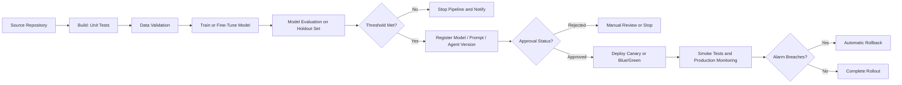
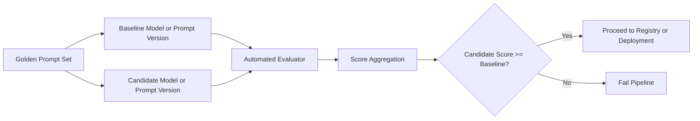

# Task 3.3: Deployment and Orchestration of ML and AI Workflows - Implement automated orchestration and continuous integration and continuous delivery (CI/CD) pipelines for MLOps and AI workloads.

## Skill 3.3.4: Configure automated testing strategies within CI/CD pipelines for traditional ML and AI workloads.

---

## 1. Why Automated Testing Matters in ML and AI CI/CD

Automated testing in MLOps is not only about checking code. It must verify:

- The application code and pipeline logic are correct.
- The training data meets expected quality standards.
- The trained model meets a numeric quality threshold.
- The serving stack returns valid predictions with acceptable latency.
- The deployed generative AI behaviour is safe, relevant, and useful.
- Prompt changes, agent changes, and fine-tuned model changes do not regress quality.

A key exam distinction:

> **Traditional software tests are deterministic.**  
> **Traditional ML model tests are threshold-based metrics on held-out data.**  
> **Generative AI tests are comparative evaluations, not exact string matching.**

---

## 2. Test Categories in ML CI/CD Pipelines

| Test Category | What It Validates | Typical Failure Gate |
|---|---|---|
| **Unit tests** | Training scripts, preprocessing functions, configs, pipeline code | Build stage fails immediately |
| **Data validation tests** | Schema, column types, nulls, value ranges, label distribution | Pipeline stops before training |
| **Model evaluation tests** | Accuracy, F1, AUC, RMSE, precision, recall on holdout data | Model is not registered or deployed |
| **Baseline comparison tests** | Candidate model vs. current production model | Candidate can be rejected if worse |
| **Inference smoke tests** | Endpoint response shape, serialisation, latency, basic prediction correctness | Deployment is aborted |
| **Deployment rollout tests** | Canary traffic, CloudWatch alarms, rollback readiness | Automatic rollback if alarms breach |
| **Prompt evaluation tests** | Generative response quality against baseline or judge criteria | Prompt/model version is blocked |
| **RAG/agent tests** | Retrieval relevance, groundedness, task completion, tool use | GenAI change is blocked |

---

## 3. Testing Traditional ML Workloads

### 3.1 Code Tests

These are deterministic and belong in **AWS CodeBuild** or a **SageMaker Pipelines Processing Step**.

Examples:

- Preprocessing function returns expected output.
- Training script imports successfully.
- Configuration files parse correctly.
- Pipeline parameters are passed correctly.

A failing unit test should fail the build stage and stop the pipeline.

### 3.2 Data Validation Tests

Before training, validate the new dataset.

Check for:

- Column names and data types.
- Null or missing value rates.
- Unexpected categorical values.
- Numeric ranges and outliers.
- Class imbalance or target leakage.
- Data drift from the last successful training set.

If a validation rule fails, stop the pipeline before spending compute on training.

### 3.3 Model Evaluation Tests

After training, evaluate on a **held-out test dataset**, not the training data.

Common traditional ML metrics:

| Problem Type | Example Gate Metric |
|---|---|
| Binary classification | AUC, F1, precision, recall |
| Multi-class classification | Macro F1, accuracy |
| Regression | RMSE, MAE, R² |
| Ranking | NDCG, precision@k |
| Forecasting | MAPE, sMAPE, weighted quantile loss |

In **Amazon SageMaker Pipelines**, this is typically done with:

1. A processing or evaluation step that computes the metric.
2. A condition step that compares the metric against a threshold.
3. A model registration step that runs only if the condition passes.

If a model fails the threshold, it should **stop at the gate** and should not reach the Model Registry or deployment stage.

### 3.4 Baseline Comparison Tests

A common MLOps requirement is:

> Deploy the new model only if it is as good as or better than the current production model.

The pipeline:

1. Loads the current production model from the Model Registry.
2. Evaluates both models on the same held-out dataset.
3. Compares metrics.
4. Proceeds only if the candidate meets or exceeds the baseline by the required margin.

This prevents accidental regression from a new model version.

### 3.5 Inference and Smoke Tests

Before or during deployment, test the actual serving endpoint.

Examples:

- Send a sample payload and check the response structure.
- Verify prediction latency is under a defined limit.
- Confirm input serialisation and output deserialisation work.
- Validate that the endpoint returns valid probabilities or class labels.

For **SageMaker endpoints**, this can be attempted through an automated pipeline step after endpoint creation, but before shifting full traffic.

### 3.6 Deployment Guardrails as Post-Deployment Tests

Testing does not end at deployment.

A canary or blue/green deployment with a **baking period** and **CloudWatch Alarms** acts as a production test. If error rate, latency, or other metrics breach the alarm, traffic automatically returns to the old model.

---

## 4. Testing Generative AI and LLM Workloads

### 4.1 The Non-Deterministic Testing Problem

Generative AI outputs vary across runs for the same prompt.

Therefore, exact expected-string assertions are not valid for generative AI quality testing.

For example, a chatbot prompt can return many valid answers:

```text
"What is Amazon S3?"
```

All of these may be correct:

- Amazon S3 is an object storage service.
- S3 is a scalable storage service from AWS.
- It stores objects in buckets.

A deterministic unit test asserting only one exact string would falsely fail valid responses.

### 4.2 Golden Prompt Datasets

Use a fixed, curated set of representative prompts as a reproducible test suite.

This dataset should contain:

- Common user prompts.
- Edge cases.
- Safety-sensitive prompts.
- Format-sensitive requests.
- Context-grounded requests for RAG use cases.

The same prompt set is run against:

- The current production version as the baseline.
- The candidate model or prompt version.

The outputs are then scored and compared.

### 4.3 Evaluation Metrics for Generative AI

| Evaluation Type | What It Measures |
|---|---|
| **Semantic similarity** | How close the response is to a reference answer |
| **Faithfulness / groundedness** | Whether the response is supported by the provided context |
| **Answer relevance** | Whether the response directly answers the question |
| **Helpfulness** | Whether the response is informative and useful |
| **Toxicity** | Presence of hateful, abusive, or unsafe language |
| **Hallucination / refusal rate** | Rate of fabricated content or unnecessary refusals |
| **Instruction following** | Whether the model obeys formatting, length, and stylistic constraints |
| **ROUGE** | Overlap with reference summaries |
| **BERTScore** | Semantic similarity using embeddings |
| **Latency and cost** | Deployment suitability for production |

### 4.4 LLM-as-a-Judge

For many GenAI quality attributes, a strong LLM acts as an automated judge.

The judge model:

- Receives the original prompt.
- Receives the candidate response.
- May receive a reference answer or expected criteria.
- Scores the response on defined metrics.

This is useful when there is no single exact answer.

However, the judge model itself may have bias or variance. It should be:

- Used with a fixed evaluation prompt template.
- Applied the same way to baseline and candidate.
- Combined with aggregate metrics over a broad prompt set.

### 4.5 Prompt Testing and Versioning

A prompt change is a behaviour change.

Prompts should be:

- Stored as versioned resources.
- Tested as comparable variants.
- Released to production only after evaluation passes.

**Amazon Bedrock Prompt Management** supports versioned prompts with variables and variants.

A CI/CD pipeline can:

1. Create a prompt variant.
2. Run a fixed evaluation set against the current version and the candidate variant.
3. Compare scores.
4. Promote the variant only if quality is equal or better.

Without prompt versioning, an application might edit prompt text in code or console, making regressions impossible to explain.

### 4.6 Fine-Tuned Foundation Model Testing

A fine-tuned model is a new version of a foundation model.

The deployment pipeline should:

- Track the fine-tuned model version.
- Evaluate it against the baseline foundation model or a previous fine-tuned version.
- Store evaluation results with the model version.
- Deploy using the version identifier, not by editing configuration in place.

This allows repeatability and auditability.

### 4.7 RAG and Agent Workload Testing

For RAG systems, automated tests should validate:

- **Retrieval relevance**: Are the retrieved chunks relevant to the query?
- **Context sufficiency**: Does the retrieved context contain the answer?
- **Groundedness**: Is the generated answer supported by the retrieved context?
- **Citation accuracy**: Are sources cited correctly?
- **Refresh integrity**: After a knowledge base update, do retrieval results change as expected?

For agents, automated tests can validate:

- Task completion rate.
- Correct tool selection.
- Correct sequence of actions.
- Output quality from multi-step reasoning.
- Failure handling.

AI-specific pipeline orchestration should test the agent version or knowledge base update before full promotion.

---

## 5. CI/CD Pipeline Placement of Tests

The following diagram shows where automated tests typically sit in an ML CI/CD pipeline.



For **GenAI workloads**, the evaluation loop can be represented as:



---

## 6. AWS Services Used for Automated Testing

| AWS Service | Role in Automated Testing |
|---|---|
| **AWS CodeBuild** | Runs deterministic unit tests, builds containers, executes test scripts |
| **AWS CodePipeline** | Coordinates source, build, test, approval, and deploy stages |
| **AWS CodeDeploy** | Manages deployment rollout, smoke tests, and rollback |
| **Amazon SageMaker Pipelines** | Runs ML-specific steps including processing, training, evaluation, condition gates, and model registration |
| **Amazon SageMaker Model Registry** | Stores model versions, metadata, lineage, and approval status for deployment gating |
| **Amazon SageMaker Clarify** | Detects bias, toxicity, and explainability issues for ML and GenAI workloads |
| **Amazon Bedrock Model Evaluation** | Evaluates foundation models using automatic metrics, LLM-as-a-judge, or human evaluation |
| **Amazon Bedrock Prompt Management** | Versions prompts, creates variants, and supports comparison testing |
| **Amazon EventBridge** | Triggers pipeline runs or evaluation jobs based on events, schedules, or registry state changes |
| **Amazon CloudWatch Alarms** | Monitors deployment metrics and triggers automatic rollback during baking period |

---

## 7. Scenario-Based Exam Examples

### Scenario 1: Traditional ML Model Gate

**Question**

A data science team uses SageMaker Pipelines to train a customer churn classifier. The model must achieve at least **0.85 AUC** on a held-out dataset before it can be registered for deployment.

The evaluation step produces a JSON report containing the AUC value.

Which pipeline configuration should stop registration when the AUC is below 0.85?

**Correct Answer**

Use a **condition step** after the evaluation step that reads the AUC value from the evaluation report and compares it to 0.85. The model registration step should run only if the condition succeeds.

**Explanation**

In SageMaker Pipelines, a condition step acts as a gate. It can evaluate numeric metrics and prevent downstream steps from running if the condition is false. Simply logging the AUC metric or displaying it in a notebook does not block registration.

---

### Scenario 2: Generative AI Prompt Change

**Question**

A company runs a production chatbot using an LLM. The team wants to change the system prompt to improve answer style. The new prompt must be automatically rejected if overall response quality drops compared with the current prompt. Responses vary between invocations.

Which testing strategy best fits this requirement?

**Correct Answer**

Run a fixed golden prompt set against both the current prompt version and the candidate prompt version. Score the responses using an automated evaluator or LLM-as-a-judge. Compare aggregate scores and block the candidate version if it scores lower than the current version.

**Explanation**

Generative responses are non-deterministic, so exact string assertions are inappropriate. A fixed evaluation dataset plus comparative scoring against a baseline is the correct approach. This can be automated in the pipeline before the prompt version is promoted.

---

### Scenario 3: Fine-Tuned Model Regression Test

**Question**

A team wants to deploy a fine-tuned summarisation model only if its **ROUGE** score on a test set is equal to or higher than the currently deployed model. Where should this test occur?

**Correct Answer**

In an automated evaluation step after fine-tuning, before model registration or deployment approval. The pipeline should load the current production model from the Model Registry, evaluate both models on the same test set, compare ROUGE scores, and block the new model if it regresses.

**Explanation**

The comparison must happen on the same evaluation dataset to be valid. The Model Registry provides the baseline production model version. The pipeline should stop before registration or deployment if the candidate underperforms.

---

### Scenario 4: Data Validation Gate

**Question**

A training pipeline ingests a new CSV dataset from an S3 bucket. The previous dataset had six columns, but a new upstream change produced seven columns. The team wants the pipeline to fail before training when the schema changes unexpectedly.

Which automated test should be configured?

**Correct Answer**

A **data validation step** that checks the expected schema, column names, and data types before the training step begins.

**Explanation**

Data validation is a pre-training gate. It prevents a poorly formed dataset from consuming compute resources and producing an invalid model. This is separate from model evaluation, which happens after training.

---

## 8. Exam Tips and Traps

### 8.1 Important Tips

- **Separate code tests from model tests.** Code tests are deterministic; model tests use thresholds on held-out data; GenAI tests use comparative evaluation.
- **Always evaluate on a held-out dataset.** Evaluation on training data gives optimistic results and can allow bad models to pass.
- **Use a condition or approval gate.** Producing a metric is not enough. The pipeline must explicitly stop when the metric fails.
- **Register models before deployment.** The Model Registry allows a human or automated approval step between training and production.
- **Version prompts and agents.** A prompt or agent configuration change changes behaviour just like a weight change.
- **Use baseline comparison for GenAI.** Compare the candidate model or prompt against the current version using the same golden prompt set and evaluator.
- **Use canary and CloudWatch alarms as production tests.** Pre-deployment tests do not catch all issues. Deployment guardrails provide automated rollback.
- **For RAG and agent workloads, test retrieval and task completion.** Accuracy alone is not enough.

### 8.2 Common Traps

| Trap | Why It Is Wrong |
|---|---|
| Asserting exact expected strings for generative AI | Causes false failures because GenAI outputs vary |
| Running only application unit tests | Does not validate model quality or prompt behaviour |
| Evaluating on the training dataset | Reports inflated or unrealistic performance |
| Manually checking metrics after deployment | Does not stop a bad model from reaching production automatically |
| Configuring no CloudWatch alarm during canary rollout | A bad deployment can complete successfully because no rollback signal exists |
| Deploying a fine-tuned model without versioning | Cannot reconstruct what shipped or roll back reliably |
| Editing prompts directly in production application code | Prevents prompt testing, comparison, versioning, and audit |
| Treating a model evaluation report as a gate | A report alone does not block deployment; a condition step must enforce the threshold |
| Ignoring data validation | A model can train successfully on malformed data and still produce garbage predictions |

---

## 9. Summary

Automated testing in ML and AI CI/CD pipelines must cover:

- **Code correctness** through deterministic unit and integration tests.
- **Data quality** through schema, drift, and range validation.
- **Traditional model quality** through threshold-based evaluation on held-out data.
- **Baseline comparison** to avoid regressions.
- **Inference smoke tests** for serving validation.
- **GenAI behaviour** through golden prompt sets, LLM-as-a-judge, and comparative scoring.
- **Prompt and agent version testing** to track all behaviour-changing artifacts.
- **Production guardrails** with canary deployments and CloudWatch alarms.

The key exam mindset is:

> **A model or prompt change must pass the correct automated gate before it can reach production. Deterministic tests assert correctness. ML tests enforce thresholds. GenAI tests compare quality against a baseline.**