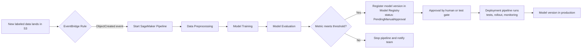

# Task 3.3: Deployment and Orchestration of ML and AI Workflows - Implement automated orchestration and continuous integration and continuous delivery (CI/CD) pipelines for MLOps and AI workloads

## Skill 3.3.5: Build and integrate mechanisms to re-train models

### Overview

Building and integrating mechanisms to re-train models means creating automated, repeatable workflows that can rebuild a model when new data arrives, when performance degrades, or on a fixed schedule—without requiring a person to manually start the process. This skill is a core part of MLOps automation and CI/CD for machine learning and AI workloads.

The central idea is that a retraining mechanism is not just a single training job. It is a **pipeline that can run unattended**, a **trigger that starts it**, and an **integration point that safely hands the new model to the next stage**—typically a model registry—rather than deploying directly to production.

---

### Key Concepts

A robust retraining mechanism has three essential parts:

1. **A repeatable training pipeline** – a series of steps that process data, train the model, evaluate it, and register the resulting artifact.
2. **An automated trigger** – something that starts the pipeline without human intervention.
3. **A safe handoff** – the pipeline ends by registering the new model version into a model registry, where it waits for approval, tests, or deployment gates.

This separation between retraining and deployment is critical. Retraining produces a candidate model; deployment is a separate, gated decision.

---

### AWS Services for Retraining Mechanisms

| AWS Service | Role in Retraining |
| --- | --- |
| **Amazon SageMaker Pipelines** | Orchestrates the end-to-end ML workflow: data processing, training, evaluation, and model registration. Each run is recordable and repeatable. |
| **Amazon EventBridge** | Routes events that trigger the retraining pipeline. Can use schedules (cron) or event patterns (e.g., new data in S3, CloudWatch alarm threshold). |
| **Amazon S3** | Stores training data, validation data, and model artifacts. S3 event notifications can be sent to EventBridge when new data lands. |
| **Amazon CloudWatch** | Monitors metrics and can emit alarms. CloudWatch alarms can trigger EventBridge rules to start retraining when a metric crosses a threshold. |
| **Amazon SageMaker Model Registry** | Catalogs trained model versions, records lineage and metadata, and tracks approval status. A deployment pipeline reads from this registry. |
| **MLflow on Amazon SageMaker AI** | Tracks experiment runs, parameters, and metrics. It can register a chosen run into the model registry automatically, preserving lineage. |
| **AWS Lambda** | Can be used to glue components together, e.g., to start a SageMaker Pipeline execution in response to an event. |
| **AWS Step Functions** | Can orchestrate a more complex retraining workflow, including branching, retries, and human approval steps before registration. |

---

### The Three Honest Triggers for Retraining

Choosing a trigger is a design decision. The three main options each have trade-offs.

| Trigger Type | Description | Pros | Cons | When to Use |
| --- | --- | --- | --- | --- |
| **Schedule-based** | A fixed time or interval (e.g., daily, weekly) triggers the pipeline via EventBridge cron rule. | Simple to implement; predictable; good for compliance or periodic refresh. | Wastes compute when no new data has arrived; can be stale if data frequency changes. | Data updates on a regular, known cadence; or for periodic model drift checks. |
| **Event-driven** | A specific event starts the pipeline. Examples: new data object created in S3, CloudWatch alarm triggers on a metric threshold, or an upstream system publishes a custom event. | Efficient; runs only when needed; low latency after the event; no wasted work. | Requires the event to actually exist and be emitted; more initial setup; needs monitoring of event sources. | Irregular data arrival, performance degradation triggers, or tight coupling to upstream data pipelines. |
| **Manual** | A human starts the pipeline on demand. | Full control; useful when the pipeline is still being tested or when a one-off retrain is needed. | Does not scale; requires human memory and effort; can introduce delay and inconsistency. | Initial phase while automating; rare, unscheduled retrains; debugging the pipeline itself. |

An effective architecture often combines these. For example, a scheduled weekly pipeline might be complemented by an event-driven trigger when an unusually large batch of new labeled data arrives.

---

### Building a Retraining Pipeline

A typical automated retraining pipeline in SageMaker includes these steps:

| Step | Purpose | Example |
| --- | --- | --- |
| **Data ingestion** | Pull the latest training data from a source (e.g., S3 bucket, data store). | Read CSV/Parquet files from `s3://my-data/training/`. |
| **Data preprocessing** | Clean, transform, split, and feature-engineer the data. | Use SageMaker Processing job with scikit-learn or Spark. |
| **Model training** | Train the model using the prepared data and specified hyperparameters. | SageMaker Training job with a built-in or custom container. |
| **Model evaluation** | Compute metrics on a held-out validation set to assess quality. | SageMaker Processing job or training step that produces metrics. |
| **Condition step** | Gate the next action based on evaluation metrics (e.g., AUC, accuracy, RMSE). | If metric < threshold, stop pipeline and notify; else continue. |
| **Model registration** | Register the trained model artifact and metadata into the SageMaker Model Registry with a new version and status (e.g., `PendingManualApproval`). | Register to model group `customer-churn-predictor` with version 7. |
| **Lineage recording** | Attach lineage information: training job ID, dataset location, hyperparameters, metrics, and code version. | Automatically captured by SageMaker ML Lineage Tracking. |

The pipeline should **end at registration**, not at deployment. This allows a human or an automated testing gate to approve the model before production traffic reaches it.

---

### Integrating Retraining with CI/CD

Retraining is a distinct phase from deployment. In a complete MLOps pipeline:

1. A **trigger** starts the retraining pipeline.
2. The pipeline produces a **candidate model version** in the model registry.
3. The **deployment pipeline** (e.g., AWS CodePipeline) listens for registry approval or starts when a model version is approved.
4. The deployment pipeline runs its own tests, gates, and rollout steps (e.g., canary deployment with rollback alarms).
5. Only after these gates pass does the model version serve production traffic.

This separation gives you:

- A clear audit trail: which training run produced the model, what data and code were used, and who approved it.
- Protection against accidental production deployment of a poorly performing model.
- Reversibility: a bad model can be rolled back to the previous approved version.

---

### Mermaid Diagram: Event-Driven Retraining Workflow

In this example, the retraining mechanism automatically processes new data and produces a candidate model. The candidate waits in the registry until approved; only then does the deployment pipeline run. This prevents an untested model from reaching production.

---

### Scenario-Based Example 1

**Scenario:**  
A financial services company has a fraud detection model. New labeled transaction data arrives irregularly—sometimes multiple batches per day, sometimes none for several days. The team wants the model retrained only when new labeled data is available, and they want the entire process automated. The new model must be reviewed by a human before it replaces the old model.

**Desired Design:**

- S3 bucket stores incoming labeled data.
- S3 event notification sends an `ObjectCreated` event to EventBridge when a new file lands.
- EventBridge rule starts a SageMaker Pipeline execution.
- SageMaker Pipeline runs preprocessing, training, evaluation, and registers the model version into SageMaker Model Registry with status `PendingManualApproval`.
- A data scientist or designated approver reviews the evaluation metrics and lineage, then approves or rejects the version.
- If approved, a separate deployment pipeline deploys the version using a canary rollout with automatic rollback alarms.

**Why this is correct:**  
Event-driven triggering is optimal for irregular data arrival because it avoids unnecessary runs when no new data exists. Ending at registration with manual approval adds a governance layer appropriate for high-risk financial models. The deployment pipeline’s alarms provide rollback protection.

---

### Scenario-Based Example 2

**Scenario:**  
An e-commerce platform has a product recommendation model. New clickstream data is generated continuously, but the team can tolerate a daily refresh. They want to minimize operational overhead while still ensuring the model does not degrade. They also need an audit trail for compliance.

**Desired Design:**

- EventBridge rule with a cron schedule triggers the SageMaker Pipeline every day at 2:00 AM.
- The pipeline ingests the previous day’s data, retrains, evaluates, and registers a new version in the Model Registry.
- The pipeline stores lineage: dataset URI, training job ID, hyperparameters, and evaluation metrics.
- The deployment pipeline automatically runs a set of tests and, if all pass, deploys the new version using a linear traffic shift over one hour with CloudWatch alarms.
- If the evaluation metric falls below the baseline from the previous version, the pipeline stops and sends notification.

**Why this is correct:**  
A schedule-based trigger fits a steady, predictable data cadence. The pipeline is fully automated but still ends at registration. The deployment pipeline’s tests and traffic shifting guard production. The recorded lineage satisfies audit requirements.

---

### Key Considerations for Retraining Mechanisms

- **Training job configuration:** Ensure training jobs specify the correct container image, instance type, input data URI, output model URI, IAM role, and hyperparameters. These must be defined inside the pipeline so they are repeatable.
- **Data versioning:** Track the exact dataset used for each training run. Use path or dataset identifiers, and record them in lineage.
- **Pipeline idempotency:** If the same event triggers twice, the pipeline should not corrupt data or create duplicate model versions unintentionally. Consider using idempotency keys or checking for existing runs.
- **Conditional steps:** Use evaluation metrics to decide whether to register a new version. A bad model should fail early, not waste registry space or require a manual rejection.
- **Separation of concerns:** Keep retraining logic separate from deployment logic. Changing a model version should not require editing application code.
- **Model Registry statuses:** Common statuses include `PendingManualApproval`, `Approved`, and `Rejected`. Deployment pipelines should read only `Approved` versions.

---

### Common Exam Scenarios and Traps

**Trap 1: Deploying directly from the retraining pipeline**  
A candidate may say the pipeline should automatically deploy the model as soon as training completes. This is dangerous. The correct answer is to register the model and require approval or automated testing before deployment.

**Trap 2: Choosing schedule-based retraining when data is irregular**  
If data arrives unpredictably, a schedule will either run too often (wasting compute) or too rarely (causing delays). Event-driven triggers are the better choice when the event exists and is reliable.

**Trap 3: Forgetting that a trigger must be automated**  
Manual retraining is not an automated mechanism. Questions will ask for "automated retraining" and expect EventBridge, CloudWatch Alarms, or S3 event notifications, not human intervention.

**Trap 4: Confusing deployment rollback with retraining triggers**  
Rollback alarms protect a deployment after a new model version is live. They do not trigger retraining. Do not choose "attach a scaling policy" or "add an alarm" as the retraining trigger—those are deployment guardrails or capacity management.

**Trap 5: Ignoring model registry integration**  
If a question asks which service records model versions and lineage after retraining, the answer is Amazon SageMaker Model Registry or MLflow on SageMaker AI, not CodeCommit or CodeDeploy. The registry is the system of record; deployment tools use it.

**Trap 6: Not accounting for event source existence**  
Event-driven retraining requires that the event actually exists. If new data lands in S3 without event notifications, or if the upstream system does not emit events, the trigger will never fire. The question may subtly state that no event notification is configured, making schedule or manual the only viable options.

---

### Summary

Building and integrating mechanisms to re-train models means creating a repeatable SageMaker Pipeline, triggering it automatically through a schedule or an event, and connecting the output to a model registry for governance and safe deployment. The retraining pipeline should end at registration—not at deployment. Choose the trigger type based on data cadence and system events, not based on personal preference. Record lineage for auditability, and always separate training from production deployment.

This skill is central to MLOps automation and is frequently tested in the AWS Certified Machine Learning – Associate exam, especially in scenario-based questions that mix data arrival patterns, pipeline stages, and governance requirements.