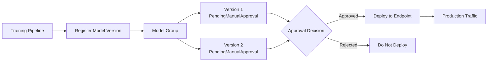
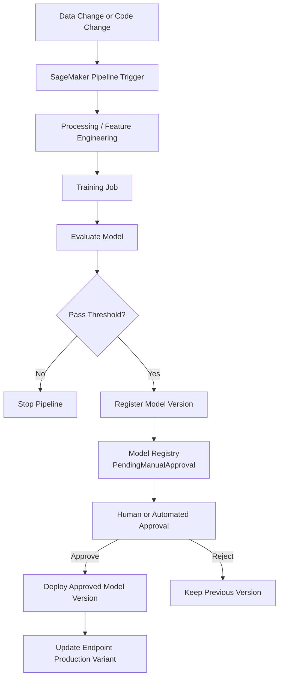
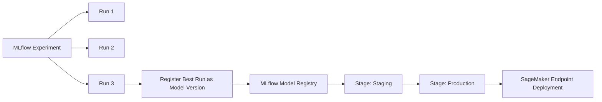
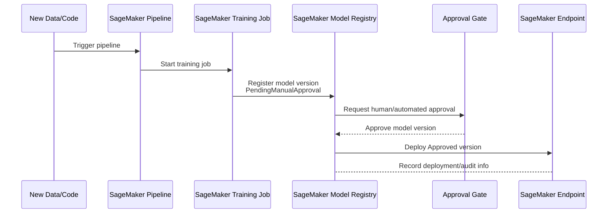

# Task 3.3: Deployment and Orchestration of ML and AI Workflows - Implement automated orchestration and continuous integration and continuous delivery (CI/CD) pipelines for MLOps and AI workloads

## Skill 3.3.6: Manage model versions for repeatability and audits (for example, SageMaker Model Registry, MLflow on SageMaker AI)

---

## 1. Purpose of This Skill

Model versioning is not just about assigning a number to a model. It is the mechanism that makes a machine learning deployment:

- **Repeatable** — the same model artifact, metadata, and serving configuration can be deployed again identically.
- **Auditable** — you can reconstruct which model version served production traffic, when it changed, why it changed, and which training run produced it.
- **Reversible** — you can identify and redeploy a previous good version after a bad deployment.
- **Approvable** — a model version carries an approval state that a CI/CD pipeline or human gate can read before deployment.

For the MLA-C02 exam, you should think of a model registry as the **system of record** for trained model artifacts, separate from the pipeline that produced them and separate from the endpoint that serves them.

---

## 2. Core Concepts

### 2.1 What a Model Version Records

A strong model version should answer the following audit questions:

| Audit Question | Version Metadata Example |
|---|---|
| Which model weights were used? | S3 URI for model artifact |
| Which training job created it? | SageMaker Training Job ARN |
| Which dataset was used? | Training/validation dataset S3 URI or dataset version |
| Which code was used? | Git commit SHA, branch, or repository reference |
| Which hyperparameters were used? | Hyperparameter values recorded as metadata |
| Which container/image was used? | Training and inference container URIs |
| What quality metrics were achieved? | Accuracy, F1, RMSE, AUC, regression metrics, etc. |
| Is this version safe to deploy? | Approval status: PendingManualApproval / Approved / Rejected |

### 2.2 Repeatability vs. Auditability

- **Repeatability** means the registry stores enough information to recreate the deployment environment, such as the model artifact location, inference image, instance type, and environment variables.
- **Auditability** means the registry maintains version history, lineage, metadata, and status changes so an auditor can trace a production model back to its source.

---

## 3. Amazon SageMaker Model Registry

Amazon SageMaker Model Registry is the native AWS service for cataloging trained models.

### 3.1 Key Components

| Component | Purpose |
|---|---|
| **Model Group** | A logical collection of versions of the same model. Example: `fraud-detection-model`. |
| **Model Package Version** | An immutable version inside a model group. Each version has a unique ARN and version number. |
| **Model Artifact** | The trained model files stored in Amazon S3. The registry stores the S3 URI, not the model binary itself. |
| **Inference Specification** | The container image and serving configuration used to deploy the model. |
| **Metadata** | Custom key-value pairs, such as dataset URI, code commit, algorithm name, evaluation metrics, and owner. |
| **Approval Status** | `PendingManualApproval`, `Approved`, or `Rejected`. Deployment logic should read this status. |
| **Lineage** | Association between the model version, the SageMaker training job, the dataset, and the pipeline execution that produced it. |

### 3.2 Model Registry Approval States

Approval status is the gate between training and production deployment.

The important exam point is:

- A newly registered model version typically starts as `PendingManualApproval`.
- The deployment step should deploy only versions with `Approved` status.
- If no approval step exists, a bad model can be deployed or a good model can be blocked without a clear decision record.

### 3.3 How SageMaker Model Registry Supports CI/CD

A typical MLOps flow using SageMaker Model Registry:

In SageMaker, the pipeline can register the model automatically. Deployment is then kept as a separate step that reads the `Approved` status. This separation is critical for:

- Human review before production.
- Automated evaluation gates before deployment.
- Audit trails showing who approved which version.
- Safe rollbacks by deploying a previously `Approved` version.

### 3.4 Lineage and Auditing in SageMaker Model Registry

SageMaker Model Registry can automatically record lineage from upstream SageMaker jobs.

A model version can be traced back to:

- The SageMaker Training Job ARN.
- The dataset S3 URI.
- The SageMaker Pipeline execution ID.
- The code and hyperparameters used.

This lineage helps answer:

> “Which training run produced the model that served traffic during the incident?”

---

## 4. MLflow on Amazon SageMaker AI

MLflow is an open-source MLOps tool. AWS offers a **managed MLflow tracking server** on SageMaker AI.

### 4.1 What MLflow on SageMaker AI Provides

| MLflow Component | Purpose |
|---|---|
| **Tracking Server** | Logs experiment runs, parameters, metrics, tags, and artifacts. |
| **Experiments** | Organize multiple runs that test different algorithms, data versions, or hyperparameters. |
| **Runs** | Individual training executions with their parameters, metrics, and artifacts. |
| **Model Registry** | Tracks model versions and lifecycle stages such as `Staging`, `Production`, and `Archived`. |
| **Model Version** | A registered model from a specific run or artifact, with its own version number. |

### 4.2 MLflow Model Registry Use Cases

MLflow is especially useful when:

- Data scientists need to compare many experiments.
- Teams already use MLflow in an open-source or multi-cloud workflow.
- You need a unified tracking server for parameters, metrics, and artifacts.
- You want to register a successful experiment run directly into a model registry.

Example relationship:

### 4.3 MLflow and SageMaker Together

In an AWS native environment, you can:

1. Use **MLflow on SageMaker AI** for experiment tracking and comparing runs.
2. Register the winning run as an MLflow model version.
3. Move the version to `Staging` for testing.
4. Promote it to `Production` after validation.
5. Integrate the selected artifact with SageMaker endpoints or SageMaker Pipelines.

However, MLflow’s `Production` stage is not automatically the same as SageMaker Model Registry `Approved` status. These are separate systems unless you explicitly integrate them.

---

## 5. SageMaker Model Registry vs. MLflow on SageMaker AI

| Feature | SageMaker Model Registry | MLflow on SageMaker AI |
|---|---|---|
| Primary purpose | Catalog SageMaker model artifacts and manage deployment approval | Track experiments and manage MLflow lifecycle stages |
| Native AWS integration | Very high with SageMaker Pipelines, training jobs, endpoints | Managed by AWS but based on open-source MLflow |
| Approval model | `PendingManualApproval`, `Approved`, `Rejected` | Stages: `None`, `Staging`, `Production`, `Archived` |
| Experiment tracking | Partial through SageMaker Experiments and lineage | Strong native experiment tracking |
| Best for | SageMaker-native CI/CD, deployment gates, audit requirements | Cross-framework experiment comparison and MLflow workflows |
| Artifact storage | S3 URI stored in registry | S3 artifact store managed by MLflow tracking server |
| Deployment integration | Directly used by SageMaker endpoint deployment steps | Requires integration or export to SageMaker |

---

## 6. Model Version Lifecycle in a SageMaker CI/CD Pipeline

The lifecycle below is a common exam scenario:

Key points:

- The pipeline ends at **registration**, not at deployment.
- The approval gate is explicit.
- Deployment does not overwrite the registry; it references an immutable version.
- Prior approved versions remain available for rollback.

---

## 7. How Versioning Supports Rollback and Audit

### 7.1 Rollback

A rollback in MLOps is not “undoing code changes.” It is deploying a previous **approved model version**.

Using a model registry enables:

- Selecting the last known good approved model version.
- Redeploying it to the endpoint.
- Comparing its lineage and metadata against the failed version.
- Providing an audit record of why the rollback occurred.

### 7.2 Audit Questions a Registry Helps Answer

| Question | Where to Look |
|---|---|
| Which model version served traffic at a given time? | Endpoint production variant history + model registry version |
| Which training job produced the model? | Registry version lineage |
| Which dataset was used to train the model? | Registry metadata or lineage |
| Which code commit produced the model? | Registry metadata or pipeline execution linkage |
| Which evaluation metrics did this version have? | Registry metadata or MLflow run |
| Was this model approved before deployment? | Registry approval status and status change history |
| Who approved this model? | CloudTrail or pipeline approval records |

---

## 8. Scenario-Based Examples

### 8.1 Scenario: Auditing a Production Incident

**Problem**

A fraud detection model behaved incorrectly between 2 PM and 4 PM. The security team asks:

- Which model version was serving traffic during that window?
- Which training job created that version?
- Which dataset was used?

**Solution**

The team should use the **SageMaker Model Registry**. The endpoint’s historical production variant can identify the deployed model package version. The registry version then provides lineage back to:

- The SageMaker Training Job.
- The S3 dataset URI.
- The pipeline execution.
- The evaluation metrics and approval status.

This gives a complete audit trail.

---

### 8.2 Scenario: Automate Retraining Without Automatic Deployment

**Problem**

A team has an automated SageMaker pipeline that retrains a model when new data arrives. However, they do not want the model to deploy automatically. They want a human to review quality before production.

**Solution**

The pipeline should:

1. Train the model.
2. Evaluate it.
3. Register the model version in SageMaker Model Registry as `PendingManualApproval`.
4. Wait for a human or automated approval step.
5. Only deploy when the model version becomes `Approved`.

This separates training from production deployment and supports auditability.

---

### 8.3 Scenario: Experiment Tracking and Model Selection with MLflow

**Problem**

A data science team runs many experiments using different algorithms and hyperparameters. They need to select the best run, register it for testing, and eventually deploy it.

**Solution**

Use **MLflow on SageMaker AI**:

- Track all experiment runs, parameters, metrics, and artifacts.
- Compare runs.
- Register the best run as an MLflow model version.
- Move the model version to `Staging`.
- Validate it.
- Promote it to `Production`.
- Integrate the production artifact with the SageMaker deployment pipeline.

This provides repeatability from experiment to deployment.

---

## 9. Exam Tips and Traps

### 9.1 Exam Tips

1. **Model Registry stores metadata and S3 URIs.** It does not directly store model binaries inside the registry.
2. **Treat registration and deployment as separate stages.** A model should not automatically go to production just because it was registered.
3. **Approval status matters.** Look for `PendingManualApproval`, `Approved`, and `Rejected` in exam answers.
4. **Lineage is automatic when using SageMaker Pipelines.** Registering through the pipeline preserves training job, dataset, and pipeline execution lineage.
5. **For audit questions, choose the answer that connects the production deployment to the registry version and its lineage.**
6. **Use SageMaker Model Registry for SageMaker-native CI/CD.** Use MLflow on SageMaker AI when the question emphasizes experiment tracking, comparing runs, or an MLflow concept.
7. **Older approved versions remain available.** Rollback usually means redeploying a prior approved version, not rebuilding from scratch.
8. **Model versioning is required for repeatability.** If a question asks how to make deployments reproducible, the answer commonly involves registering model versions with metadata, not copying files to S3 manually.

### 9.2 Common Traps

| Trap | Why It Is Wrong |
|---|---|
| **Copying model artifacts to a new S3 folder is sufficient versioning** | A plain S3 copy lacks approval status, lineage, metadata, and registry history. |
| **The endpoint production variant is the model registry** | The endpoint tracks what is deployed, but the registry tracks the catalog, approval state, and lineage. |
| **A newly registered model is always deployed automatically** | Good MLOps design keeps registration and deployment separated. A pipeline should end at registration and wait for approval. |
| **MLflow `Production` stage automatically equals SageMaker `Approved` status** | These are separate systems unless explicitly integrated. Do not assume equivalence. |
| **Current pipeline definition is enough for auditing a past incident** | You need historical registry versions and lineage. The current pipeline definition may have changed. |
| **Model registry stores the full dataset** | It stores dataset references and metadata, not the entire raw dataset. |
| **Rejecting a model version deletes previous approved versions** | Rejection only marks that version as not deployable. Other versions remain available. |
| **Versioning is only about model weights** | For complete auditability, you also need code commit, dataset version, container image, hyperparameters, and evaluation metrics. |

---

## 10. Quick Summary

- **SageMaker Model Registry** is the AWS-native system of record for model versions, approval states, metadata, and lineage.
- **MLflow on SageMaker AI** is a managed experiment tracking and model registry service, often used for comparing runs and managing lifecycle stages.
- A model version should capture:
  - Model artifact S3 URI.
  - Training job ARN.
  - Dataset URI.
  - Code commit.
  - Hyperparameters.
  - Metrics.
  - Approval status.
- CI/CD for MLOps should separate **training**, **registration**, **approval**, and **deployment**.
- For audits, use the registry version and its lineage to trace from production back to the exact training run and dataset.
- For rollback, redeploy a previously `Approved` registry version.
- On the exam, prefer answers that mention immutable model versions, registry approval status, lineage tracking, and registration through an automated pipeline.