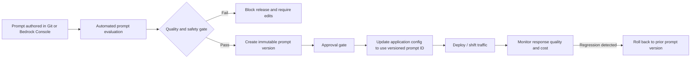
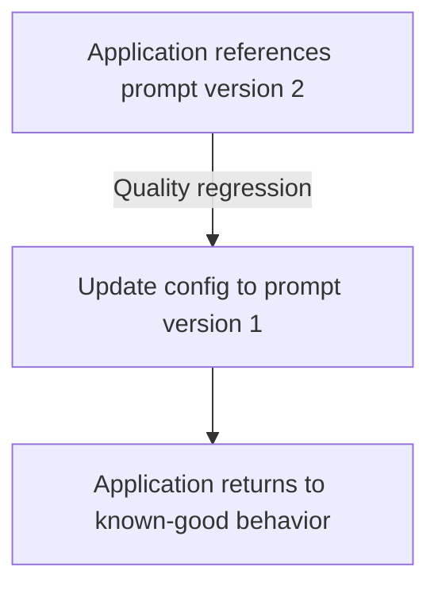

# Task 3.3: Deployment and Orchestration of ML and AI Workflows - Implement Automated Orchestration and Continuous Integration and Continuous Delivery (CI/CD) Pipelines for MLOps and AI Workloads

## Skill 3.3.7: Manage prompts (for example, Amazon Bedrock Prompt Management)

### Skill Overview

Managing prompts is a core MLOps capability for generative AI workloads. A prompt is not just a block of text embedded in an application; it is an artifact that directly changes model behavior. In production systems, prompts must be authored, tested, versioned, deployed, monitored, and rolled back with the same rigor applied to code and model artifacts.

Amazon Bedrock Prompt Management helps teams:

- Store prompts as centrally managed resources.
- Create prompt templates with runtime variables.
- Create immutable prompt versions.
- Compare prompt variants before release.
- Reference a specific prompt version from an application.
- Integrate prompt lifecycle stages into CI/CD pipelines.

In a CI/CD context, the key idea is that a prompt change can affect model behavior as much as changing model weights. If you version the model but not the prompt, you cannot fully explain or reproduce a system behavior change.

---

### Why Prompt Management Matters in AI CI/CD

Traditional software deployments version code and configuration. Trained ML models are versioned in a model registry. Generative AI systems add another behavior-defining artifact: the prompt.

Consider a customer support chatbot. Changing the system prompt from:

> "Answer the customer’s question."

to:

> "Answer the customer’s question concisely and include a link to the documentation."

changes the style, length, and likely the usefulness of the response — without changing the model.

The exam expects you to treat prompts as first-class release artifacts.

| Artifact | What it controls | Versioning mechanism |
| --- | --- | --- |
| Code | Logic, API routing | Git commit |
| Traditional model | Predictions, metrics | SageMaker Model Registry |
| Foundation model | General language behavior | Model ID, fine-tuned version |
| Prompt | Tone, structure, instructions, behavior | Amazon Bedrock Prompt Management version |
| Guardrail | Safety, blocked topics | Guardrail version |
| Agent configuration | Tools, orchestration, system prompts | Amazon Bedrock Agents version and alias |

---

### Core Concepts of Amazon Bedrock Prompt Management

Amazon Bedrock Prompt Management stores prompts as versioned resources with variables and comparable variants.

| Concept | Description | Reason it matters |
| --- | --- | --- |
| Prompt resource | Logical prompt with name, description, model choice, text, and inference settings. | Central ownership instead of text scattered across code. |
| Draft | Editable working copy of a prompt. | Allows iteration before release. |
| Version | Immutable snapshot of a prompt. | Enables repeatability, audit, and rollback. |
| Variables | Placeholders in the prompt filled at runtime, such as `{company_name}` or `{question}`. | Makes prompts reusable and avoids hardcoding user or session data. |
| Variants | Different prompt designs tested against each other, such as a concise version and a detailed version. | Enables comparison before selecting the production prompt. |
| Model and inference parameters | Model ID, temperature, max tokens, top P, stop sequences attached to the prompt. | A prompt version must include these settings to be reproducible. |
| Version-specific identifier | Application references an exact prompt version rather than `latest` or mutable text. | Prevents accidental behavior changes and supports rollback. |

A prompt can look conceptually like this:

> System prompt:  
> "You are a support assistant for {company_name}. Use the provided context to answer the customer’s question in a professional tone."  
>  
> User prompt:  
> "Customer question: {question}  
> Context: {context}"

The values for `{company_name}`, `{question}`, and `{context}` are supplied at invocation time. They are not part of the stored prompt version itself.

---

### Prompt Lifecycle in a CI/CD Pipeline

A managed prompt should move through a lifecycle similar to code:

The important idea is that passing a code build is not enough. Generative AI changes need an evaluation gate because responses are non-deterministic.

---

### Testing and Evaluating Prompt Variants

Traditional code tests assert exact outputs. That approach does not work well for generative AI because the same prompt can return multiple acceptable responses.

Prompt testing should use:

- A fixed golden prompt set.
- Evaluation criteria such as correctness, relevance, faithfulness, toxicity, tone, completeness, and cost.
- Comparison against a baseline prompt or previous prompt version.

Evaluation methods include:

| Method | Use case |
| --- | --- |
| LLM-as-a-judge | Score responses against a rubric or reference answer. |
| Automated metrics | Use ROUGE, BERTScore, faithfulness, answer relevance, or custom rules. |
| Human evaluation | Review a sample of outputs for subtle quality or brand-safety issues. |
| Cost and latency checks | Ensure the new prompt does not create unexpectedly long or expensive responses. |

Example:

- **Baseline prompt:** "Answer the question."
- **Candidate prompt:** "Step through the problem and answer clearly."
- **Test:** Run both against 500 customer questions.
- **Decision:** Deploy the candidate only if aggregate answer correctness and helpfulness improve or remain acceptable.

This is why prompts must be comparable variants. You are not looking for an exact string to match; you are looking for an aggregate quality comparison.

---

### Versioning, Deployment, and Rollback

A versioned prompt is the unit of deployment.

#### Best Practice

- Application code should not contain the full prompt text.
- Application configuration should reference a prompt ID and a specific version.
- The pipeline should create a new version after evaluation passes.
- Production traffic should use that immutable version.

#### Deployment Flow

1. Author a draft prompt.
2. Run evaluation against a golden prompt set.
3. If quality requirements pass, create a new prompt version.
4. Update application configuration to point to the new version.
5. Deploy the configuration change through the pipeline.
6. Monitor metrics such as customer satisfaction, escalation rate, response length, and invocation errors.

#### Rollback Flow

Rollback is typically a configuration update, not a model retraining operation. The previous prompt version still exists in Amazon Bedrock Prompt Management, so the application can be repointed to it quickly.

---

### Prompts as Part of a Larger AI System

A prompt change may be part of:

| Workload | What version changes | Notes |
| --- | --- | --- |
| Direct FM invocation | Prompt version | Application references prompt version and model ID. |
| RAG application | Prompt version and possibly agent/flow version | Retrieval index may be unchanged. |
| Agent-based workload | Agent version and agent alias | The agent version includes instruction, tools, model, and prompt configuration. |
| Fine-tuned FM | Fine-tuned model version plus prompt version | Both artifacts affect behavior. |
| Safety update | Prompt version plus guardrail version | New prompt may require updated safety testing. |

When you manage agents, a prompt change often requires a new agent version. The production agent alias is then pointed to the tested agent version. Rollback is achieved by moving the alias back to the previous agent version.

---

### Scenario-Based Examples

#### Scenario 1: Rolling Back a Bad Prompt Update

**Situation**

A team updates the system prompt of a customer-facing summarization application. After deployment, users report that responses are too short and omit key details. The model and inference parameters did not change.

**Question**

Which approach provides the fastest, safest rollback?

**Correct approach**

Repoint the application configuration to the previously deployed immutable prompt version. Because the prompt was managed as a versioned resource, the previous version is still available and does not need to be recreated. This is faster and safer than trying to manually edit prompt text in production.

**Why this matters**

Prompt rollback is a configuration rollback. If the team had embedded the prompt directly in application code, rollback would require a code deployment. With Amazon Bedrock Prompt Management, the old version is already stored.

---

#### Scenario 2: Gating Prompt Changes in CI/CD

**Situation**

A company wants to ensure that a proposed prompt update cannot ship if it produces lower answer quality than the current prompt. The generative model has variable outputs.

**Question**

Which testing strategy should the CI/CD pipeline use before creating the new prompt version?

**Options and expected answer**

- A. Run a fixed prompt set through evaluation and compare aggregate scores against the previous version.
- B. Assert that each response is an exact match to a stored expected string.
- C. Run only the existing unit tests for the application code.
- D. Deploy the prompt to a small percentage of traffic without any quality check.

**Correct answer:** A.

Generative outputs vary between runs. Exact string matching creates flaky tests and false failures. A golden prompt set with evaluation metrics provides a meaningful quality gate. Application unit tests check code, not semantic prompt quality. Deploying without a quality gate can expose users to a bad prompt.

---

#### Scenario 3: Versioning Prompts for Audit

**Situation**

During an internal audit, the team must determine exactly which prompt version was serving a customer chatbot last Tuesday and which model it was paired with.

**Correct design**

The application logs or deployment configuration should record the version-specific prompt identifier, the model ID, and the inference parameters. Amazon Bedrock Prompt Management preserves the immutable prompt version. The deployment pipeline or application configuration can provide the association between prompt version, model, and application version.

**Common mistake**

Logging only the model ID or only the application version. This does not answer which prompt text was used. A prompt version is required for complete lineage.

---

### Exam Tips and Traps

#### Exam Tips

- Treat prompts as behavior-changing artifacts, not incidental text.
- Prefer versioned prompt resources over editing prompts directly in production.
- Reference an immutable prompt version from application code; avoid `latest` or mutable draft.
- Use variables for runtime-changing content rather than creating many hard-coded prompts.
- Test prompts by comparing aggregate quality against a previous version, not by exact string matching.
- Use a golden prompt set and evaluation metrics such as correctness, relevance, faithfulness, toxicity, and answer completeness.
- In a CI/CD pipeline, place prompt evaluation before version creation and deployment.
- A rollback for a prompt is typically a configuration change back to a previous version.
- If an agent uses the prompt, version the agent and repoint the agent alias for rollback.
- Keep prompt version, model ID, guardrail version, and agent version recorded together for audit.

#### Exam Traps

- **Trap:** Thinking unit tests are sufficient for generative AI changes.  
  **Reality:** Unit tests validate code, not semantic prompt behavior.

- **Trap:** Using exact string comparison for LLM outputs.  
  **Reality:** LLM outputs vary; this creates false failures.

- **Trap:** Assuming a prompt change is safe because the model did not change.  
  **Reality:** Prompts can change tone, correctness, cost, safety, and customer experience.

- **Trap:** Storing prompt text only in application source code.  
  **Reality:** This makes versioning, testing, and rollback harder.

- **Trap:** Believing rollback requires retraining or replacing the foundation model.  
  **Reality:** Most prompt regressions can be rolled back by referencing the previous prompt version.

- **Trap:** Using a mutable prompt draft in production.  
  **Reality:** A draft can change unexpectedly; production should use an immutable version.

- **Trap:** Ignoring inference parameters when versioning a prompt.  
  **Reality:** Temperature and maximum token settings affect outputs and should be part of the reproducible configuration.

---

### Quick Reference

| Requirement | Recommended practice |
| --- | --- |
| Reusable prompt | Use variables in the prompt template |
| Reproducible release | Use immutable prompt version |
| Quality gate | Evaluate against baseline prompt on golden dataset |
| Rollback | Repoint application to previous prompt version |
| Audit | Record prompt version, model ID, guardrail version, and agent alias |
| Agent update | Create new agent version and update alias |
| CI/CD integration | Automate evaluation and version creation before deployment |
| Prompt regression | Compare aggregate metrics, not exact strings |

---

### Summary

Managing prompts with Amazon Bedrock Prompt Management is a key MLOps skill for generative AI workloads. The exam will likely test whether you know how to version prompts, evaluate prompt variants, deploy a prompt change safely, and roll back when quality drops.

Remember the central rule: **a prompt change is a behavior change**. It must be managed through the same automation, testing, and versioning discipline as model training and application code.