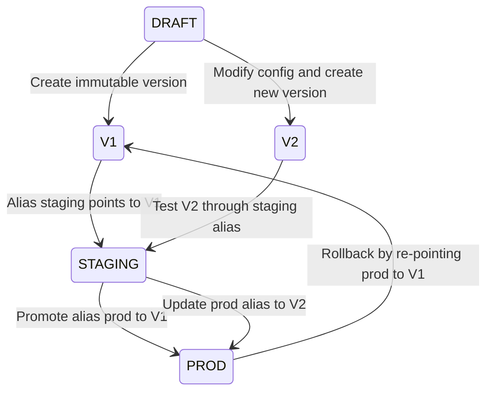
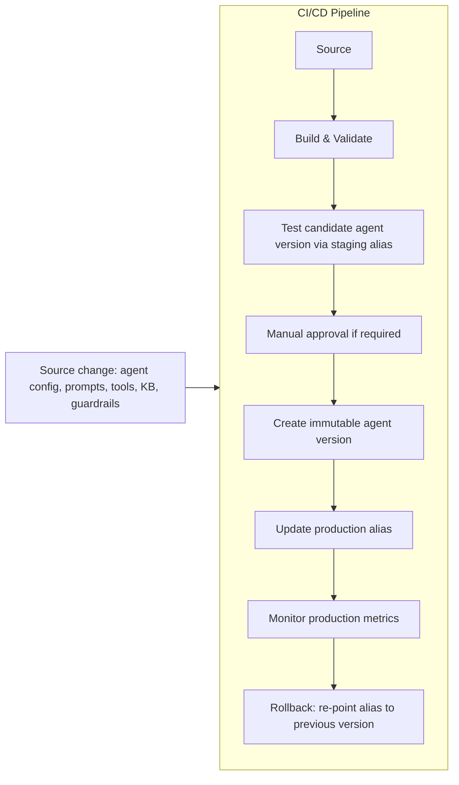

# Task 3.3: Deployment and Orchestration of ML and AI Workflows - Implement automated orchestration and continuous integration and continuous delivery (CI/CD) pipelines for MLOps and AI workloads

## Skill 3.3.8: Implement automated agent deployment pipelines and agent version management

### Overview

This skill focuses on applying CI/CD and MLOps practices to **Amazon Bedrock Agents** and other AI agent workloads. An agent is not just a model; it includes:

- Foundation model selection or fine-tuned model version
- Agent instructions and system prompts
- Action groups and tool schemas
- Knowledge base associations
- Guardrails
- IAM roles
- Prompt versions

Because an agent's behavior changes when **any** of these components changes, agent deployment and version management must cover the entire agent configuration, not only model weights.

---

## 1. Key Concepts

### 1.1 What is an agent deployment pipeline?

An automated agent deployment pipeline:

1. Treats agent configuration as versioned, source-controlled code.
2. Builds an immutable agent version.
3. Tests the agent against golden conversations and evaluation criteria.
4. Promotes the agent version through environments.
5. Updates a stable alias that the application calls.
6. Monitors production metrics and rolls back to a previous version when needed.

### 1.2 Important Amazon Bedrock Agents versioning states

| Resource | Mutability | Purpose |
| --- | --- | --- |
| **DRAFT** | Mutable | Working copy during development and authoring |
| **Agent version** | Immutable | Point-in-time snapshot used for testing, approval, production, and audit |
| **Alias** | Mutable pointer | Stable production or staging endpoint that points to an agent version |

An application should call the agent through an **alias**, not directly through DRAFT. DRAFT can change at any time. A production system must use a stable, immutable agent version.

---

## 2. Agent Versioning Model

### 2.1 DRAFT, version, and alias relationship

### 2.2 What an agent version captures

An agent version should be treated as an immutable deployment artifact. It typically records:

| Artifact | What should be fixed at version creation |
| --- | --- |
| Foundation model | Exact model ID or custom fine-tuned model ARN |
| Instructions | System prompt text or prompt version ARN |
| Action groups | OpenAPI schemas and Lambda function aliases/versions |
| Knowledge base | Knowledge base ID and metadata |
| Guardrails | Guardrail ID and version |
| IAM role | Agent resource role ARN |
| Prompt variants | Prompt version ARNs from Amazon Bedrock Prompt Management |

If a Lambda function underlying an action group changes independently, you should pin the Lambda alias or version in the agent version for reproducibility.

---

## 3. Automated Agent Deployment Pipeline

### 3.1 High-level pipeline flow

### 3.2 Pipeline stages and AWS services

| Pipeline stage | Purpose | Common AWS service/mechanism |
| --- | --- | --- |
| Source | Detect changes to agent definition from Git | AWS CodePipeline, AWS CodeCommit, AWS CodeConnections |
| Build/Validate | Validate agent configuration, tool schemas, IAM permissions, and prompt references | AWS CodeBuild |
| Test | Run golden conversation evaluations against the agent version | AWS CodeBuild, Amazon Bedrock Model Evaluation, LLM-as-judge |
| Approval | Human or automated approval gate before production update | CodePipeline manual approval stage |
| Deploy | Create an immutable agent version and update the production alias | AWS CodeBuild or AWS Lambda calling Bedrock Agents control plane APIs |
| Monitor | Watch agent metrics and trigger rollback when thresholds breach | Amazon CloudWatch, Amazon EventBridge |
| Rollback | Re-point the production alias to the previous known-good version | Automation through CodeBuild, Lambda, or EventBridge |

### 3.3 Important CI/CD detail

There is no native CodePipeline action specifically for Amazon Bedrock Agents. A common solution is to use **AWS CodeBuild** or an **AWS Lambda** action to call the Bedrock Agents APIs for:

- Creating an agent version
- Creating an agent alias
- Updating an alias to point to a new version

AWS CodeDeploy is not used for Bedrock agent version deployment. CodeDeploy targets compute, containers, Lambda functions, and on-premises instances, not the Bedrock Agents control plane.

---

## 4. Testing in Agent Deployment Pipelines

Agent behavior is generative and non-deterministic. Therefore, testing must combine deterministic validation with probabilistic evaluation.

### 4.1 Test categories

| Test type | Deterministic or Probabilistic | What it verifies |
| --- | --- | --- |
| Configuration/schema validation | Deterministic | Action group OpenAPI schemas, required fields, valid ARNs |
| IAM policy validation | Deterministic | Agent role can access necessary tools, KBs, and models |
| Tool Lambda validation | Deterministic | Action group Lambda alias exists and returns expected status |
| Golden conversation evaluation | Probabilistic | Agent success on representative user tasks |
| Regression comparison | Probabilistic | New version performs as well as or better than previous version |
| Guardrail testing | Probabilistic/Deterministic | Blocked topics, harmful responses, compliance with policies |
| Prompt variant evaluation | Probabilistic | Prompt changes improve or maintain response quality |

### 4.2 Testing method for agents

1. Run a fixed set of representative prompts through the candidate agent version.
2. Evaluate the responses against criteria such as:
   - Task completion
   - Tool-selection correctness
   - Faithfulness to retrieved knowledge
   - Safety and guardrail compliance
   - Tone and format
3. Compare aggregate scores to the previous agent version.
4. Block deployment if the candidate version fails the threshold.

Do not use exact string matching for generative agent responses. That creates flaky tests because valid responses vary between runs.

---

## 5. Rollback and Traffic Management

### 5.1 Rollback pattern

The fastest rollback for a bad agent version is to **re-point the production alias to the previous immutable version**. You do not need to retrain a model or recreate the agent from scratch.

Example:

- `prod` alias points to agent version 1.
- Agent version 2 is deployed.
- High `InvocationClientErrors` or poor evaluation scores are observed.
- Pipeline or operator updates `prod` alias back to version 1.
- Users are immediately routed to the known-good version.

### 5.2 Deployment monitoring signals

| Signal | Meaning |
| --- | --- |
| `InvocationServerErrors` | Server-side failures or agent execution failures |
| `InvocationClientErrors` | Bad runtime inputs or invalid requests |
| `InvocationLatency` | Response time regression |
| Evaluation score | Quality or task success regression |
| Guardrail violations | Increase in blocked responses or unsafe behavior |

Use CloudWatch alarms on these signals to trigger an automated rollback in the pipeline.

### 5.3 Agents vs. SageMaker deployment guardrails

SageMaker endpoint deployment guardrails provide managed blue/green canary, linear, and rolling traffic shifts with automated rollback. Do not assume the same managed mechanism applies directly to Bedrock Agents.

For Bedrock Agents, you can implement traffic strategy at the application or API gateway layer by calling multiple aliases or routing traffic to separate aliases. The version/alias mechanism is the core release and rollback tool.

---

## 6. Agent Version Management and Auditability

### 6.1 Why version management matters

An incident investigation must be able to answer:

- Which agent version served traffic during the incident?
- What model, prompts, tools, knowledge base, and guardrails were associated with that version?
- Which pipeline run created that version?
- Which source commit produced that pipeline run?

### 6.2 Audit trail

For full auditability:

- Store agent configurations in Git.
- Use CloudTrail to track `CreateAgentVersion` and `UpdateAgentAlias` API calls.
- Use the agent version metadata to trace model ID, prompt version, action groups, KB ID, and guardrail ID.
- Use source commit IDs and pipeline execution IDs to connect the deployed version to its origin.

An alias itself does not keep deep lineage; the immutable agent version plus CloudTrail and source control do.

---

## 7. Relationship to Knowledge Base Refreshes

Agents commonly reference Amazon Bedrock Knowledge Bases. Agent version management is separate from knowledge base data refreshes.

| Operation | What it updates | Frequency |
| --- | --- | --- |
| Agent version creation | Agent instructions, model, tools, prompts, guardrails, KB association | Controlled release |
| KB ingestion/resync | Ingests new, modified, or deleted documents into the vector index | Event-driven or scheduled |

An agent version records the knowledge base ID at release time. A KB data refresh does not automatically create a new agent version. However, if a KB schema, vector dimension, embedding model, chunking strategy, or major data policy changes, you should consider a new agent version and full evaluation.

---

## 8. Scenario-Based Exam Questions

### Scenario 1

A team deploys an Amazon Bedrock agent to production by pointing the production alias to DRAFT because that is where the latest changes are stored. After an incident, they cannot determine exactly which configuration was live.

**What should the team do?**

**Correct approach:**  
Create an immutable agent version from the prepared DRAFT configuration, test it through a staging alias, and then point the production alias to that immutable version. DRAFT should never be used for production because it is mutable and cannot provide an audit trail.

---

### Scenario 2

A CI/CD pipeline must publish a new Amazon Bedrock agent version and update the production alias. A developer suggests using AWS CodeDeploy.

**Which AWS service or mechanism should perform that deployment step?**

**Correct approach:**  
Use AWS CodeBuild or an AWS Lambda action in AWS CodePipeline to call the Bedrock Agents control plane APIs to create the new agent version and update the alias. CodeDeploy is designed for compute workloads and does not natively deploy Bedrock agents.

---

### Scenario 3

Agent version 2 is deployed to production. After ten minutes, CloudWatch shows a spike in `InvocationServerErrors`, and evaluation results show low task-completion scores.

**What is the fastest recovery action?**

**Correct approach:**  
Re-point the production alias from agent version 2 back to agent version 1. Because version 1 is immutable and already deployed, this is a fast alias update. No retraining or regeneration of the agent is required.

---

## 9. Exam Tips and Traps

| Trap | Why it is wrong | Correct understanding |
| --- | --- | --- |
| Using DRAFT for production | DRAFT is mutable and impossible to audit reliably | Use immutable agent versions behind stable aliases |
| Assuming CodeDeploy deploys Bedrock agents | CodeDeploy targets compute workloads | Use CodeBuild or Lambda in CodePipeline for Bedrock agent deployment |
| Assuming SageMaker managed canary/linear shifts apply to agents | Bedrock Agents are not SageMaker endpoints and have different control planes | Use alias updates and application-layer routing for agent rollout |
| Testing generative agents with exact string assertions | Valid generative responses vary between runs | Use golden prompt sets and criteria-based evaluation |
| Versioning only model weights | Agent behavior also depends on prompts, tools, KB, guardrails, and model ID | Version the entire agent configuration as an immutable snapshot |
| Believing a KB refresh automatically creates a new agent version | KB ingestion and agent versioning are separate workflows | Trigger agent version creation only when agent configuration/contract changes |
| Deleting the failed version for rollback | Deleting a version does not restore the previous production state | Re-point the production alias to the previous known-good version |
| Storing credentials in pipeline source for external Git repos | Insecure and discouraged | Use AWS CodeConnections for external Git repositories |
| Triggering retraining only on a schedule when data changes irregularly | Wastes compute or delays updates | Use event-driven triggers, such as S3 events through EventBridge |
| Treating prompt changes as minor edits | Prompt changes can change behavior as much as model changes | Version prompts and test them like model changes |

---

## 10. Key Takeaways

- An agent is a composite system; version all behavior-affecting components.
- Use **DRAFT** for development, **immutable agent versions** for release, and **aliases** for stable runtime targets.
- Automate agent release with CodePipeline, CodeBuild, and CodeConnections—not CodeDeploy.
- Test agent changes with golden prompts and probabilistic evaluation, not exact string matching.
- Rollback is fast if you re-point a production alias to a previous immutable agent version.
- Maintain an audit trail by connecting source commits, pipeline executions, agent versions, and alias updates.
- Keep agent version management separate from knowledge base refresh cycles, but create a new agent version when the Agent configuration contract changes.