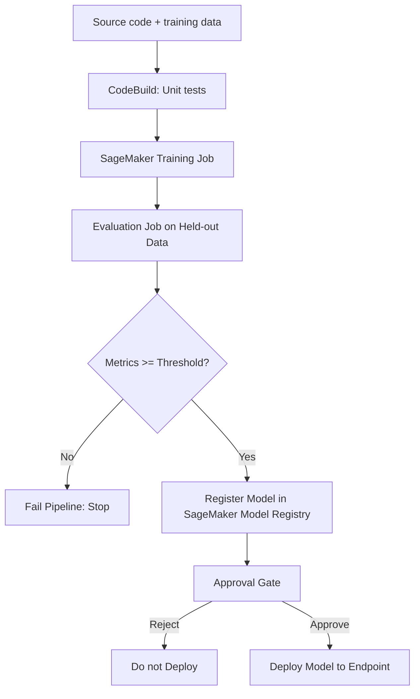
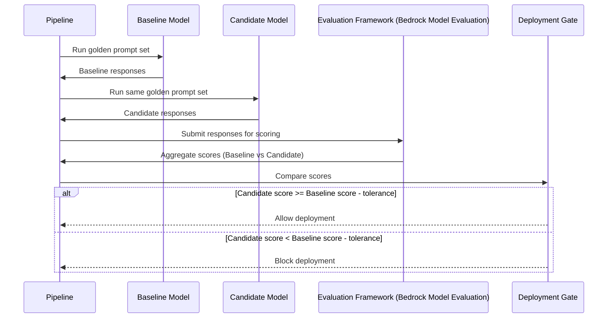
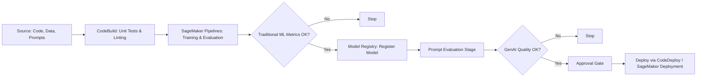

# Task 3.3: Deployment and Orchestration of ML and AI Workflows - Implement automated orchestration and continuous integration and continuous delivery (CI/CD) pipelines for MLOps and AI workloads

## Skill 3.3.9: Implement AI model testing frameworks, including prompt testing

### Overview
AI model testing frameworks are structured approaches and tools used to validate machine learning (ML) and generative AI (GenAI) models before they are promoted through a CI/CD pipeline. For traditional ML models, testing often means evaluating metrics such as accuracy, precision, recall, or F1 score against a held-out dataset. For generative AI models, testing is more nuanced because responses are non-deterministic and cannot be compared to a single “correct” answer. Prompt testing specifically refers to evaluating and versioning the prompts that guide GenAI behavior, ensuring changes to prompts do not degrade output quality.

In a CI/CD pipeline for MLOps, testing is a gate that decides whether a model or prompt version is allowed to proceed toward deployment. The key challenge is building tests that are meaningful for AI workloads—tests that can catch regressions in model performance, response quality, or fairness without requiring manual review every time.

---

### Why AI Model Testing Differs from Traditional Software Testing

Traditional software tests are deterministic: a given input produces an expected output, and assertions can be exact. ML model testing, however, evaluates probabilistic outputs. Generative AI testing goes a step further because the output is free-form text generated from a distribution, making exact matching impossible.

| Testing Type | What is Tested | How Success is Determined | Example |
|--------------|----------------|---------------------------|---------|
| **Traditional software unit test** | Code logic, APIs, data structures | Exact assertion on returned value or state | `assert add(2,3) == 5` |
| **Traditional ML model evaluation** | Model predictions on held-out data | Numeric metric threshold (e.g., accuracy ≥ 0.90, AUC ≥ 0.85) | Evaluate a fraud detection model on a test dataset; deploy only if F1 score ≥ 0.85 |
| **Generative AI model evaluation** | Free-form text responses to a fixed set of prompts | Semantic similarity scores, faithfulness, relevance, toxicity, human judgment, or LLM-as-a-judge comparison against a baseline | Compare a fine-tuned LLM’s answers to a baseline model’s answers on 100 golden prompts; block deployment if average score drops |
| **Prompt testing** | Prompt templates, system instructions, variable substitutions | Compare response quality across prompt versions using same evaluation metrics | A/B test two prompt variants with different wording; promote the one with higher answer relevance |

---

### Key AWS Services for AI Model Testing

Several AWS services can be used to implement AI model testing frameworks in a CI/CD pipeline. The choice depends on whether you are testing traditional ML models, generative AI models, or prompts.

| AWS Service | Purpose in AI Model Testing | Typical Use Case |
|-------------|-----------------------------|------------------|
| **Amazon SageMaker Pipelines** | Orchestrates ML workflow steps including training, evaluation, and conditional registration | Define a pipeline with a condition step that compares model metrics against thresholds and stops execution if criteria are not met |
| **Amazon SageMaker Clarify** | Detects bias, explainability, and feature attribution for ML models | Run pre-training or post-training bias analysis; include fairness metrics in the evaluation gate |
| **Amazon SageMaker Model Monitor** | Monitors deployed model performance and data drift | After deployment, continuously test model quality via metrics like data drift or model quality drift; can trigger alarms for rollback |
| **Amazon Bedrock Model Evaluation** | Managed evaluation of foundation models (FMs) and fine-tuned models, including automatic LLM-as-judge evaluation and human evaluation workflows | Compare multiple models or versions using predefined metrics like helpfulness, correctness, faithfulness, relevance, and toxicity |
| **Amazon Bedrock Prompt Management** | Store, version, and compare prompt templates with variables | Manage prompt changes as versioned resources; test prompt variants against a golden dataset; promote a specific prompt version |
| **AWS CodeBuild** | Runs build and test commands in a CI/CD stage | Execute unit tests, run evaluation scripts, or invoke evaluation jobs as part of a stage |
| **AWS CodePipeline** | Models the release process and applies gates between stages | Add a manual approval gate after model evaluation before deployment |

---

### Testing Traditional ML Models in CI/CD

For traditional ML models (e.g., classification, regression, forecasting), testing in a pipeline typically involves:

1. **Code tests**: Unit tests for data preprocessing, feature engineering, and training scripts.
2. **Model evaluation on held-out data**: Run the trained model against a test dataset and compute standard metrics.
3. **Metric threshold gate**: Compare the metrics against predefined quality thresholds (e.g., precision ≥ 0.9, RMSE ≤ 10).
4. **Bias and explainability checks (optional)**: Use SageMaker Clarify to evaluate statistical bias and feature importance.
5. **Model registration**: If all gates pass, register the model version in the SageMaker Model Registry with a status such as `Approved` or `PendingManualApproval`.

The evaluation can be implemented as a **SageMaker Processing Job** running a custom evaluation script, or as a **SageMaker Pipelines Condition Step** that evaluates metrics after training. Alternatively, CodeBuild can run evaluation scripts and store metrics in a file that a subsequent pipeline stage reads.

**Key points:**
- The test dataset must be separate from training data to avoid overfitting.
- Thresholds should be defined in advance and stored as pipeline parameters.
- A pipeline that ends at registration (not deployment) allows human approval before production traffic.

---

### Testing Generative AI Models

Generative AI models produce variable, free-form text responses. Traditional exact-match assertions are inappropriate because the same prompt can legitimately receive different valid answers. Testing a generative AI model involves evaluating the **quality, relevance, safety, and faithfulness** of responses using a curated set of prompts.

**Common evaluation approaches for GenAI:**

| Method | Description | Strengths | Limitations |
|--------|-------------|-----------|-------------|
| **LLM-as-a-judge** | Use a separate large language model (judge) to score responses against criteria such as relevance, faithfulness, or helpfulness | Scalable, automated, can apply nuanced criteria | Judge model may have its own biases; requires careful prompt design for judging |
| **Semantic similarity metrics** | Compute embeddings of generated and reference responses; use cosine similarity, BERTScore, or ROUGE/BLEU | Fast, deterministic once embeddings are crafted | May not capture factual correctness or nuance |
| **Human evaluation** | Human reviewers rate responses on a rubric | High-quality judgment, captures subtleties | Slow, expensive, not suitable for every pipeline run |
| **Specialized metrics** | Metrics like toxicity score, factual consistency, or groundedness | Catches specific failure modes | Each metric covers only one aspect |

AWS **Amazon Bedrock Model Evaluation** supports both **automatic evaluation** (using LLM-as-a-judge) and **human evaluation workflows**. Automatic evaluation can compare candidate models or versions against predefined metrics such as:
- **Helpfulness**
- **Correctness**
- **Faithfulness** (grounding in provided context)
- **Relevance**
- **Toxicity**
- **Robustness**

For a CI/CD pipeline, a typical pattern is:
1. Maintain a **golden prompt dataset** (a fixed set of prompts with known expected behavior, possibly including reference answers).
2. Run the golden prompts through both the **baseline model** (current production version) and the **candidate model** (new version).
3. Use Bedrock Model Evaluation or a custom evaluation job to score both sets of responses.
4. Compare aggregate scores: if the candidate’s metric is equal to or better than the baseline within a tolerance, the change is allowed; otherwise, the pipeline is blocked.

**Important:** Exact match testing is not suitable. A response that differs from a stored expected string may still be correct. Use semantic evaluation instead.

---

### Prompt Testing and Versioning

Prompts are the instructions given to generative AI models. A change in prompt wording can alter model behavior as significantly as a change in model weights. Therefore, prompts must be tested and versioned just like model artifacts.

**Amazon Bedrock Prompt Management** is the AWS service that supports prompt versioning. It allows you to:
- Store prompts as **versioned resources** with variables (e.g., `{{context}}`, `{{question}}`).
- Create multiple **variants** of a prompt and compare their outputs.
- Associate prompts with a specific foundation model or model version.
- Retrieve prompts by version identifier from your application, rather than hardcoding the text.

**Prompt testing workflow in CI/CD:**
1. **Define a golden dataset** of inputs and evaluation criteria (e.g., 50 questions with expected answer types or reference responses).
2. **Create a prompt variant** in Bedrock Prompt Management or in your source repository.
3. **Run the variant** against the golden dataset using the current model.
4. **Score responses** using automated metrics (LLM-as-a-judge, semantic similarity, or custom evaluators).
5. **Compare the variant’s score** to the current production prompt version’s score.
6. **Promote the variant** to a new prompt version if it meets or exceeds quality thresholds.
7. **Update the application** to reference the new prompt version via its identifier.

Prompt testing can be integrated into a CodePipeline stage using AWS CodeBuild to invoke Bedrock or a custom evaluation script. The results can be stored in a file, and a condition step can decide whether to proceed.

**Key concepts:**
- **Prompt version**: an immutable snapshot of the prompt text and configuration.
- **Prompt variant**: a candidate change not yet promoted to a version.
- **Golden dataset**: a representative, fixed set of inputs used for evaluation across versions.
- **Evaluation metric**: quantitative measure of response quality for the specific task.

**Exam tip:** A common trap is to assume that prompts can be edited in place with no versioning. In a production MLOps environment, prompts must be versioned to enable audits and rollbacks.

---

### Integrating AI Model Testing into CI/CD Pipelines

A complete AI CI/CD pipeline includes multiple gates where testing occurs.

**Pipeline stages explained:**
1. **Source stage**: Code, data, and prompt definitions are retrieved from repositories (e.g., CodeCommit, S3, Bedrock Prompt Management).
2. **Build/test stage (CodeBuild)**: Unit tests for code and scripts; static analysis.
3. **Model training and evaluation (SageMaker Pipelines)**: Train model, evaluate on hold-out data, compute metrics; condition step fails if metrics below threshold.
4. **Model registration**: Register the model version with metadata and lineage.
5. **Prompt testing (if GenAI)**: Run golden prompts through candidate and baseline; compare scores. This can be done in CodeBuild or a SageMaker Processing job.
6. **Approval gate**: Human approves model/prompt package for deployment.
7. **Deploy stage**: Use SageMaker deployment guardrails (blue/green/canary) or CodeDeploy to rollout.

**Important integration points:**
- **EventBridge** can trigger the pipeline when new model versions are approved in the Model Registry or when prompts are updated.
- **Pipeline parameters** should include evaluation thresholds and model/prompt version identifiers.
- **Artifacts** (model packages, prompt versions, evaluation reports) must be stored for audit.

---

### Scenario-Based Examples

#### Scenario 1: Regression in a Fine-Tuned LLM

**Question:** A company has fine-tuned a foundation model and wants to deploy it using an automated pipeline. Before deployment, they need to ensure the new fine-tuned model does not degrade response quality compared to the currently deployed model. Responses to the same prompt may vary between runs. Which testing approach should they use?

**Answer:** Use a **golden prompt dataset** and an **evaluation framework** (e.g., Amazon Bedrock Model Evaluation) that scores responses with LLM-as-a-judge or semantic metrics. Run the same prompts through both models, compare aggregate scores, and gate deployment on the candidate model having a score equal to or better than the baseline within a tolerance. This accounts for response variability and does not rely on exact string matching.

**Why not other options:** Exact string matching fails due to non-determinism; unit tests do not evaluate semantic quality; canary deployment alone does not catch quality regressions before exposing traffic.

#### Scenario 2: Prompt Change Causes Behavior Drift

**Question:** A team updates a system prompt to improve the tone of responses from their chatbot. They want to ensure the new prompt version does not reduce answer relevance. They use Amazon Bedrock Prompt Management to store the prompt. How should they automatically test this prompt change in their CI/CD pipeline?

**Answer:** Create a **new prompt variant** in Bedrock Prompt Management. In the pipeline, run a **golden dataset** of user questions through both the current production prompt version and the new variant using the same model. Score the responses using a metric such as **answer relevance** or **faithfulness**. If the new variant’s average score meets the quality threshold, promote it to a new prompt version; otherwise, block the pipeline.

**Key point:** Prompt changes must be tested and versioned independently of the model.

#### Scenario 3: Traditional ML Model Quality Gate

**Question:** An MLOps pipeline trains a churn prediction model. The pipeline should automatically stop deployment if the model’s F1 score on a held-out test set is below 0.85. Which AWS service/feature should be used?

**Answer:** Use **SageMaker Pipelines** with a **Condition Step** after the evaluation step. The condition step compares the F1 score metric (stored in the pipeline context) against 0.85. If the condition fails, the pipeline stops and does not register the model. Alternatively, CodeBuild can run the evaluation and fail if the metric is below threshold.

**Why:** SageMaker Pipelines natively supports conditional execution based on metrics, making it the most direct solution.

---

### Exam Tips and Traps

| Topic | Tip / Trap |
|-------|------------|
| **Generative AI evaluation** | **Tip:** When testing generative AI, never use exact string assertions. Use semantic evaluation, LLM-as-a-judge, or human evaluation. **Trap:** Choosing “assert each response equals an expected string” will always be wrong for GenAI. |
| **Prompt versioning** | **Tip:** Treat prompts as versioned artifacts just like model weights. Use Amazon Bedrock Prompt Management. **Trap:** Editing prompt text in production without versioning is a common mistake that breaks reproducibility and auditability. |
| **Traditional ML metrics** | **Tip:** For classification/regression models, use thresholds on accuracy, precision, recall, F1, AUC, RMSE, etc., in a SageMaker Pipelines Condition Step. **Trap:** Forgetting to define the evaluation dataset separately from training data leads to overfitting and misleading metrics. |
| **Bias and fairness** | **Tip:** Include SageMaker Clarify for bias detection and explainability as part of testing, especially for high-risk models. **Trap:** Assuming that a high accuracy model is automatically fair; bias tests are separate. |
| **Human approval** | **Tip:** In many production pipelines, a human approval gate after model evaluation and prompt testing is required before deployment. **Trap:** Fully automated deployment without any approval may violate change management policies. |
| **Monitoring vs. testing** | **Tip:** Model Monitor is for post-deployment monitoring, not pre-deployment testing. Use it to continuously test data drift and model quality after rollout. **Trap:** Confusing Model Monitor with an evaluation step inside the pipeline. |
| **Bedrock Model Evaluation** | **Tip:** Use Amazon Bedrock Model Evaluation for managed automatic evaluation (LLM-as-a-judge) and human review workflows. It can compare multiple models or versions. **Trap:** Using custom evaluation scripts when Bedrock Model Evaluation already supports the needed metrics may be unnecessary work, but note that custom scripts provide flexibility. |
| **Prompt management** | **Tip:** Store prompts with variables in Amazon Bedrock Prompt Management and reference them by version. This keeps application code clean and enables A/B testing. **Trap:** Hardcoding prompts in application code prevents versioning and rollback. |
| **Pipeline integration** | **Tip:** Use CodePipeline and CodeBuild to orchestrate tests, and SageMaker Pipelines for ML-specific steps. EventBridge can trigger retraining or prompt evaluation. **Trap:** A pipeline that only tests code but not model or prompt quality is incomplete for AI workloads. |

---

### Summary

Implementing AI model testing frameworks in CI/CD requires distinguishing between deterministic software tests, numeric evaluations for traditional ML, and semantic evaluations for generative AI. Key services include SageMaker Pipelines for ML workflow orchestration with condition steps, SageMaker Clarify for bias/explainability, Amazon Bedrock Model Evaluation for automatic GenAI scoring, and Amazon Bedrock Prompt Management for prompt versioning and testing. Successful pipelines integrate multiple testing gates: code unit tests, model metric thresholds, generative quality evaluations, and prompt variant comparisons. Remember that every artifact that affects behavior—code, model weights, prompts, and agent configurations—must be versioned and tested before reaching production.